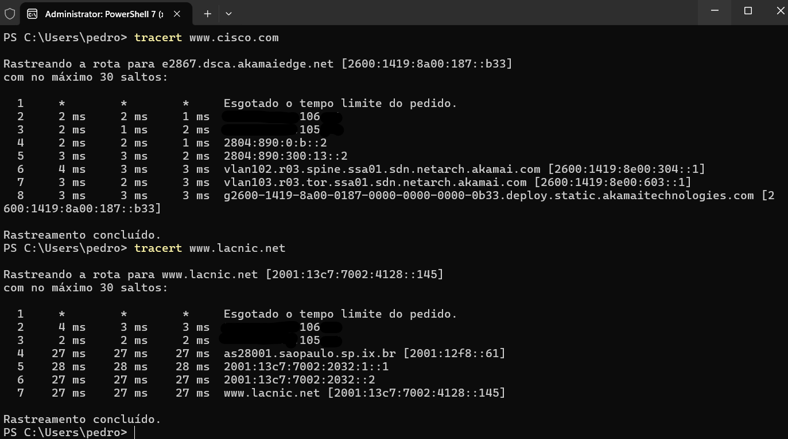

# Laboratório - Mapeamento da Internet   

### Cisco: <a href="../../../">cisco   </a>
### Cisco Networking Academy: cna   </a>
### Training Category: <a href="../../../labs/">labs</a>
### Software/Subject: network   </a>
### Course: <a href="./">lab_003 (Laboratório - Mapeamento da Internet)   </a>

---

### Theme:
- Network

### Used Tools:
- Operating System (OS): 
  - Windows 11 
- Cloud Services:
  - Google Drive 
- Language:
  - HTML   
  - Markdown   
- Integrated Development Environment (IDE) and Text Editor:
  - Visual Studio Code (VS Code)   
- Versioning: 
  - Git   
- Repository:
  - GitHub   
- Network:
  - ping   
  - Trace Route (tracert)   

---

<h3><a name="item00">Course Strcuture:</a></h3>

1. <a href="#item01">Laboratório - Como você está conectado?</a> 
  1.1 <a href="#item01.01">Parte 1: Determinar a conectividade de rede com um host destino</a> 
  1.2 <a href="#item01.02">Parte 2: Rastrear uma rota para um servidor remoto usando o Tracert</a> 
  1.3 <a href="#item01.03">Reflexão</a> 

---

### Objective:
Pesquisar quantas horas 3 a 4 pessoas ficam conectadas por meio de qualquer dispositivo durante cada dia.

### Folder Structure:
- [README.md](./README.md): Este documento de README, escrito em **Markdown**, com o conteúdo do laboratório.
- [0-aux](./0-aux/): Pasta auxiliar com imagens utilizadas na construção dos arquivos de README desse curso.

### Development:

<a name="item01"><h4>1. Laboratório - Como você está conectado?</h4></a>[Back to summary](#item00)

<a name="item01.01"><h4>1.1 Parte 1: Determinar a conectividade de rede com um host destino</h4></a>[Back to summary](#item00)

- a. No prompt de linha de comando, digite ping www.cisco.com para determinar se ele está acessível: `C:> ping www.cisco.com`.
- b. Agora, faça ping nos sites de Registro Regional de Internet (RIR) localizados em diferentes partes do mundo para determinar se estão acessíveis:
  - Africa: www.afrinic.net
  - Australia: www.apnic.net
  - Europe: www.ripe.net
  - Latin America and Caribbean: www.lacnic.net
  - North America: www.arin.net

<a name="item01.02"><h4>1.2 Parte 2: Rastrear uma rota para um servidor remoto usando o Tracert</h4></a>[Back to summary](#item00)

- a. No prompt de linha de comando, trace a rota para www.cisco.com: `C:UsersUser1> tracert www.cisco.com`.
- b. A ferramenta localizada na Web em http://whois.domaintools.com/ pode ser usada para determinar os proprietários do endereço IP resultante e dos nomes de domínio exibidos na saída das ferramentas tracert. Agora, execute um tracert para um dos sites RIR da Parte 1 e salve os resultados:
  - Africa: www.afrinic.net
  - Australia: www.apnic.net
  - Europe: www.ripe.net
  - Latin America and Caribbean: www.lacnic.net
  - North America: www.arin.net
- b. Liste os domínios abaixo a partir dos resultados do tracert, usando a ferramenta whois localizada na Web.
  - XXXX:XXX:X:XXX::1:
    - Owner: Softdados Telecomunicações
  - XXXX:XXX:X:XXX::1:
    - Owner: Softdados Telecomunicações
  - as28001.saopaulo.sp.ix.br [2001:12f8::61]:
    - Domain Name: ix.br
    - Owner: Núcleo de Inf. e Coord. do Ponto BR - NIC.BR
  - 2001:13c7:7002:2032:1::1:
    - Owner: LACNIC - Latin American and Caribbean IP address
  - 2001:13c7:7002:2032::2: 
    - Owner: LACNIC - Latin American and Caribbean IP address
  - www.lacnic.net [2001:13c7:7002:4128::145]: 
    - Domain Name: LACNIC.NET
    - Registrar: GoDaddy.com, LLC
    - Registrant Organization: Domains By Proxy, LLC
    - Owner: LACNIC - Latin American and Caribbean IP Address Registry
- c. Compare as listas de domínios cruzados para acessar os destinos finais.
  - Os dois primeiros saltos são iguais, pois ambos partem do mesmo ISP. A partir dos saltos seguintes, as rotas passam por domínios e organizações diferentes, variando conforme o destino final, o que evidencia que a internet utiliza caminhos distintos para redes diferentes. A imagem 01 evidencia esses dois trajetos.

<figure>
     
    <figcaption>Imagem 01.</figcaption>
</figure>
 

<a name="item01.03"><h4>1.3 Reflexão</h4></a>[Back to summary](#item00)

1. O que pode afetar os resultados do tracert?
  - Os resultados do tracert podem ser afetados por firewalls e roteadores que bloqueiam ou limitam respostas ICMP. Além disso, congestionamento de rede, latência variável e rotas dinâmicas podem alterar os tempos e os caminhos exibidos. Configurações de segurança também podem ocultar ou ignorar determinados saltos.