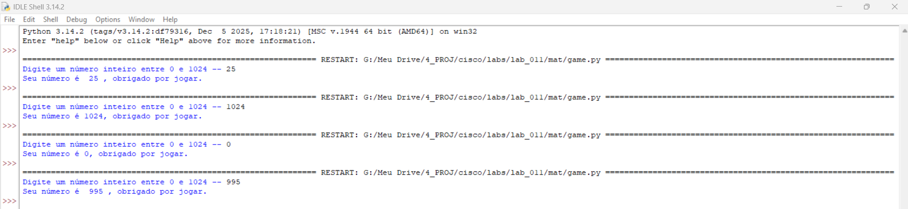

# Laboratório - Crie um jogo simples com Python   

### Cisco: <a href="../../../">cisco   </a>
### Cisco Networking Academy: cna   </a>
### Training Category: <a href="../../../labs/">labs</a>
### Software/Subject: python   </a>
### Course: <a href="./">lab_012 (Laboratório - Crie um jogo simples com Python)   </a>

---

### Theme:
- Programming

### Used Tools:
- Operating System (OS): 
  - Windows 11 
- Cloud Services:
  - Google Drive 
- Language:
  - HTML   
  - Markdown   
  - Python   
- Integrated Development Environment (IDE) and Text Editor:
  - Integrated Development and Learning Environment (IDLE)   
  - Visual Studio Code (VS Code)   
- Versioning: 
  - Git   
- Repository:
  - GitHub   

---

<h3><a name="item00">Course Strcuture:</a></h3>

1. <a href="#item01">Parte 1: Criar um jogo simples com Python IDLE</a><br>
2. <a href="#item02">Parte 2: Reflexão</a><br>

---

### Objective:
O objetivo deste laboratório foi a criação de um jogo simples usando o IDLE do **Python**.

### Folder Structure:
- [README.md](./README.md): Este documento de README, escrito em **Markdown**, com o conteúdo do laboratório.
- [0-aux](./0-aux/): Pasta auxiliar com imagens utilizadas na construção dos arquivos de README desse curso.

### Development:

<a name="item01"><h4>1. Parte 1: Criar um jogo simples com Python IDLE</h4></a>[Back to summary](#item00)

- a. Inicie o IDLE. (No Windows, clique em Iniciar> Python3.x > IDLE, onde x é a versão de lançamento.)
- b. Crie um novo arquivo no IDLE. Clique em Arquivo -> Novo arquivo para abrir um novo script Python (sem título).
- c. Copie e cole o script a seguir no novo arquivo.

```python
y=input('Digite um número inteiro entre 0 e 1024 -- ')
x=int(y)
a=0
b=1024
test=True

if x == 0:
    print('Seu número é 0, obrigado por jogar.')
    test=False
else:
    if x == 1024:
        print('Seu número é 1024, obrigado por jogar.')
        test=False
    while test == True:
        n=int((a+b)/2)
        if n == x:
            print('Seu número é ', n, ', obrigado por jogar.')
            break
        else:
            if n < x:
                a = n
            else:
                b=n
```

- d. Clique em Arquivo > Salvar, salve o script atual como game.py no diretório C:/Users/nome de usuário/Documents. Clique em “Salvar” para continuar.
- e. Clique em Executar > Executar módulo (ou pressione F5). A janela Shell exibirá o resultado.
- f. Solucione problemas se ocorrer um erro durante a avaliação da sintaxe do código.

A imagem 01 mostra a conclusão da parte 1.

<div align="center"><figure>
    <br>
    <figcaption>Imagem 01.</figcaption>
</figure></div><br>

<a name="item02"><h4>2. Parte 2: Reflexão</h4></a>[Back to summary](#item00)

- a. Como você identificaria quando um jogador digitasse um número fora do intervalo entre 0 a 1024?
  - Após a conversão para inteiro, pode-se verificar se o valor é menor que 0 ou maior que 1024. Caso isso ocorra, o programa identifica que o número está fora do intervalo permitido e pode exibir uma mensagem de erro.
- b. Como você identificaria quando um jogador inserisse um número do tipo float?
  - Um número do tipo float pode ser identificado verificando se a entrada contém um ponto decimal (.). Se houver ponto, o valor não é inteiro e deve ser rejeitado antes de continuar o jogo.