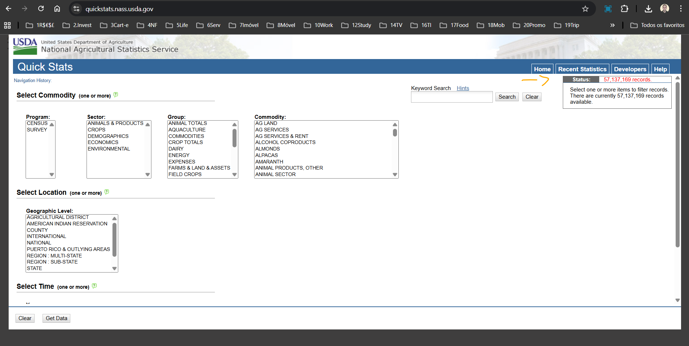
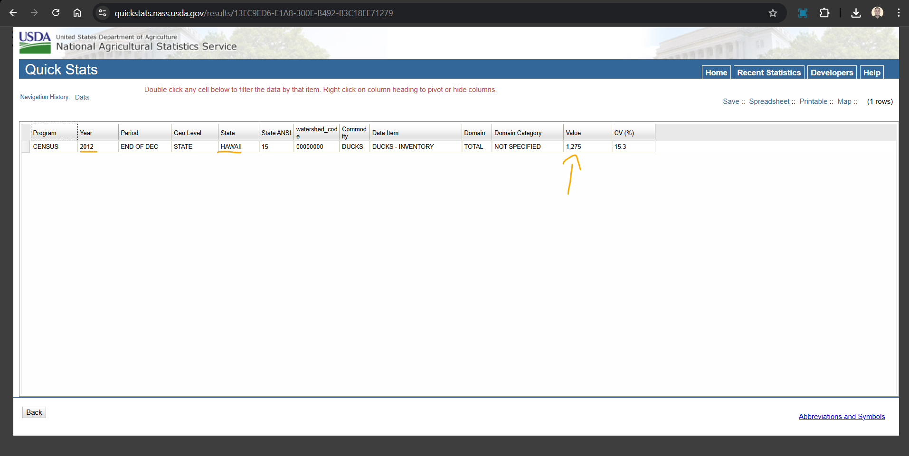

# Laboratório - Explore um Conjunto Grande de Dados   

### Cisco: <a href="../../../">cisco   </a>
### Cisco Networking Academy: cna   </a>
### Training Category: <a href="../../../labs/">labs</a>
### Software/Subject: big_data   </a>
### Course: <a href="./">lab_014 (Laboratório - Explore um Conjunto Grande de Dados)   </a>

---

### Theme:
- Big Data

### Used Tools:
- Operating System (OS): 
  - Windows 11 
- Cloud Services:
  - Google Drive 
- Language:
  - HTML   
  - Markdown   
- Integrated Development Environment (IDE) and Text Editor:
  - Visual Studio Code (VS Code)   
- Versioning: 
  - Git   
- Repository:
  - GitHub   

---

<h3><a name="item00">Course Strcuture:</a></h3>

1. <a href="#item01">Parte 1: Localize um banco de dados grande, livre e pesquisável.</a> 
2. <a href="#item02">Parte 2: Selecione Categories (categorias).</a> 

---

### Objective:
Explorar um conjunto de dados de exemplo para exibir o poder do Big Data.

### Folder Structure:
- [README.md](./README.md): Este documento de README, escrito em **Markdown**, com o conteúdo do laboratório.
- [0-aux](./0-aux/): Pasta auxiliar com imagens utilizadas na construção dos arquivos de README desse curso.

### Development:

<a name="item01"><h4>1. Parte 1: Localize um banco de dados grande, livre e pesquisável.</h4></a>[Back to summary](#item00)

- a. Clique aqui [https://www.nass.usda.gov/Data_and_Statistics/index.php](https://www.nass.usda.gov/Data_and_Statistics/index.php) para acessar o banco de dados do Departamento de Serviço de Estatísticas de Agricultura dos Estados Unidos.
- b. Clique na seta para acessar Quick Stats Tools (Ferramentas de estatísticas rápidas).
- c. Observe o status no canto superior direito. Quantos registros estão atualmente no banco de dados?
  - 57.137.169 registros.

A imagem 01 mostra a conclusão da parte 1.

<figure>
     
    <figcaption>Imagem 01.</figcaption>
</figure>
 

<a name="item02"><h4>2. Parte 2: Selecione Categories (categorias).</h4></a>[Back to summary](#item00)

- a. Em Categories (categorias), selecione:
  - Program: Census
  - Setor: Animals(animais) e Products (produtos)
  - Grupo: Poultry (aves)
  - Commodity: Ducks(patos)
  - Categoria: Inventory (inventário)
  - Item de dados: Ducks - Inventory ( Inventário - Patos)
  - Domínio: Total
  - Nível geográfico: State (Estado)
  - Estado: Alaska
- b. Clique em Get Data (Obter dados) para exibir as estatísticas. Qual foi o inventário de patos no Alaska em 2012?
  - 226 patos.
- c. Selecione o botão Voltar e mude o estado para Havaí. Certifique-se de que o ano ainda seja 2012. Qual foi o inventário de patos no Havaí em 2012?
  - 1.275 patos.
- c. Se fosse dono de uma empresa que precisasse de patos, como esse banco de dados seria útil para a empresa?
  - Esse banco de dados permitiria identificar estados com maior disponibilidade de patos, facilitando decisões sobre onde comprar ou instalar operações. Também ajudaria a analisar a oferta ao longo do tempo para reduzir riscos de escassez. Além disso, apoiaria o planejamento logístico e estratégico da empresa com base em dados confiáveis.

A imagem 02 mostra a conclusão da parte 2.

<figure>
     
    <figcaption>Imagem 02.</figcaption>
</figure>
 
