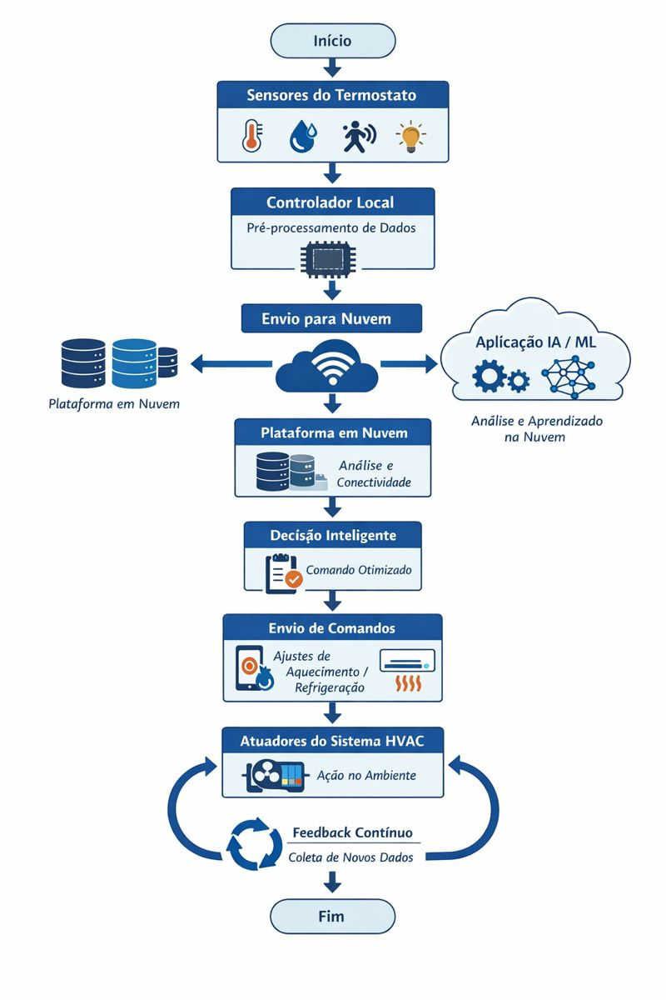

# Laboratório - Projetar um protótipo de um aplicativo de IA   

### Cisco: <a href="../../../">cisco   </a>
### Cisco Networking Academy: cna   </a>
### Training Category: <a href="../../../labs/">labs</a>
### Software/Subject: iot   </a>
### Course: <a href="./">lab_017 (Laboratório - Projetar um protótipo de um aplicativo de IA)   </a>

---

### Theme:
- Internet of Things (IoT)

### Used Tools:
- Operating System (OS): 
  - Windows 11 
- Cloud Services:
  - Google Drive 
- Language:
  - HTML   
  - Markdown   
- Integrated Development Environment (IDE) and Text Editor:
  - Visual Studio Code (VS Code)   
- Versioning: 
  - Git   
- Repository:
  - GitHub   

---

<h3><a name="item00">Course Strcuture:</a></h3>

1. <a href="#item01">Parte 1: Considere um aplicativo de IoT com a tecnologia de IA/ML</a> 
2. <a href="#item02">Parte 2: Crie componentes necessários para um aplicativo de IoT com a tecnologia IA/ML</a> 
3. <a href="#item03">Parte 3: Descreva o processo e a operação para o aplicativo de IoT com fluxogramas</a> 
4. <a href="#item04">Reflexão</a> 

---

### Objective:
Desenvolver um protótipo IoT no qual dispositivos IoT se comunicam com algoritmos de IA e Machine Learning hospedados em ambiente cloud para tomada de decisão inteligente.

### Folder Structure:
- [README.md](./README.md): Este documento de README, escrito em **Markdown**, com o conteúdo do laboratório.
- [0-aux](./0-aux/): Pasta auxiliar com imagens utilizadas na construção dos arquivos de README desse curso.

### Development:

<a name="item01"><h4>1. Parte 1: Considere um aplicativo de IoT com a tecnologia de IA/ML</h4></a>[Back to summary](#item00)

Nesta parte, você listará as funções e recursos de um termostato doméstico inteligente e um dispositivo controlador com capacidade de autoaprendizagem, tomando decisões com base nas mudanças ambientais e agindo de acordo.

- a. Liste as funcionalidades e a função desejadas para esse tipo de dispositivo.
  - Monitorar continuamente a temperatura interna do ambiente.
  - Ajustar automaticamente o aquecimento ou a refrigeração com base nas condições ambientais e nas preferências do usuário.
  - Aprender os hábitos dos moradores (horários de presença, temperatura preferida, rotinas diárias).
  - Integrar-se a sensores de presença, portas e janelas para evitar desperdício de energia.
  - Operar de forma automática ou manual, permitindo intervenção do usuário quando necessário.
  - Acessar previsões climáticas para antecipar mudanças de temperatura.
  - Otimizar o consumo de energia, reduzindo custos e impacto ambiental.
  - Enviar notificações e relatórios de uso por aplicativo móvel.
- b. Liste os fatores que podem influenciar a percepção de temperatura.
  - Temperatura externa.
  - Umidade do ar.
  - Incidência de luz solar.
  - Ventilação e circulação de ar.
  - Presença e quantidade de pessoas no ambiente.
  - Horário do dia.
  - Estação do ano.
  - Isolamento térmico do imóvel.
  - Atividade física realizada no ambiente.
- c. Indique as maneiras pelas quais os dispositivos inteligentes podem obter informações sobre esses fatores.
  - Sensores internos de temperatura e umidade.
  - Sensores de luminosidade para medir a incidência solar.
  - Sensores de presença e movimento para detectar ocupação.
  - Integração com estações meteorológicas e serviços de previsão do tempo.
  - Sensores em portas e janelas para identificar abertura e fechamento.
  - Análise de dados históricos de uso e comportamento dos moradores.
  - Comunicação com outros dispositivos inteligentes da residência (ventiladores, persianas, janelas automáticas).

<a name="item02"><h4>2. Parte 2: Crie componentes necessários para um aplicativo de IoT com a tecnologia IA/ML</h4></a>[Back to summary](#item00)

Nesta parte, você explorará e projetará as funções dos principais componentes necessários para o termostato/controlador inteligente.

- a. Quais são os principais componentes de um termostato/controlador inteligente?
  - Sensores: Sensores de temperatura, umidade, luminosidade e presença, responsáveis por coletar dados do ambiente.
  - Unidade de processamento (microcontrolador ou processador): Componente responsável por analisar os dados coletados, executar algoritmos de controle e aplicar regras de autoaprendizagem.
  - Software/firmware inteligente: Programa que gerencia o funcionamento do dispositivo, incluindo lógica de decisão, aprendizado de padrões de uso e integração com outros sistemas.
  - Atuadores: Elementos que executam as ações físicas, como ligar ou desligar sistemas de aquecimento, refrigeração ou ventilação.
  - Módulo de conectividade: Interface de comunicação (Wi-Fi, Bluetooth, Zigbee ou Z-Wave) para integração com aplicativos móveis, outros dispositivos inteligentes e serviços em nuvem.
  - Interface do usuário: Tela, botões ou aplicativo móvel que permitem configuração, monitoramento e controle manual do termostato.
  - Fonte de alimentação: Responsável por fornecer energia ao dispositivo, podendo ser elétrica, bateria ou híbrida.
- b. Listar o processo e a operação do termostato/controlador inteligente?
  - Coleta de dados: Os sensores monitoram continuamente as condições do ambiente, como temperatura, umidade e presença de pessoas.
  - Análise e processamento: A unidade de processamento interpreta os dados recebidos e os compara com parâmetros definidos e padrões aprendidos ao longo do tempo.
  - Tomada de decisão: O sistema decide automaticamente se deve acionar, ajustar ou desligar os sistemas de aquecimento ou refrigeração, considerando conforto e eficiência energética.
  - Ação dos atuadores: Os comandos são enviados aos atuadores, que executam fisicamente as ações necessárias no sistema de climatização.
  - Aprendizado contínuo: O dispositivo registra o comportamento do usuário e os resultados das ações, refinando suas decisões futuras por meio de autoaprendizagem.
  - Interação e feedback: O usuário pode acompanhar o funcionamento pelo aplicativo ou interface local, receber notificações e ajustar configurações quando necessário.

<a name="item03"><h4>3. Parte 3: Descreva o processo e a operação para o aplicativo de IoT com fluxogramas</h4></a>[Back to summary](#item00)

Nesta parte, você usará fluxogramas para descrever o fluxo lógico para coleta de dados, análise de dados, interação do ser humano e planejar ações adequadas.

- a. Com um fluxograma, descreva como os dados são coletados, comunicados a um aplicativo IA/ML na computação em nuvem e processados.
  - Sensores do termostato: Coletam dados de temperatura, umidade, presença, luminosidade e estado de portas/janelas.
  - Controlador local (microcontrolador): Pré-processa os dados, valida leituras e organiza as informações.
  - Módulo de conectividade: Transmite os dados via Wi-Fi/Zigbee/Z-Wave.
  - Plataforma em nuvem: Recebe e armazena os dados em bancos de dados.
  - Aplicação de IA/ML na nuvem: Analisa dados históricos e em tempo real, identifica padrões de uso e condições ambientais.
  - Tomada de decisão inteligente: Gera comandos com base em conforto térmico, eficiência energética e aprendizado do comportamento do usuário.
  - Envio de comandos ao termostato: Ajustes de aquecimento, refrigeração ou ventilação.
  - Atuadores do sistema HVAC: Executam as ações físicas no ambiente.
  - Feedback contínuo: Novos dados são coletados, fechando o ciclo de aprendizado e otimização.
- b. Use um fluxograma para ilustrar a operação geral do termostato/controlador inteligente.
  - Imagem 01.

<figure>
     
    <figcaption>Imagem 01.</figcaption>
</figure>
 

<a name="item04"><h4>4. Reflexão</h4></a>[Back to summary](#item00)

- a. Qual componente fornece a parte pensante para o aprendizado e, em seguida, se ajusta de acordo?
  - Aplicação de IA/ML (Inteligência Artificial e Aprendizado de Máquina): Esse componente fornece a “parte pensante” do sistema. Ele analisa os dados coletados pelos sensores, identifica padrões de comportamento e condições ambientais, aprende com o histórico de uso e ajusta automaticamente as decisões e comandos enviados ao termostato/controlador ao longo do tempo.
- b. Você consegue pensar em outros dispositivos de IoT que aprenderão ao longo do tempo e melhorarão suas operações?
  - Iluminação inteligente: aprende os horários de uso e a presença de pessoas para ajustar automaticamente intensidade e horários de acendimento.
  - Assistentes virtuais domésticos: aprendem preferências do usuário, rotinas e comandos mais frequentes para responder de forma mais precisa.
  - Câmeras de segurança inteligentes: aprendem padrões normais de movimento e passam a identificar atividades suspeitas com maior precisão.
  - Geladeiras inteligentes: aprendem hábitos de consumo e ajustam alertas ou sugestões de compra.
  - Máquinas de lavar inteligentes: aprendem tipos de carga, nível de sujeira e preferências para otimizar ciclos de lavagem.
  - Sistemas de irrigação inteligentes: aprendem padrões climáticos e necessidades das plantas para ajustar automaticamente a quantidade de água.
  - Robôs aspiradores: aprendem o layout do ambiente e os locais de maior sujeira, melhorando rotas e eficiência de limpeza.