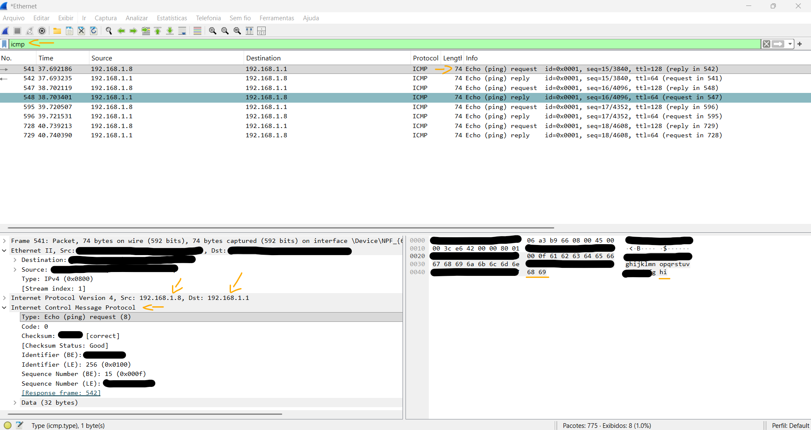
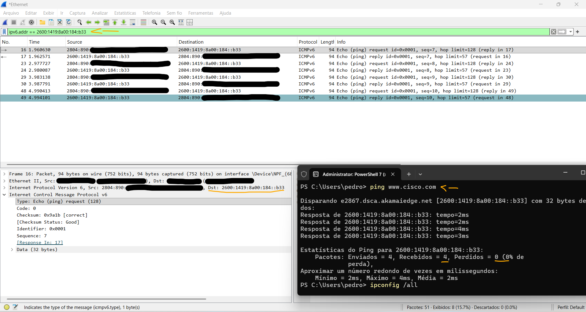

# Laboratório - Use o Wireshark para examinar os quadros Ethernet   

### Cisco: <a href="../../../">cisco   </a>
### Cisco Networking Academy: cna   </a>
### Training Category: <a href="../../../labs/">labs</a>
### Software/Subject: wireshark   </a>
### Course: <a href="./">lab_023 (Laboratório - Use o Wireshark para examinar os quadros Ethernet)   </a>

---

### Theme:
- Network

### Used Tools:
- Operating System (OS): 
  - Windows 11 
- Cloud Services:
  - Google Drive 
- Language:
  - HTML   
  - Markdown   
- Integrated Development Environment (IDE) and Text Editor:
  - Visual Studio Code (VS Code)   
- Versioning: 
  - Git   
- Repository:
  - GitHub   
- Network:
  - ping   
  - Wireshark   

---

<h3><a name="item00">Course Strcuture:</a></h3>

1. <a href="#item01">Parte 1: Examinar os campos do cabeçalho de um quadro Ethernet II</a> 
  1.1 <a href="#item01.01">Etapa 1: Analise os tamanhos e as descrições dos campos do cabeçalho Ethernet II.</a> 
  1.2 <a href="#item01.02">Etapa 2: Examinar a configuração de rede do PC.</a> 
  1.3 <a href="#item01.03">Etapa 3: Examine os quadros Ethernet em uma captura do Wireshark.</a> 
  1.4 <a href="#item01.04">Etapa 4: Examine o conteúdo do cabeçalho Ethernet II de uma requisição ARP.</a> 
2. <a href="#item02">Parte 2: Usar o Wireshark para capturar e analisar quadros Ethernet II</a> 
  2.1 <a href="#item02.01">Etapa 1: Determinar o endereço IP do gateway padrão em seu PC.</a> 
  2.2 <a href="#item02.02">Etapa 2: Iniciar a captura do tráfego na NIC do seu PC.</a> 
  2.3 <a href="#item02.03">Etapa 3: Filtrar o Wireshark para exibir apenas o tráfego ICMP.</a> 
  2.4 <a href="#item02.04">Etapa 4: Na janela do prompt de comando, fazer ping no gateway padrão do seu PC.</a> 
  2.5 <a href="#item02.05">Etapa 5: Interromper a captura de tráfego na NIC.</a> 
  2.6 <a href="#item02.06">Etapa 6: Examine a primeira requisição (ping) de eco no Wireshark.</a> 
  2.7 <a href="#item02.07">Etapa 7: Capturar pacotes para um host remoto.</a> 
3. <a href="#item03">Perguntas para reflexão</a> 

---

### Objective:
O objetivo deste laboratório foi utilizar o **Wireshark** para capturar e analisar o tráfego de rede entre o PC e o gateway padrão na rede local, bem como entre o PC e um host em uma rede remota, com o intuito de examinar e compreender os campos do cabeçalho do quadro Ethernet II.

### Folder Structure:
- [README.md](./README.md): Este documento de README, escrito em **Markdown**, com o conteúdo do laboratório.
- [0-aux](./0-aux/): Pasta auxiliar com imagens utilizadas na construção dos arquivos de README desse curso.

### Development:

<a name="item01"><h4>1. Parte 1: Examinar os campos do cabeçalho de um quadro Ethernet II</h4></a>[Back to summary](#item00)

Na Parte 1, você examinará o conteúdo e os campos do cabeçalho de um quadro Ethernet II. Será usada uma captura do Wireshark para examinar o conteúdo nesses campos. 

<a name="item01.01"><h4>1.1 Etapa 1: Analise os tamanhos e as descrições dos campos do cabeçalho Ethernet II.</h4></a>[Back to summary](#item00)

- Introdução: 8 bytes;
- Endereço de destino: 6 bytes;
- Endereço de origem: 6 bytes;
- Tipo de moldura: 2 bytes;
- Dados: 46 a 1.500 bytes;
- FCS: 4 bytes.
- Total (Quadro Ethernet II): 76 à 1.526 bytes. 

<a name="item01.02"><h4>1.2 Etapa 2: Examinar a configuração de rede do PC.</h4></a>[Back to summary](#item00)

- a. No exemplo, este endereço IP do host do PC é 192.168.1.147 e o gateway padrão possui um endereço IP 192.168.1.1. 
  - `C:\> ipconfig /all`

<a name="item01.03"><h4>1.3 Etapa 3: Examine os quadros Ethernet em uma captura do Wireshark.</h4></a>[Back to summary](#item00)

As capturas de tela da captura do Wireshark no arquivo mostram os pacotes gerados por um ping emitido de um host do PC para o gateway padrão. Um filtro foi aplicado ao Wireshark para visualizar somente os protocolos ARP e ICMP. ARP significa protocolo de resolução de endereços. ARP é um protocolo de comunicação que é usado para determinar o endereço MAC associado ao endereço IP. A sessão começa com uma consulta ARP e uma resposta para o endereço MAC do roteador de gateway, seguido por quatro solicitações e respostas de ping.

<a name="item01.04"><h4>1.4 Etapa 4: Examine o conteúdo do cabeçalho Ethernet II de uma requisição ARP.</h4></a>[Back to summary](#item00)

- a. A tabela a seguir usa o primeiro quadro na captura do Wireshark e exibe os dados nos campos do cabeçalho Ethernet II.

| Campo              | Valor                                   | Descrição |
|:--------------------:|:------------------------------------------:|:-----------:|
| Preâmbulo          | Não mostrado na captura                  | Este campo contém bits de sincronização, processados pelo hardware da NIC. |
| Endereço Destino   | Broadcast (ff:ff:ff:ff:ff:ff)            | Endereços de Camada 2 para o quadro. Cada endereço tem 48 bits (ou 6 octetos), expressos como 12 dígitos hexadecimais (0–9, A–F). O endereço destino pode ser broadcast, que contém todos os valores em 1, ou unicast. |
| Endereço Origem    | NETGear_99:C5:72 (30:46:9A:99:C5:72)     | Endereços de Camada 2 para o quadro. Os primeiros seis números hexadecimais indicam o fabricante da NIC e os últimos seis representam o número de série. O endereço origem é sempre unicast. |
| Tipo de quadro     | 0x0806                                  | Nos quadros Ethernet II, este campo indica o tipo de protocolo de camada superior no campo de dados. Exemplos comuns: 0x0800 (IPv4) e 0x0806 (ARP). |
| Dados ARP          | —                                       | Contém o protocolo de nível superior encapsulado. O campo de dados varia de 46 a 1.500 bytes. |
| FCS                | Não mostrado na captura                  | Sequência de Verificação de Quadro (FCS), usada pela NIC para identificar erros durante a transmissão. O valor é calculado pelo dispositivo de envio e verificado pelo receptor. |

- b. Qual é a importância do conteúdo do campo Endereço Destino?
  - Permite identificar qual interface de rede deve receber e processar o quadro, garantindo que ele seja entregue ao destino correto na Camada 2.
- c. Por que o PC envia um broadcast ARP antes da primeira requisição ping?
  - Porque o PC não possui o endereço MAC correspondente ao IP de destino em sua tabela ARP, sendo necessário descobri-lo antes de enviar o pacote ICMP.
- d. Qual é o endereço MAC origem no primeiro quadro?
  - Dell_50:fd:c8 (f0:1f:af:50:fd:c8)
- e. Qual é o ID do fornecedor (OUI) da NIC de origem na resposta do ARP?
  - 30:46:9a
- f. Que parte do endereço MAC é a OUI?
  - Os três primeiros octetos do endereço MAC (os seis primeiros dígitos hexadecimais).
- g. Qual é o número serial da NIC de origem?
  - 99:c5:72

<a name="item02"><h4>2. Parte 2: Usar o Wireshark para capturar e analisar quadros Ethernet II</h4></a>[Back to summary](#item00)

Na Parte 2, você usará o Wireshark para capturar quadros Ethernet locais e remotos. Em seguida, examinará as informações contidas nos campos do cabeçalho do quadro. 

<a name="item02.01"><h4>2.1 Etapa 1: Determinar o endereço IP do gateway padrão em seu PC.</h4></a>[Back to summary](#item00)

- a. Abra uma janela do prompt de comando e emita o comando ipconfig. Qual é o endereço IP do gateway padrão do PC?
  - 192.168.1.1

<a name="item02.02"><h4>2.2 Etapa 2: Iniciar a captura do tráfego na NIC do seu PC.</h4></a>[Back to summary](#item00)

- a. Abra o Wireshark para iniciar a captura de dados.
- b. Observe o tráfego que aparece na janela Packet List (Lista de pacotes).

<a name="item02.03"><h4>2.3 Etapa 3: Filtrar o Wireshark para exibir apenas o tráfego ICMP.</h4></a>[Back to summary](#item00)

Você pode usar o filtro do Wireshark para bloquear a visibilidade de tráfego indesejado. O filtro não bloqueia a captura de dados indesejados; apenas filtra o que você deseja exibir na tela. Por enquanto, deve ser exibido somente tráfego ICMP. 

- a. Na caixa Filtro do Wireshark, digite icmp. A caixa deve ficar verde se você digitou corretamente o filtro. Se a caixa estiver verde, clique em Apply (Aplicar) (a seta à direita) para aplicar o filtro. 

<a name="item02.04"><h4>2.4 Etapa 4: Na janela do prompt de comando, fazer ping no gateway padrão do seu PC.</h4></a>[Back to summary](#item00)

- a. Na janela de comando, faça ping no gateway padrão usando o endereço IP registrado na Etapa 1. 

<a name="item02.05"><h4>2.5 Etapa 5: Interromper a captura de tráfego na NIC.</h4></a>[Back to summary](#item00)

- a. Clique no ícone Parar de capturar pacotes para parar de capturar o tráfego.

<a name="item02.06"><h4>2.6 Etapa 6: Examine a primeira requisição (ping) de eco no Wireshark.</h4></a>[Back to summary](#item00)

A janela principal do Wireshark é dividida em três seções: o painel Packet List (Lista de pacotes) (superior), o painel Packet Details (Detalhes do pacote) (intermediária) e o painel Packet Bytes (Bytes do pacote) (inferior). Se você selecionou a interface correta para a captura de pacotes anteriormente, o Wireshark deve exibir as informações do ICMP no painel da lista de pacotes do Wireshark. 

- a. No painel Packet List (Lista de pacotes) [seção superior], clique no primeiro quadro listado. Você deve ver Echo (ping) request no cabeçalho Info (Informações). A linha deve agora ser realçada. 
- b. Examine a primeira linha no painel Packet Details (Detalhes do pacote) [seção intermediária]. Esta linha exibe o comprimento do quadro.
- c. A segunda linha no painel Packet Details (Detalhes do pacote) mostra que se trata de um quadro Ethernet II. Os endereços MAC de origem e de destino também são exibidos. Qual é o endereço MAC da NIC do PC?
  - MAC identificado (Info Confidencial).
- c. Qual é o endereço MAC do gateway padrão?
  - MAC identificado (Info Confidencial).
- d. Você pode clicar no sinal de mais que (>) no início da segunda linha para obter mais informações sobre o quadro Ethernet II. Que tipo de quadro é exibido?
  - IPv4 (0x0800).
- e. As duas últimas linhas exibidas na parte intermediária fornecem informações sobre o campo de dados do quadro. Observe que os dados contêm informações do endereço IPv4 origem e destino. Qual é o endereço IP de origem? 
  - 192.168.1.8
- e. Qual é o endereço IP de destino?
  - 192.168.1.1
- f. Clique em qualquer linha na seção intermediária para destacar a parte do quadro (hexadecimal e ASCII) no painel Packet Bytes (Bytes do pacote) [seção inferior]. Clique na linha Internet Control Message Protocol (Protocolo ICMP) na seção intermediária e examine o que está destacado no painel Packet Bytes (Bytes do pacote). O que dizem os dois últimos octetos destacados?
  - Os dois últimos octetos destacados são 68 69 (hexadecimal), correspondentes aos caracteres ASCII “hi”, presentes no campo de dados do ICMP.
- g. Clique no próximo quadro na seção superior e examine um quadro de resposta de eco. Observe que os endereços MAC de origem e de destino foram invertidos porque esse quadro foi enviado do roteador gateway padrão como uma resposta ao primeiro ping. Que dispositivo e endereço MAC são exibidos como endereço destino? 
  - O dispositivo é o PC utilizado e seu respectivo MAC.

A imagem 01 ilustra a primeira captura do tráfego ICMP na rede local.

<figure>
     
    <figcaption>Imagem 01.</figcaption>
</figure>
  

<a name="item02.07"><h4>2.7 Etapa 7: Capturar pacotes para um host remoto.</h4></a>[Back to summary](#item00)

- a. Clique no ícone Start Capture (Iniciar captura) para iniciar uma nova captura do Wireshark. Você receberá uma janela pop-up perguntando se deseja salvar os pacotes capturados em um arquivo antes de iniciar uma nova captura. Clique em Continue without Saving (Continuar sem salvar). 
- b. Em uma janela do prompt de comando, execute ping em www.cisco.com. 
- c. Parar a captura de pacotes.
- d. Examinar os novos dados no painel lista de pacotes do Wireshark. No primeiro quadro de requisição (ping) de eco, quais são os endereços MAC de origem e de destino?
  - Fonte: MAC do PC (Info Confidencial).
  - Destino: MAC do Gateway (Info Confidencial).
- d. Quais são os endereços IP origem e destino contidos no campo de dados do quadro?
  - Fonte: 2804:890:200:... (Info Confidencial).
  - Destino: 2600:1419:8a00:184::b33 (IPv6).
- d. Compare esses endereços com os endereços que você recebeu na Etapa 6. O único endereço que mudou foi o endereço IP de destino. Por que o endereço IP de destino mudou e o endereço MAC de destino permaneceu o mesmo? 
  - O endereço IP de destino mudou porque o destino final do pacote passou a ser um host em outra rede. Já o endereço MAC de destino não mudou porque, em comunicações fora da rede local, os quadros Ethernet são sempre enviados ao MAC do gateway padrão, independentemente do IP de destino final.

A imagem 02 exibe a captura do tráfego ICMP na rede remota.

<figure>
     
    <figcaption>Imagem 02.</figcaption>
</figure>
  

<a name="item03"><h4>3. Perguntas para reflexão</h4></a>[Back to summary](#item00)

- a. O Wireshark não exibe o campo Preâmbulo de um cabeçalho do quadro. O que o preâmbulo contém?
  - O preâmbulo contém bits de sincronização, usados para permitir que a placa de rede do dispositivo receptor sincronize o relógio e identifique o início do quadro. Esse campo é processado pelo hardware da NIC e, por isso, não é exibido pelo Wireshark.