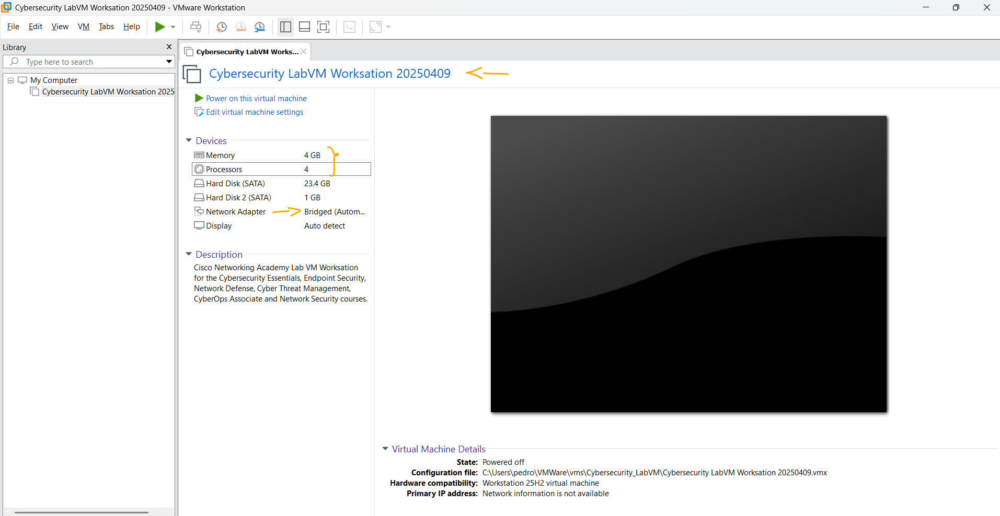
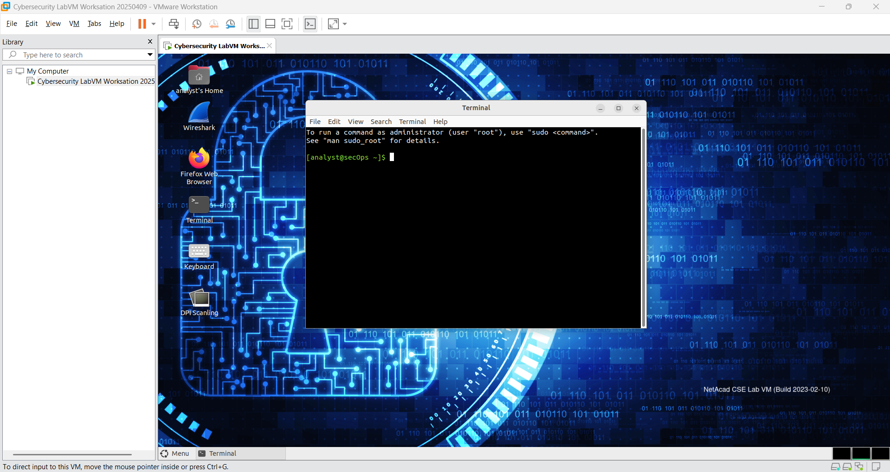

# Laboratório - Instalando as Máquinas Virtuais   

### Cisco: <a href="../../../">cisco   </a>
### Cisco Networking Academy: cna   </a>
### Training Category: <a href="../../../labs/">labs</a>
### Software/Subject: network   </a>
### Course: <a href="./">lab_025 (Laboratório - Instalando as Máquinas Virtuais)   </a>

---

### Theme:
- Network

### Used Tools:
- Operating System (OS): 
  - Windows 11 
- Cloud Services:
  - Google Drive 
- Language:
  - HTML   
  - Markdown   
- Integrated Development Environment (IDE) and Text Editor:
  - Visual Studio Code (VS Code)   
- Versioning: 
  - Git   
- Repository:
  - GitHub   
- Network:
  - ping   
  - Trace Route (tracert)   

---

<h3><a name="item00">Course Strcuture:</a></h3>

1. <a href="#item01">Parte 1: Prepare um computador pessoal para virtualização</a> 
  1.1 <a href="#item01.01">Etapa 1: Download e Instalação do VirtualBox.</a> 
  1.2 <a href="#item01.02">Etapa 2: Baixe o arquivo de imagem da máquina virtual.</a> 
  1.3 <a href="#item01.03">Reflexão</a> 
2. <a href="#item02">Parte 2: Importe uma máquina virtual para o inventário do VirtualBox</a> 
  2.1 <a href="#item02.01">Etapa 1: Importe o arquivo da máquina virtual para o VirtualBox.</a> 
  2.2 <a href="#item02.02">Etapa 2: Inicie a máquina virtual e faça login.</a> 
  2.3 <a href="#item02.03">Etapa 3: Familiarize-se com a Máquina Virtual.</a> 
  2.4 <a href="#item02.04">Etapa 4: Desligue as VMs.</a> 
3. <a href="#item03">Reflexão</a> 

---

### Objective:
Pesquisar quantas horas 3 a 4 pessoas ficam conectadas por meio de qualquer dispositivo durante cada dia.

### Folder Structure:
- [README.md](./README.md): Este documento de README, escrito em **Markdown**, com o conteúdo do laboratório.
- [0-aux](./0-aux/): Pasta auxiliar com imagens utilizadas na construção dos arquivos de README desse curso.

### Development:

<a name="item01"><h4>1. Parte 1: Prepare um computador pessoal para virtualização</h4></a>[Back to summary](#item00)

Na Parte 1, você baixará e instalará o software de virtualização de desktop e também baixará um arquivo de imagem que poderá ser usado para concluir os laboratórios durante todo o curso. Para este laboratório, a máquina virtual está executando o Linux.

<a name="item01.01"><h4>1.1 Etapa 1: Download e Instalação do VirtualBox.</h4></a>[Back to summary](#item00)

VMware Player e Oracle VirtualBox são dois programas de virtualização que você pode baixar e instalar para oferecer suporte ao arquivo de imagem. Neste laboratório, você usará o VirtualBox.

- a. Acesse http://www.oracle.com/technetwork/server-storage/virtualbox/downloads/index.html.
- b. Escolha e baixe o arquivo de instalação apropriado para seu sistema operacional.
- c. Quando você tiver feito o download do arquivo de instalação do VirtualBox, execute o instalador e aceite as configurações de instalação padrão.

<a name="item01.02"><h4>1.2 Etapa 2: Baixe o arquivo de imagem da máquina virtual.</h4></a>[Back to summary](#item00)

O arquivo de imagem foi criado de acordo com o Open Virtualization Format (OVF). O OVF é um padrão aberto para acondicionar e distribuir dispositivos virtuais. Um pacote de OVF tem vários arquivos colocados em um diretório. Esse diretório é distribuído para um pacote de OVA. Esse pacote contém todos os arquivos de OVF necessários para a implantação da máquina virtual. A máquina virtual usada neste laboratório foi exportada de acordo com o padrão de OVF.

- a. Baixe os arquivos de imagem cyberops_workstation.ova e security_onion.ova dos recursos do curso e anote o local da VM baixada.

<figure>
     
    <figcaption>Imagem 01.</figcaption>
</figure>
 

<a name="item02"><h4>2. Parte 2: Importe uma máquina virtual para o inventário do VirtualBox</h4></a>[Back to summary](#item00)

Na Parte 2, você importará a imagem de máquina virtual para o VirtualBox e a iniciará.

<a name="item02.01"><h4>2.1 Etapa 1: Importe o arquivo da máquina virtual para o VirtualBox.</h4></a>[Back to summary](#item00)

- a. Abra o VirtualBox. Clique em File > Import Appliance... para importar a imagem da máquina virtual.
- b. Na janela Appliance to import, especifique o local do arquivo .OVA e clique em Next.
- c. A janela Appliance apresenta as configurações sugeridas no arquivo OVA. Revise as configurações padrão e altere conforme necessário. Clique em Import para continuar.
- d. Ao concluir o processo de importação, você verá a nova máquina virtual adicionada ao inventário do VirtualBox no painel esquerdo. Agora a máquina virtual está pronta para ser usada.

<a name="item02.02"><h4>2.2 Etapa 2: Inicie a máquina virtual e faça login.</h4></a>[Back to summary](#item00)

- a. Selecione e inicie máquinas virtuais recém-importadas. A VM CyberOps Workstation é usada como exemplo neste laboratório.
- b. Clique no botão de seta verde Iniciar na parte superior da janela do aplicativo VirtualBox. Se você receber a caixa de diálogo a seguir, clique em Change Network Settings e defina o adaptador de ponte. Clique na lista suspensa ao lado do Nome e escolha seu adaptador de rede (variará para cada computador). Observação: Se sua rede não estiver configurada com serviços DHCP, clique em Change Network Settings e selecione NAT na caixa suspensa. As configurações de rede também podem ser acessadas por meio de Settings no Oracle VirtualBox Manager ou no menu de máquina virtual, selecione Devices > Network > Network Settings. Talvez seja necessário desativar e habilitar o adaptador de rede para
que a alteração entre em vigor.
- c. Clique em OK. Uma nova janela será exibida e o processo de boot da máquina virtual será iniciado.
- d. Quando o processo de boot estiver concluído, a máquina virtual solicitará um nome de usuário e senha. Use as seguintes credenciais para iniciar uma sessão na máquina virtual:
  - Nome de usuário: analyst
  - Senha: cyberops
- d. Você entrará em um ambiente de área de trabalho: há uma barra de inicialização na parte inferior, ícones na área de trabalho e um menu de aplicativos na parte superior. Nota: Observe o foco do teclado e do mouse. Ao clicar dentro da janela da máquina virtual, o mouse e o teclado comandarão o sistema operacional convidado. O sistema operacional de host deixará de detectar os toques de tecla ou movimentos do mouse. Pressione a tecla CTRL direita para retornar o foco do teclado e do mouse ao sistema operacional host.

<a name="item02.03"><h4>2.3 Etapa 3: Familiarize-se com a Máquina Virtual.</h4></a>[Back to summary](#item00)

A máquina virtual que você acabou de instalar pode ser usada para completar muitos dos laboratórios neste curso. Familiarize-se com os ícones da lista abaixo. Os ícones da barra do lançador são (da esquerda para a direita):
- Mostrar a área de trabalho;
- Aplicativo Terminal;
- Aplicação de gerenciador de arquivos;
- Aplicativo de navegador da Web (Firefox);
- Ferramenta de busca de arquivos;
- Diretório pessoal do usuário atual;

Todos os aplicativos relacionados ao curso estão localizados no Applications Menu > CyberOPs

- a. Liste os aplicativos no menu CyberOps.
  - 
- b. Abra o aplicativo Emulador de Terminal. Digite ip address no prompt para determinar o endereço IP da sua máquina virtual. Quais são os endereços IP designados para a máquina virtual?
  - 
- c. Localize e inicie o aplicativo do navegador da Web. É possível navegar para seu mecanismo de busca favorito?
  - 

<a name="item02.04"><h4>2.4 Etapa 4: Desligue as VMs.</h4></a>[Back to summary](#item00)

Quando terminar com a VM, você pode salvar o estado da VM para uso futuro ou encerrar a VM. 

- a. Fechando a VM usando GUI:
  - No menu File do VirtualBox, escolha Close.
  - Clique no botão de rádio Save the machine state (Salvar o estado da máquina) e clique em OK. Da próxima vez que iniciar a máquina virtual, você conseguirá retomar o funcionamento do sistema operacional no estado atual.
  - As outras duas opções são:
    - Enviar o sinal de desligamento: simula pressionar o botão liga/desliga em um computador físico.
    - Desligar a máquina: simula puxar o plugue em um computador físico.
- b. Fechando a VM usando a CLI:
  - Para desligar a VM usando a linha de comando, você pode usar as opções de menu dentro da VM ou digitar o comando sudo shutdown -h now em uma janela de terminal e fornecer a senha cyberops quando solicitado.
- c. Reinicializando a VM:
  - Se você quiser reinicializar a VM, você pode usar as opções de menu dentro da VM ou digitar o comando sudo reboot em um terminal e fornecer a senha cyberops quando solicitado. Observação: Você pode usar o navegador da Web nesta máquina virtual para pesquisar problemas de segurança. Usando a máquina virtual, você pode impedir que malware seja instalado em seu computador.

<figure>
     
    <figcaption>Imagem 02.</figcaption>
</figure>
 

<a name="item03"><h4>3. Reflexão</h4></a>[Back to summary](#item00)

- a. Quais são as vantagens e as desvantagens de usar uma máquina virtual?
  - Usar uma máquina virtual permite melhor aproveitamento do hardware, isolamento entre sistemas e maior flexibilidade para testes e execução de diferentes ambientes no mesmo equipamento. Além disso, facilita backup, recuperação e portabilidade dos sistemas. Como desvantagens, há perda de desempenho em relação ao sistema físico, maior consumo de recursos e dependência de um software de virtualização.