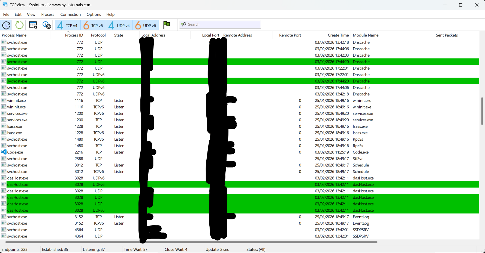
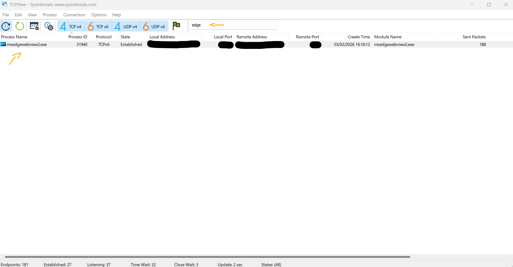

# Atividade da Classe - Identificar Processos em Execução   

### Cisco: <a href="../../../">cisco   </a>
### Cisco Networking Academy: cna   </a>
### Training Category: <a href="../../../labs/">labs</a>
### Software/Subject: sysadmin   </a>
### Course: <a href="./">lab_030 (Atividade da Classe - Identificar Processos em Execução)   </a>

---

### Theme:
- Systems Administration

### Used Tools:
- Operating System (OS): 
  - Windows 11 
- Cloud Services:
  - Google Drive 
- Language:
  - HTML   
  - Markdown   
- Integrated Development Environment (IDE) and Text Editor:
  - Visual Studio Code (VS Code)   
- Versioning: 
  - Git   
- Repository:
  - GitHub   
- SysAdm:
  - Tcpview   
  - Windows Sysinternals Suite   

---

<h3><a name="item00">Course Strcuture:</a></h3>

1. <a href="#item01">Parte 1: Baixar o Windows Sysinternals Suite.</a> 
2. <a href="#item02">Parte 2: Inicie TCP/UDP Endpoint Viewer.</a> 
3. <a href="#item03">Parte 3: Explore os processos em execução.</a> 
4. <a href="#item04">Parte 4: Explore um processo iniciado pelo usuário.</a> 

---

### Objective:
O objetivo desta atividade de classe foi utilizar o TCP/UDP Endpoint Viewer, uma ferramenta no Sysinternals Suite, para identificar quaisquer processos em execução no computador. 

### Folder Structure:
- [README.md](./README.md): Este documento de README, escrito em **Markdown**, com o conteúdo do laboratório.
- [0-aux](./0-aux/): Pasta auxiliar com imagens utilizadas na construção dos arquivos de README desse curso.

### Development:

<a name="item01"><h4>1. Parte 1: Baixar o Windows Sysinternals Suite.</h4></a>[Back to summary](#item00)

- a. Navegue até o link a seguir para baixar o Windows Sysinternals Suite: https://technet.microsoft.com/en-us/sysinternals/bb842062.aspx
- b. Após a conclusão do download, clique com o botão direito do mouse no arquivo zip e escolha Extrair tudo..., para extrair os arquivos da pasta. Escolha o nome e o destino padrão na pasta Downloads e clique em Extrair.
- c. Saia do navegador da Web.

<a name="item02"><h4>2. Parte 2: Inicie TCP/UDP Endpoint Viewer.</h4></a>[Back to summary](#item00)

- a. Navegue até a pasta SysInternalsSuite com todos os arquivos extraídos
- b. Abra Tcpview.exe. Aceite o Contrato de Licença do Process Explorer quando solicitado. Clique em Sim para permitir que este aplicativo faça alterações em seu dispositivo. 
- c. Saia do Explorer e feche todas as aplicações atualmente em execução. 

A imagem 01 exibe o **Tcpview** em execução.

<figure>
     
    <figcaption>Imagem 01.</figcaption>
</figure>
 

<a name="item03"><h4>3. Parte 3: Explore os processos em execução.</h4></a>[Back to summary](#item00)

- a. O TCPView lista o processo que está atualmente no seu PC Windows. Neste momento, apenas os processos do Windows estão em execução.
- b. Dê um clique duplo lsass.exe. O que é lsass.exe? Em que pasta ele está localizado? 
  - C:\Windows\System32
- c. Feche a janela de propriedades para lsass.exe quando terminar. 
- d. Exiba as propriedades dos outros processos em execução. Observação: Nem todos os processos podem ser consultados para obter informações sobre
propriedades. 

<a name="item04"><h4>4. Parte 4: Explore um processo iniciado pelo usuário.</h4></a>[Back to summary](#item00)

- a. Abra um navegador da Web, como o Microsoft Edge. O que você observou na janela do TCPView?
  - Ao abrir o Microsoft Edge, o TCPView exibe instantaneamente múltiplas instâncias do processo msedge.exe estabelecendo conexões simultâneas com diversos endereços IP remotos. Isso ocorre porque os navegadores modernos utilizam uma arquitetura multi-processo para isolar abas e acelerar o carregamento de recursos através de várias sessões TCP/UDP paralelas.
- b. Feche o navegador da Web. O que você observou na janela do TCPView?
  - Ao fechar o navegador, o TCPView destaca as linhas em vermelho para indicar o encerramento imediato das conexões e a remoção dos processos msedge.exe da lista. A permanência do msedgewebview2.exe ocorre porque este processo pertence à infraestrutura do Windows que renderiza conteúdo web para outros aplicativos do sistema, operando de forma independente da janela principal do navegador. A imagem 02 exibe esse momento.
- c. Reabra o navegador Web. Pesquise alguns dos processos listados no TCPView. Anote suas descobertas.
  - Ao reabrir o navegador, você notará que o TCPView volta a exibir uma série de processos ativos, cada um com uma função específica na comunicação de rede. Aqui estão as descobertas que você pode anotar para este ponto:
    - Processos de Renderização e Abas: Muitas instâncias do msedge.exe que você vê não são o navegador em si, mas processos isolados para cada aba aberta e extensão ativa, visando aumentar a segurança e a estabilidade do sistema.
    - Serviços de Background e Telemetria: Você encontrará processos conectando-se a endereços da Microsoft e CDNs (redes de entrega de conteúdo), que servem para sincronizar seus dados, verificar atualizações de segurança e carregar o conteúdo dos sites de forma mais rápida.

<figure>
     
    <figcaption>Imagem 02.</figcaption>
</figure>
 