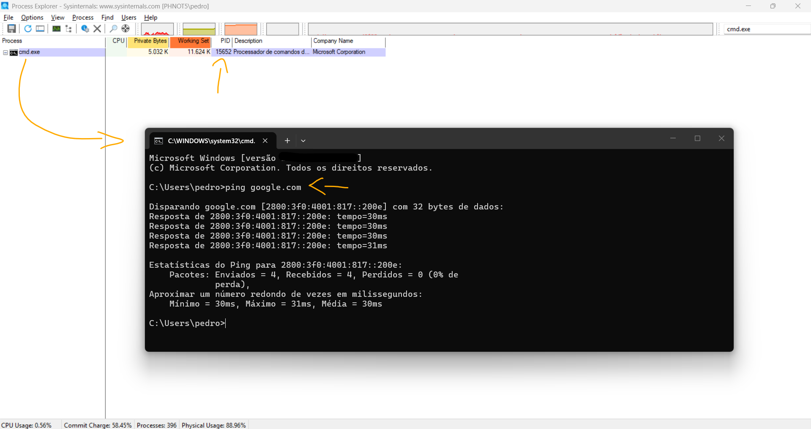
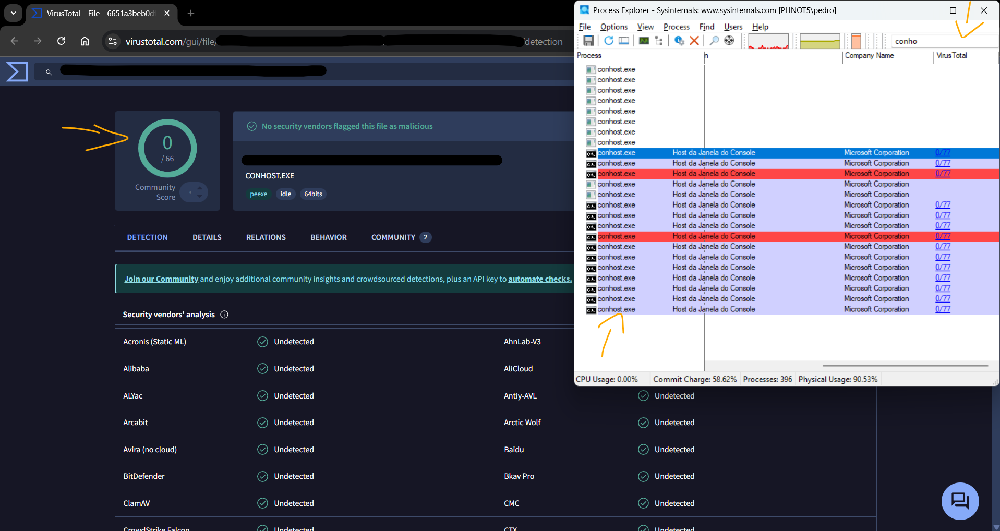
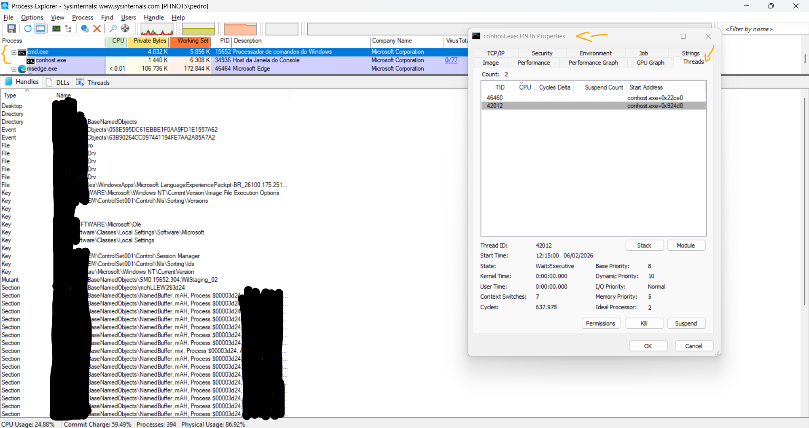
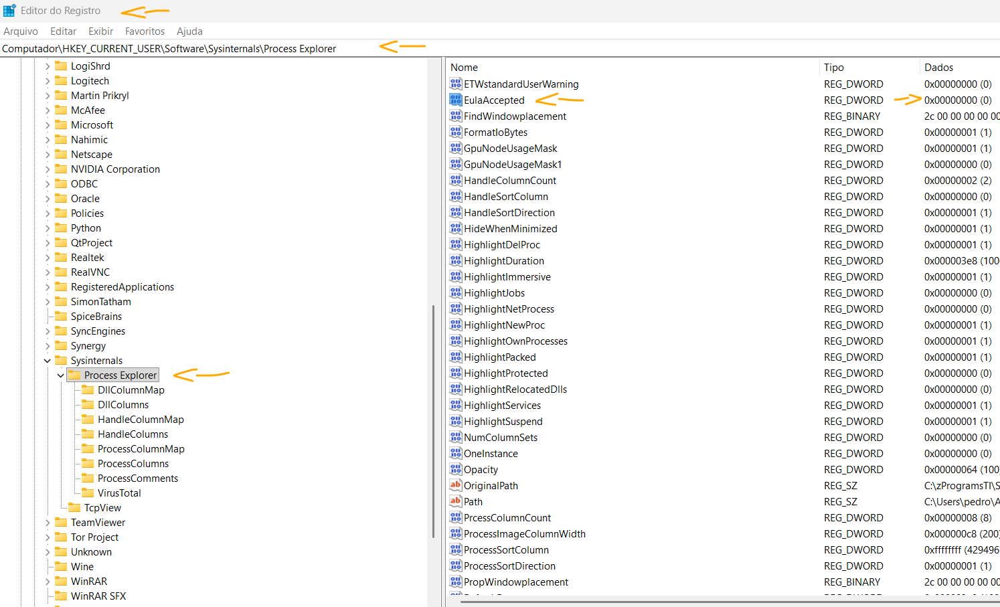

# Laboratório - Explorando Processos, Threads, Handles e Registro do Windows   

### Cisco: <a href="../../../">cisco   </a>
### Cisco Networking Academy: cna   </a>
### Training Category: <a href="../../../labs/">labs</a>
### Software/Subject: sysadmin   </a>
### Course: <a href="./">lab_031 (Laboratório - Explorando Processos, Threads, Handles e Registro do Windows)   </a>

---

### Theme:
- Systems Administration

### Used Tools:
- Operating System (OS): 
  - Windows 11 
- Cloud Services:
  - Google Drive 
- Language:
  - HTML   
  - Markdown   
- Integrated Development Environment (IDE) and Text Editor:
  - Visual Studio Code (VS Code)   
- Versioning: 
  - Git   
- Repository:
  - GitHub   
- SysAdm:
  - Registry Editor (Regedit)   
  - Process Explorer (Procexp)   
  - Windows Sysinternals Suite   

---

<h3><a name="item00">Course Strcuture:</a></h3>

1. <a href="#item01">Parte 1: Explorando Processos</a> 
  1.1 <a href="#item01.01">Etapa 1: Baixe o Windows SysInternals Suite.</a> 
  1.2 <a href="#item01.02">Etapa 2: Explore um processo ativo.</a> 
  1.3 <a href="#item01.03">Etapa 3: Inicie outro processo.</a> 
2. <a href="#item02">Parte 2: Explorando Threads e Alças</a> 
  2.1 <a href="#item02.01">Etapa 1: Explore tópicos.</a> 
  2.2 <a href="#item02.02">Etapa 2: Explore alças.</a> 
3. <a href="#item03">Parte 3: Explorando o Registro do Windows</a> 

---

### Objective:
O objetivo deste laboratório foi utilizar o **Process Explorer (Procexp)** do **Windows SysInternals Suite** para explorar processos, threads e manipuladores, além de utilizar o Editor de Registro do Windows, o **Regedit**, para alterar uma configuração.

### Folder Structure:
- [README.md](./README.md): Este documento de README, escrito em **Markdown**, com o conteúdo do laboratório.
- [0-aux](./0-aux/): Pasta auxiliar com imagens utilizadas na construção dos arquivos de README desse curso.

### Development:

<a name="item01"><h4>1. Parte 1: Explorando Processos</h4></a>[Back to summary](#item00)

Nesta parte, você explorará processos. Processos são programas ou aplicativos em execução. Você explorará os processos usando o Process Explorer no Windows SysInternals Suite. Você também iniciará e observará um novo processo.

<a name="item01.01"><h4>1.1 Etapa 1: Baixe o Windows SysInternals Suite.</h4></a>[Back to summary](#item00)

- a. Navegue até o link a seguir para baixar o Windows SysInternals Suite: https://technet.microsoft.com/en-us/sysinternals/bb842062.aspx
- b. Após a conclusão do download, extraia os arquivos da pasta. 
- c. Deixe o navegador da Web aberto para as etapas a seguir. 

<a name="item01.02"><h4>1.2 Etapa 2: Explore um processo ativo.</h4></a>[Back to summary](#item00)

- a. Navegue até a pasta SysInternalsSuite com todos os arquivos extraídos.
- b. Abra procexp.exe. Aceite o Contrato de Licença do Process Explorer quando solicitado.
- c. O Process Explorer exibe uma lista de processos ativos no momento.
- d. Para localizar o processo do navegador da Web, arraste o ícone Processo da Janela Localizar para a janela aberta do navegador da Web. O Microsoft Edge foi usado neste exemplo.
- e. O processo do Microsoft Edge pode ser encerrado no Process Explorer. Clique com o botão direito no processo selecionado e selecione Eliminar Processo Clique em OK para continuar. O que aconteceu com a janela do navegador da Web quando o processo é eliminado?
  - A janela do navegador é fechada imediatamente, pois ao eliminar o processo no Process Explorer, o Microsoft Edge é finalizado à força e todos os seus componentes em execução são encerrados.

<a name="item01.03"><h4>1.3 Etapa 3: Inicie outro processo.</h4></a>[Back to summary](#item00)

- a. Abra um prompt de comando. (Iniciar > pesquisar Prompt de Comando > selecione Prompt de Comando) 
- b. Arraste o ícone Processo da Janela Localizar para a janela Prompt de Comando e localize o processo de Prompt de Comando realçado no Process Explorer. 
- c. O processo para o prompt de comando é cmd.exe. Seu processo pai é o processo explorer.exe. O cmd.exe tem um processo filho, conhost.exe. 
- d. Acesse a janela do Prompt de Comando. Inicie um ping no prompt e observe as alterações no processo cmd.exe. O que aconteceu durante o processo de ping?
  - Durante o processo de ping, o cmd.exe permaneceu em execução contínua enquanto enviava e recebia pacotes de rede. No entanto, as mudanças no uso de CPU e memória foram mínimas e praticamente imperceptíveis, já que o comando ping consome poucos recursos do sistema.
- e. Ao revisar a lista de processos ativos, você acha que o processo filho conhost.exe pode ser suspeito. Para procurar conteúdo malicioso, clique com o botão direito do mouse em conhost.exe e selecione Verificar VirusTotal. Quando solicitado, clique em Sim para concordar com os Termos de Serviço VirusTotal. Em seguida, clique em OK para o próximo prompt.
- f. Expanda a janela do Process Explorer ou role para a direita até ver a coluna VirusTotal. Clique no link sob a coluna VirusTotal. O navegador da Web padrão é aberto com os resultados em relação ao conteúdo malicioso do conhost.exe.
- g. Clique com o botão direito no processo cmd.exe e selecione Eliminar Processo. O que aconteceu com o processo filho conhost.exe?
  - Ao encerrar o processo cmd.exe, o processo filho conhost.exe também foi finalizado automaticamente. Isso acontece porque o conhost.exe depende do cmd.exe para funcionar; quando o processo pai é encerrado, o processo filho associado a ele também é encerrado pelo sistema.

As imagens 1 e 2 mostram a conclusão da Parte 1.

<figure>
     
    <figcaption>Imagem 01.</figcaption>
</figure>
 

<figure>
     
    <figcaption>Imagem 02.</figcaption>
</figure>
 

<a name="item02"><h4>2. Parte 2: Explorando Threads e Alças</h4></a>[Back to summary](#item00)

Nesta parte, você vai explorar tópicos e alças. Os processos têm um ou mais threads. Um thread é uma unidade de execução em um processo. Um identificador é uma referência abstrata a blocos de memória ou objetos gerenciados por um sistema operacional. Você usará o Process Explorer (procexp.exe) no Windows SysInternals Suite para explorar os threads e identificadores. 

<a name="item02.01"><h4>2.1 Etapa 1: Explore tópicos.</h4></a>[Back to summary](#item00)

- a. Abra um prompt de comando.
- b. Na janela Process Explorer, clique com o botão direito do mouse em conhost.exe e Selecionar Propriedades... Clique na guia Threads para exibir os threads ativos para o processo conhost.exe. Clique em OK para continuar se solicitado por uma caixa de diálogo de aviso. 
- c. Examine os detalhes do thread. Que tipo de informação está disponível na janela Propriedades?
  - A janela de Propriedades na guia Threads mostra informações detalhadas sobre os threads em execução dentro do processo, como o ID do thread (TID), uso de CPU, tempo de execução, endereço de início (start address) e o módulo ou função responsável por iniciar cada thread. Esses dados ajudam a entender como o processo está sendo executado e quais partes do sistema ou bibliotecas estão sendo utilizadas.
- d. Clique em OK para continuar. 

<a name="item02.02"><h4>2.2 Etapa 2: Explore alças.</h4></a>[Back to summary](#item00)

- a. No Process Explorer, clique em Exibir > selecione Modo de Exibição de Painel Inferior > Alças para exibir os identificadores associados ao processo conhost.exe. Examine as alças. Para que apontam as alças?
  - As alças (handles) apontam para recursos do sistema que o processo conhost.exe está utilizando, como objetos do sistema, arquivos, chaves de registro, eventos e componentes do console. Elas representam referências ativas que o processo mantém abertas para conseguir interagir com o sistema e gerenciar a janela do terminal.
- b. Feche o Process Explorer quando terminar.

A imagem 03 exibe a conclusão da Parte 2.

<figure>
     
    <figcaption>Imagem 03.</figcaption>
</figure>
 

<a name="item03"><h4>3. Parte 3: Explorando o Registro do Windows</h4></a>[Back to summary](#item00)

O Registro do Windows é um banco de dados hierárquico que armazena a maioria dos sistemas operacionais e configurações de ambiente de trabalho.

- a. Para acessar o Registro do Windows, clique em Iniciar > Pesquisar regedit e selecione Editor do Registro. Clique em Sim quando solicitado a permitir que este aplicativo faça alterações. O Editor do Registro tem cinco hives. Estas hives estão no nível superior do registo. 
  - HKEY_CLASSES_ROOT: é na verdade a subchave Classes de HKEY_LOCAL_MACHINE\Software\. Ele armazena informações usadas por aplicativos registrados como associação de extensão de arquivo, bem como um identificador programático (ProgID), ID de classe (CLSID) e dados de ID de interface (IID). 
  - HKEY_CURRENT_USER: contém as configurações e configurações para os usuários que estão conectados no momento.
  - HKEY_LOCAL_MACHINE: armazena informações de configuração específicas do computador local. 
  - HKEY_USERS: contém as configurações e configurações para todos os usuários no computador local. HKEY_CURRENT_USER é uma subchave de HKEY_USERS. 
  - HKEY_CURRENT_CONFIG: armazena as informações de hardware usadas na inicialização pelo computador local.
- b. Em uma etapa anterior, você aceitou o EULA para Process Explorer. Navegue até a chave de registro EulaAccepted para Process Explorer. Clique para selecionar Process Explorer em HKEY_CURRENT_USER > Software > Sysinternals > Process Explorer. Role para baixo para localizar a chave EulaAccepted. Atualmente, o valor para a chave de registro EulaAccepted é 0x00000001 (1).
- c. Clique duas vezes na chave de registro EULAAceite. Atualmente, os dados do valor são definidos como 1. O valor de 1 indica que o EULA foi aceito pelo usuário.
- d. Altere o 1 para 0 para dados de valor. O valor 0 indica que o EULA não foi aceito. Clique em OK para continuar. Qual é o valor para esta chave de registo na coluna Dados?
  - Binário: 0; Hexadecimal: 0x00000000.
- e. Abra o Process Explorer. Navegue até a pasta onde você baixou o SysInternals. Abra a pasta SysInternalsSuite > Abrir procexp.exe. Quando você abre o Process Explorer, o que você viu?
  - Ao abrir o Process Explorer novamente, os termos de licença (EULA) aparecem outra vez solicitando que o usuário aceite, pois o valor da chave foi alterado para indicar que o contrato ainda não havia sido aceito.

A imagem 04 exibe a conclusão da Parte 3.

<figure>
     
    <figcaption>Imagem 04.</figcaption>
</figure>
 