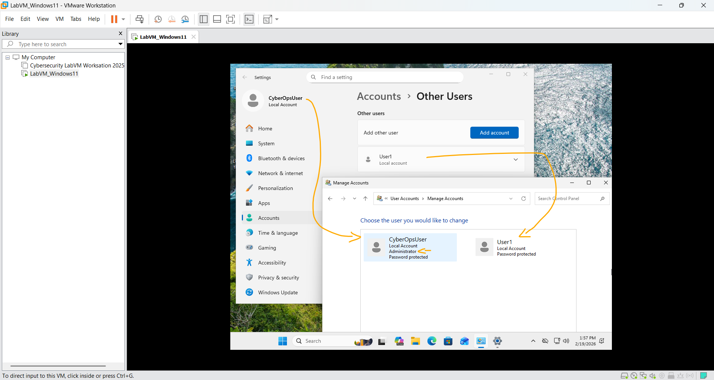
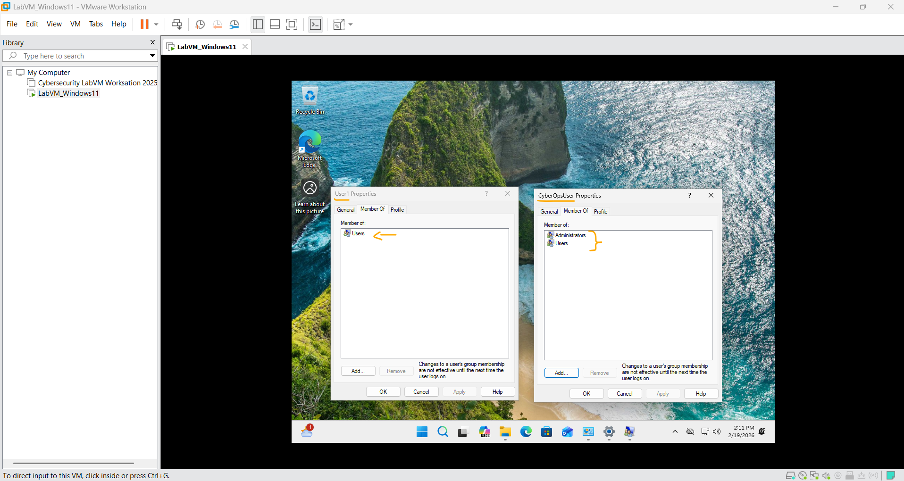

# Laboratório – Criação de Contas de Usuário   

### Cisco: <a href="../../../">cisco   </a>
### Cisco Networking Academy: cna   </a>
### Training Category: <a href="../../../labs/">labs</a>
### Software/Subject: network   </a>
### Course: <a href="./">lab_032 (Laboratório – Criação de Contas de Usuário)   </a>

---

### Theme:
- Network

### Used Tools:
- Operating System (OS): 
  - Windows 11 
- Cloud Services:
  - Google Drive 
- Language:
  - HTML   
  - Markdown   
- Integrated Development Environment (IDE) and Text Editor:
  - Visual Studio Code (VS Code)   
- Versioning: 
  - Git   
- Repository:
  - GitHub   
- Network:
  - ping   
  - Trace Route (tracert)   

---

<h3><a name="item00">Course Strcuture:</a></h3>

1. <a href="#item01">Laboratório - Como você está conectado?</a> 
  1.1 <a href="#item01.01">Parte 1: Determinar a conectividade de rede com um host destino</a> 
  1.2 <a href="#item01.02">Parte 2: Rastrear uma rota para um servidor remoto usando o Tracert</a> 
  1.3 <a href="#item01.03">Reflexão</a> 
2. <a href="#item02">Reflexão</a> 
  2.1 <a href="#item02.01">Parte 1: Determinar a</a> 
  2.2 <a href="#item02.02">Parte 2: Rastrear uma</a> 

---

### Objective:
Pesquisar quantas horas 3 a 4 pessoas ficam conectadas por meio de qualquer dispositivo durante cada dia.

### Folder Structure:
- [README.md](./README.md): Este documento de README, escrito em **Markdown**, com o conteúdo do laboratório.
- [0-aux](./0-aux/): Pasta auxiliar com imagens utilizadas na construção dos arquivos de README desse curso.

### Development:

<a name="item01"><h4>1. Laboratório - Como você está conectado?</h4></a>[Back to summary](#item00)

<a name="item01.01"><h4>1.1 Parte 1: Determinar a conectividade de rede com um host destino</h4></a>[Back to summary](#item00)

<a name="item01.02"><h4>1.2 Parte 2: Rastrear uma rota para um servidor remoto usando o Tracert</h4></a>[Back to summary](#item00)

<figure>
     
    <figcaption>Imagem 01.</figcaption>
</figure>
 

<a name="item01.03"><h4>1.3 Reflexão</h4></a>[Back to summary](#item00)

<a name="item02"><h4>2. Reflexão</h4></a>[Back to summary](#item00)

<a name="item02.01"><h4>2.1 Parte 1: Determinar a</h4></a>[Back to summary](#item00)

<a name="item02.02"><h4>2.2 Parte 2: Rastrear uma</h4></a>[Back to summary](#item00)

<figure>
     
    <figcaption>Imagem 02.</figcaption>
</figure>
 