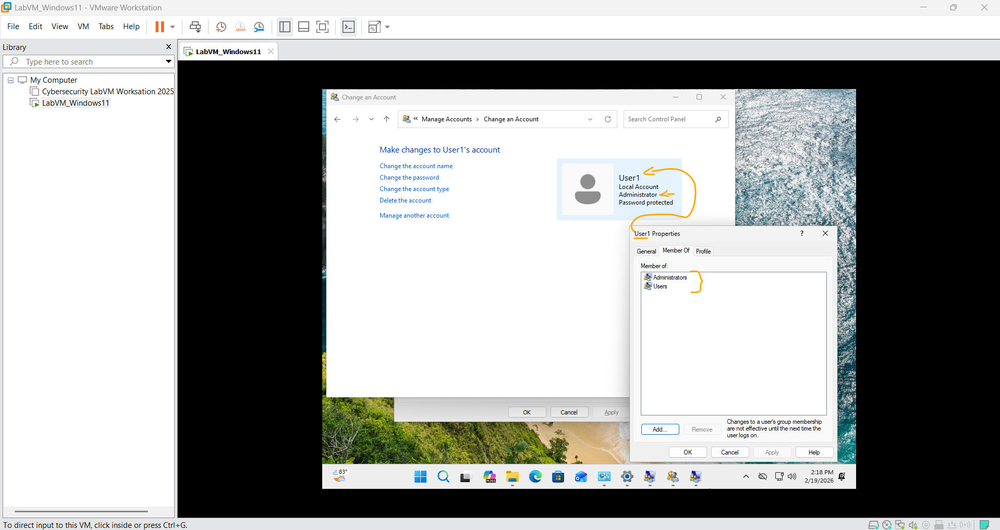

# Laboratório – Criação de Contas de Usuário   

### Cisco: <a href="../../../">cisco   </a>
### Cisco Networking Academy: cna   </a>
### Training Category: <a href="../../../labs/">labs</a>
### Software/Subject: sysadmin   </a>
### Course: <a href="./">lab_032 (Laboratório – Criação de Contas de Usuário)   </a>

---

### Theme:
- Systems Administration

### Used Tools:
- Operating System (OS): 
  - Windows 11 
- Cloud Services:
  - Google Drive 
- Language:
  - HTML   
  - Markdown   
- Integrated Development Environment (IDE) and Text Editor:
  - Visual Studio Code (VS Code)   
- Versioning: 
  - Git   
- Repository:
  - GitHub   
- Windows Tools:
  - Local Users and Groups Microsoft Management Console (lusrmgr MMC)   
  - Microsoft Control Panel   
  - Microsoft User Accounts   
  - Windows Settings; Microsoft Settings (ms-settings)   

---

<h3><a name="item00">Course Strcuture:</a></h3>

1. <a href="#item01">Parte 1: Criando uma nova conta de usuário local</a> 
  1.1 <a href="#item01.01">Etapa 1: Abra a ferramenta de conta do usuário.</a> 
  1.2 <a href="#item01.02">Etapa 2: Crie uma contas de usuário.</a> 
2. <a href="#item02">Parte 2: Revisando Propriedades da Conta de Usuário</a> 
3. <a href="#item03">Parte 3: Modificando Contas de Usuário Local</a> 
  3.1 <a href="#item03.01">Etapa 1: Altere o tipo de conta.</a> 
  3.2 <a href="#item03.02">Etapa 2: Apague a conta </a> 
4. <a href="#item04">Perguntas para reflexão </a> 

---

### Objective:
O objetivo deste laboratório foi praticar o gerenciamento de contas de usuários locais no sistema operacional, abrangendo todo o ciclo de vida de uma conta secundária, desde o seu provisionamento e alteração de privilégios até a exclusão definitiva.

### Folder Structure:
- [README.md](./README.md): Este documento de README, escrito em **Markdown**, com o conteúdo do laboratório.
- [0-aux](./0-aux/): Pasta auxiliar com imagens utilizadas na construção dos arquivos de README desse curso.

### Development:

<a name="item01"><h4>1. Parte 1: Criando uma nova conta de usuário local</h4></a>[Back to summary](#item00)

<a name="item01.01"><h4>1.1 Etapa 1: Abra a ferramenta de conta do usuário.</h4></a>[Back to summary](#item00)

- a. Faça logon no PC com Windows com uma conta de administrador. A conta CyberOpsUser é usada neste exemplo. 
- b. Clique em Iniciar> Pesquisar no Painel de Controle. Selecione Contas de usuário na exibição Ícones pequenos. Para alterar a exibição, selecione Ícones pequenos na lista suspensa Exibir por.

<a name="item01.02"><h4>1.2 Etapa 2: Crie uma contas de usuário.</h4></a>[Back to summary](#item00)

- a. Na janela Contas de usuário (`control /name Microsoft.UserAccounts`), clique em Gerenciar outra conta.
- b. Na janela Gerenciar Contas, clique em Adicionar um novo usuário nas configurações do PC. 
- c. Na janela Configurações, clique em Adicionar outra pessoa a este PC.
- c. Vai ser alterado do painel de controle antigo para o novo. Ao clicar em Adicionar conta em Adicionar outro usuário, a janela de conta da Microsoft vai ser aberta.
- d. Como esta pessoa fará login? Clique em Não tenho as informações de login desta pessoa.
- e. Na janela Vamos criar sua conta é aberta, clique em Adicionar um usuário sem uma conta da Microsoft. 
- f. Na janela Criar uma conta para este PC, forneça as informações necessárias para criar a nova conta de usuário denominada User1. Clique em Avançar para criar a nova conta de usuário. Que tipo de conta de usuário você acabou de criar?
  - Foi criada uma conta de usuário local do Windows, sem vínculo com uma conta Microsoft. Por padrão, essa conta é criada como usuário padrão (não administrador), pertencente ao grupo Usuários.
- g. Tente fazer login na conta de usuário recém-criada. Ele deve ser bem-sucedido.
- h. Navegue até a pasta C: \ Usuários. Clique com o botão direito do mouse na pasta User1 e selecione Propriedades e, em seguida, a guia Segurança. Quais grupos ou usuários têm controle total sobre esta pasta?
  - Os grupos ou usuários que possuem controle total sobre a pasta são SYSTEM, Administrators e o próprio usuário User1.
- i. Abra a pasta que pertence ao CyberOpsUser. Clique com o botão direito na pasta e clique na guia Propriedades. Conseguiu acessar a pasta? Explique.
  - Não foi possível acessar a pasta do CyberOpsUser, pois a conta User1 é um usuário padrão e não possui permissões suficientes para acessar a pasta de outro perfil. O Windows restringe o acesso às pastas de usuários para proteger os arquivos pessoais.
- j. Faça logout da conta User1. Faça login novamente como CyberOpsUser.
- k. Navegue até a pasta C: \ Usuários. Clique com o botão direito na pasta e selecione Propriedades. Clique na guia Segurança. Quais grupos ou usuários têm controle total sobre esta pasta? 
  - Os grupos ou usuários que possuem controle total sobre a pasta são SYSTEM, Administrators e o próprio usuário CyberOpsUser.

A imagem 01 apresenta a segunda conta local criada no sistema, configurada com perfil de usuário padrão (sem privilégios de administrador).

<figure>
     
    <figcaption>Imagem 01.</figcaption>
</figure>
 

<a name="item02"><h4>2. Parte 2: Revisando Propriedades da Conta de Usuário</h4></a>[Back to summary](#item00)

- a. Click Start > Search for Control Panel > Select Administrative Tools > Select Computer Management. 
- b. Selecione Usuários e grupos locais. Clique na pasta Usuários. 
- c. Clique com o botão direito em User1 e selecione Propriedades. 
- d. Clique na guia Membro de. De qual grupo o User1 é membro? 
  - O usuário User1 é membro do grupo Users, que corresponde ao grupo padrão para contas com privilégios limitados no Windows.
- e. Clique com o botão direito na conta CyberOpsUser e selecione Propriedades. De qual grupo esse usuário é membro?
  - O usuário CyberOpsUser é membro dos grupos Users e Administrators, o que lhe concede privilégios administrativos no sistema.

A imagem 02 comprova a qual grupo cada usuário pertence.

<figure>
     
    <figcaption>Imagem 02.</figcaption>
</figure>
 

<a name="item03"><h4>3. Parte 3: Modificando Contas de Usuário Local</h4></a>[Back to summary](#item00)

<a name="item03.01"><h4>3.1 Etapa 1: Altere o tipo de conta.</h4></a>[Back to summary](#item00)

- a. Navegue até o Painel de controle e selecione Contas de usuário. Clique em Gerenciar outra conta. Selecione User1. 
- b. Na janela Alterar uma conta, clique na conta User1. Clique em Alterar o tipo de conta.
- c. Selecione o botão de opção Administrador. Clique em Alterar tipo de conta. 
- d. Agora, a conta User1 tem direitos administrativos.
- e. Navegue até Painel de controle> Ferramentas administrativas> Gerenciamento do computador. Clique em Usuários e grupos locais> Usuários. 
- f. Clique com o botão direito em User1 e selecione Propriedades. Clique na guia Membro de. A quais grupos o User1 pertence? 
  - Após a alteração do tipo de conta para Administrador, o usuário User1 passou a ser membro dos grupos Users e Administrators. A inclusão no grupo Administrators concede ao usuário privilégios administrativos completos no sistema.
- g. Selecione Administradores e clique em Remover para remover o User1 do grupo Administrativo. Clique em OK para continuar. 

<a name="item03.02"><h4>3.2 Etapa 2: Apague a conta</h4></a>[Back to summary](#item00)

- a. Para excluir a conta, clique com o botão direito do mouse em User1 e selecione Excluir. 
- b. Clique em OK para confirmar a exclusão. Qual é outra maneira de excluir uma conta de usuário? 
  - Existem várias formas de excluir uma conta de usuário no Windows. É possível realizar a exclusão pelo Gerenciamento do Computador (`lusrmgr.msc`), acessando Usuários e Grupos Locais. Também pode ser feita pelo utilitário User Accounts (`netplwiz`). Outra alternativa é pelo Painel de Controle clássico, através do comando `control /name Microsoft.UserAccounts`, em Gerenciar outra conta. Além disso, é possível remover a conta pelas Configurações modernas do Windows, utilizando `ms-settings:otherusers`, em Contas > Outros usuários.

A imagem 03 exibe a conta User1 com privilégios administrativos antes de ser excluída.

<figure>
     
    <figcaption>Imagem 03.</figcaption>
</figure>
 

<a name="item04"><h4>4. Perguntas para reflexão</h4></a>[Back to summary](#item00)

- a. Por que é importante proteger todas as contas com senhas fortes?
  - Para evitar o acesso não autorizado ao sistema e proteger dados sensíveis. Senhas fortes reduzem o risco de invasões e comprometimento da conta.
- b. Por que criar um usuário com privilégios padrão?
  - Para limitar o acesso a configurações críticas do sistema. Isso reduz riscos de alterações indevidas ou instalação de softwares maliciosos.