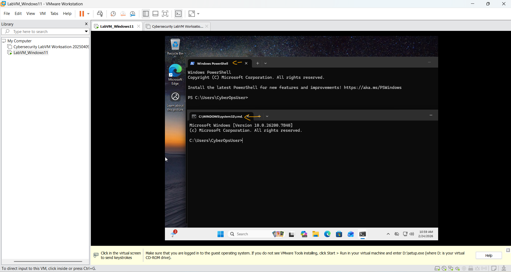
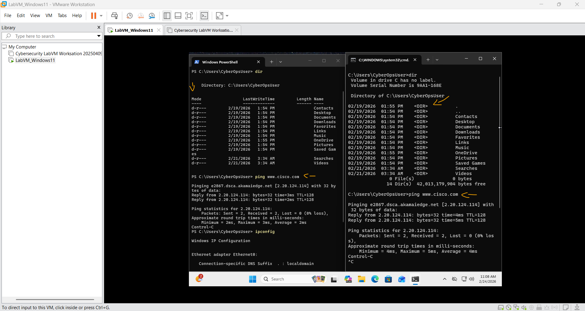
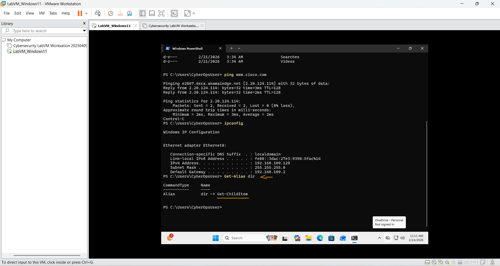
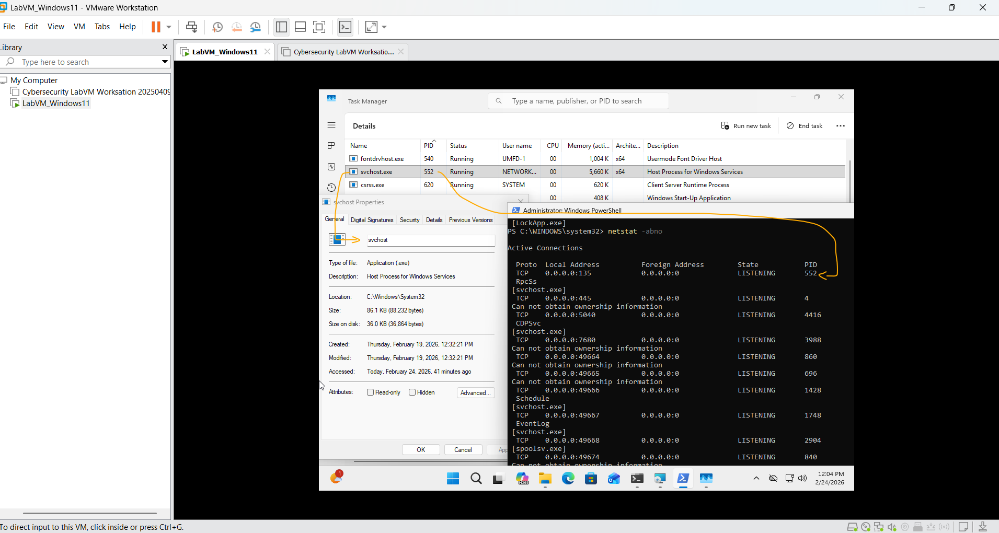
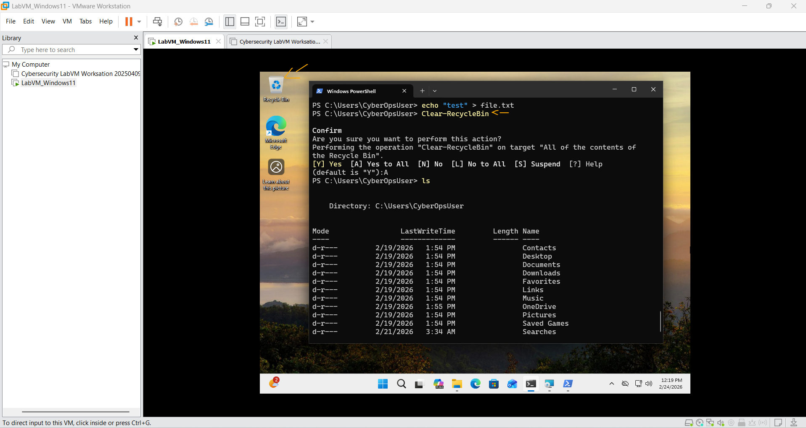

# Laboratório - Usando o Windows PowerShell   

### Cisco: <a href="../../../">cisco   </a>
### Cisco Networking Academy: cna   </a>
### Training Category: <a href="../../../labs/">labs</a>
### Software/Subject: Windows PowerShell   </a>
### Course: <a href="./">lab_033 (Laboratório - Usando o Windows PowerShell)   </a>

---

### Theme:
- Systems Administration

### Used Tools:
- Operating System (OS): 
  - Windows 11 
- Virtualization: 
  - VMWare Workstation   
- Cloud Services:
  - Google Drive 
- Language:
  - HTML   
  - Markdown   
- Integrated Development Environment (IDE) and Text Editor:
  - Visual Studio Code (VS Code)   
- Versioning: 
  - Git   
- Repository:
  - GitHub   
- Command Line Interpreter (CLI):
  - Command Prompt (cmd)   
  - PowerShell Core; PowerShell   
- Windows Tools:
  - Windows Task Manager   

---

<h3><a name="item00">Course Strcuture:</a></h3>

1. <a href="#item01">Parte 1: Acesse o console do PowerShell.</a> 
2. <a href="#item02">Parte 2: Explore comandos do Prompt de Comando e do PowerShell.</a> 
3. <a href="#item03">Parte 3: Explore cmdlets.</a> 
4. <a href="#item04">Parte 4: Explore o comando netstat usando o PowerShell.</a> 
5. <a href="#item05">Parte 5: Esvazie a lixeira usando o PowerShell.</a> 
6. <a href="#item06">Perguntas para reflexão</a> 

---

### Objective:
O objetivo deste laboratório foi explorar algumas funcionalidades do **Windows PowerShell**, analisando suas principais características e identificando as diferenças em relação ao **Command Prompt (cmd)**.

### Folder Structure:
- [README.md](./README.md): Este documento de README, escrito em **Markdown**, com o conteúdo do laboratório.
- [0-aux](./0-aux/): Pasta auxiliar com imagens utilizadas na construção dos arquivos de README desse curso.

### Development:

<a name="item01"><h4>1. Parte 1: Acesse o console do PowerShell.</h4></a>[Back to summary](#item00)

- a. Clique em Iniciar. Pesquise e selecione powershell.
- b. Clique em Iniciar. Pesquise e selecione o prompt de comando.

A imagem 01 comprova que as duas ferramentas foram abertas na máquina virutal.

<figure>
     
    <figcaption>Imagem 01.</figcaption>
</figure>
 

<a name="item02"><h4>2. Parte 2: Explore comandos do Prompt de Comando e do PowerShell.</h4></a>[Back to summary](#item00)

- a. Digite dir no prompt em ambas as janelas. Quais são as saídas para o comando dir?
  - As saídas foram essencialmente as mesmas, pois o comando foi executado a partir da mesma pasta em ambos os terminais, resultando na listagem dos mesmos arquivos e diretórios. A principal diferença está no formato de exibição. No **Windows PowerShell**, é exibida a coluna *Mode*, que apresenta informações sobre permissões e atributos do arquivo, de forma semelhante ao que ocorre em sistemas Linux. Já no **Command Prompt (cmd)**, essa coluna não aparece; em vez disso, há uma indicação mais simples que diferencia diretórios de arquivos.
- b. Tente outro comando que você usou no prompt de comando, como ping, cd e ipconfig. Quais são os resultados?
  - Os resultados foram essencialmente os mesmos em ambos os terminais. Isso ocorre porque comandos como `ping`, `cd` e `ipconfig` são utilitários nativos do sistema operacional Windows e podem ser executados tanto no **Command Prompt (cmd)** quanto no **Windows PowerShell**. Assim, os comandos funcionam da mesma forma e retornam informações equivalentes, podendo haver apenas pequenas diferenças na formatação da saída exibida no terminal.

A imagem 02 mostra o resultado dos comandos dir e ping.

<figure>
     
    <figcaption>Imagem 02.</figcaption>
</figure>
 

<a name="item03"><h4>3. Parte 3: Explore cmdlets.</h4></a>[Back to summary](#item00)

- a. Comandos do PowerShell, cmdlets, são construídos na forma de string de substantivo verbo. Para identificar o comando do PowerShell para listar os subdiretórios e arquivos em um diretório, digite Get-Alias dir no prompt do PowerShell. O que é o comando do PowerShell para dir?
  - O comando do PowerShell para o dir é o `Get-Child-Item`, conforme mostrado na imagem 03.
- b. Para obter informações mais detalhadas sobre cmdlets, execute uma pesquisa na Internet para cmdlets do Microsoft Powershell.
- c. Feche a janela do prompt de comando quando terminar

<figure>
     
    <figcaption>Imagem 03.</figcaption>
</figure>
 

<a name="item04"><h4>4. Parte 4: Explore o comando netstat usando o PowerShell.</h4></a>[Back to summary](#item00)

- a. No prompt do PowerShell, digite netstat -h para ver as opções disponíveis para o comando netstat.
- b. Para exibir a tabela de roteamento com as rotas ativas, digite netstat -r no prompt. O que é o gateway IPv4?
  - O gateway IPv4 é o dispositivo responsável por encaminhar o tráfego da rede local para outras redes, funcionando como o ponto de saída da rede. No caso desta máquina virtual, o gateway corresponde ao serviço de NAT do **VMware Workstation**, que atua como intermediário entre a VM e a rede externa, realizando a tradução de endereços (NAT) para permitir o acesso a outras redes e à internet.
- c. Abra e execute um segundo PowerShell com privilégios elevados. Clique em Iniciar. Procure o PowerShell e clique com o botão direito do mouse no Windows PowerShell e selecione Executar como administrador. Clique em Sim para permitir que este aplicativo faça alterações em seu dispositivo.
- d. O comando netstat também pode exibir os processos associados às conexões TCP ativas. Digite o netstat -abno no prompt. 
- e. Abra o Gerenciador de Tarefas. Navegue até a guia Detalhes. Clique no cabeçalho PID para que o PID esteja em ordem.
- f. Selecione um dos PIDs dos resultados de netstat -abno. O PID 756 é usado neste exemplo.
- g. Localize o PID selecionado no Gerenciador de Tarefas. Clique com o botão direito do mouse no PID selecionado no Gerenciador de Tarefas para abrir a caixa de diálogo Propriedades para obter mais informações. Quais informações você pode obter na guia Detalhes e na caixa de diálogo Propriedades do PID selecionado?
  - Na guia Detalhes do Gerenciador de Tarefas é possível obter informações como o nome do processo, PID, uso de CPU, uso de memória, status do processo e o usuário que está executando o processo. Na caixa de diálogo Propriedades do processo é possível visualizar informações mais detalhadas, como nome do aplicativo, localização do arquivo executável, tamanho do arquivo, datas de criação/modificação e outras informações relacionadas ao programa.

A imagem 04 exibe o processo svchost.exe identificado tanto no Gerenciador de Tarefas quanto na saída do comando netstat, demonstrando a correspondência entre o PID do processo e a conexão de rede ativa associada a ele.

<figure>
     
    <figcaption>Imagem 04.</figcaption>
</figure>
 

<a name="item05"><h4>5. Parte 5: Esvazie a lixeira usando o PowerShell.</h4></a>[Back to summary](#item00)

Os comandos do PowerShell podem simplificar o gerenciamento de uma grande rede de computadores. Por exemplo, se você quiser implementar uma nova solução de segurança em todos os servidores da rede, você poderia usar um comando ou script do PowerShell para implementar e verificar se os serviços estão em execução. Você também pode executar comandos do PowerShell para simplificar ações que executariam várias etapas para executar usando as ferramentas gráficas da área de trabalho do Windows. 

- a. Abra a lixeira de reciclagem. Verifique se há itens que podem ser excluídos permanentemente do seu PC. Caso contrário, restaure esses arquivos
- b. Se não houver arquivos na Lixeira, crie alguns arquivos, como o arquivo de texto usando o Bloco de Notas, e coloque-os na Lixeira.
- c. Em um console do PowerShell, digite clear-recyclebin no prompt. O que aconteceu com os arquivos na Lixeira? 
  - Os arquivos que estavam na Lixeira são excluídos permanentemente, deixando a Lixeira vazia. A imagem 05 evidencia a exclusão dos arquivos.

<figure>
     
    <figcaption>Imagem 05.</figcaption>
</figure>
 

<a name="item06"><h4>6. Perguntas para reflexão</h4></a>[Back to summary](#item00)

- a. O PowerShell foi desenvolvido para automação de tarefas e gerenciamento de configuração. Usando a internet, pesquise comandos que você poderia usar para simplificar suas tarefas como analista de segurança. Anote suas descobertas.
  - Como analista de segurança, alguns comandos do PowerShell úteis para automação e análise são:
    - Get-Process: lista processos em execução, útil para identificar atividades suspeitas.
    - Get-Service: mostra serviços do sistema e seu status.
    - Get-EventLog ou Get-WinEvent: permite analisar logs do sistema para detectar eventos de segurança.
    - Get-NetTCPConnection: exibe conexões de rede ativas, ajudando a identificar conexões suspeitas.
    - Get-FileHash: calcula o hash de arquivos para verificar integridade ou possíveis malwares.