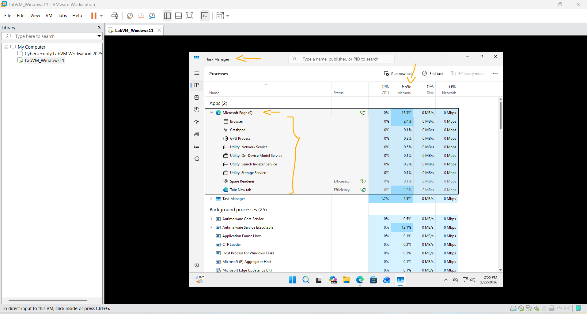
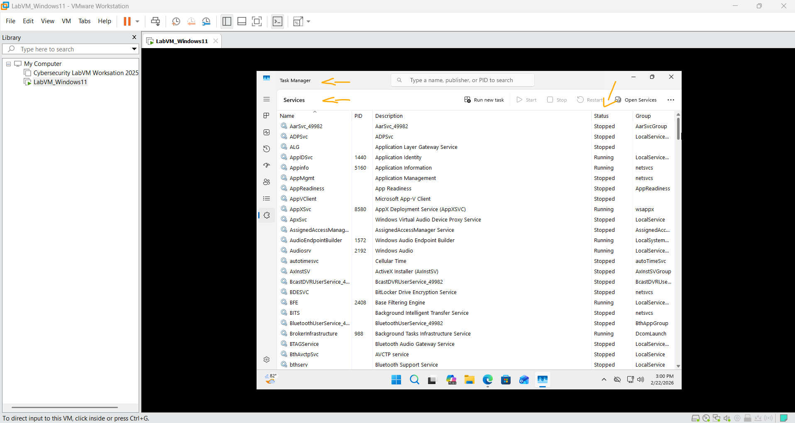
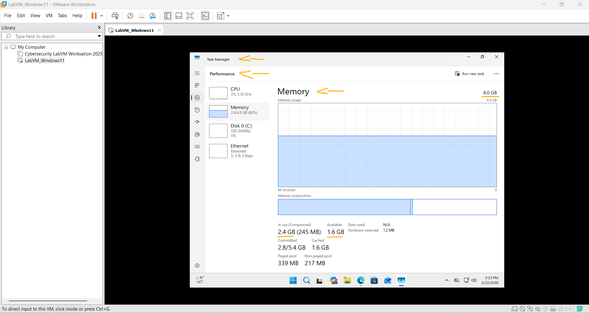

# Laboratório - Gerenciador de Tarefas do Windows   

### Cisco: <a href="../../../">cisco   </a>
### Cisco Networking Academy: cna   </a>
### Training Category: <a href="../../../labs/">labs</a>
### Software/Subject: sysadmin   </a>
### Course: <a href="./">lab_034 (Laboratório - Gerenciador de Tarefas do Windows)   </a>

---

### Theme:
- Systems Administration

### Used Tools:
- Operating System (OS): 
  - Windows 11 
- Virtualization: 
  - VMWare Workstation   
- Cloud Services:
  - Google Drive 
- Language:
  - HTML   
  - Markdown   
- Integrated Development Environment (IDE) and Text Editor:
  - Visual Studio Code (VS Code)   
- Versioning: 
  - Git   
- Repository:
  - GitHub   
- Network:
  - Microsoft Edge   
- Windows Tools:
  - Windows Task Manager   

---

<h3><a name="item00">Course Strcuture:</a></h3>

1. <a href="#item01">Parte 1: Trabalhando na guia Processos</a> 
2. <a href="#item02">Parte 2: Trabalhando na guia Serviços</a> 
3. <a href="#item03">Parte 3: Trabalhando na guia Desempenho</a> 
4. <a href="#item04">Perguntas para reflexão</a> 

---

### Objective:
O objetivo deste laboratório foi explorar o Gerenciador de Tarefas do Windows (**Windows Task Manager**), analisando detalhadamente as guias Processos, Desempenho e Serviços, com a finalidade de compreender o monitoramento de recursos do sistema, a identificação de processos ativos e a verificação do estado dos serviços em execução.

### Folder Structure:
- [README.md](./README.md): Este documento de README, escrito em **Markdown**, com o conteúdo do laboratório.
- [0-aux](./0-aux/): Pasta auxiliar com imagens utilizadas na construção dos arquivos de README desse curso.

### Development:

<a name="item01"><h4>1. Parte 1: Trabalhando na guia Processos</h4></a>[Back to summary](#item00)

- a. Abra um prompt de comando e um navegador da Web. O Microsoft Edge é usado neste laboratório; no entanto, qualquer navegador da Web funcionará. Basta substituir o nome do seu navegador sempre que vir Microsoft Edge.
- b. Clique com o botão direito na barra de tarefas para abrir o Gerenciador de tarefas. Outra maneira de abrir o Gerenciador de Tarefas é pressionar Ctrl-Alt-Delete para acessar a tela Segurança do Windows e selecionar Gerenciador de Tarefas.
- c. Clique em Mais detalhes para ver todos os processos listados na guia Processos.
- d. Expanda o cabeçalho Processador de Comando do Windows. O que está listado nesta rubrica?
  - O cabeçalho exibido no Gerenciador de Tarefas é Terminal. Ao expandi-lo, são listados os processos relacionados à sessão do prompt de comando, incluindo Command Prompt (cmd.exe) e Console Window Host (conhost.exe / PTY Host), que são responsáveis por executar e gerenciar a interface do console.
- e. Existem três categorias de processos listados na guia Processos: Aplicativos, Processos em segundo plano e processos do Windows:
  - Os Aplicativos são os aplicativos que você abriu, como Microsoft Edge, Gerenciador de Tarefas e Processador de Comandos do Windows. Outros aplicativos que são abertos pelos usuários, como navegadores da web e clientes de e-mail, também serão listados aqui.
  - Os processos em segundo plano são executados em segundo plano por aplicativos que estão abertos no momento.
  - Os processos do Windows não são mostrados na figura. Role para baixo para visualizá-los no seu PC Windows. Os processos do Windows são serviços do Microsoft Windows executados em segundo plano.
- f. Alguns dos processos em segundo plano ou processos do Windows podem estar associados a processos em primeiro plano. Por exemplo, se você abrir uma janela de prompt de comando, o processo Console Window Host será iniciado na seção de processo do Windows. Clique com o botão direito do mouse em Console Window Host e selecione Propriedades. Qual é a localização deste nome de arquivo e localização deste processo?
  - Nas propriedades do processo Console Window Host, aparece apenas o campo Location, que indica o caminho do executável. A localização exibida é: `C:\Windows\System32\conhost.exe`. Essa localização corresponde tanto ao nome do arquivo quanto ao processo em execução.
- g. Feche a janela do prompt de comando. O que acontece com o Processador de Comando do Windows e o Console Window Host quando a janela do prompt de comando é fechada?
  - Ao fechar a janela do Prompt de Comando, os processos associados a ela são encerrados automaticamente. O Command Prompt (cmd.exe) e o Console Window Host (conhost.exe) deixam de aparecer no Gerenciador de Tarefas, pois sua execução está diretamente vinculada à janela ativa do prompt.
- h. Clique no título Memória. Clique no título Memória uma segunda vez. Qual é o efeito disso nas colunas? 
  - Ao clicar no título Memória, o Gerenciador de Tarefas organiza os processos com base na quantidade de memória RAM utilizada. Ao clicar uma segunda vez, a ordem de classificação é invertida, alternando entre ordem crescente (do menor para o maior consumo) e ordem decrescente (do maior para o menor consumo).
- i. Clique com o botão direito do mouse no cabeçalho Memória e selecione Valores de recursos > Memória > Porcentagens. Que influência isso tem na coluna Memória?
  - Ao selecionar Valores de recursos > Memória > Porcentagens, a coluna Memória deixa de exibir o consumo em megabytes (MB) e passa a mostrar o uso em porcentagem (%), indicando quanto da memória total do sistema cada processo está utilizando.
- i. Como isso pode ser útil?
  - Isso é útil para identificar rapidamente quais processos estão consumindo maior proporção da memória total do sistema. A visualização em porcentagem facilita a análise do impacto de cada processo no desempenho geral do computador, especialmente quando há lentidão ou alto uso de RAM.
- j. No Gerenciador de Tarefas, clique no cabeçalho Nome.
- k. Clique duas vezes no Microsoft Edge. O que acontece?
  - Ao clicar duas vezes em Microsoft Edge, o processo é expandido no Gerenciador de Tarefas, exibindo os subprocessos relacionados a ele. Isso ocorre porque o navegador utiliza múltiplos processos para gerenciar abas, extensões, renderização de páginas e outros recursos de forma isolada.
- l. Retorne ao Gerenciador de Tarefas e clique com o botão direito do mouse em Selecione Finalizar tarefa. O que acontece com as janelas do navegador da Web?
  - Ao selecionar Finalizar tarefa, o processo do navegador é encerrado imediatamente. Como as janelas do navegador dependem desse processo para funcionar, todas as janelas abertas são fechadas automaticamente.

A imagem 01 exibe a janela do Gerenciador de Tarefas (**Task Manager**) com o processo do **Microsoft Edge** expandido, exibindo seus subprocessos, e a coluna Memória configurada para mostrar o consumo em porcentagem.

<figure>
     
    <figcaption>Imagem 01.</figcaption>
</figure>
 

<a name="item02"><h4>2. Parte 2: Trabalhando na guia Serviços</h4></a>[Back to summary](#item00)

- a. Na janela Gerenciador de Tarefas, clique na guia Serviços. Use a barra de rolagem no lado direito da janela Serviços para ver todos os serviços listados. Que status estão listados?
  - Na guia Serviços do Gerenciador de Tarefas, os status exibidos são Running (Em execução) e Stopped (Parado), indicando respectivamente quais serviços estão ativos no momento e quais não estão em funcionamento. A imagem 02 ilustra essa parte 2.

<figure>
     
    <figcaption>Imagem 02.</figcaption>
</figure>
 

<a name="item03"><h4>3. Parte 3: Trabalhando na guia Desempenho</h4></a>[Back to summary](#item00)

- a. Na janela Gerenciador de Tarefas, clique na guia Desempenho. Quantas threads estão sendo executadas?
  - Estão sendo executadas aproximadamente 1.420 threads no sistema no momento da verificação.
- a. Quantos processos estão sendo executados?
  - Estão em execução cerca de 138 processos ativos.
- b. Clique em Memória no painel esquerdo da guia Desempenho. Qual é a memória física total (MB)?
  - A memória física total é de 4 GB (4096 MB), valor configurado para a máquina virtual.
- b. Qual é a memória física disponível (MB)?
  - A memória física disponível é de aproximadamente 1,4 GB.
- b. Quanta memória física (MB) está sendo usada pelo computador? 
  - O sistema está utilizando cerca de 2,6 GB de memória RAM, correspondente à diferença entre a memória total e a memória disponível.
- c. Clique no gráfico Ethernet no painel esquerdo da guia Desempenho. Qual é a velocidade do link?
  - A velocidade do link é de 1,0 Gbps, conforme verificado nas propriedades do adaptador de rede (Status da conexão). Esse valor indica a capacidade máxima de transmissão da interface de rede.
- c. Qual é o endereço IPv4 do PC?
  - O endereço IPv4 do computador é 192.168.109.129, conforme apresentado nas informações da interface Ethernet na guia Desempenho.
- d. Clique em Abrir Monitor de Recursos para abrir o utilitário Monitor de Recursos na guia Desempenho do Gerenciador de Tarefas. 

A imagem 03 apresenta as informações de memória coletadas na guia Desempenho do Gerenciador de Tarefas.

<figure>
     
    <figcaption>Imagem 03.</figcaption>
</figure>
 

<a name="item04"><h4>4. Perguntas para reflexão</h4></a>[Back to summary](#item00)

- a. Por que é importante que o administrador entenda como trabalhar no Gerenciador de Tarefas?
  - É importante que o administrador saiba utilizar o Gerenciador de Tarefas porque essa ferramenta permite monitorar o desempenho do sistema, identificar processos que consomem muitos recursos, diagnosticar problemas e encerrar tarefas que estejam causando falhas ou lentidão.