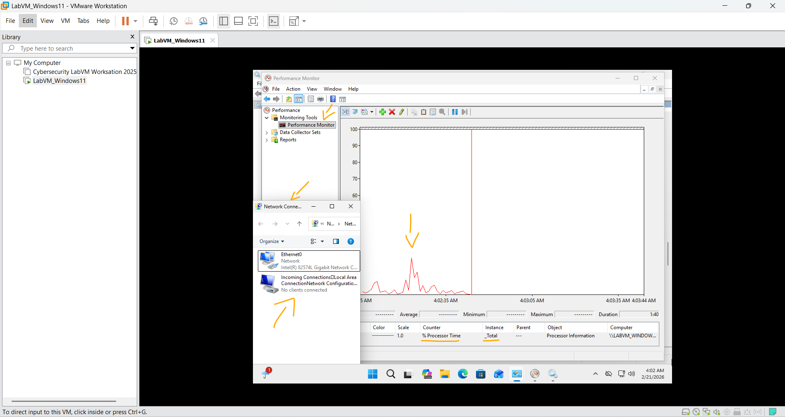
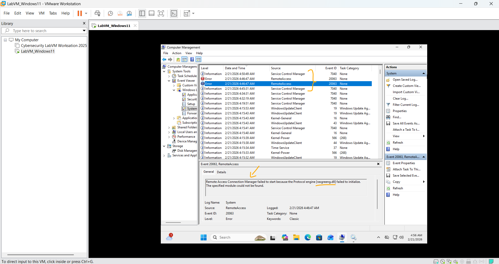
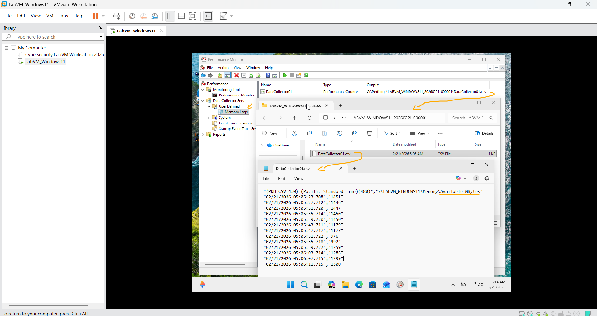

# Laboratório - Monitorar e gerenciar recursos do sistema no Windows   

### Cisco: <a href="../../../">cisco   </a>
### Cisco Networking Academy: cna   </a>
### Training Category: <a href="../../../labs/">labs</a>
### Software/Subject: sysadmin   </a>
### Course: <a href="./">lab_035 (Laboratório - Monitorar e gerenciar recursos do sistema no Windows)   </a>

---

### Theme:
- Systems Administration

### Used Tools:
- Operating System (OS): 
  - Windows 11 
- Virtualization: 
  - VMWare Workstation   
- Cloud Services:
  - Google Drive 
- Language:
  - HTML   
  - Markdown   
- Integrated Development Environment (IDE) and Text Editor:
  - Visual Studio Code (VS Code)   
- Versioning: 
  - Git   
- Repository:
  - GitHub   
- Windows Tools:
  - Computer Management Microsoft Management Console (compmgmt MMC)   
  - Microsoft Event Viewer; Windows Event Viewer   
  - Microsoft Network Connections   
  - Microsoft Network & Sharing Center   
  - Performance Monitor Microsoft Management Console (perfmon MMC)   
  - Services Microsoft Management Console (services MMC)   

---

<h3><a name="item00">Course Strcuture:</a></h3>

1. <a href="#item01">Parte 1: Iniciando e interrompendo o serviço de roteamento e acesso remoto</a> 
2. <a href="#item02">Parte 2: Trabalho no utilitário de gerenciamento do computador</a> 
3. <a href="#item03">Parte 3: Configurando Ferramentas Administrativas</a> 

---

### Objective:
O objetivo deste laboratório foi exercitar o uso de ferramentas administrativas do Windows para monitoramento e análise do sistema. Foi utilizado o **Performance Monitor** para avaliar métricas de desempenho, incluindo a métrica padrão de percentual de uso do processador e a criação de um contador específico para memória disponível. Também foi utilizado o **Microsoft Event Viewer**, por meio do **Computer Management**, para análise e interpretação de logs de eventos do sistema. Ferramentas adicionais foram empregadas para gerar alterações controladas no ambiente, permitindo observar o comportamento do sistema diante dessas ações.

### Folder Structure:
- [README.md](./README.md): Este documento de README, escrito em **Markdown**, com o conteúdo do laboratório.
- [0-aux](./0-aux/): Pasta auxiliar com imagens utilizadas na construção dos arquivos de README desse curso.

### Development:

<a name="item01"><h4>1. Parte 1: Iniciando e interrompendo o serviço de roteamento e acesso remoto</h4></a>[Back to summary](#item00)

Você explorará o que acontece quando um serviço é interrompido e, em seguida, iniciado. Nesta parte, você usará o serviço de roteamento e acesso remoto como o serviço de exemplo. Este serviço permite que o dispositivo local se torne um roteador ou um servidor de acesso remoto.

- a. Navegue até o Control Panel > Click Network and Sharing Center. Observação: Se o Painel de Controle estiver definido como View by: Category, change it to View by: 
Large icons or View by: Small icons. Este laboratório pressupõe que você esteja usando uma dessas configurações.
- b. Clique em Change adapter settings adaptador no painel esquerdo. Reduza o tamanho da janela Network Connections e deixe-a aberta.
- c. Navegue até o Administrative Tools. (Navegue até o Control Panel > Click Administrative Tools) 
- d. Na janela Administrative Tools, clique duas vezes no ícone Performance Monitor.
- e. Na janela Performance Monitor, certifique-se de que o Performance Monitor no cabeçalho Ferramenta de monitorização no painel esquerdo está realçado. lique no icone Freeze Display (botão de pausa) para parar a gravação.
- f. Clique com o botão direito no gráfico e selecione Clear t para limpar o gráfico. Deixe essa janela aberta. 
- g. Navegue até as Administrative Tools e selecione Services.
- h. Expanda a largura da janela Services para que você possa visualizar o conteúdo com nitidez. Role para baixo no painel direito até ver o serviço Routing and Remote Access. Clique duas vezes em Routing and Remote Access.
- i. Na janela Routing and Remote Access Properties (Local Computer) é aberta. No campo suspenso Startup type selecione Manual e então clique em Apply. O botão Iniciar agora está ativo. NÃO clique no botão Iniciar ainda. Deixe essa janela aberta. 
- j. Navegue até a janela Performance Monitor. Clique o ícone Unfreeze Display para iniciar a gravação.
- k. Clique na janela Routing and Remote Access Properties (Local Computer). Para iniciar o serviço, clique Start. Uma janela com barra de progresso abre.
- l. A janela Routing and Remote Access Properties (Local Computer) agora mostra os botões Stop e Pause button active. Deixe essa janela aberta.
- m. Navegue até a janela Network Connections. Pressione a tecla de função F5 para atualizar o conteúdo. Que alterações aparecem na janela depois de iniciar o serviço Routing and Remote Access ?
  - Após a inicialização do serviço Routing and Remote Access, é criado automaticamente um novo adaptador de rede virtual na janela Network Connections, denominado Incoming Connections. Esse adaptador é utilizado para gerenciar conexões de entrada (como VPN ou conexões dial-up), permitindo que o computador atue como servidor de acesso remoto.
- n. Navegue até a janela Routing and Remote Access Properties (Local Computer) e clique em Stop. Observação: se Stop estiver acinzentada, clique em Apply e altere o status do serviço.
- o. Navegue até a janela Network Connections. Quais alterações aparecem no painel direito após o serviço Roteamento e Acesso Remoto ser interrompido?
  - Após a interrupção do serviço Routing and Remote Access, o adaptador virtual Incoming Connections é removido automaticamente da janela Network Connections. Isso ocorre porque o adaptador depende diretamente do serviço para funcionar; ao parar o serviço, a interface de rede associada é desativada e deixa de ser exibida.
- p. Navegar para a janela Performance Monitor e clique no icone Freeze Display para parar a gravação. Qual Contador está sendo gravado no gráfico (dica: analise a cor do gráfico e a cor do contador)?
  - O contador que está sendo gravado no gráfico é: `\Processor Information(_Total)\%Processor Time`. Esse contador mede o percentual de tempo que o processador está ocupado executando threads não ociosas, considerando o total de todos os núcleos do processador (Total). A linha vermelha no gráfico corresponde a esse contador, indicando a utilização total da CPU. Ao iniciar ou interromper o serviço Routing and Remote Access, observa-se um pico momentâneo no gráfico, causado pelo carregamento ou encerramento do serviço e atualização das configurações do sistema. Após isso, o uso da CPU retorna ao normal.
- q. Clique no menu suspenso Change graph type e selecione Report. 
- r. A exibição muda para a visualização do relatório. Quais valores são exibidos pelo contador?
  - O valor exibido pelo contador `\Processor Information(_Total)\%Processor Time` é 2,777%, indicando que, no momento da coleta, aproximadamente 2,777% da capacidade total da CPU estava sendo utilizada.
- s. Clique na janela Routing and Remote Access Properties (Local Computer). No campo Tipo de inicialização, selecione Disabled e clique OK. 
- t. Clique na janela Services. Qual é o Status e o Tipo de Inicialização de Roteamento e Acesso Remoto?
  - O Status do serviço aparece em branco (não está em execução) e o Tipo de Inicialização está configurado como Disabled (Desabilitado), indicando que o serviço está parado e não poderá ser iniciado automaticamente pelo sistema.
- u. Clique na janela Performance Monitor. Clique o ícone Unfreeze Display para iniciar a gravação.
- v. Feche todas as janelas abertas durante a Etapa 1 deste laboratório.

A Imagem 01 apresenta parte do gráfico com os dados coletados no momento da inicialização do serviço Routing and Remote Access. Observa-se um pequeno pico na utilização do processador, decorrente do carregamento e ativação do serviço. Como consequência da inicialização, o próprio sistema criou automaticamente um segundo adaptador de rede virtual na janela Conexões de Rede, o qual permaneceu disponível enquanto o serviço esteve em execução e foi removido automaticamente após sua interrupção.

<figure>
     
    <figcaption>Imagem 01.</figcaption>
</figure>
 

<a name="item02"><h4>2. Parte 2: Trabalho no utilitário de gerenciamento do computador</h4></a>[Back to summary](#item00)

A Gestão do Computador é utilizada para gerir um computador local ou remoto. As ferramentas deste utilitário são agrupadas em três categorias: ferramentas do sistema, armazenamento e serviços e aplicativos.

- a. Clique em Control Panel > Administrative Tools. Selecione Computer Management. 
- b. Na janela Computer Management, expanda as três categorias clicando na seta ao lado de System Tools.
- c. Clique na seta perto do Event Viewer e depois a seta perto do Windows Logs. Selecione System.
- d. A janela Event Properties do Evento será aberta com informações sobre o primeiro evento. Clique na seta para baixo para localizar um evento de Routing and Remote Access. Você encontrará quatro eventos que descrevem o pedido para iniciar e interromper o serviço Routing and Remote Access. Quais são as descrições de cada um dos quatro eventos?
  - Event ID 7040 – 04:45 – Service Control Manager: O tipo de inicialização do serviço Routing and Remote Access foi alterado de Disabled para Manual (Demand Start).
  - Event ID 20063 – 04:46 – RemoteAccess (Error): Falha ao iniciar o serviço de acesso remoto, pois o mecanismo de protocolo rasgreeng.dll não conseguiu ser inicializado. O módulo especificado não foi encontrado.
  - Event ID 20063 – 04:46 – RemoteAccess (Error): Nova falha de inicialização do serviço, desta vez relacionada ao protocolo IKEv2, cuja solicitação não é suportada no ambiente.
  - 04:49 – Tentativa de interrupção do serviço: Não foi gerado evento de stop, pois o serviço não chegou a entrar no estado Running.
  - Event ID 7040 – 04:50 – Service Control Manager: O tipo de inicialização do serviço foi alterado de Manual (Demand Start) para Disabled.
  - Observação: Infelizmente o resultado esperado foi diferente devido ao tipo de Windows utilizado. Como esse era um Windows 11, o Remote and Routing Access (RRAS) muitas vezes não funciona corretamente como servidor completo. Ele funciona corretamente no Windows Server.
- e. Feche todas as janelas abertas. 

A imagem 02 exibe os eventos registrados no Visualizador de Eventos (Event Viewer) relacionados às tentativas de inicialização e alteração de configuração do serviço Routing and Remote Access no Windows 11.

<figure>
     
    <figcaption>Imagem 02.</figcaption>
</figure>
 

<a name="item03"><h4>3. Parte 3: Configurando Ferramentas Administrativas</h4></a>[Back to summary](#item00)

No restante deste laboratório, você configurará os recursos da Ferramenta Administrativa Avançada e monitorará como isso afeta o computador.

- a. clique em Control Panel > Administrative Tools > Performance Monitor. A janela Monitor de Desempenho será aberta. Expanda Data Collector Sets. Clique com o botão da direita em User Defined, e selecione New > Data Collector Set.
- b. A janela Create new Data Collector Set será aberta. No campo Nome, digite Memory Logs. Selecione o botão de opção Create manually (Advanced) e clique em Next.
- c. Na janela What type of data do you want to include? Verifique a caixa Performance counter e então clique Next.
- d. Na janela Which performance counters would you like to log? clique Add. 
- e. Na lista de contadores disponíveis, localize e expanda Memory. Selecione Available MBytes e clique Add>>.
- f. Você verá o contador de Available MBytes adicionado no painel direito. Clique em OK.
- g. Defina o campo Intervalo de amostra para 4 segundos. Clique em Avançar.
- h. Na tela Where would you like the data to be saved? clique em Browse.
- i. Na janela Browse For Folder, selecione a unidade (C:) que é Disco Local (C:). Selecione PerfLogs e clique em OK. 
- j. A janela Where would you like the data to be saved? será aberta com as informações do diretório selecionado na etapa anterior. Clique em Next.
- k. Na tela Create the data collector set? clique em Finish.
- l. Expanda User Defined e selecione Memory Logs. Clique com o botão da direita em Data Collector01 e selecione Properties.
- m. Na janela DataCollector01 Properties mude o campo Log format: para Comma Separated.
- n. Clique na guia File. Qual é o nome do caminho completo para o arquivo de exemplo?
  - `C:\PerfLogs\LABVM_WINDOWS11_20260221-000001\DataCollector01.csv`.
- o. Clique em OK.
- p. Selecione o ícone Memory Logs no painel esquerdo da janela Performance Monitor. Clique no ícone de seta verde para iniciar o conjunto de coletores de dados. Observe que uma seta verde é posicionada no ícone Memory Logs.
- q. Para forçar o computador a usar um pouco da memória disponível, abra e feche um navegador.
- r. Clique no ícone de quadrado preto para interromper o conjunto de coletores de dados. Qual mudança você percebeu no ícone Logs de Memória? 
  - Após interromper o conjunto de coletores de dados, a seta verde exibida sobre o ícone Memory Logs desapareceu, indicando que a coleta de dados foi finalizada e que o conjunto não está mais em execução.
- s. Clique em Start > Computer,and click drive C: > PerfLogs. Localize a pasta que começa com o nome do seu PC seguido por um computador com carimbo de data / hora., DESKTOP-NDFE14H_20170514-000001 por exemplo. Clique duas vezes na pasta para abri-la. Depois, clique duas vezes no arquivo DataCollector01.csv. Se solicitado, clique em Continuar para permitir o acesso à pasta. Nota: Se o Windows não conseguir abrir o arquivo: a mensagem é exibida, select the radio button Select a program from a list of installed programs > OK > Notepad > OK. O que será mostrado na coluna mais à direita? 
  - Na coluna mais à direita são exibidos os valores do contador Available MBytes, indicando a quantidade de memória física disponível (em megabytes) em cada momento da coleta. Esses valores variam conforme o uso da memória do sistema, diminuindo quando aplicações (como o navegador) são abertas e aumentando após seu fechamento.
- t. Feche o arquivo DataCollector01.csv e a janela com a pasta PerfLogs.
- u. Selecione a janela Performance Monitor. Clique com o botão da direita em Memory Logs > Delete.
- v. A janela abre. Performance Monitor > Confirm Delete Clique em yes.
- w. Abra a unidade C: > pasta PerfLogs. Clique com o botão direito do mouse na pasta que foi criada para armazenar o arquivo de registro de Memória e, depois, clique em Delete.
- x. A janela Excluir Pasta será aberta. Clique em Yes.
- y. Feche todas as janelas abertas.

A imagem 03 mostra os dados coletados pelo contador criado `Available MBytes`, demonstrando a variação da quantidade de memória física disponível durante o período de monitoramento. Lembrando que essa máquina virtual foi configurada com 4 GB de memória RAM.

<figure>
     
    <figcaption>Imagem 03.</figcaption>
</figure>
 