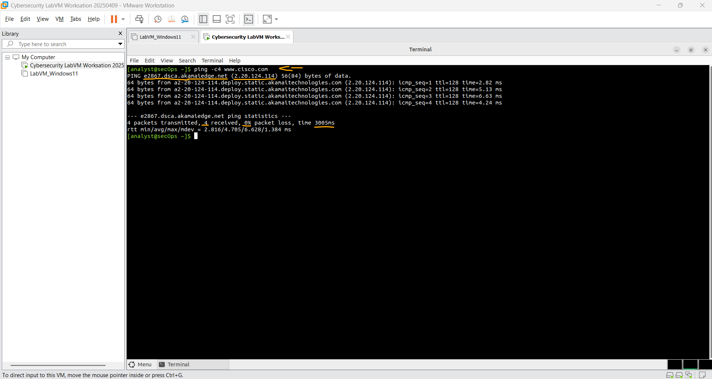
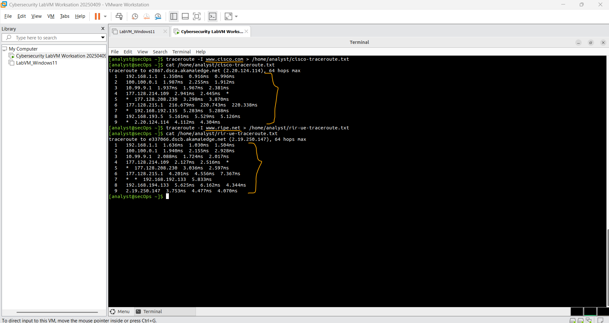
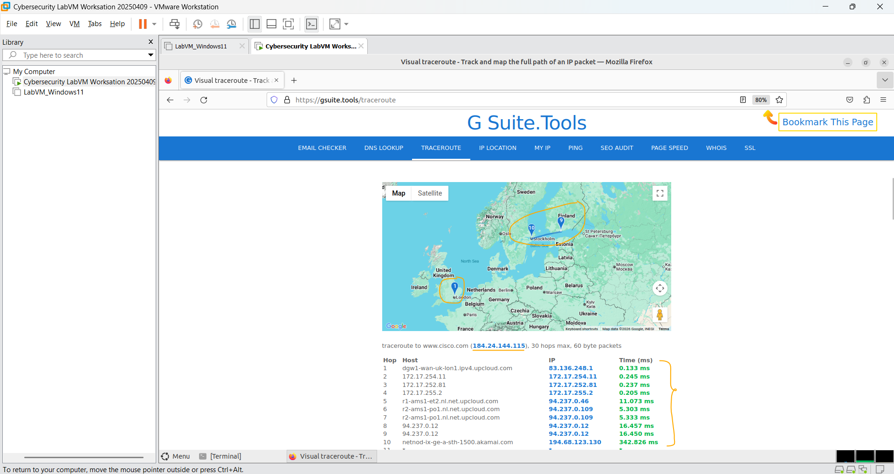

# Laboratório - Rastreando uma Rota   

### Cisco: <a href="../../../">cisco   </a>
### Cisco Networking Academy: cna   </a>
### Training Category: <a href="../../../labs/">labs</a>
### Software/Subject: network   </a>
### Course: <a href="./">lab_041 (Laboratório - Rastreando uma Rota)   </a>

---

### Theme:
- Network

### Used Tools:
- Operating System (OS): 
  - Linux   
  - Windows 11 
- Linux Distribution:
  - Arch Linux   
- Virtualization: 
  - VMWare Workstation   
- Cloud Services:
  - Google Drive 
- Language:
  - HTML   
  - Markdown   
- Integrated Development Environment (IDE) and Text Editor:
  - Visual Studio Code (VS Code)   
- Versioning: 
  - Git   
- Repository:
  - GitHub   
- Network:
  - G Suite.Tools   
  - ping   
  - traceroute   
  - Trace Route (tracert)   
- Cibersecurity:
  - Cisco CyberOps Workstation   
  
---

<h3><a name="item00">Course Strcuture:</a></h3>

1. <a href="#item01">Parte 1: Verificando a conectividade de rede usando ping</a> 
2. <a href="#item02">Parte 2: Traçando uma rota para um servidor remoto usando Traceroute</a> 
3. <a href="#item03">Parte 3: Rastreie uma rota para um servidor remoto usando a ferramenta Traceroute baseada na web</a> 

---

### Objective:
O objetivo deste laboratório foi compreender como funciona o processo de rastreamento de um destino na rede utilizando as ferramentas **traceroute** e **tracert**, bem como o recurso de rastreamento disponível na ferramenta online **G Suite.Tools**.

### Folder Structure:
- [README.md](./README.md): Este documento de README, escrito em **Markdown**, com o conteúdo do laboratório.
- [0-aux](./0-aux/): Pasta auxiliar com imagens utilizadas na construção dos arquivos de README desse curso.

### Development:

<a name="item01"><h4>1. Parte 1: Verificando a conectividade de rede usando ping</h4></a>[Back to summary](#item00)

- a. Inicie a VM CyberOps Workstation. Faça login na VM com as seguintes credenciais: 
  - Username: analyst
  - Password: cyberops
- b. Abra uma janela de terminal na VM para executar ping em um servidor remoto, como www.cisco.com.
- c. A primeira linha de saída exibe o nome de domínio totalmente qualificado (FQDN) e2867.dsca.akamaiedge.net. Isso é seguido pelo endereço IP 184.24.123.103. A Cisco hospeda o mesmo conteúdo da Web em diferentes servidores em todo o mundo (conhecidos como mirrors). Portanto, dependendo de onde você estiver, o FQDN e o endereço IP serão diferentes. Quatro pings foram enviados e uma resposta foi recebida de cada ping. Como cada ping recebeu uma resposta, houve 0% de perda de pacote. Em média, demorou 3005 ms (3005 milissegundos) para os pacotes cruzarem a rede. Um milissegundo é um segundo dividido pó 1.000. Seus resultados provavelmente serão diferentes. 

A imagem 01 mostra os resultados obtidos na verificação de conectividade.

<figure>
     
    <figcaption>Imagem 01.</figcaption>
</figure>
 

<a name="item02"><h4>2. Parte 2: Traçando uma rota para um servidor remoto usando Traceroute</h4></a>[Back to summary](#item00)

Agora que a acessibilidade básica foi verificada usando a ferramenta de ping, pode ser útil examinar com  mais atenção cada segmento de rede que é atravessado. As rotas rastreadas podem passar por muitos saltos e vários provedores de serviços de Internet (ISPs) diferentes, dependendo do tamanho do seu ISP e da localização dos hosts de origem e destino. 

Cada “salto” representa um roteador. Um roteador é um tipo especializado de computador usado para direcionar o tráfego pela Internet. Imagine fazer uma viagem de automóvel por vários países usando muitas estradas. Em diferentes pontos da viagem, você chega a uma bifurcação na qual tem a opção de escolher entre várias rodovias diferentes. Agora, imagine que haja um dispositivo em cada cruzamento na estrada que leve você a pegar a estrada correta para seu destino final. É isso o que um roteador faz para os pacotes em uma rede. 

Como os computadores falam em números binários ou hexadecimais, em vez de palavras, os roteadores são identificados de forma única usando endereços IP. A ferramenta traceroute mostra qual caminho através da rede um pacote de informações percorre para chegar ao seu destino final. A ferramenta traceroute também dá uma ideia da velocidade do tráfego em cada segmento da rede. Os pacotes são enviados a cada roteador no caminho e o tempo de retorno é medido em milissegundos. 

Observação: as configurações de rede da VM do CyberOps Workstation podem precisar ser definidas para o adaptador de bridge se você não estiver obtendo resultados de traceroute. Para verificar as definições de rede, acesse:  Machine > Settings, select Network, na guia Adapter 1, Conectdo a: Adaptador em ponte. Para fazer isso, a ferramenta traceroute é usada.

- a. No prompt do terminal, digite traceroute www.cisco.com. 
- b. Se você quiser salvar a saída traceroute em um arquivo de texto para revisão posterior, use o caracter maior (>) e o nome de arquivo desejado para salvar a saída no diretório atual. Neste exemplo, a saída traceroute é salva no arquivo /home/analyst/cisco-traceroute.txt. Agora você pode inserir o comando cat cisco-traceroute.txt para exibir a saída do rastreamento armazenado no arquivo de texto. 
- c. Execute e salve os resultados do traceroute para um dos seguintes sites. Estes são os sites do Registro Regional da Internet (RIR) localizados em diferentes partes do mundo:
  - Africa: www.afrinic.net
  - Australia: www.apnic.net
  - Europe: www.ripe.net
  - South America: www.lacnic.net 
  - Observação: alguns desses roteadores ao longo da rota podem não responder ao traceroute. 

A imagem 02 mostra os dois rastreamentos realizados com sucesso.

<figure>
     
    <figcaption>Imagem 02.</figcaption>
</figure>
 

<a name="item03"><h4>3. Parte 3: Rastreie uma rota para um servidor remoto usando a ferramenta Traceroute baseada na web</h4></a>[Back to summary](#item00)

- a. Abra um navegador da Web na VM e procure uma ferramenta visual traceroute que você possa usar no navegador da Web. Tente ir para o seguinte site: https://gsuite.tools/traceroute.
- b. Digite qualquer site que desejar. Exemplo: www.cisco.com e pressione Trace. Nota: Se você receber o erro “SEC_ERROR_OCSP_FUTURE_RESPONSE” no Firefox, o relógio 
CyberOps Workstation está incorreto. Para corrigir a hora, digite o seguinte comando para atualizar o relógio/hora, atualize o navegador da Web e insira o rastreamento visual: sudo ntpd -qg. Revise as localizações geográficas dos saltos respondentes. O que você observou sobre o caminho? 
  - O caminho passa por saltos com endereços IP bem diferentes do traceroute realizado via terminal. O endereço de origem e de destino também são diferentes. Além disso, é exibido um mapa com a localização geográfica do primeiro e do último salto, sendo a origem em Londres e o destino na Suécia. Contudo, o último salto não consegue confirmar a chegada ao destino do rastreamento, possivelmente devido a bloqueios ou firewalls que não responderam à solicitação.

A imagem 03 exibe esse rastreamento.

<figure>
     
    <figcaption>Imagem 03.</figcaption>
</figure>
 

<a name="item04"><h4>4. Perguntas para reflexão</h4></a>[Back to summary](#item00)

- a. Como o traceroute difere ao acessar www.cisco.com ou outros sites a partir do terminal (consulte a Parte 2) em vez do site online? (Seus resultados podem variar dependendo de onde você está localizado geograficamente e de qual ISP está fornecendo conectividade à sua escola.) 
  - Ao usar o comando traceroute diretamente no terminal, o rastreamento é feito a partir da rede local do computador, mostrando os roteadores reais entre o host e o destino (por exemplo, o gateway, o provedor de internet e outros roteadores da internet). Já ao usar um site online de traceroute, o teste é executado a partir do servidor do próprio site, que pode estar em outra cidade ou país. Por isso, o caminho (hops), os tempos de resposta e até os IPs exibidos podem ser diferentes. Essas diferenças acontecem porque o trajeto dos pacotes depende da localização geográfica e do provedor de internet utilizado.