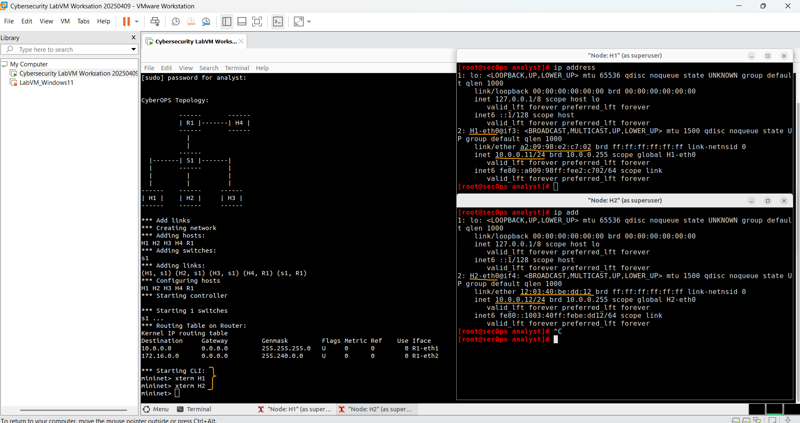
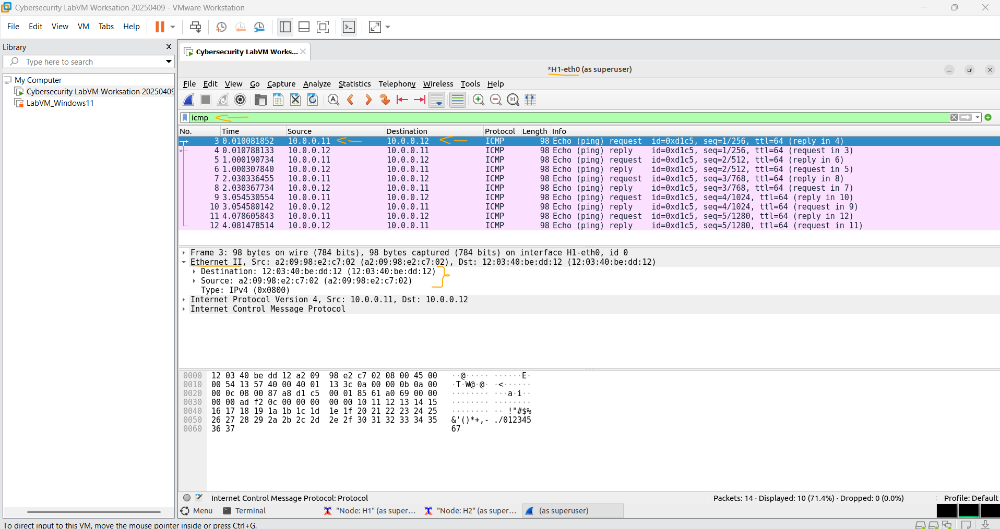
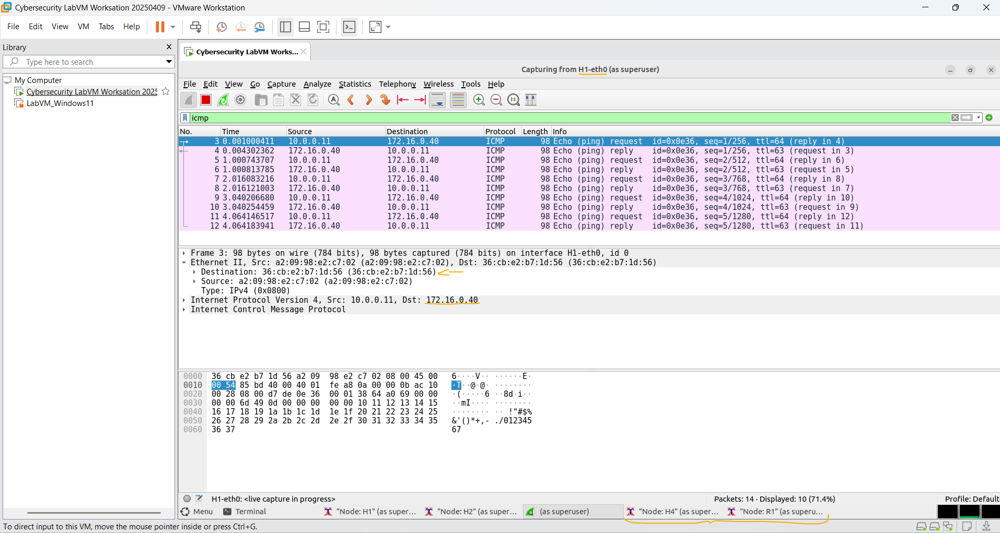

# Laboratório - Introdução ao Wireshark   

### Cisco: <a href="../../../">cisco   </a>
### Cisco Networking Academy: cna   </a>
### Training Category: <a href="../../../labs/">labs</a>
### Software/Subject: wireshark   </a>
### Course: <a href="./">lab_042 (Laboratório - Introdução ao Wireshark)   </a>

---

### Theme:
- Network

### Used Tools:
- Operating System (OS): 
  - Linux   
  - Windows 11 
- Linux Distribution:
  - Arch Linux   
- Virtualization: 
  - VMWare Workstation   
- Cloud Services:
  - Google Drive 
- Language:
  - HTML   
  - Markdown   
  - Python   
- Integrated Development Environment (IDE) and Text Editor:
  - Visual Studio Code (VS Code)   
- Versioning: 
  - Git   
- Repository:
  - GitHub   
- Network:
  - ping   
  - Trace Route (tracert)   
  - Wireshark   
- Cibersecurity:
  - Cisco CyberOps Workstation   
- SysAdm:
  - xterm   

---

<h3><a name="item00">Course Strcuture:</a></h3>

1. <a href="#item01">Parte 1: Instalar e verificar a topologia do Mininet</a> 
  1.1 <a href="#item01.01">Etapa 1: Verifique os endereços de interface do seu PC.</a> 
  1.2 <a href="#item01.02">Etapa 2: Execute o script Python para instalar a Topologia do Mininet.</a> 
  1.3 <a href="#item01.03">Etapa 3: Registre endereços IP e MAC para H1 e H2.</a> 
2. <a href="#item02">Parte 2: capturar e analisar dados ICMP no Wireshark</a> 
  2.1 <a href="#item02.01">Etapa 1: Examine os dados capturados na mesma LAN.</a> 
  2.2 <a href="#item02.02">Etapa 2: Examine os dados capturados na LAN remota.</a> 

---

### Objective
O objetivo deste laboratório foi criar uma pequena rede virtual por meio de um script em **Python** e utilizar o **Wireshark** para capturar e analisar o tráfego ICMP, tanto em comunicação local quanto com uma rede remota, observando os endereços IP e MAC dos dispositivos envolvidos.

### Folder Structure:
- [README.md](./README.md): Este documento de README, escrito em **Markdown**, com o conteúdo do laboratório.
- [0-aux](./0-aux/): Pasta auxiliar com imagens utilizadas na construção dos arquivos de README desse curso.

### Development:

<a name="item01"><h4>1. Parte 1: Instalar e verificar a topologia do Mininet</h4></a>[Back to summary](#item00)

Nesta parte, você usará um script Python para configurar a Topologia Mininet dentro da VM CyberOps. Em seguida, você registrará os endereços IP e MAC para H1 e H2.

<a name="item01.01"><h4>1.1 Etapa 1: Verifique os endereços de interface do seu PC.</h4></a>[Back to summary](#item00)

- a. Inicie e faça login na CyberOps Workstation que você instalou em um laboratório anterior usando as seguintes credenciais: 
  - Nome de usuário: analyst
  - Senha: cyberops

<a name="item01.02"><h4>1.2 Etapa 2: Execute o script Python para instalar a Topologia do Mininet.</h4></a>[Back to summary](#item00)

- a. Abra um emulador de terminal para iniciar o Mininet e digite o seguinte comando no prompt. Quando solicitado, digite `cyberops` como a senha.
  - `sudo ~/lab.support.files/scripts/cyberops_topo.py`.

<a name="item01.03"><h4>1.3 Etapa 3: Registre endereços IP e MAC para H1 e H2.</h4></a>[Back to summary](#item00)

- a. No prompt da mininet, inicie as janelas do terminal nos hosts H1 e H2. Isso abrirá janelas separadas para esses hosts. Cada host terá uma configuração separada para a rede, incluindo endereços IP e MAC exclusivos.
  - `xterm H1`.
  - `xterm H2`.
- b. No prompt em Node: H1, digite o endereço IP para verificar o endereço IPv4 e registrar o endereço MAC. Faça o mesmo para Node: H2. O endereço IPv4 e o endereço MAC são destacados abaixo para referência.
  - `ip address`.

| Interface de host | Endereço IP | Endereço MAC |
| :---: | :---: | :---: |
| **H1-eth0** | 10.0.0.11/24 | a2:09:98:e2:c7:02 |
| **H2-eth0** | 10.0.0.12/24 | 12:03:40:be:dd:12 |

A imagem 01 mostra a captura dos endereços de protocolo (IP) e endereço físico (MAC) das interfaces de rede de ambos os dispositivos.

<figure>
     
    <figcaption>Imagem 01.</figcaption>
</figure>
 

<a name="item02"><h4>2. Parte 2: capturar e analisar dados ICMP no Wireshark</h4></a>[Back to summary](#item00)

Nesta parte, você fará ping entre dois hosts no Mininet e capturará solicitações e respostas ICMP no Wireshark. Você também examinará as PDUs capturadas para obter informações específicas. Essa análise deve ajudar a esclarecer como os cabeçalhos dos pacotes são usados para transportar dados ao destino. 

<a name="item02.01"><h4>2.1 Etapa 1: Examine os dados capturados na mesma LAN.</h4></a>[Back to summary](#item00)

Nesta etapa, você examinará os dados gerados pelas solicitações de ping do PC de seu membro da equipe. Os dados do Wireshark são exibidos em três seções: 
- A seção superior exibe a lista de quadros de PDU capturados com um resumo das informações do pacote IP listadas.
- A seção média lista as informações de PDU do quadro selecionado na parte superior da tela e separa um quadro de PDU capturado pelas suas camadas de protocolo. 
- A seção inferior mostra os dados brutos de cada camada. Os dados são exibidos em formato hexadecimal e decimal.
  

- a. No nó: H1, digite `wireshark&` para iniciar o Wireshark (O aviso pop-up não é importante para este laboratório). Clique em OK para continuar.
  - `wireshark&`.
- b. Na janela Wireshark, sob o título Capture, selecione a interface H1-eth0. Clique em Start para capturar o tráfego de dados.
- c. Em Node: H1, pressione a tecla Enter, se necessário, para obter um prompt. Em seguida, digite ping -c 5 10.0.0.12 para realizar o ping H2 cinco vezes. A opção de comando -c especifica a contagem ou o número de pings. O 5 especifica que cinco pings devem ser enviados. Os pings serão todos bem sucedidos.
  - `ping -c 5 10.0.0.12`.
- d. Navegue até a janela Wireshark, clique em Stop para interromper a captura de pacotes.
- e. Um filtro pode ser aplicado para exibir apenas o tráfego interessado. Digite icmp no campo Filter e clique em Apply.
  - `icmp`.
- f. Se necessário, clique nos primeiros quadros de PDU de solicitação de ICMP na seção superior do Wireshark. Observe que a coluna Origem tem o endereço IP do H1 e a coluna Destino tem o endereço IP do H2.
- g. Com esse quadro de PDU ainda selecionado na seção superior, vá até a seção média. Clique na seta à esquerda da linha Ethernet II para ver os endereços MAC de origem e destino. O endereço MAC de origem corresponde à interface de H1?
  - Sim. O endereço MAC de origem exibido no quadro Ethernet II corresponde ao MAC da interface H1-eth0 (a2:09:98:e2:c7:02), indicando que o pacote foi enviado pelo host H1.
- g. O endereço MAC de destino no Wireshark corresponde ao endereço MAC de H2?
  - Sim. O endereço MAC de destino corresponde ao MAC da interface H2-eth0 (12:03:40:be:dd:12), mostrando que o pacote foi direcionado corretamente ao host H2.

Nota: No exemplo anterior de uma solicitação ICMP capturada, os dados ICMP são encapsulados dentro de uma PDU de pacote IPv4 (cabeçalho IPv4), que é então encapsulado em uma PDU de quadro Ethernet II (cabeçalho Ethernet II) para transmissão na LAN. 

A imagem 02 apresenta os resultados da captura de pacotes obtidos por meio do **Wireshark**.

<figure>
     
    <figcaption>Imagem 02.</figcaption>
</figure>
 

<a name="item02.02"><h4>2.2 Etapa 2: Examine os dados capturados na LAN remota.</h4></a>[Back to summary](#item00)

Você executará ping em hosts remotos (hosts que não estão na LAN) e examinará os dados gerados a partir desses pings. Você determinará o que há de diferente nesses dados a partir dos dados pesquisados na parte 1. 
- a. No prompt da mininet, inicie as janelas do terminal nos hosts H4 e R1.
  - `xterm H4`.
  - `xterm R1`.
- b. No prompt em Node: H4, digite o ip address para verificar o endereço IPv4 e registrar o endereço MAC. Faça o mesmo para o node: R1.

| Interface de host | Endereço IP | Endereço MAC |
| :---: | :---: | :---: |
| **H4-eth0** | 172.16.0.40/12 | e6:0b:64:3d:e9:22 |
| **R1-eth1** | 10.0.0.1/24 | 36:cb:e2:b7:1d:56 |
| **R1-eth2** | 172.16.0.1/12 | c2:7d:0f:fc:9b:cd |

- c. Inicie uma nova captura Wireshark em H1 selecionando Capture > Start. Você também pode clicar no botão Start ou digitar Ctrl-E. Clique em Continue without Saving para iniciar uma nova captura. 
- d. H4 é um servidor remoto simulado. Ping H4 de H1. O ping deve obter êxito.
  - `ping -c 5 172.16.0.40`.
- e. Revise os dados capturados no Wireshark. Examine os endereços IP e MAC que você fez ping. Observe que o endereço MAC é para a interface R1-eth1. Liste os endereços IP e MAC de destino.
  - Endereço IP: 172.16.0.40
  - Endereço MAC: 36:cb:e2:b7:1d:56
- f. Na janela principal da VM do CyberOps, digite quit para parar o Mininet.
  - `quit`.
- g. Para limpar todos os processos que foram usados pela Mininet, digite o comando sudo mn -c no prompt.
  - `sudo mn -c`.

A imagem 03 exibe a segunda captura realizada no **Wireshark**, desta vez relacionada ao tráfego de comunicação com a rede remota.

<figure>
     
    <figcaption>Imagem 03.</figcaption>
</figure>
 