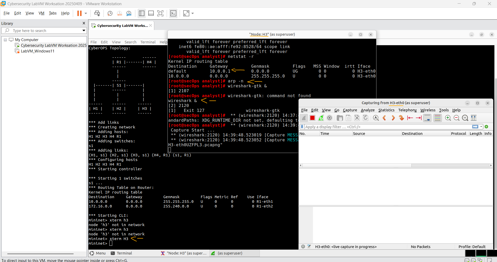
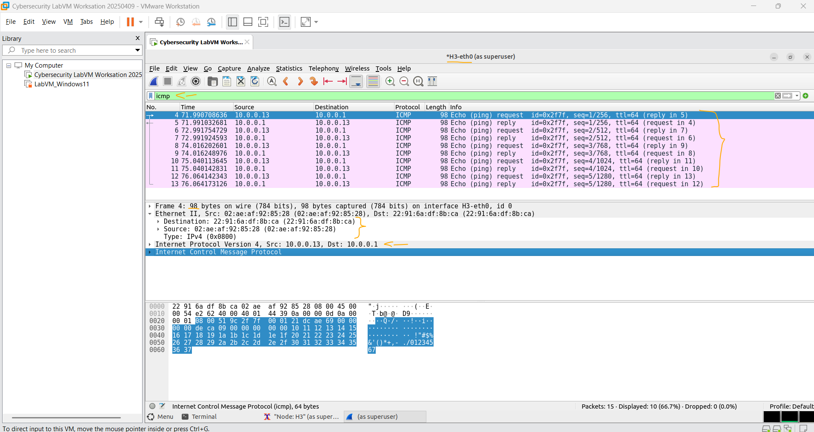
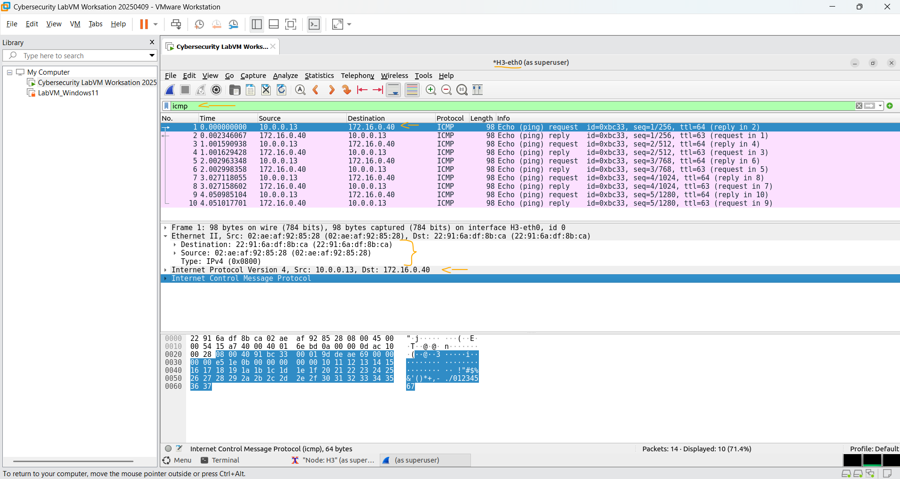

# Laboratório - Usando Wireshark para Examinar Quadros Ethernet   

### Cisco: <a href="../../../">cisco   </a>
### Cisco Networking Academy: cna   </a>
### Training Category: <a href="../../../labs/">labs</a>
### Software/Subject: wireshark   </a>
### Course: <a href="./">lab_043 (Laboratório - Usando Wireshark para Examinar Quadros Ethernet)   </a>

---

### Theme:
- Network

### Used Tools:
- Operating System (OS): 
  - Windows 11 
- Virtualization:
  - VMWare Workstation   
- Cloud Services:
  - Google Drive 
- Language:
  - HTML   
  - Markdown   
- Integrated Development Environment (IDE) and Text Editor:
  - Visual Studio Code (VS Code)   
- Versioning: 
  - Git   
- Repository:
  - GitHub   
- Network:
  - Mininet   
  - ping   
  - Wireshark   
- Cibersecurity:
  - Cisco CyberOps Workstation   

---

<h3><a name="item00">Course Strcuture:</a></h3>

1. <a href="#item01">Parte 1: Examinar os campos do cabeçalho de um quadro Ethernet II</a> 
  1.1 <a href="#item01.01">Etapa 1: Analise os tamanhos e as descrições dos campos do cabeçalho Ethernet II.</a> 
  1.2 <a href="#item01.02">Etapa 2: Examine os quadros Ethernet em uma captura do Wireshark.</a> 
  1.3 <a href="#item01.03">Etapa 3: Examine o conteúdo do cabeçalho Ethernet II de uma requisição ARP.</a> 
2. <a href="#item02">Parte 2: Usar o Wireshark para capturar e analisar quadros Ethernet</a> 
  2.1 <a href="#item02.01">Etapa 1: Examine a configuração de rede do H3.</a> 
  2.2 <a href="#item02.02">Etapa 2: Limpe o cache ARP em H3 e comece a capturar tráfego em H3-eth0.</a> 
  2.3 <a href="#item02.03">Etapa 3: Ping H1 de H3.</a> 
  2.4 <a href="#item02.04">Etapa 4: Filtrar o Wireshark para exibir apenas o tráfego ICMP.</a> 
  2.5 <a href="#item02.05">Etapa 5: Examine a primeira requisição (ping) de eco no Wireshark.</a> 
  2.6 <a href="#item02.06">Etapa 6: Inicie uma nova captura no Wireshark.</a> 
  2.7 <a href="#item02.07">Etapa 7: Examinar os novos dados no painel lista de pacotes do Wireshark.</a> 
3. <a href="#item03">Reflexão</a> 

---

### Objective:
O objetivo deste laboratório foi analisar e compreender os campos de quadros Ethernet por meio da captura e inspeção de pacotes utilizando o **Wireshark**, em uma rede virtual criada com o **Mininet** na máquina virtual **Cisco CyberOps Workstation**.

### Folder Structure:
- [README.md](./README.md): Este documento de README, escrito em **Markdown**, com o conteúdo do laboratório.
- [0-aux](./0-aux/): Pasta auxiliar com imagens utilizadas na construção dos arquivos de README desse curso.

### Development:

<a name="item01"><h4>1. Parte 1: Examinar os campos do cabeçalho de um quadro Ethernet II</h4></a>[Back to summary](#item00)

Na Parte 1, você examinará os campos de cabeçalho e o conteúdo em um Quadro Ethernet II fornecido a você. Será usada uma captura do Wireshark para examinar o conteúdo nesses campos.

<a name="item01.01"><h4>1.1 Etapa 1: Analise os tamanhos e as descrições dos campos do cabeçalho Ethernet II.</h4></a>[Back to summary](#item00)

- Introdução: 8 bytes;
- Endereço de destino: 6 bytes;
- Endereço de origem: 6 bytes;
- Tipo de quadro: 2 bytes;
- Dados: 46 a 1.500 bytes;
- FCS: 4 bytes.

<a name="item01.02"><h4>1.2 Etapa 2: Examine os quadros Ethernet em uma captura do Wireshark.</h4></a>[Back to summary](#item00)

A captura do Wireshark a seguir mostra os pacotes gerados por um ping sendo enviados de um host PC para o gateway padrão. Um filtro foi aplicado ao Wireshark para visualizar somente os protocolos ARP e ICMP. A sessão começa com uma consulta ARP para o endereço MAC do roteador gateway, seguida de quatro requisições e respostas de ping.

<a name="item01.03"><h4>1.3 Etapa 3: Examine o conteúdo do cabeçalho Ethernet II de uma requisição ARP.</h4></a>[Back to summary](#item00)

A tabela a seguir usa o primeiro quadro na captura do Wireshark e exibe os dados nos campos do cabeçalho Ethernet II.
- Preâmbulo (Não mostrado na captura): Este campo contém bits de sincronização, processados pelo hardware da NIC.
- Endereço Destino (Broadcast (ff:ff:ff:ff:ff:ff)) e Endereço Origem (IntelCor_62:62:6d (f4:8c:50:62:62:6d)): Endereços de Camada 2 para o quadro. Cada endereço 
tem 48 bits (ou 6 octetos), expressos como 12 dígitos hexadecimais, 0-9,A-F. Um formato comum é 12:34:56:78:9A:BC. Os primeiros seis números hexadecimais indicam o 
fabricante da placa de interface de rede (NIC) e os últimos seis números hexadecimais são o número de série dela. O endereço destino pode ser broadcast, que contém todos 
os valores em 1, ou unicast. O endereço origem é sempre unicast.
- Tipo de quadro (0x0806): Nos quadros Ethernet II, este campo contém um valor hexadecimal que é usado para indicar o tipo de protocolo de camada superior no campo de dados. Há muitos protocolos de camadas superiores compatíveis com Ethernet II. Dois tipos de quadro comum são:
  - Protocolo IPv4: 0x0800 
  - Protocolo de Resolução de Endereço (ARP): 0x0806
- Dados (ARP): Contém o protocolo de nível superior encapsulado. O campo de dados varia de 46 a 1.500 bytes.
- FCS (Não mostrado na captura): Sequência de Verificação de Quadro (FCS), usado pela NIC para identificar erros durante a transmissão. O valor é computado pela máquina emissora, incluindo o endereçamento, o tipo e o campo de dados do quadro. Isso é verificado pelo receptor.

Perguntas:
- a. Qual é a importância do conteúdo do campo Endereço Destino?
  - A importância do campo Endereço Destino é indicar para qual endereço MAC o quadro Ethernet deve ser enviado na rede local. Isso garante que o dispositivo correto receba o quadro.
- b. Por que o PC envia um broadcast ARP antes da primeira requisição ping?
  - O PC envia um broadcast ARP porque não possui o endereço MAC correspondente ao IP de destino em sua tabela ARP. O broadcast é usado para descobrir qual dispositivo possui aquele IP.
- c. Qual é o endereço MAC origem no primeiro quadro?
  - O endereço MAC de origem no primeiro quadro é f4:BC:50:62:62:6d, pertencente à interface de rede do computador que enviou o quadro.
- d. Qual é a ID do fornecedor (OUI) da NIC origem?
  - A ID do fornecedor (OUI) da NIC de origem é f4:BC:50, que identifica o fabricante Intel (IntelCor).
- e. Que parte do endereço MAC é a OUI?
  - A OUI corresponde aos primeiros 24 bits do endereço MAC, ou seja, aos três primeiros bytes (seis dígitos hexadecimais).
- f. Qual é o número de série da NIC origem?
  - O número de série da NIC corresponde aos últimos 24 bits do endereço MAC, que neste caso são 62:62:6d.

<a name="item02"><h4>2. Parte 2: Usar o Wireshark para capturar e analisar quadros Ethernet</h4></a>[Back to summary](#item00)

Na Parte 2, você usará o Wireshark para capturar quadros Ethernet locais e remotos. Em seguida, examinará as informações contidas nos campos do cabeçalho do quadro. 

<a name="item02.01"><h4>2.1 Etapa 1: Examine a configuração de rede do H3.</h4></a>[Back to summary](#item00)

- a. Inicie e faça login na VM do CyberOps Workstation usando as seguintes credenciais: 
  - Username: analyst
  - Password: cyberops
- b. Abra um emulador de terminal para iniciar o mininet e digite o seguinte comando no prompt. Quando solicitado, digite cyberops como a senha.
  - `sudo ./lab.support.files/scripts/cyberops_topo.py`.
- c. No prompt da mininet, inicie as janelas do terminal no host H3.
  - `xterm H3`.
- d. No prompt em Node: H3, digite o `ip address` para verificar o endereço IPv4 e registrar o endereço MAC.
  - Host-interface: H3-eth0
  - Endereço IP: 10.0.0.13/24
  - Endereço MAC: 02:ae:af:92:85:28
- e. No prompt em Node: H3, digite netstat -r para exibir as informações padrão do gateway.
  - `netstat -r`.
- e. Qual é o endereço IP do gateway padrão para o host H3?
  - 10.0.0.1

<a name="item02.02"><h4>2.2 Etapa 2: Limpe o cache ARP em H3 e comece a capturar tráfego em H3-eth0.</h4></a>[Back to summary](#item00)

- a. Na janela do terminal de Node: H3, digite `arp -n` para exibir o conteúdo do cache ARP.
  - `arp -n`.
- b. Se houver alguma informação ARP existente no cache, limpá-a inserindo o seguinte comando: `arp -d IP address`. Repita até que todas as informações armazenadas em cache tenham sido limpas.
- c. Na janela do terminal para Node: H3, abra o Wireshark e inicie uma captura de pacote para a interface H3-eth0.
  - `wireshark &`

A imagem 01 ilustra o início da captura de pacotes.

<figure>
     
    <figcaption>Imagem 01.</figcaption>
</figure>
 

<a name="item02.03"><h4>2.3 Etapa 3: Ping H1 de H3.</h4></a>[Back to summary](#item00)

- a. A partir do terminal em H3, faça ping no gateway padrão e pare depois de enviar 5 pacotes de solicitação de eco.
  - `ping -c 5 10.0.0.1`.
- b. Após a conclusão do ping, pare a captura Wireshark.

<a name="item02.04"><h4>2.4 Etapa 4: Filtrar o Wireshark para exibir apenas o tráfego ICMP.</h4></a>[Back to summary](#item00)

- a. Aplique o filtro ICMP ao tráfego capturado para que apenas o tráfego ICMP seja mostrado nos resultados.

<a name="item02.05"><h4>2.5 Etapa 5: Examine a primeira requisição (ping) de eco no Wireshark.</h4></a>[Back to summary](#item00)

A janela principal do Wireshark é dividida em três seções: superior [o painel Packet List (Lista de pacotes)], intermediária [o painel Packet Details (Detalhes do pacote)] e inferior [o painel Packet Bytes (Bytes do pacote)]. Se você tiver selecionado a interface correta para captura de pacotes na Etapa 3, o Wireshark deverá exibir as informações ICMP no painel Packet List (Lista de pacotes), como mostrado no exemplo a seguir.

- a. No painel Packet List (Lista de pacotes) [seção superior], clique no primeiro quadro listado. Você deve ver Echo (ping) request no cabeçalho Info (Informações). A linha será destacada em azul.
- b. Examine a primeira linha no painel Packet Details (Detalhes do pacote) [seção intermediária]. Essa linha apresenta o tamanho do quadro; 98 bytes neste exemplo.
- c. A segunda linha no painel Packet Details (Detalhes do pacote) mostra que se trata de um quadro Ethernet II. Os endereços MAC de origem e de destino também são exibidos. Qual é o endereço MAC da NIC do PC?
  - 02:ae:af:92:85:28
- c. Qual é o endereço MAC do gateway padrão?
  - 22:91:6a:df:8b:ca
- d. Você pode clicar na seta no início da segunda linha para obter mais informações sobre o quadro Ethernet II. Que tipo de quadro é exibido?
  - IPv4 (0x0800).
- e. As duas últimas linhas exibidas na parte intermediária fornecem informações sobre o campo de dados do quadro. Observe que os dados contêm informações do endereço IPv4 origem e destino. Qual é o endereço IP de origem?
  - O endereço de IP de origem é 10.0.0.13.
- e. Qual é o endereço IP de destino?
  - O endereço de IP de destino é 10.0.0.1.
- f. Clique em qualquer linha na seção intermediária para destacar a parte do quadro (hexadecimal e ASCII) no painel Packet Bytes (Bytes do pacote) [seção inferior]. Clique na linha Internet Control Message Protocol na seção do meio e examine o que está destacado no painel Packet Bytes.
- g. Clique no próximo quadro na seção superior e examine um quadro de resposta de eco. Observe que os endereços MAC de origem e de destino foram invertidos porque esse quadro foi enviado do roteador gateway padrão como uma resposta ao primeiro ping. Que dispositivo e endereço MAC são exibidos como endereço destino? 
  - O dispositivo de destino é o PC H3, pois o quadro é uma resposta ao ping enviado anteriormente. O endereço MAC de destino exibido é 02:ae:af:92:85:28, que corresponde à interface de rede desse host.

A imagem 02 mostra as informações do primeiro pacote ICMP capturado.

<figure>
     
    <figcaption>Imagem 02.</figcaption>
</figure>
 

<a name="item02.06"><h4>2.6 Etapa 6: Inicie uma nova captura no Wireshark.</h4></a>[Back to summary](#item00)

- a. Clique no ícone Start Capture (Iniciar captura) para iniciar uma nova captura do Wireshark. Você receberá uma janela pop-up perguntando se deseja salvar os pacotes capturados em um arquivo antes de iniciar uma nova captura. Clique em Continue without Saving (Continuar sem salvar).
- b. Na janela de terminal de Node: H3, envie 5 pacotes de solicitação de eco para 172.16.0.40.
  - `ping -c 5 172.16.0.40`.
- c. Pare de capturar pacotes quando os pings forem concluídos.

<a name="item02.07"><h4>2.7 Etapa 7: Examinar os novos dados no painel lista de pacotes do Wireshark.</h4></a>[Back to summary](#item00)

- a. No primeiro quadro de requisição (ping) de eco, quais são os endereços MAC de origem e de destino? 
  - Origem: 02:ae:af:92:85:28
  - Destino: 22:91:6a:df:8b:ca
- b. Quais são os endereços IP origem e destino contidos no campo de dados do quadro?
  - Origem: 10.0.0.13
  - Destino: 172.16.0.40
- c. Compare esses endereços com os endereços que você recebeu na Etapa 5. O único endereço que mudou foi o endereço IP de destino. Por que o endereço IP de destino mudou e o endereço MAC de destino permaneceu o mesmo?
  - Porque o endereço de IP de destino agora é de uma rede remota, e neste caso, o endereço MAC tem que ser o do gateway padrão que é o roteador da rede local.
  - O endereço IP de destino mudou porque agora o pacote está sendo enviado para um dispositivo em uma rede remota. O endereço MAC de destino permanece o mesmo porque o quadro é enviado ao gateway padrão (roteador), responsável por encaminhar o pacote para outras redes.

A imagem 03 mostra as informações do primeiro pacote ICMP capturado no tráfego entre a rede local e remota.

<figure>
     
    <figcaption>Imagem 03.</figcaption>
</figure>
 

<a name="item03"><h4>3. Reflexão</h4></a>[Back to summary](#item00)

- a. O Wireshark não exibe o campo Preâmbulo de um cabeçalho do quadro. O que o preâmbulo contém? 
  - O preâmbulo contém uma sequência de bits usada para sincronizar a comunicação entre o transmissor e o receptor antes da transmissão do quadro Ethernet. Ele permite que o dispositivo receptor prepare sua interface para receber os dados.