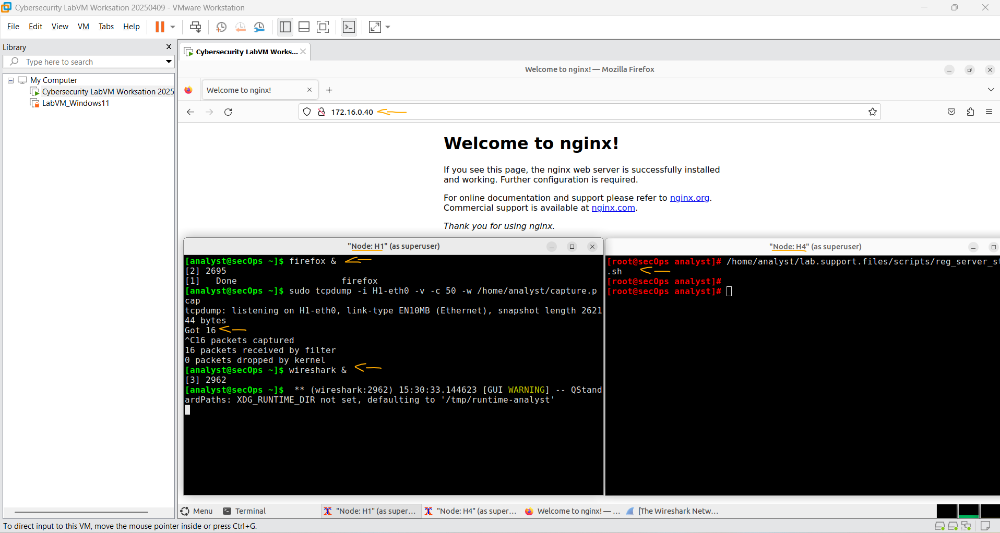
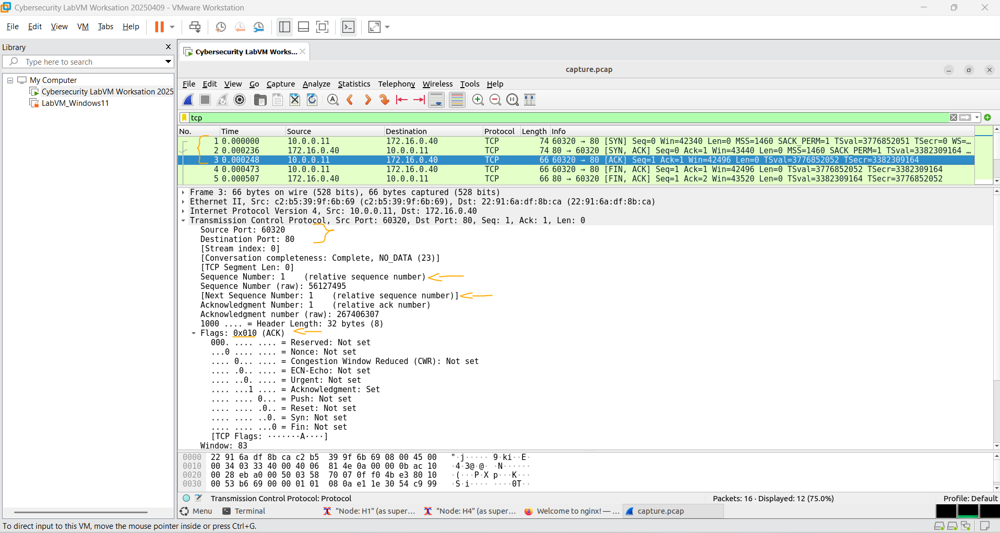
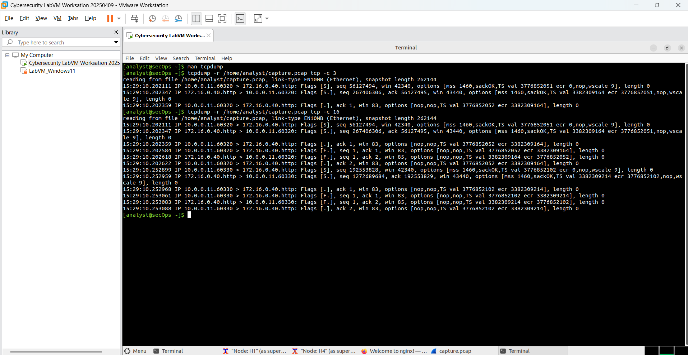

# Laboratório - Usando o Wireshark para Observar o Handshake TCP de 3 Vias   

### Cisco: <a href="../../../">cisco   </a>
### Cisco Networking Academy: cna   </a>
### Training Category: <a href="../../../labs/">labs</a>
### Software/Subject: wireshark   </a>
### Course: <a href="./">lab_044 (Laboratório - Usando o Wireshark para Observar o Handshake TCP de 3 Vias)   </a>

---

### Theme:
- Network

### Used Tools:
- Operating System (OS): 
  - Windows 11 
- Virtualization:
  - VMWare Workstation   
- Cloud Services:
  - Google Drive 
- Language:
  - HTML   
  - Markdown   
- Integrated Development Environment (IDE) and Text Editor:
  - Visual Studio Code (VS Code)   
- Versioning: 
  - Git   
- Repository:
  - GitHub   
- Network:
  - Mininet   
  - ping   
  - tcpdump   
  - Wireshark   
- Cibersecurity:
  - Cisco CyberOps Workstation   
- SysAdmin:
  - man-db   
  
---

<h3><a name="item00">Course Strcuture:</a></h3>

1. <a href="#item01">Parte 1: Prepare os Hosts para Capturar o Tráfego</a> 
2. <a href="#item02">Parte 2: Analisar os pacotes usando o Wireshark</a> 
  2.1 <a href="#item02.01">Etapa 1: Aplique um filtro à captura salva.</a> 
  2.2 <a href="#item02.02">Etapa 2: Examinar as informações dentro dos pacotes incluindo os endereços IP, números de porta TCP e flags de controle TCP.</a> 
3. <a href="#item03">Parte 3: Exibir os pacotes usando o tcpdump</a> 
4. <a href="#item04">Perguntas para reflexão</a> 

---

### Objective:
Neste laboratório, o objetivo foi capturar e analisar pacotes utilizando **tcpdump** e **Wireshark** para observar e compreender o funcionamento do TCP Three-Way Handshake, processo responsável por estabelecer conexões confiáveis no protocolo TCP. Esta atividade foi realizado em uma rede virtual criada com **Mininet** na máquina virtual **Cisco CyberOps Workstation**.

### Folder Structure:
- [README.md](./README.md): Este documento de README, escrito em **Markdown**, com o conteúdo do laboratório.
- [0-aux](./0-aux/): Pasta auxiliar com imagens utilizadas na construção dos arquivos de README desse curso.

### Development:

<a name="item01"><h4>1. Parte 1: Prepare os Hosts para Capturar o Tráfego</h4></a>[Back to summary](#item00)

- a. Inicie o CyberOps VM. Faça login com o analyst de nome de usuário e as cyberops de senha.
- b. Inicie a Mininet.
  - `sudo lab.support.files/scripts/cyberops_topo.py`.
- c. Inicie o host H1 e H4 no Mininet.
  - `xterm H1` e `xterm H4`.
- d. Inicie o servidor Web em H4.
  - `/home/analyst/lab.support.files/scripts/reg_server_start.sh`.
- e. Por motivos de segurança, você não é capaz de executar o Firefox a partir da conta de usuário raiz. No host H1, use o comando switch user para alternar do usuário raiz para a conta de usuário analyst:
  - `su analyst`.
- f. Inicie o navegador da Web em H1. Isso levará alguns instantes.
  - `firefox &`.
- g. Após a janela do Firefox abrir, inicie uma sessão tcpdump no terminal Node: H1e envie a saída para um arquivo chamado capture.pcap. Com a opção -v, você pode assistir ao progresso. Essa captura será interrompida após a captura de 50 pacotes, pois é configurada com a opção -c 50.
  - `sudo tcpdump -i H1-eth0 -v -c 50 -w /home/analyst/capture.pcap`.
- h. Depois que o tcpdump for iniciado, navegue rapidamente para 172.16.0.40 no navegador da Web Firefox.

A imagem exibe a conclusão da Parte 1.

<figure>
     
    <figcaption>Imagem 01.</figcaption>
</figure>
 

<a name="item02"><h4>2. Parte 2: Analisar os pacotes usando o Wireshark</h4></a>[Back to summary](#item00)

<a name="item02.01"><h4>2.1 Etapa 1: Aplique um filtro à captura salva.</h4></a>[Back to summary](#item00)

- a. Pressione ENTER para ver o prompt. Iniciar Wireshark no Node: H1. Clique em OK quando solicitado pelo aviso referente à execução do Wireshark como superusuário.
  - `wireshark &`.
- b. No Wireshark, clique em File> Open. Selecione o arquivo pcap salvo localizado em /home/analyst/capture.pcap. 
- c. Aplique um filtro tcp à captura. Neste exemplo, os três primeiros quadros são o tráfego interessado.

<a name="item02.02"><h4>2.2 Examinar as informações dentro dos pacotes incluindo os endereços IP, números de porta TCP e flags de controle TCP.</h4></a>[Back to summary](#item00)

- a. Neste exemplo, o quadro 1 é o início do handshake de três vias entre o PC e o servidor em H4. No painel da lista de pacotes (seção superior da janela principal), selecione o primeiro pacote, se necessário.
- b. Clique na seta à esquerda do Transmission Control Protocol no painel de detalhes do pacote para expandi-lo e examinar as informações de TCP. Localize as informações da porta de origem e destino.
- c. Clique na seta à esquerda dos flags Um valor de 1 significa que o flag está definido. Localize o flag que está definido neste pacote. Nota: Você pode ter que ajustar os tamanhos das janelas superior e intermediária dentro do Wireshark para exibir as informações necessárias. Qual é o número da porta TCP origem? 
  - O número da porta TCP de origem é 60320.
- c. Como você classificaria essa porta de origem?
  - Essa porta é classificada como porta efêmera (ou dinâmica), pois é temporariamente atribuída pelo sistema operacional para iniciar uma conexão.
- c. Qual é o número da porta TCP destino?
  - O número da porta TCP de destino é 80.
- c. Como você classificaria essa porta de destino?
  - Essa porta é classificada como porta bem conhecida (well-known port), utilizada por serviços padrão como HTTP.
- c. Qual flag (ou flags) estão ligadas?
  - A flag SYN está ativada, indicando o início do estabelecimento da conexão TCP.
- c. Qual o valor do número de sequência relativo? 
  - O valor do número de sequência relativo é 0.
- d. Selecione o próximo pacote no handshake de três vias. Neste exemplo, este é o quadro 2. Este é o servidor da web respondendo à solicitação inicial para iniciar uma sessão. Quais são os valores das portas origem e destino?
  - A porta de origem é a 80 e a porta de destino é a 60320.
- d. Que flags estão ligados?
  - As flags SYN e ACK estão ativadas, indicando que o servidor reconheceu a solicitação e respondeu para continuar o estabelecimento da conexão TCP.
- d. Quais os valores dos números de sequência e confirmação relativos?
  - O número de sequência relativo é 0 e o número de confirmação relativo é 1, indicando que o servidor reconheceu o primeiro pacote enviado pelo cliente.
- e. Por fim, selecione o terceiro pacote no handshake de três vias. Examine o terceiro e último pacote do handshake. Qual flag (ou flags) estão ligados?
  - A flag ACK está ativada, confirmando o recebimento da resposta do servidor e completando o estabelecimento da conexão TCP.
- e. Os números de sequência e confirmação relativos estão com valor 1 como um ponto de partida. A conexão TCP é estabelecida e a conversação entre o computador origem e o servidor Web pode iniciar.

A imagem 02 mostra a captura do último pacote desse handshake.

<figure>
     
    <figcaption>Imagem 02.</figcaption>
</figure>
 

<a name="item03"><h4>3. Parte 3: Exibir os pacotes usando o tcpdump</h4></a>[Back to summary](#item00)

Você também pode exibir o arquivo pcap e filtrar as informações desejadas. 

- a. Abra uma nova janela de terminal, digite man tcpdump. Observação: talvez seja necessário pressionar ENTER para ver o prompt. Usando as páginas de manual disponíveis com o sistema operacional Linux, você lê ou pesquisa nas páginas do manual opções para selecionar as informações desejadas no arquivo pcap.
  - `man tcpdump`.
- a. Para pesquisar através das páginas de manual, você pode usar / (pesquisando para frente) ou ? (pesquisando para trás) para encontrar termos específicos, e n para encaminhar para a próxima partida e q para sair. Por exemplo, procure as informações no switch -r, digite /-r. Digite n para mover para a próxima correspondência. O que faz o switch -r ?
  - O switch -r faz com que o tcpdump leia pacotes a partir de um arquivo de captura (.pcap) em vez de capturar pacotes diretamente da interface de rede. Isso permite analisar posteriormente pacotes que já foram gravados.
- b. No mesmo terminal, abra o arquivo de captura usando o seguinte comando para exibir os primeiros 3 pacotes TCP capturados. Para visualizar o handshake de 3 vias, você pode precisar aumentar o número de linhas após a opção c. 
  - `tcpdump -r /home/analyst/capture.pcap tcp -c 3`.
- c. Navegue até o terminal usado para iniciar o Mininet. Encerre o Mininet digitando quit na janela principal do terminal CyberOps VM.
  - `quit`.
- d. Depois de sair da Mininet, digite sudo mn -c para limpar os processos iniciados pela Mininet. Entre a senha cyberops quando solicitado.
  - `sudo mn -c`.

A imagem 03 apresenta os pacotes capturados, mas agora visualizados pelo **tcpdump**.

<figure>
     
    <figcaption>Imagem 03.</figcaption>
</figure>
 

<a name="item04"><h4>4. Perguntas para reflexão</h4></a>[Back to summary](#item00)

- a. Existem centenas de filtros disponíveis no Wireshark. Uma rede grande pode ter muitos filtros e diferentes tipos de tráfego. Liste três filtros que podem ser úteis para um administrador de rede.
  - Três filtros úteis no Wireshark para um administrador de rede são arp, para visualizar requisições e respostas ARP; icmp, para analisar testes de conectividade como ping; e dns, para verificar consultas e respostas de resolução de nomes.
- b. De que outras maneiras o Wireshark pode ser usado em uma rede de produção?
  - O Wireshark pode ser usado em uma rede de produção para diagnosticar problemas de conectividade, analisar desempenho da rede e identificar tráfego suspeito ou anormal. Também auxilia na investigação de falhas de comunicação entre dispositivos e serviços.