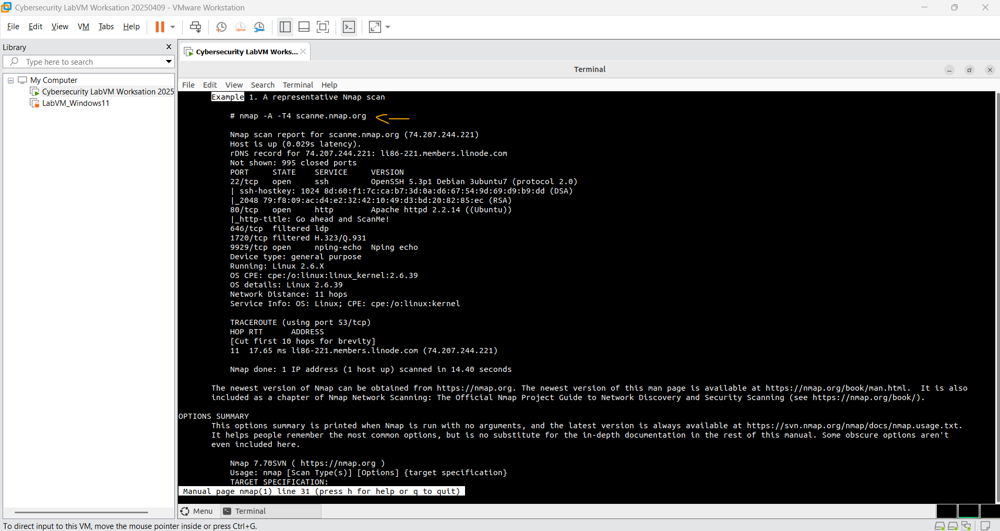
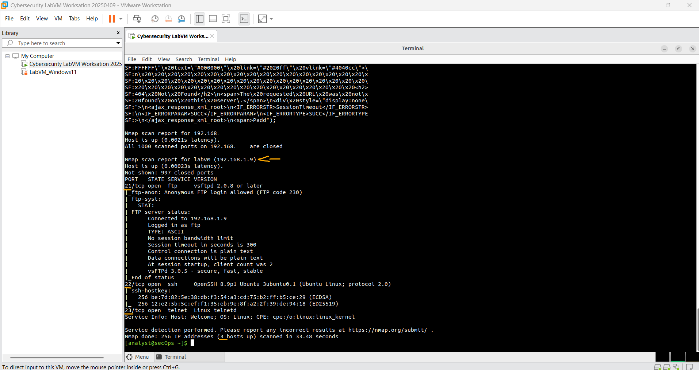
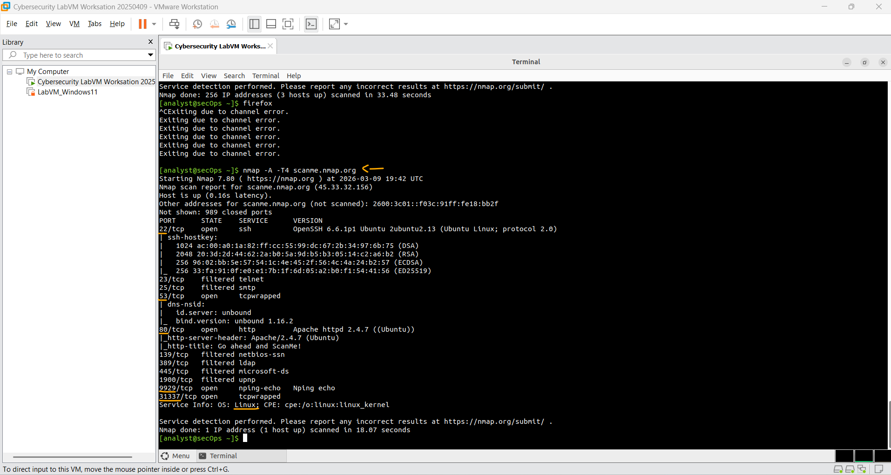

# Laboratório - Explorando o Nmap   

### Cisco: <a href="../../../">cisco   </a>
### Cisco Networking Academy: cna   </a>
### Training Category: <a href="../../../labs/">labs</a>
### Software/Subject: nmap   </a>
### Course: <a href="./">lab_045 (Laboratório - Explorando o Nmap)   </a>

---

### Theme:
- Network

### Used Tools:
- Operating System (OS): 
  - Windows 11 
- Virtualization:
  - VMWare Workstation   
- Cloud Services:
  - Google Drive 
- Language:
  - HTML   
  - Markdown   
- Integrated Development Environment (IDE) and Text Editor:
  - Visual Studio Code (VS Code)   
- Versioning: 
  - Git   
- Repository:
  - GitHub   
- Cibersecurity:
  - Cisco CyberOps Workstation   
  - Network Mapper (Nmap)   
- SysAdmin:
  - man-db   

---

<h3><a name="item00">Course Strcuture:</a></h3>

1. <a href="#item01">Parte 1: Explorando Nmap</a> 
2. <a href="#item02">Parte 2: Verificação de Portas Abertas</a> 
  2.1 <a href="#item02.01">Etapa 1: Analise o seu host local.</a> 
  2.2 <a href="#item02.02">Etapa 2: Analise a sua rede.</a> 
  2.3 <a href="#item02.03">Etapa 3: Faça a varredura em um servidor remoto.</a> 
3. <a href="#item03">Perguntas para reflexão</a> 

---

### Objective:
O objetivo deste laboratório foi explorar o uso da ferramenta **Nmap** para realizar varreduras de rede, tanto em uma rede local utilizando a máquina virtual **Cisco CyberOps Workstation**, quanto em um ambiente remoto por meio do site scanme.nmap.org. Ambas as varreduras foram realizadas em ambientes controlados e apenas para fins de aprendizado.

### Folder Structure:
- [README.md](./README.md): Este documento de README, escrito em **Markdown**, com o conteúdo do laboratório.
- [0-aux](./0-aux/): Pasta auxiliar com imagens utilizadas na construção dos arquivos de README desse curso.

### Development:

<a name="item01"><h4>1. Parte 1: Explorando Nmap</h4></a>[Back to summary](#item00)

Nesta parte, você usará páginas de manual (ou páginas de man para abreviar) para saber mais sobre o Nmap. O comando man [ programa |utilitário | função] exibe as páginas de manual associadas aos argumentos. As páginas de manual são os manuais de referência encontrados em sistemas operacionais Unix e Linux. Essas páginas podem incluir estas seções: Nome, Sinopse, Descrições, Exemplos e Consulte Também.

- a. Inicie o CyberOps Workstation VM.
- b. Abra um terminal.
- c. No prompt do terminal, digite `man nmap`. O que é Nmap?
  - Nmap é uma ferramenta de código aberto utilizada para exploração e auditoria de segurança em redes.
- c. Para que é utilizado o nmap?
  - O Nmap é utilizado para descobrir dispositivos em uma rede, identificar portas abertas e detectar serviços ou sistemas em execução nos hosts.
- d. Enquanto estiver na página do manual, você pode usar as teclas de seta para cima e para baixo para percorrer as páginas. Você também pode pressionar a barra de espaço para encaminhar uma página de cada vez. Para procurar um termo ou frase específico, use uma barra (/) ou um ponto de interrogação (?) seguido pelo termo ou frase. A barra pesquisa para a frente no documento e o ponto de interrogação pesquisa para trás no documento. A chave n se move para a próxima correspondência. Digite /example e pressione ENTER Isso pesquisará a palavra exemplo adiante na página do manual. 
- e. Na primeira instância do exemplo, você vê três correspondências. Para ir para a próxima correspondência, pressione n. Olhe para o Exemplo 1. Qual é o comando nmap usado?
  - `nmap -A -T4 scanme.nmap.org`.
- e. Use a função de pesquisa para responder às seguintes perguntas. O que o opção -A faz?
  - A opção -A habilita uma varredura avançada, incluindo detecção de sistema operacional, detecção de versão de serviços, execução de scripts e traceroute.
- e. O que o opção -T4 faz?
  - A opção -T4 define o modelo de temporização do Nmap para agressivo, tornando a varredura mais rápida ao ajustar timeouts, paralelismo e atrasos. Os níveis variam de 0 (Paranoid) a 5 (Insane).
- f. Percorra a página para saber mais sobre o nmap. Digite q quando terminar.

A imagem exibe a conclusão da Parte 1.

<figure>
     
    <figcaption>Imagem 01.</figcaption>
</figure>
 

<a name="item02"><h4>2. Parte 2: Verificação de Portas Abertas</h4></a>[Back to summary](#item00)

Nesta parte, você usará as opções do exemplo nas páginas do manual Nmap para escanear seu localhost, sua rede local e um servidor remoto em scanme.nmap.org. 

<a name="item02.01"><h4>2.1 Etapa 1: Analise o seu host local.</h4></a>[Back to summary](#item00)

- a. Se necessário, abra um terminal na VM. No prompt, digite `nmap -A -T4 localhost`. Dependendo da rede local e dos dispositivos, a verificação levará de alguns segundos a alguns minutos.
  - `nmap -A -T4 localhost`.
- b. Reveja os resultados e responda às seguintes perguntas. Quais portas e serviços são abertos?
  - Estão abertas as portas 21, 22 e 23, correspondentes aos serviços FTP (**vsftpd**), SSH (**OpenSSH**) e Telnet.
- b. Para cada uma das portas abertas, registre o software que está fornecendo os serviços.
  - A porta 21 utiliza o software **vsftpd**, a porta 22 utiliza **OpenSSH**, e a porta 23 utiliza o serviço **Telnet**.

<a name="item02.02"><h4>2.2 Etapa 2: Analise a sua rede.</h4></a>[Back to summary](#item00)

Aviso: Antes de usar o Nmap em qualquer rede, obtenha a permissão dos proprietários da rede antes de prosseguir. 

- a. No prompt de comando do terminal, digite ip address para determinar o endereço IP e a máscara de sub-rede para esse host. Para este exemplo, o endereço IP para esta VM é 10.0.2.15 e a máscara de sub-rede é 255.255.255.0.
  - `ip address`.
- a. Registre o endereço IP e a máscara de sub-rede para sua VM. 
  - O endereço IP é 192.168.1.9 e o prefixo é /24, que corresponde à máscara de sub-rede 255.255.255.0.
- a. A qual rede sua VM pertence?
  - A VM pertence à rede 192.168.1.0/24.
- b. Para localizar outros hosts nesta LAN, digite nmap -A -T4 endereço/prefixo de rede. O último octeto do endereço IP deve ser substituído por um zero. Por exemplo, no endereço IP 10.0.2.15, o .15 é o último octeto. Portanto, o endereço de rede é 10.0.2.0. O /24 é chamado de prefixo e é uma abreviação para a máscara de rede 255.255.255.0. Se sua VM tiver uma máscara de rede diferente, pesquise na Internet uma “tabela de conversão CIDR” para localizar seu prefixo. Por exemplo, 255.255.0.0 seria /16. O endereço de rede 10.0.2.0/24 é usado neste exemplo. Observação: essa operação pode levar algum tempo, especialmente se você tiver muitos dispositivos conectados à rede. Em um ambiente de teste, a varredura demorou cerca de 4 minutos.
  - `nmap -A -T4 192.168.1.0/24`.
- b. Quantos hosts estão ativos?
  - Foram identificados três hosts ativos na rede.
- b. Nos resultados do Nmap, liste os endereços IP dos hosts que estão na mesma LAN da VM. Liste alguns dos serviços que estão disponíveis nos hosts detectados.
  - Os endereços IP identificados foram 192.168.1.2, 192.168.1.9 e 192.168.1.20. Os serviços detectados foram observados apenas na VM 192.168.1.9, sendo os mesmos identificados anteriormente: FTP (21), SSH (22) e Telnet (23). Por motivos de segurança, algumas informações podem ter sido ocultadas ou alteradas.

A imagem 02 mostra as portas abertas identificadas na máquina virtual durante a varredura.

<figure>
     
    <figcaption>Imagem 02.</figcaption>
</figure>
 

<a name="item02.03"><h4>2.2 Etapa 3: Faça a varredura em um servidor remoto.</h4></a>[Back to summary](#item00)

- a. Abra um navegador da Web e navegue até scanme.nmap.org. Por favor, leia a mensagem postada. Qual é o propósito deste site?
  - O site scanme.nmap.org foi criado para permitir que usuários testem e pratiquem varreduras com o Nmap de forma segura e autorizada. Ele fornece um ambiente controlado para aprendizado e demonstração das funcionalidades da ferramenta.
- b. No prompt do terminal, digite `nmap -A -T4 scanme.nmap.org`.
  - `nmap -A -T4 scanme.nmap.org`.
- c. Reveja os resultados e responda às seguintes perguntas. Quais portas e serviços são abertos?
  - As portas abertas identificadas são 22 (SSH), 53 (DNS), 80 (HTTP), 9929 (nping-echo) e 31337 (tcpwrapped).
- c. Quais portas e serviços são filtrados?
  - As portas filtradas identificadas são 23 (Telnet), 25 (SMTP), 139 (NetBIOS), 389 (LDAP), 445 (Microsoft-DS) e 1900 (UPnP).
- c. Qual é o endereço IP do servidor?
  - O endereço IP do servidor é 45.33.32.156.
- c. O que é o sistema operacional?
  - O sistema operacional identificado é Linux.

A imagem 03 apresenta os resultados desse scan.

<figure>
     
    <figcaption>Imagem 03.</figcaption>
</figure>
 

<a name="item03"><h4>3. Perguntas para reflexão</h4></a>[Back to summary](#item00)

- a. Nmap é uma ferramenta poderosa para exploração e gerenciamento de redes. Como o Nmap pode ajudar com a segurança da rede?
  - O Nmap pode ajudar a identificar dispositivos ativos, portas abertas e serviços em execução na rede. Isso permite que administradores detectem vulnerabilidades e corrijam possíveis riscos de segurança.
- a. Como o Nmap pode ser usado por um ator ameaçador como uma ferramenta nefasta?
  - Um ator malicioso pode usar o Nmap para mapear a rede de um alvo, identificar portas abertas e descobrir serviços vulneráveis. Essas informações podem ser usadas para planejar ataques ou explorar falhas de segurança.