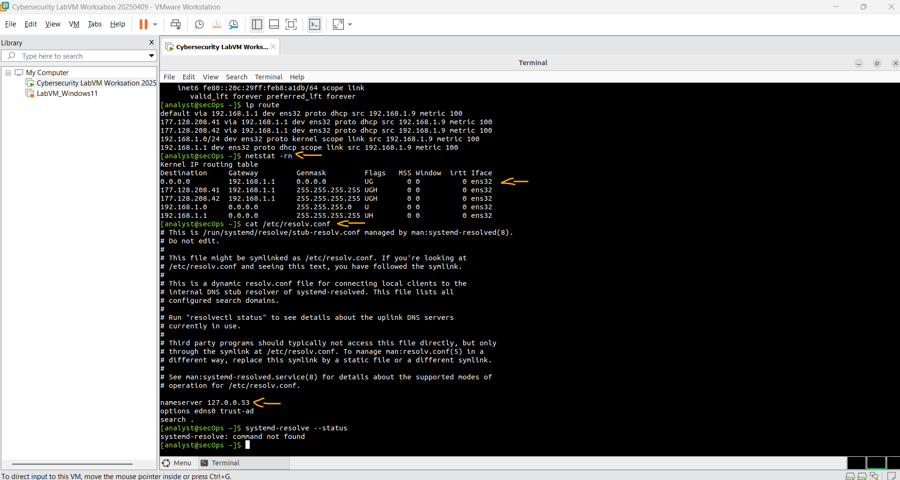
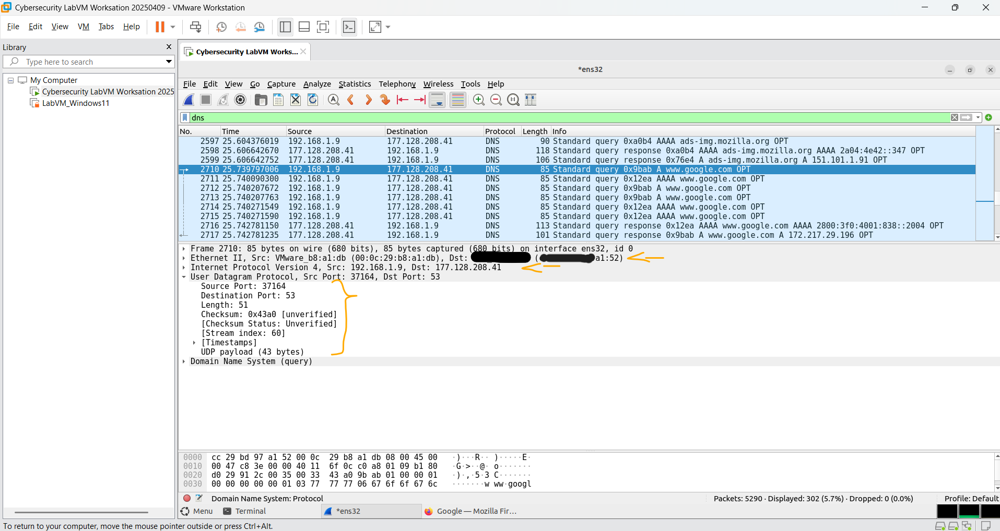
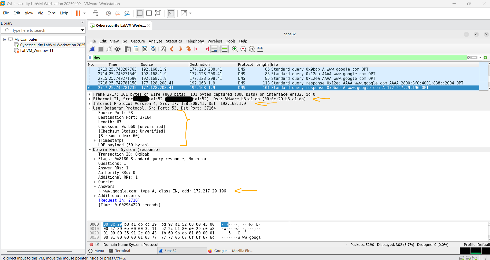

# Laboratório - Usando o Wireshark para Examinar uma Captura UDP DNS   

### Cisco: <a href="../../../">cisco   </a>
### Cisco Networking Academy: cna   </a>
### Training Category: <a href="../../../labs/">labs</a>
### Software/Subject: wireshark   </a>
### Course: <a href="./">lab_046 (Laboratório - Usando o Wireshark para Examinar uma Captura UDP DNS)   </a>

---

### Theme:
- Network

### Used Tools:
- Operating System (OS): 
  - Windows 11 
- Virtualization:
  - VMWare Workstation   
- Cloud Services:
  - Google Drive 
- Language:
  - HTML   
  - Markdown   
- Integrated Development Environment (IDE) and Text Editor:
  - Visual Studio Code (VS Code)   
- Versioning: 
  - Git   
- Repository:
  - GitHub   
- Network:
  - Wireshark   
- Cibersecurity:
  - Cisco CyberOps Workstation   

---

<h3><a name="item00">Course Strcuture:</a></h3>

1. <a href="#item01">Parte 1: Registrar as Informações de Configuração IP de um PC</a> 
2. <a href="#item02">Parte 2: Usar o Wireshark para Capturar Consultas e Respostas DNS</a> 
3. <a href="#item03">Parte 3: Analisar Pacotes DNS ou UDP Capturados</a> 
  3.1 <a href="#item03.01">Etapa 1: Filtrar os pacotes DNS.</a> 
  3.2 <a href="#item03.02">Etapa 2: Examine os campos em um pacote de consulta DNS.</a> 
  3.3 <a href="#item03.03">Etapa 3: Examine os campos em um pacote de resposta DNS.</a> 
4. <a href="#item04">Perguntas para reflexão</a> 

---

### Objective:
O objetivo deste laboratório foi compreender o funcionamento das consultas e respostas DNS e a razão de seu transporte pelo protocolo UDP, por meio da captura e análise de pacotes utilizando o **Wireshark** na máquina virtual **CyberOps Workstation**.

### Folder Structure:
- [README.md](./README.md): Este documento de README, escrito em **Markdown**, com o conteúdo do laboratório.
- [0-aux](./0-aux/): Pasta auxiliar com imagens utilizadas na construção dos arquivos de README desse curso.

### Development:

<a name="item01"><h4>1. Parte 1: Registrar as Informações de Configuração IP de um PC</h4></a>[Back to summary](#item00)

Na Parte 1, você usará comandos em sua CyberOps Workstation VM para encontrar e registrar os endereços MAC e IP da placa de interface de rede virtual (NIC) de sua VM, o endereço IP do gateway padrão especificado e o endereço IP do servidor DNS especificado para o PC. Anote essas informações na tabela fornecida. As informações serão usadas em partes deste laboratório com a análise de pacotes.

#### Tabela 1

| Descrição | Configurações | 
| :---: | :---: |
| **Endereço IP** | 192.168.1.9/24 |
| **Endereço MAC** | 00:0c:29:b8:a1:db | 
| **Endereço IP do gateway padrão** | 192.168.1.1/24 |
| **Endereço IP do servidor DNS** | 127.0.0.53 |

- a. As configurações de rede da VM do CyberOps Workstation devem ser definidas como adaptador de ponte. Para verificar as configurações de rede, acesse: Máquina > Configurações, Selecione Rede, a Guia Adaptador 1, Conectado a: Adaptador em Ponte.
- b. Abra um terminal na VM. Digite `ifconfig` no prompt para exibir as informações da interface. Se você não tiver um endereço IP em sua rede local, execute o seguinte comando no terminal:
  - `sudo lab.support.files/scripts/configure_as_dhcp.sh`.
- b. Observação: Na Parte 1, seus resultados variam dependendo das configurações de rede local e da conexão com a Internet. 
- c. No prompt do terminal, digite `cat /etc/resolv.conf` para determinar o servidor DNS.
  - `cat /etc/resolv.conf`.
- d. No prompt do terminal, digite `netstat -rn` para exibir a tabela de roteamento IP para o endereço IP do gateway padrão.
  - `netstat -rn`.
- d. Observação: O endereço IP do DNS e o endereço IP do gateway padrão geralmente são os mesmos, especialmente em redes pequenas. No entanto, em uma rede de negócios ou escolar, os endereços provavelmente seriam diferentes.

A imagem 01 mostra a identificação do gateway padrão e do servidor DNS.

<figure>
     
    <figcaption>Imagem 01.</figcaption>
</figure>
 

<a name="item02"><h4>2. Parte 2: Usar o Wireshark para Capturar Consultas e Respostas DNS</h4></a>[Back to summary](#item00)

Na Parte 2, você configurará o Wireshark para capturar pacotes de consulta e resposta DNS. Isso demonstrará o uso do protocolo de transporte UDP enquanto se comunica com um servidor DNS.

- a. Na janela do terminal, inicie o Wireshark e clique em OK quando solicitado.
  - `wireshark &`
- b. Na janela Wireshark, selecione e clique duas vezes em enp0s3 (ens32) na lista de interface.
- c. Abra o navegador da web e navegue até www.google.com.
- d. Clique em Stop para interromper a captura do Wireshark ao ver a página inicial do Google.

<a name="item03"><h4>3. Parte 3: Analisar Pacotes DNS ou UDP Capturados</h4></a>[Back to summary](#item00)

Na Parte 3, você examinará os pacotes UDP gerados ao se comunicar com um servidor DNS para os endereços IP de www.google.com.

<a name="item03.01"><h4>3.1 Etapa 1: Filtrar os pacotes DNS.</h4></a>[Back to summary](#item00)

- a. Na janela principal do Wireshark, digite dns no campo Filter. Clique em Aplicar. Observação: se não vir nenhum resultado após ter aplicado o filtro DNS, feche o navegador Web. Na janela do terminal, digite ping www.google.com como uma alternativa ao navegador da Web.
- b. No painel da lista de pacotes (seção superior) na janela principal, localize o pacote que inclui Standard query (Consulta padrão) e A www.google.com. Veja o quadro 429 acima como exemplo.

<a name="item03.02"><h4>3.2 Etapa 2: Examine os campos em um pacote de consulta DNS.</h4></a>[Back to summary](#item00)

Os campos de protocolo, destacados em cinza, são exibidos no painel de detalhes do pacote (seção do meio) da janela principal.

- a. Na primeira linha do painel de detalhes do pacote, o quadro 429 tinha 74 bytes de dados na transmissão. Este é o número de bytes necessários para enviar uma consulta DNS a um servidor nomeado solicitando os endereços IP de www.google.com. Se você usou um endereço da Web diferente, como www.cisco.com, a contagem de bytes pode ser diferente.
- b. A linha Ethernet II exibe os endereços MAC origem e destino. O endereço MAC de origem é de sua VM porque sua VM originou a consulta DNS. O endereço MAC destino é o endereço do gateway padrão, porque esta é a última parada antes desta consulta sair da rede local. O endereço MAC de origem é o mesmo registrado na Parte 1 para a VM?
  - Sim. O endereço MAC de origem é 00:0c:29:b8:a1:db, sendo o mesmo identificado anteriormente para a interface de rede da VM.
- c. Na linha do protocolo da Internet versão 4, a captura do Wireshark do pacote IP indica que o endereço IP de origem desta consulta DNS é 192.168.8.10 e o endereço IP de destino é 8.8.4.4. Neste exemplo, o endereço de destino é o servidor DNS. Você pode identificar os endereços IP e MAC para a origem e os destinos deste pacote?

#### Tabela 2 - Endereço de IP e MAC

| Dispositivo | Endereço IP | Endereço MAC |
| :---: | :---: |
| **Estação de Trabalho de Origem** | 192.168.1.9 | 00:0c:29:b8:a1:db |
| **Servidor DNS de Destino/Gateway Padrão** | 177.128.208.41 | xx:xx:xx:xx:a1:52 |

- c. Observação: O endereço IP de destino é para o servidor DNS, mas o endereço MAC de destino é para o gateway padrão. O pacote IP e o cabeçalho encapsulam o segmento UDP. O segmento UDP contém a consulta DNS como os dados.
- d. Um cabeçalho UDP tem apenas quatro campos: porta de origem, porta de destino, comprimento e checksum. Cada campo em um cabeçalho UDP possui somente 16 bits conforme descrito abaixo.
- d. Clique na seta ao lado de User Datagram Protocol para exibir os detalhes. Observe que há apenas quatro campos. O número da porta de origem neste exemplo é 58029. A porta de origem foi gerada aleatoriamente pela VM usando números de porta que não são reservados. A porta de destino é 53. A porta 53 é uma porta muito conhecida reservada para uso do DNS. Os servidores DNS ouvem na porta 53 as consultas DNS dos clientes. 
- d. Neste exemplo, o tamanho do segmento UDP é 40 bytes. O comprimento do segmento UDP em seu exemplo pode ser diferente. Dos 40 bytes, 8 bytes são usados como cabeçalho. Os outros 32 bytes são usados por dados da consulta DNS. Os 32 bytes de dados de consulta DNS estão na ilustração a seguir no painel de bytes de pacote (seção inferior) da janela principal do Wireshark. 
- d. A soma de verificação é usada para determinar a integridade do cabeçalho UDP depois que ele cruzou a Internet. O cabeçalho UDP tem pouca sobrecarga visto que o UDP não tem campos associados ao handshake triplo do TCP. Todos os problemas de confiabilidade da transferência de dados que ocorrem devem ser tratados pela camada de aplicação. Expanda conforme necessário para ver os detalhes. Registre os resultados do Wireshark na tabela abaixo: 

#### Tabela 3

| Descrição | Resultados Wireshark | 
| :---: | :---: |
| **Tamanho do quadro** | 85 bytes |
| **Endereço MAC origem** | 00:0c:29:b8:a1:db | 
| **Endereço MAC destino** | xx:xx:xx:xx:a1:52 |
| **Endereço IP de origem** | 192.168.1.9 |
| **Endereço IP de destino** | 177.128.208.41 |
| **Porta de origem** | 37164 |
| **Porta de destino** | 53 |

- d. O endereço IP origem é o mesmo que o endereço IP do computador local registrado na Parte 1?
  - Sim. O endereço IP de origem corresponde ao mesmo endereço IP da VM identificado anteriormente na Parte 1.
- d. O endereço IP de destino é o mesmo do gateway padrão observado na Parte 1?
  - Não. O endereço IP de destino corresponde ao servidor DNS, responsável por resolver o nome de domínio solicitado.

A imagem 02 mostra as informações do primeiro pacote ICMP capturado.

<figure>
     
    <figcaption>Imagem 02.</figcaption>
</figure>
 

<a name="item03.03"><h4>3.3 Etapa 3: Examine os campos em um pacote de resposta DNS.</h4></a>[Back to summary](#item00)

Nesta etapa, você examinará o pacote de resposta DNS e verificará se o pacote de resposta DNS também usa o UDP.
- a. Neste exemplo, o quadro 488 é o pacote de resposta DNS correspondente. Observe que o número de bytes no frame é 90. É um pacote maior em relação ao pacote de consulta DNS. Isso ocorre porque o pacote de resposta DNS incluirá uma variedade de informações sobre o domínio.
- b. No quadro Ethernet II para a resposta DNS, de qual dispositivo vem o endereço MAC origem e de qual dispositivo é o endereço MAC destino?
  - O endereço MAC de origem pertence ao gateway, e o endereço MAC de destino pertence à VM.
- c. Observe os endereços IP de origem e destino no pacote IP. Qual é o endereço IP de destino?
  - O endereço IP de destino é 192.168.1.9, que corresponde à VM.
- c. Qual é o endereço IP de origem?
  - O endereço IP de origem é 177.128.208.41, que corresponde ao servidor DNS.
- c. O que aconteceu com as funções de origem e destino da VM e do gateway padrão?
  - As funções de origem e destino se inverteram, pois o pacote agora retorna do servidor DNS para a VM através do gateway.
- d. No segmento UDP, a função dos números de porta também foi invertida. O número da porta de destino é 58029. O número da porta 58029 é a mesma que foi gerada pela VM quando a consulta DNS foi enviada ao servidor DNS. Sua VM escuta uma resposta DNS nesta porta. O número da porta de origem é 53. O servidor DNS ouve uma consulta DNS na porta 53 e depois envia uma resposta DNS com um número de porta de origem 53 de volta ao autor da consulta DNS. Quando a resposta DNS é expandida, observe os endereços IP resolvidos para www.google.com na seção Answers (Respostas).

A imagem 03 exibe a captura desses pacotes.

<figure>
     
    <figcaption>Imagem 03.</figcaption>
</figure>
 

<a name="item04"><h4>4. Perguntas para reflexão</h4></a>[Back to summary](#item00)

- a. Quais são os benefícios de usar o UDP em vez do TCP como um protocolo de transporte para o DNS?
  - O UDP é mais rápido e possui menor overhead que o TCP, pois não exige estabelecimento de conexão. Isso torna as consultas DNS mais rápidas e eficientes para pequenas requisições e respostas.