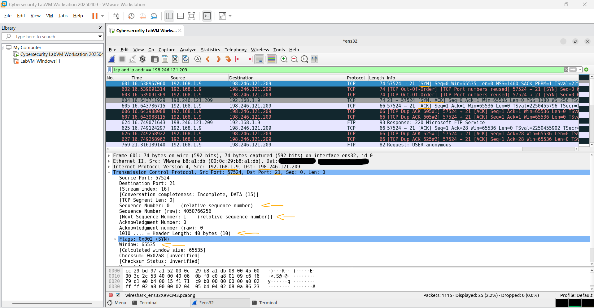
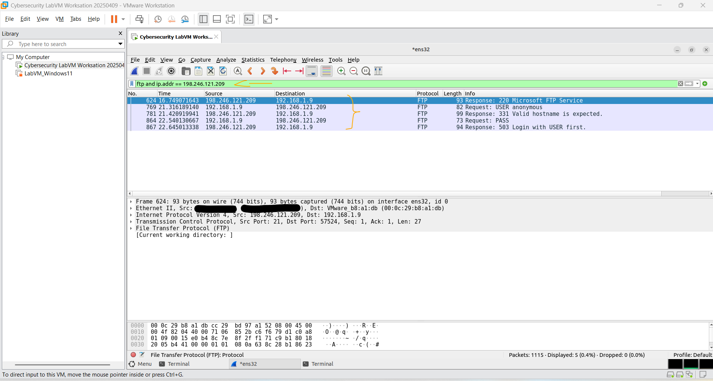
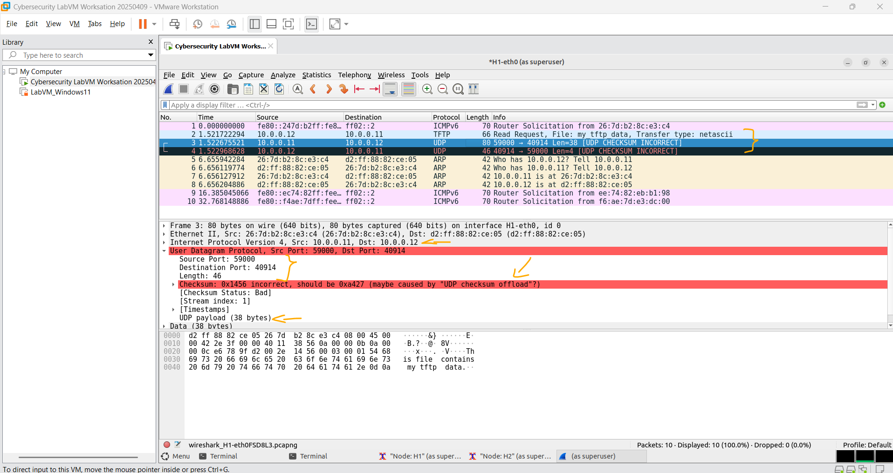

# Laboratório - Usando o Wireshark para Examinar Capturas FTP e TFTP   

### Cisco: <a href="../../../">cisco   </a>
### Cisco Networking Academy: cna   </a>
### Training Category: <a href="../../../labs/">labs</a>
### Software/Subject: wireshark   </a>
### Course: <a href="./">lab_047 (Laboratório - Usando o Wireshark para Examinar Capturas FTP e TFTP)   </a>

---

### Theme:
- Network

### Used Tools:
- Operating System (OS): 
  - Windows 11 
- Virtualization:
  - VMWare Workstation   
- Cloud Services:
  - Google Drive 
- Language:
  - HTML   
  - Markdown   
- Integrated Development Environment (IDE) and Text Editor:
  - Visual Studio Code (VS Code)   
- Versioning: 
  - Git   
- Repository:
  - GitHub   
- Network:
  - ftp   
  - Mininet   
  - tftp   
  - Wireshark   
- Cibersecurity:
  - Cisco CyberOps Workstation   

---

<h3><a name="item00">Course Strcuture:</a></h3>

1. <a href="#item01">Parte 1: Identificar os Campos do Cabeçalho e a Operação TCP Usando uma Captura de Sessão FTP do Wireshark</a> 
  1.1 <a href="#item01.01">Etapa 1: Iniciar uma captura do Wireshark.</a> 
  1.2 <a href="#item01.02">Etapa 2: Baixar o arquivo Readme (Leiame).</a> 
  1.3 <a href="#item01.03">Etapa 3: Parar a captura do Wireshark.</a> 
  1.4 <a href="#item01.04">Etapa 4: Exibir a janela principal do Wireshark.</a> 
  1.5 <a href="#item01.05">Etapa 5: Analisar os campos TCP.</a> 
2. <a href="#item02">Parte 2: Identificar os Campos do Cabeçalho e a Operação UDP Usando uma Captura de Sessão TFTP do Wireshark</a> 
  2.1 <a href="#item02.01">Etapa 1: Inicie o serviço Mininet e tftpd.</a> 
  2.2 <a href="#item02.02">Etapa 2: Crie um arquivo para transferência tftp.</a> 
  2.3 <a href="#item02.03">Etapa 3: Capturar uma sessão TFTP no Wireshark</a> 
  2.4 <a href="#item02.04">Etapa 4: Limpeza</a> 
3. <a href="#item03">Perguntas para reflexão</a> 

---

### Objective:
O objetivo deste laboratório foi analisar capturas de tráfego FTP entre a máquina virtual **CyberOps Workstation** e um servidor remoto, bem como tráfego TFTP em uma rede local provisionada pelo **Mininet**. O propósito foi compreender o comportamento desses protocolos e observar como utilizam diferentes protocolos da camada de transporte, TCP e UDP.

### Folder Structure:
- [README.md](./README.md): Este documento de README, escrito em **Markdown**, com o conteúdo do laboratório.
- [0-aux](./0-aux/): Pasta auxiliar com imagens utilizadas na construção dos arquivos de README desse curso.

### Development:

<a name="item01"><h4>1. Parte 1: Identificar os Campos do Cabeçalho e a Operação TCP Usando uma Captura de Sessão FTP do Wireshark</h4></a>[Back to summary](#item00)

Na Parte 1, use o Wireshark para capturar uma sessão FTP e inspecionar os campos do cabeçalho TCP.

<a name="item01.01"><h4>1.1 Etapa 1: Iniciar uma captura do Wireshark.</h4></a>[Back to summary](#item00)

- a. Inicie e faça login na VM CyberOps Workstation. Abra uma janela de terminal e inicie o Wireshark. O e comercial (&) envia o processo para o plano de fundo e permite que você continue trabalhando no mesmo terminal.
  - `wireshark &`.
- b. Inicie uma captura Wireshark para a interface enp0s3.
- c. Abra outra janela de terminal para acessar um site ftp externo. Digite `ftp ftp.cdc.gov` no prompt. Efetue login no site FTP do Centro de Controle e Prevenção de Doenças (CDC) com o usuário anonymous e nenhuma senha.
  - `ftp ftp.cdc.gov` -> `anonymous`.

<a name="item01.02"><h4>1.2 Etapa 2: Baixar o arquivo Readme (Leiame).</h4></a>[Back to summary](#item00)

- a. Digite o comando ls para listar os arquivos, em seguida, localize e baixe o arquivo Readme (Leiame).
  - `ls`.
- a. Observação: Você pode receber as seguintes mensagens. Se isso acontecer, então o servidor FTP está inativo no momento. No entanto, você pode prosseguir com o resto do laboratório analisando os pacotes que você foi capaz de capturar e ler junto para pacotes que você não capturou. Você também pode retornar ao laboratório mais tarde para ver se o servidor FTP está de backup. 
- b. Digite o comando `get Readme` para baixar o arquivo. Quando o download do arquivo estiver completo, digite o comando `quit` para sair. (Observação: se você não conseguir fazer o download do arquivo, você pode prosseguir com o resto do laboratório.) 
  - `get Readme`.
- c. Após a conclusão da transferência, digite quit para sair do ftp.
  - `quit`.

<a name="item01.03"><h4>1.3 Etapa 3: Parar a captura do Wireshark.</h4></a>[Back to summary](#item00)

O Wireshark foi acessado e a captura foi encerrada.

<a name="item01.04"><h4>1.4 Etapa 4: Exibir a janela principal do Wireshark.</h4></a>[Back to summary](#item00)

- a. O Wireshark capturou muitos pacotes durante a sessão FTP com ftp.cdc.gov. Para limitar a quantidade de dados para análise, aplique o filtro tcp e ip.addr == 198.246.117.106 e clique em Apply.
  - `tcp.flags.syn == 1 and tcp.flags.ack == 0` -> `tcp and ip.addr == 198.246.121.209`.
- a. Nota: O endereço IP, 198.246.117.106, é o endereço de ftp.cdc.gov na época em que este laboratório foi criado. O endereço IP pode ser diferente para você. Se assim for, procure o primeiro pacote TCP que iniciou o handshake de 3 vias com ftp.cdc.gov. O endereço IP de destino é o endereço IP que você deve usar para o filtro.
- a. Observação: sua interface Wireshark pode parecer um pouco diferente da imagem acima.

<a name="item01.05"><h4>1.5 Etapa 5: Analisar os campos TCP.</h4></a>[Back to summary](#item00)

- a. Depois que o filtro TCP foi aplicado, os três primeiros pacotes (seção superior) exibem a sequência de [SYN], [SYN, ACK] e [ACK] que é o handshake de três vias TCP. 
- b. O TCP é comumente usado durante uma sessão para controlar a entrega de datagramas, verificar a chegada de datagramas e gerenciar o tamanho da janela. Em cada troca de dados entre o cliente FTP e o servidor FTP, uma nova sessão TCP é iniciada. Com a conclusão da transferência de dados, a sessão TCP é fechada. Quando a sessão FTP é finalizada, o TCP desempenha ordenadamente um fechamento e um término.
- c. No Wireshark, as informações detalhadas do TCP estão disponíveis no painel de detalhes do pacote (seção do meio). Realce o primeiro datagrama TCP do computador host e expanda as partes do datagrama TCP, conforme mostrado abaixo.
- d. O datagrama TCP expandido é semelhante ao painel de detalhes do pacote, conforme mostrado abaixo. A imagem acima é um diagrama de um datagrama TCP. Uma explicação de cada campo é fornecida para referência: 
  - O TCP Source Port Number (Número da porta TCP origem) pertence ao host da sessão TCP que abriu uma conexão. O valor é geralmente um valor aleatório acima de 1.023.
  - O TCP Destination Port Number (Número da porta TCP destino) é usado para identificar o protocolo de camada superior ou aplicação no site remoto. Os valores no intervalo 0-1.023 representam as “portas bem conhecidas” e estão associados a serviços e aplicações populares (conforme descrito na RFC 1700, tais como Telnet, FTP e HTTP). A combinação do endereço IP de origem, porta de origem, endereço IP de destino e porta de destino identifica de forma exclusiva a sessão para o remetente e o destinatário. Observação: na captura do Wireshark acima, a porta de destino é 21, que é FTP. Os servidores FTP ouvem a porta 21 para conexões de clientes FTP.
  - O Sequence number (Número de sequência) especifica o número do último octeto em um segmento.
  - O Acknowledgment number (Número de confirmação) especifica o próximo octeto esperado pelo destinatário.
  - Os Code bits (Bits de Código) possuem um significado especial no gerenciamento de sessão e no tratamento de segmentos. Entre valores interessantes estão:
    - ACK: Confirmação de recebimento de segmento.
    - SYN: Sincronizar, apenas definido quando uma nova sessão TCP é negociada durante o handshake TCP de três vias.
    - FIN: Concluir, a solicitação para fechar a sessão TCP.
  - O Window size (Tamanho da Janela) é o valor da janela deslizante. Ele determina quantos octetos podem ser enviados antes de se esperar por uma confirmação.
  - O Urgent pointer (Ponteiro de Urgência) só é usado com um flag URG (Urgente) quando o remetente precisa enviar dados urgentes ao destinatário. 
  - As Opções têm apenas uma opção atualmente e estão definidas como o tamanho máximo de segmento TCP (valor opcional).
- e. Usando a captura do Wireshark da primeira inicialização da sessão TCP (bit SYN em 1), preencha as informações sobre o cabeçalho TCP. Alguns campos podem não se aplicar a este pacote. Da VM para o servidor CDC (apenas o bit SYN é definido como 1).

#### Tabela 1

| Descrição | Resultados Wireshark |
| :---: | :---: |
| Endereço IP origem | 192.168.1.9 |
| Endereço IP destino | 198.246.121.209 |
| Número da porta de origem | 57524 |
| Número da porta de destino | 21 |
| Número de sequência | 0 |
| Número de confirmação | 1 |
| Tamanho do cabeçalho | 40 bytes |
| Tamanho da janela | 65535 bytes |

A imagem 01 mostra a captura dos pacotes da conexão FTP que iniciaram o handshake de três vias, destacando os detalhes do primeiro pacote da comunicação.

<figure>
     
    <figcaption>Imagem 01.</figcaption>
</figure>
 

- f. Na segunda captura filtrada do Wireshark, o servidor FTP do CDC reconhece a solicitação da VM. Observe os valores dos bits SYN e ACK. Preencha as seguintes informações com relação à mensagem de SYN-ACK.

#### Tabela 2

| Descrição | Resultados Wireshark |
| :---: | :---: |
| Endereço IP origem | 198.246.121.209 |
| Endereço IP destino | 192.168.1.9 |
| Número da porta de origem | 21 |
| Número da porta de destino | 57524 |
| Número de sequência | 0 |
| Número de confirmação | 1 |
| Tamanho do cabeçalho | 40 bytes |
| Tamanho da janela | 65535 bytes |

- g. No estágio final da negociação para estabelecer a comunicação, a VM envia uma mensagem de confirmação ao servidor. Observe que apenas o bit ACK está definido como 1 e o número de sequência foi incrementado para 1. Preencha as seguintes informações com relação à mensagem de ACK.

#### Tabela 3

| Descrição | Resultados Wireshark |
| :---: | :---: |
| Endereço IP origem | 192.168.1.9 |
| Endereço IP destino | 198.246.121.209 |
| Número da porta de origem | 57524 |
| Número da porta de destino | 21 |
| Número de sequência | 1 |
| Número de confirmação | 1 |
| Tamanho do cabeçalho | 32 bytes |
| Tamanho da janela | 65536 bytes |

- g. Quantos outros datagramas TCP continham um bit SYN?
  - Dois outros datagramas TCP continham o bit SYN (pacotes 602 e 603), que parecem ser retransmissões do SYN inicial.
- h. Após uma sessão TCP ser estabelecida, o tráfego FTP pode ocorrer entre o computador e o servidor FTP. O cliente e o servidor FTP se comunicam, sem saber que o TCP possui o controle e o gerenciamento sobre a sessão. Quando o servidor FTP envia uma Response: 220 ao cliente FTP, a sessão TCP no cliente FTP envia uma confirmação à sessão TCP no servidor. Essa sequência é visível na captura do Wireshark abaixo.
- i. Com a finalização da sessão FTP, o cliente FTP envia um comando “quit”. O servidor FTP confirma o término do FTP com Response: 221 Goodbye. Neste momento, a sessão TCP do servidor FTP envia um datagrama TCP ao cliente FTP, anunciando o término da sessão TCP. A sessão TCP do cliente FTP confirma o recebimento do datagrama de término, então, envia seu próprio término da sessão TCP. Quando o originador do término TCP (o servidor FTP) recebe um término duplicado, um datagrama ACK é enviado para confirmar o término e a sessão TCP é fechada. Essa sequência é visível na captura e no diagrama abaixo. 
- j. Ao aplicar um filtro ftp, toda a sequência do tráfego FTP pode ser examinada no Wireshark. Observe a sequência dos eventos durante esta sessão FTP. O nome de usuário anonymous foi usado para recuperar o arquivo Readme (Leia-me). Quando a transferência for concluída, o usuário terá concluído a sessão FTP.
- k. Aplique o filtro TCP novamente no Wireshark para examinar o término da sessão TCP. Quatro pacotes são transmitidos para o encerramento da sessão TCP. Como a conexão TCP é full duplex, cada direção deve terminar de forma independente. Examine os endereços origem e destino.
- l. Neste exemplo, o servidor FTP não tem mais dados para enviar na transmissão. Envia um segmento com o flag FIN ligado no quadro 149. O computador envia uma ACK para confirmar o recebimento do FIN para terminar a sessão do servidor com o cliente no quadro 150.
- m. No quadro 151, o computador envia um FIN para o servidor FTP para terminar a sessão TCP. O servidor FTP responde com um ACK para confirmar o FIN do computador no quadro 152. Agora a sessão TCP é encerrada entre o servidor FTP e o PC.

A imagem 02 exibe os pacotes FTP, após o handshake estabelecido. Contudo, não foi possível autenticar no servidor FTP, pois o mesmo não aceita mais login anônimo.

<figure>
     
    <figcaption>Imagem 02.</figcaption>
</figure>
 

<a name="item02"><h4>2. Parte 2: Identificar os Campos do Cabeçalho e a Operação UDP Usando uma Captura de Sessão TFTP do Wireshark</h4></a>[Back to summary](#item00)

Na Parte 2, use o Wireshark para capturar uma sessão TFTP e inspecionar os campos do cabeçalho UDP.

<a name="item02.01"><h4>2.1 Etapa 1: Inicie o serviço Mininet e tftpd.</h4></a>[Back to summary](#item00)

- a. Inicie a Mininet. Digite `cyberops` como a senha quando solicitado.
  - `cyberops` -> `sudo lab.support.files/scripts/cyberops_topo.py`.
- b. Inicie H1 e H2 no mininet>prompt.
  - `xterm H1 H2`.
- c. Na janela do terminal H1, inicie o servidor tftpd usando o script fornecido.
  - `/home/analyst/lab.support.files/scripts/start_tftpd.sh`.

<a name="item02.02"><h4>2.2 Etapa 2: Crie um arquivo para transferência tftp.</h4></a>[Back to summary](#item00)

- a. Crie um arquivo de texto no prompt de terminal H1 na pasta /srv/tftp/.
  - `echo "This file contains my tftp data." > /srv/tftp/my_tftp_data`.
- b. Verifique se o arquivo foi criado com os dados desejados na pasta.
  - `cat /srv/tftp/my_tftp_data`.
- c. Por causa da medida de segurança para este servidor tftp específico, o nome do arquivo de recebimento já precisa existir. Em H2, crie um arquivo chamado my_tftp_data.
  - `touch my_tftp_data`.

<a name="item02.03"><h4>2.3 Etapa 3: Capturar uma sessão TFTP no Wireshark</h4></a>[Back to summary](#item00)

- a. Inicie o Wireshark em H1.
  - `wireshark &`.
- b. No menu Edit, escolha Preferences e clique na seta para expandir Protocols. Role para baixo e selecione UDP. Clique na caixa de seleção Validar a soma de verificação UDP se possível e clique em OK.
- c. Inicie uma captura Wireshark na interface H1-eth0.
- d. Inicie uma sessão tftp do H2 para o servidor tftp em H1 e obtenha o arquivo my_tftp_data.
  - `tftp 10.0.0.11 -c get my_tftp_data`.
- e. Parar a captura do Wireshark. Defina o filtro como tftp e clique em Apply. Use os três pacotes TFTP para preencher a tabela e responder às perguntas no resto do laboratório.
- e. Informações detalhadas do UDP estão disponíveis no painel de detalhes do pacote do Wireshark. Destaque o primeiro datagrama UDP enviado pelo host e mova o cursor do mouse para o painel de detalhes do pacote. Pode ser necessário ajustar o painel de detalhes do pacote e expandir o registro UDP clicando na caixa de expansão do protocolo. O datagrama UDP expandido deve ser semelhante ao diagrama abaixo. 
- f. A figura a seguir é um diagrama do datagrama UDP. As informações de cabeçalho são escassas, em comparação ao datagrama TCP. Assim como o TCP, cada datagrama UDP é identificado pela porta de origem UDP e pela porta de destino UDP. 
- g. Usando a captura Wireshark do primeiro datagrama UDP, preencha as informações sobre o cabeçalho UDP. O valor de checksum é um valor hexadecimal (base 16), denotado pelo código precedente 0x.

#### Tabela 4

| Descrição | Resultados Wireshark |
| :---: | :---: |
| Endereço IP origem | 10.0.0.12 |
| Endereço IP destino | 10.0.0.11 |
| Número da porta de origem | 40914 |
| Número da porta de destino | 69 |
| Tamanho da mensagem UDP | 32 bytes |
| Checksum UDP | 0x3b3b |

- g. Como o UDP verifica a integridade do datagrama?
  - O UDP verifica a integridade do datagrama utilizando um checksum presente no cabeçalho. Esse valor permite detectar erros que possam ter ocorrido durante a transmissão dos dados.
- h. Examine o primeiro quadro retornado pelo servidor tftpd. Preencha as informações sobre o cabeçalho UDP.

#### Tabela 5

| Descrição | Resultados Wireshark |
| :---: | :---: |
| Endereço IP origem | 10.0.0.11 |
| Endereço IP destino | 10.0.0.12 |
| Número da porta de origem | 59000 |
| Número da porta de destino | 40914 |
| Tamanho da mensagem UDP | 38 bytes |
| Checksum UDP | 0x1456 |

- i. Note que o datagrama UDP de retorno tem uma porta de origem UDP diferente, mas esta porta de origem é usada para o restante da transferência TFTP. Por não haver conexão confiável, somente a porta de origem original usada para iniciar a sessão TFTP é usada para manter a transferência TFTP.
- j. Observe também que o checksum UDP está incorreto. Isso é causado provavelmente pelo checksum offload UDP. Você pode saber mais sobre por que isso acontece pesquisando por "checksum offload UDP”.
  - O UDP checksum offload é um recurso em que a placa de rede (NIC) calcula o checksum em vez do sistema operacional. Por isso, o Wireshark pode mostrar o checksum como incorreto, pois a captura ocorre antes do cálculo final ser feito pela placa de rede.

A imagem 03 mostra o segundo quadro retornado pelo servidor TFTP.

<figure>
     
    <figcaption>Imagem 03.</figcaption>
</figure>
 

<a name="item02.04"><h4>2.4 Etapa 4: Limpeza</h4></a>[Back to summary](#item00)

Nesta etapa, você desligará e limpará a Mininet.

- a. No terminal que iniciou o Mininet, digite quit no prompt.
  - `quit`.
- b. No prompt, digite `sudo mn -c` para limpar os processos iniciados pela Mininet.
  - `sudo mn -c`.

<a name="item03"><h4>3. Perguntas para reflexão</h4></a>[Back to summary](#item00)

- a. Este laboratório proporcionou a oportunidade de analisar operações dos protocolos TCP e UDP das sessões FTP e TFTP capturadas. Como o TCP gerencia a comunicação de forma diferente do UDP?
  - O TCP gerencia a comunicação estabelecendo uma conexão, garantindo a entrega dos dados, controle de erros e ordem dos pacotes. Já o UDP envia os dados sem estabelecer conexão e sem garantia de entrega ou ordenação.