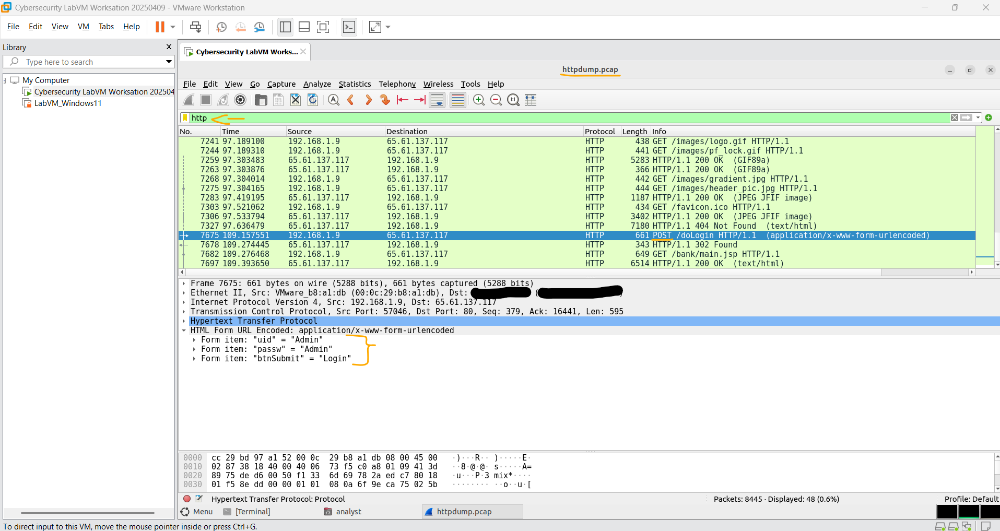
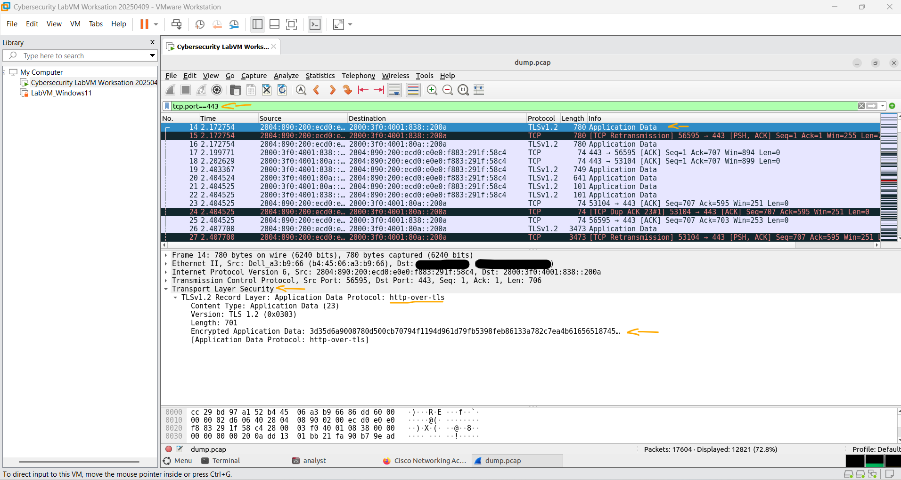

# Laboratório - Usando Wireshark para examinar tráfego HTTP e HTTPS   

### Cisco: <a href="../../../">cisco   </a>
### Cisco Networking Academy: cna   </a>
### Training Category: <a href="../../../labs/">labs</a>
### Software/Subject: wireshark   </a>
### Course: <a href="./">lab_048 (Laboratório - Usando Wireshark para examinar tráfego HTTP e HTTPS)   </a>

---

### Theme:
- Network

### Used Tools:
- Operating System (OS): 
  - Windows 11 
- Virtualization:
  - VMWare Workstation   
- Cloud Services:
  - Google Drive 
- Language:
  - HTML   
  - Markdown   
- Integrated Development Environment (IDE) and Text Editor:
  - Visual Studio Code (VS Code)   
- Versioning: 
  - Git   
- Repository:
  - GitHub   
- Network:
  - tcpdump   
  - Wireshark   
- Cibersecurity:
  - AltoroMutual   
  - Cisco CyberOps Workstation   

---

<h3><a name="item00">Course Strcuture:</a></h3>

1. <a href="#item01">Parte 1: Capturar e visualizar tráfego HTTP</a> 
  1.1 <a href="#item01.01">Etapa 1: Inicie a máquina virtual e faça login.</a> 
  1.2 <a href="#item01.02">Etapa 2: Abra um terminal e inicie o tcpdump.</a> 
  1.3 <a href="#item01.03">Etapa 3: Exiba a captura HTTP.</a> 
2. <a href="#item02">Parte 2: Capture e visualize o tráfego HTTPS</a> 
  2.1 <a href="#item02.01">Etapa 1: Inicie o tcpdump dentro de um terminal.</a> 
  2.2 <a href="#item02.02">Etapa 2: Exiba a captura HTTPS.</a> 
3. <a href="#item03">Perguntas para reflexão</a> 

---

### Objective:
Este laboratório teve como objetivo capturar e analisar tráfego HTTP e HTTPS utilizando as ferramentas **tcpdump** e **Wireshark** na máquina virtual **Cisco CyberOps Workstation**, a fim de compreender as diferenças entre comunicações não criptografadas e criptografadas.

### Folder Structure:
- [README.md](./README.md): Este documento de README, escrito em **Markdown**, com o conteúdo do laboratório.
- [0-aux](./0-aux/): Pasta auxiliar com imagens utilizadas na construção dos arquivos de README desse curso.

### Development:

<a name="item01"><h4>1. Parte 1: Capturar e visualizar tráfego HTTP</h4></a>[Back to summary](#item00)

Nesta parte, você usará tcpdump para capturar o conteúdo do tráfego HTTP. Você usará as opções de comando para salvar o tráfego em um arquivo de captura de pacote (pcap). Esses registros podem ser analisados usando diferentes aplicativos que lêem arquivos pcap, incluindo Wireshark.

<a name="item01.01"><h4>1.1 Etapa 1: Inicie a máquina virtual e faça login.</h4></a>[Back to summary](#item00)

- a. Inicie a VM CyberOps Workstation. Use as seguintes credenciais de usuário:
  - Username: `analyst`.
  - Password: `cyberops`.

<a name="item01.02"><h4>1.2 Etapa 2: Abra um terminal e inicie o tcpdump.</h4></a>[Back to summary](#item00)

- a. Abra um aplicativo de terminal e digite o comando `ip address`.
  - `ip address`.
- b. Liste as interfaces e seus endereços IP exibidos na saída do ip address.
- c. Enquanto estiver no aplicativo de terminal, digite o comando `sudo tcpdump -i enp0s3 -s 0 -w httpdump.pcap`. Insira as `cyberops` de senha para o analista de usuário quando solicitado.
  - `sudo tcpdump -i ens32 -s 0 -w httpdump.pcap` -> `cyberops`.
- c. Este comando inicia o tcpdump e registra o tráfego de rede na interface enp0s3. A opção de comando -i permite especificar a interface. Se não for especificado, o tcpdump capturará todo o tráfego em todas as interfaces.
- c. A opção de comando -s especifica o comprimento do instantâneo para cada pacote. Você deve limitar snaplen ao menor número que irá capturar as informações do protocolo em que você está interessado. Definir snaplen como 0 define-o para o padrão de 262144, para compatibilidade com versões anteriores recentes do tcpdump.
- c. A opção de comando -w é usada para gravar o resultado do comando tcpdump em um arquivo. Adicionar a extensão .pcap garante que os sistemas operacionais e aplicativos serão capazes de ler em arquivo. Todo o tráfego gravado será impresso no arquivo httpdump.pcap no diretório home do analista do usuário.
- c. Use as páginas de manual para tcpdump para determinar o uso das opções de comando -s e -w. 
- d. Abra um navegador da Web a partir da barra de inicialização dentro da VM CyberOps Workstation. Navegue até http://www.altoromutual.com/login.jsp (outra opção é o http://demo.testfire.net/login.jsp). Como este site usa HTTP, o tráfego não é criptografado. Clique no campo Senha para ver o pop-up de aviso.
- e. Digite um nome de usuário de Admin com uma senha de Admin e clique em Login.
- f. Feche o navegador da Web.
- g. Retorne à janela do terminal onde o tcpdump está sendo executado. Digite CTRL+C para interromper a captura de pacotes.

<a name="item01.03"><h4>1.3 Etapa 3: Exiba a captura HTTP.</h4></a>[Back to summary](#item00)

O tcpdump, executado na etapa anterior, imprimiu a saída para um arquivo chamado httpdump.pcap. Este arquivo está localizado no diretório home do usuário analyst.
- a. Clique no ícone Gerenciador de arquivos na área de trabalho e navegue até a pasta pessoal do usuário analyst. Clique duas vezes no arquivo httpdump.pcap, na caixa de diálogo Abrir com role para baixo até Wireshark e clique em Open.
- b. No aplicativo Wireshark, filtre para http e clique em Apply.
- c. Navegue pelas diferentes mensagens HTTP e selecione a mensagem POST.
- d. Na janela inferior, a mensagem é exibida. Expanda a seção HTML Form URL Encoded: application/x-www-form-urlencoded. Quais são as duas informações exibidas?
  - São exibidas três informações no formulário: uid = Admin, passw = Admin e btnSubmit = Login, que correspondem ao usuário, à senha e ao botão de envio do formulário.
- e. Feche o aplicativo Wireshark.

A imagem 01 ilustra a captura dos pacotes HTTP, destacando a requisição que utiliza o método POST.

<figure>
     
    <figcaption>Imagem 01.</figcaption>
</figure>
 

<a name="item02"><h4>2. Parte 2: Capture e visualize o tráfego HTTPS</h4></a>[Back to summary](#item00)

Agora você usará tcpdump a partir da linha de comando de uma estação de trabalho Linux para capturar tráfego HTTPS. Depois de iniciar o tcpdump, você gerará tráfego HTTPS enquanto o tcpdump registra o conteúdo do tráfego de rede. Esses registros serão novamente analisados usando Wireshark.

<a name="item02.01"><h4>2.1 Etapa 1: Inicie o tcpdump dentro de um terminal.</h4></a>[Back to summary](#item00)

- a. Enquanto estiver no aplicativo de terminal, digite o comando `sudo tcpdump -i enp0s3 -s 0 -w dump.pcap`. Insira as `cyberops` de senha para o analista de usuário quando solicitado.
  - `sudo tcpdump -i ens32 -s 0 -w dump.pcap`.
- a. Este comando iniciará o tcpdump e registrará o tráfego de rede na interface enp0s3 da estação de trabalho Linux. Se a sua interface for diferente do enp0s3, modifique-a ao usar o comando acima.
- a. Todo o tráfego registrado será impresso no arquivo dump.pcap no diretório home do usuario analyst.
- b. Abra um navegador da Web a partir da barra de inicialização dentro da VM CyberOps Workstation. Navegue para www.netacad.com. Observação: se você receber uma página da Web “Falha na conexão segura”, provavelmente significa que a data e a hora estão incorretas. Atualize o dia e a hora com o seguinte comando, alterando para o dia e hora atuais:
  - `data sudo -s “12 MAIO 2020 21:38:20`.
- b. O que você percebe sobre o URL do site?
  - O URL utiliza o protocolo HTTPS, indicando que a conexão é segura e que o tráfego entre o navegador e o site é criptografado.
- c. Clique em login.
- d. Digite seu nome de usuário e senha do NetAcad. Clique em Avançar.
- e. Feche o navegador da web na máquina virtual.
- f. Retorne à janela do terminal onde o tcpdump está sendo executado. Digite CTRL+C para interromper a captura de pacotes.

<a name="item02.02"><h4>2.2 Etapa 2: Exiba a captura HTTPS.</h4></a>[Back to summary](#item00)

O tcpdump executado na Etapa 1 imprimiu a saída para um arquivo chamado dump.pcap. Este arquivo está localizado no diretório home do usuario analyst.
- a. Clique no ícone Sistema de arquivos na área de trabalho e navegue até a pasta pessoal do usuári analyst Abra o arquivo dump.pcap.
- b. No aplicativo Wireshark, expanda a janela de captura verticalmente e filtre pelo tráfego HTTPS pela porta 443. Digite tcp.port==443 como um filtro e clique em Apply.
  - `tcp.port==443`.
- c. Navegue pelas diferentes mensagens HTTPS e selecione uma mensagem Application Data.
- d. Na janela inferior, a mensagem é exibida. O que substituiu a seção HTTP que estava no arquivo de captura anterior?
  - A seção HTTP foi substituída por Transport Layer Security (TLS), indicando que os dados da comunicação estão criptografados.
- e. Expanda completamente a seção Secure Sockets Layer.
- f. Clique nos Encrypted Application Data. Os dados do aplicativo estão em um formato de texto simples ou legível?
  - Não. Os dados estão criptografados e não podem ser lidos em texto simples.
- g. Feche todas as janelas e desligue a máquina virtual.

A imagem 02 exibe a captura de pacotes HTTP sobre TLS (HTTPS), mostrando que os dados da comunicação estão criptografados.

<figure>
     
    <figcaption>Imagem 02.</figcaption>
</figure>
 

<a name="item03"><h4>3. Perguntas para reflexão</h4></a>[Back to summary](#item00)

- a. Quais são as vantagens de usar HTTPS em vez de HTTP?
  - O HTTPS utiliza criptografia para proteger os dados transmitidos entre o cliente e o servidor, garantindo confidencialidade e integridade das informações. Isso reduz o risco de interceptação ou alteração dos dados durante a comunicação.
- b. Todos os sites que usam HTTPS são considerados confiáveis?
  - Não. O HTTPS apenas garante que a comunicação é criptografada, mas não assegura que o site seja legítimo ou seguro contra golpes ou conteúdos maliciosos.