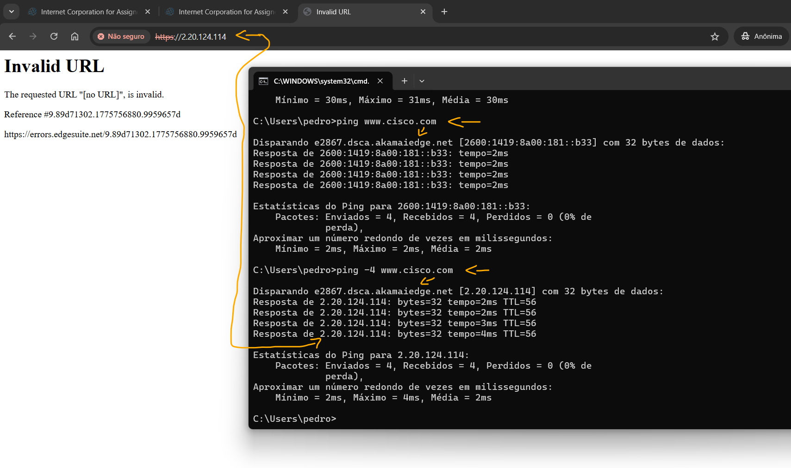
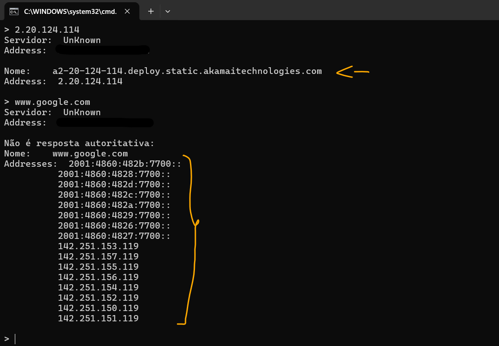
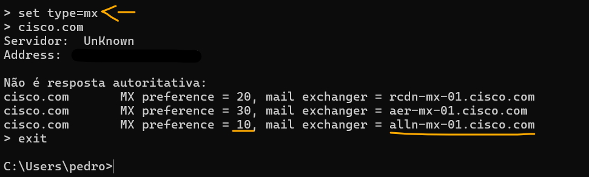

# Laboratório - Observe a resolução DNS   

### Cisco: <a href="../../../">cisco   </a>
### Cisco Networking Academy: cna   </a>
### Training Category: <a href="../../../labs/">labs</a>
### Software/Subject: network   </a>
### Course: <a href="./">lab_052 (Laboratório - Observe a resolução DNS)   </a>

---

### Theme:
- Network

### Used Tools:
- Operating System (OS): 
  - Windows 11 
- Cloud Services:
  - Google Drive 
- Language:
  - HTML   
  - Markdown   
- Integrated Development Environment (IDE) and Text Editor:
  - Visual Studio Code (VS Code)   
- Versioning: 
  - Git   
- Repository:
  - GitHub   
- Network:
  - nslookup   
  - ping   

---

<h3><a name="item00">Course Strcuture:</a></h3>

1. <a href="#item01">Parte 1: Observar a conversão DNS de uma URL para um Endereço IP</a> 
2. <a href="#item02">Parte 2: Observar a Pesquisa DNS Usando o Comando nslookup em um Site</a> 
3. <a href="#item03">Parte 3: Observar a Pesquisa DNS Usando o Comando nslookup em Servidores de E-mail</a> 
4. <a href="#item04">Perguntas para reflexão</a> 

---

### Objective:
O objetivo deste laboratório foi utilizar a ferramenta nslookup para analisar o processo de resolução de nomes de domínio (DNS). A prática permitiu compreender a tradução entre nomes de domínio e endereços IP, explorar consultas de registros de recursos específicos — como os registros MX para identificação de servidores de e-mail — e verificar o funcionamento da resolução reversa e da infraestrutura de redundância em ambientes de CDNs e ISPs.

### Folder Structure:
- [README.md](./README.md): Este documento de README, escrito em **Markdown**, com o conteúdo do laboratório.
- [0-aux](./0-aux/): Pasta auxiliar com imagens utilizadas na construção dos arquivos de README desse curso.

### Development:

<a name="item01"><h4>1. Parte 1: Observar a conversão DNS de uma URL para um Endereço IP</h4></a>[Back to summary](#item00)

- a. Abra um prompt de comando do Windows.
- b. No prompt de comando, efetue ping na URL do Internet Corporation for Assigned Names and Numbers (ICANN) em www.icann.org. O ICANN coordena o DNS, endereços IP, gerenciamento do sistema de nomes de domínio de nível superior e as funções de gerenciamento do sistema dos servidores raiz. O computador deve converter www.icann.org em um endereço IP para saber para onde enviar os pacotes do protocolo ICMP.
  - `ping www.icann.org`.
- b. A primeira linha da saída exibe www.icann.org convertido em um endereço IP pelo DNS. Você poderá ver o efeito do DNS, mesmo se a instituição tiver um firewall que impeça a execução de ping, ou se o servidor de destino impedir que você efetue ping no servidor Web.
- b. Observação: se o nome de domínio for resolvido para um endereço IPv6, use o comando ping -4 www.icann.org se desejar a tradução para um endereço IPv4.
  - `ping -4 www.icann.org`.
- c. Digite o endereço IPv4 da etapa b em um navegador Web, em vez da URL.
  - A página não carregou porque o IP pertence à Cloudflare (CDN) e não ao servidor de origem da ICANN. Como a Cloudflare utiliza IPs compartilhados para múltiplos clientes, ela bloqueia o acesso direto via IP por segurança e pela ausência do cabeçalho Host HTTP, que é essencial para identificar qual site deve ser entregue.
- c. Digite https://192.0.32.7 no navegador da Web. Se o computador tiver um endereço IPv6, você poderá inserir o endereço IPv6 https://2620:0:2d0:200::7 no navegador da Web.
  - `https://192.0.32.7` -> `https://[2620:0:2d0:200::7]`.
- d. Observe que a página inicial da ICANN na web é exibida sem o uso do DNS. A maioria dos seres humanos acha mais fácil lembrar palavras, em vez de números. Se você disser a 
alguém para ir para www.icann.org, é provável que se lembrem disso. Se você dissesse para irem para 192.0.32.7, teriam dificuldade para lembrar um endereço IP. Os computadores processam números. O DNS é o processo de conversão de palavras em números. Além disso, há uma segunda tradução que ocorre. Os seres humanos pensam em números na base 10. Os computadores processam os números na base 2. O endereço IP 192.0.32.7 na base 10 em números na base 2 é 11000000.00000000.00100000.00000111. O que acontece se você recortar e colar esses números na base 2 em um navegador? 
  - O navegador não exibe a página e, em vez disso, realiza uma pesquisa na web ou apresenta um erro. Isso ocorre porque os navegadores não são programados para reconhecer representações textuais de números binários (zeros e uns) como endereços válidos. Eles aceitam apenas nomes de domínio (DNS) ou endereços IP em formato decimal (IPv4) e hexadecimal (IPv6). O binário é a linguagem interna do hardware, mas as aplicações de software esperam formatos padronizados para humanos.
- e. No prompt de linha de comando, digite ping www.cisco.com.
  - `ping www.cisco.com`.
- e. Nota: Se o nome do domínio for resolvido para um endereço IPv6, use o comando ping -4 www.cisco.com para converter em um endereço IPv4, se desejado.
  - `ping -4 www.cisco.com`.
- e. Quando você efetua ping em www.cisco.com, você tem o mesmo endereço IP que o exemplo. Explique.
  - Não. A Cisco utiliza uma infraestrutura de CDN da Akamai, que possui milhares de servidores distribuídos globalmente. O endereço IP retornado pelo DNS é dinâmico e depende da minha localização geográfica e da disponibilidade do servidor mais próximo (Edge Server) no momento da consulta, visando reduzir a latência.
- e. Digite o endereço IP que você obteve quando efetuou ping em www.cisco.com em um navegador. O site é exibido? Explique.
  - Não. O acesso falha porque os IPs obtidos (2.20.124.114 e 2600:1419:8a00:181::b33) pertencem aos nós de borda da Akamai. Esses servidores exigem o cabeçalho Host HTTP (o nome www.cisco.com) para identificar qual site entregar entre os múltiplos domínios hospedados no mesmo IP. Além disso, o protocolo HTTPS bloqueia a conexão por incompatibilidade entre o endereço IP digitado e o nome de domínio registrado no certificado SSL.

A imagem 01 mostra a conclusão da Parte 1.

<figure>
     
    <figcaption>Imagem 01.</figcaption>
</figure>
 

<a name="item02"><h4>2. Parte 2: Observar a Pesquisa DNS Usando o Comando nslookup em um Site</h4></a>[Back to summary](#item00)

- a. No prompt de comando, digite o comando nslookup. Seu resultado será diferente do exemplo.
  - `nslookup`.
- a. Qual é o servidor DNS padrão usado?
  - O servidor DNS padrão é o do ISP (Provedor de Internet) local, configurado automaticamente via DHCP.
- b. Observe como o prompt de comando mudou para um símbolo de maior que (>). Este é o prompt do nslookup. Nesse prompt, você poderá inserir os comandos relacionados ao DNS. No prompt, digite o símbolo ? para ver uma lista de todos os comandos disponíveis que você pode usar no modo nslookup.
  - `?`.
- c. No prompt do nslookup, digite www.cisco.com.
  - `www.cisco.com`.
- c. Qual é o endereço IPv4 traduzido?
  - O endereço IPv4 resolvido é 2.20.124.114. Este não é um IP fixo da Cisco, mas sim um endereço de um servidor de borda (Edge Server) da Akamai (CDN). O domínio www.cisco.com utiliza registros do tipo CNAME (aliases) para apontar para a infraestrutura da Akamai, que entrega o conteúdo a partir do servidor mais próximo da localização da solicitação.
- c. Observação: o endereço IP do local provavelmente será diferente, porque a Cisco usa servidores espelho em vários locais em todo o mundo. É o mesmo que o endereço IP exibido pelo comando ping?
  - Sim. O endereço IP exibido no nslookup é o mesmo do comando ping, pois ambos consultam o cache do DNS local. Como o IP é dinâmico e fornecido pela Akamai (CDN), o valor pode mudar com o tempo, mas em uma mesma sessão de testes, as ferramentas retornam o mesmo destino final.
- c. Em endereços, além do endereço IP 172.230.155.162, existem os seguintes números: 2600:1404:a:395::b33 e 2600:1404:a:38e::b33. O que são?
  - São os endereços IPv6 do servidor de borda da Akamai. Eles são fornecidos em duplicidade para garantir alta disponibilidade e redundância no protocolo IPv6, oferecendo caminhos alternativos caso um dos servidores ou sub-redes do cluster apresente falhas.
- d. No prompt nslookup, digite o endereço IP do servidor web da Cisco que você acabou de encontrar. Você pode usar o nslookup para obter o nome de domínio de um endereço IP, se você não souber a URL. 
  - `2.20.124.114`.
  - O nome retornado foi um host da Akamai (a2-20-124-114.deploy.static.akamaitechnologies.com) e não www.cisco.com. Isso ocorre porque o registro reverso (PTR) identifica o proprietário físico do IP (a CDN Akamai) e não o cliente (Cisco) que utiliza o serviço através de um alias (CNAME).
- d. Você pode usar a ferramenta de nslookup para converter nomes de domínio em endereços IP. Você também pode utilizá-la para converter endereços IP em nomes de domínio. Utilizando a ferramenta nslookup, anote os endereços IP associados a www.google.com.
  - `www.google.com`.
  - Os endereçso associados ao www.google.com são: (2001:4860:482b:7700::, 2001:4860:4828:7700::, 2001:4860:482d:7700::, 2001:4860:482c:7700::, 2001:4860:482a:7700::, 2001:4860:4829:7700::, 2001:4860:4826:7700:: e 2001:4860:4827:7700::) para IPv6 e (142.251.153.119, 142.251.157.119, 142.251.155.119, 142.251.156.119, 142.251.154.119, 142.251.152.119, 142.251.150.119 e 142.251.151.119) para IPv4.

A imagem 02 exibe o resultado da resolução DNS para www.google.com.

<figure>
     
    <figcaption>Imagem 02.</figcaption>
</figure>
 

<a name="item03"><h4>3. Parte 3: Observar a Pesquisa DNS Usando o Comando nslookup em Servidores de E-mail</h4></a>[Back to summary](#item00)

- a. No prompt, digite set type=mx para usar o nslookup para identificar servidores de e-mail.
  - `nslookup` -> `set type=mx`.
- b. No prompt do nslookup, digite cisco.com.
  - `cisco.com`.
- b. Um princípio fundamental de projeto de redes é a redundância (mais de um servidor de e-mail é configurado). Dessa forma, se um dos servidores de e-mail estiver inacessível, o computador que faz a consulta tenta o segundo servidor de e-mail. Os administradores de e-mail determinam qual servidor de e-mail é contatado primeiro usando a preferência MX. O servidor de e-mail com a menor preferência MX é contatado primeiro. Com base na saída acima, que servidor de e-mail será contatado primeiro quando o e-mail é enviado para cisco.com?
  - O servidor que será contatado primeiro é o alln-mx-01.cisco.com. Isso ocorre porque ele possui o menor valor de preferência MX (10), o que indica a maior prioridade na hierarquia de recebimento de e-mails do domínio. Caso ele esteja inacessível, os servidores com preferências 20 e 30 serão utilizados como redundância.
- c. No prompt nslookup, digite exit para voltar ao prompt de comando regular do PC.
  - `exit`.
- d. No prompt de comando do PC, digite ipconfig /all. Escreva os endereços IP de todos os servidores DNS que sua escola usa.
  - `ipconfig /all`.
  - Aparecem quatro endereços IP, todos pertencentes à infraestrutura do ISP. Trata-se de uma configuração de pilha dupla (Dual Stack), fornecendo dois servidores para IPv4 e dois para IPv6. Essa estrutura garante a redundância, permitindo que o sistema utilize um servidor secundário caso o primário fique indisponível, garantindo a continuidade da resolução de nomes.

A imagem 03 exibe a captura desses pacotes.

<figure>
     
    <figcaption>Imagem 03.</figcaption>
</figure>
 

<a name="item04"><h4>4. Perguntas para reflexão</h4></a>[Back to summary](#item00)

- a. Qual é o principal objetivo do DNS?
  - O principal objetivo do DNS (Domain Name System) é converter nomes de domínio amigáveis (como www.google.com) em endereços IP numéricos (como 8.8.8.8), permitindo que os usuários acessem sites e serviços sem precisar memorizar sequências complexas de números. Ele funciona como a "lista telefônica" da internet.