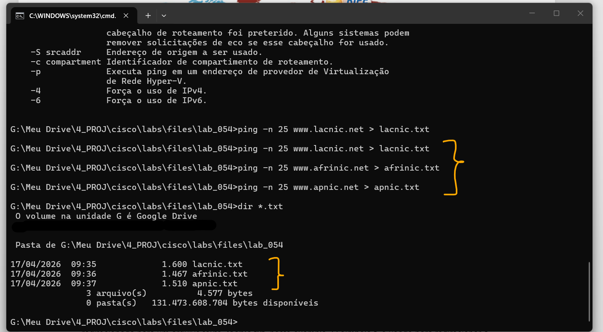
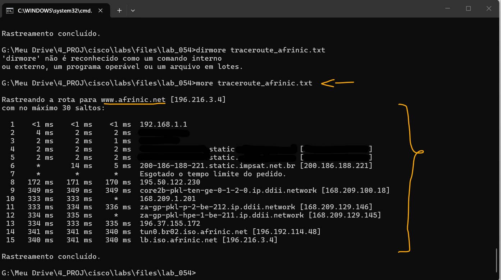
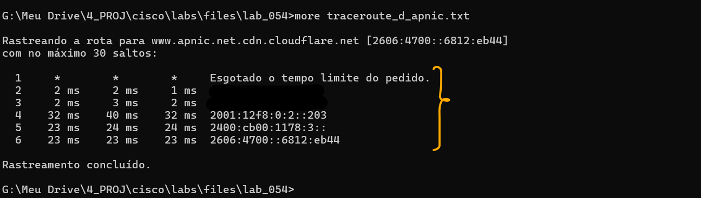

# Laboratório - Teste a latência da rede com ping e traceroute   

### Cisco: <a href="../../../">cisco   </a>
### Cisco Networking Academy: cna   </a>
### Training Category: <a href="../../../labs/">labs</a>
### Software/Subject: network   </a>
### Course: <a href="./">lab_054 (Laboratório - Teste a latência da rede com ping e traceroute)   </a>

---

### Theme:
- Network

### Used Tools:
- Operating System (OS): 
  - Windows 11 
- Cloud Services:
  - Google Drive 
- Language:
  - HTML   
  - Markdown   
- Integrated Development Environment (IDE) and Text Editor:
  - Visual Studio Code (VS Code)   
- Versioning: 
  - Git   
- Repository:
  - GitHub   
- Network:
  - ping   
  - Trace Route (tracert)   

---

<h3><a name="item00">Course Strcuture:</a></h3>

1. <a href="#item01">Parte 1: Usar Ping para Documentar a Latência da Rede</a> 
  1.1 <a href="#item01.01">Etapa 1: Verificar a conectividade.</a> 
  1.2 <a href="#item01.02">Etapa 2: Coletar dados de rede.</a> 
  1.3 <a href="#item01.03">Etapa 3: Verificar a coleta de dados.</a> 
2. <a href="#item02">Parte 2: Usar Traceroute para Documentar a Latência de Rede</a> 
  2.1 <a href="#item02.01">Etapa 1: Usar o comando tracert e gravar as saídas em arquivos texto.</a> 
  2.2 <a href="#item02.02">Etapa 2: Usar o comando more para examinar o caminho traçado.</a> 
3. <a href="#item03">Parte 3: Traceroute estendido</a> 
4. <a href="#item04">Perguntas para reflexão</a> 

---

### Objective:
O objetivo deste laboratório foi realizar testes de latência de rede utilizando os comandos ping e traceroute, demonstrando como essas informações podem ser utilizadas na construção de uma linha de base de desempenho da rede.

### Folder Structure:
- [README.md](./README.md): Este documento de README, escrito em **Markdown**, com o conteúdo do laboratório.
- [0-aux](./0-aux/): Pasta auxiliar com imagens utilizadas na construção dos arquivos de README desse curso.
- Arquivos .txt contendo as saídas dos comandos de teste de latência (ping e tracert).

### Development:

<a name="item01"><h4>1. Parte 1: Usar Ping para Documentar a Latência da Rede</h4></a>[Back to summary](#item00)

Na Parte 1, você analisará a latência da rede de vários sites em diversas partes do mundo. Este processo pode ser usado em uma rede de produção de uma empresa para criar um parâmetro de desempenho.

<a name="item01.01"><h4>1.1 Etapa 1: Verificar a conectividade.</h4></a>[Back to summary](#item00)

- a. Faça ping nos seguintes sites da Regional Internet Registry (RIR) para verificar a conectividade:
  - `ping www.lacnic.net`.
  - `ping www.afrinic.net`.
  - `ping www.apnic.net`.
- a. Observação: devido à falta de resposta de www.ripe.net para as requisições ICMP, ele não pode ser utilizado neste laboratório.
- a. Observação: se os sites forem resolvidos como endereços IPv6, a opção -4 pode ser usada para a resolução como endereços IPv4, se desejar. O comando fica ping -4 www.arin.
net.
  - `ping -4 www.lacnic.net`.
  - `ping -4 www.afrinic.net`.
  - `ping -4 www.apnic.net`.

<a name="item01.02"><h4>1.2 Etapa 2: Coletar dados de rede.</h4></a>[Back to summary](#item00)

Você coletará uma quantidade de dados suficiente para calcular as estatísticas na saída do ping, enviando 25 requisições de eco para cada endereço listado na Etapa 1. Esta etapa pode exigir privilégios administrativos, dependendo do seu sistema operacional. Grave os resultados de cada site em arquivos texto. 

- a. No prompt de comando, digite ping para listar as opções disponíveis.
  - `ping`.
- b. Ao usar o comando ping com a opção de contagem, é possível enviar 25 solicitações de eco para o destino, como é mostrado abaixo. Além disso, isso criará um arquivo texto com o nome do arquivo arin.txt no diretório atual. Esse arquivo texto conterá os resultados das requisições de eco.
  - `ping -n 25 www.lacnic.net > lacnic.txt`.
- b. Observação: o terminal permanece em branco até que o comando seja concluído, porque a saída foi redirecionada para um arquivo texto, lacnic.txt, neste exemplo. O símbolo > é usado para redirecionar a saída da tela para o arquivo e sobrescrevê-lo, caso ele já exista. Se desejar acrescentar mais resultados ao arquivo, substitua > por >> no comando.
- c. Repita o comando ping para os outros sites.
  - `ping -n 25 www.afrinic.net > afrinic.txt`.
  - `ping -n 25 www.apnic.net > apnic.txt`.

<a name="item01.03"><h4>1.3 Etapa 3: Verificar a coleta de dados.</h4></a>[Back to summary](#item00)

- a. Para verificar se os arquivos foram criados, use o comando dir para listar os arquivos no diretório. Os coringas * podem ser usados para filtrar apenas os arquivos texto.
  - `dir *.txt`.
- b. Para ver os resultados no arquivo criado, use o comando more no prompt de comando.
  - `more afrinic.txt`.
  - `more apnic.txt`.
  - `more lacnic.txt`.
- b. Observação: pressione a barra de espaço para exibir o restante do arquivo, ou pressione q para sair. 
- c. Registre seus resultados na tabela a seguir:
- c. Compare os resultados do atraso. Como as localizações geográficas afetam o atraso?
  - Quanto maior a distância física entre os pontos, maior tende a ser a latência, resultando em valores mínimo, médio e máximo mais elevados.

#### Tabela 1 — Planejamento das Sub-redes IPv6

| Site | Mínimo | Máximo | Média |
|:---:|:---:|:---:|:---:|
| www.afrinic.net | 310 | 313 | 310 |
| www.apnic.net | 23 | 80 | 25 |
| www.lacnic.net | 27 | 28 | 27 |

A imagem 01 mostra que os arquivos de teste de conectividade com ping foram criados com sucesso.

<figure>
     
    <figcaption>Imagem 01.</figcaption>
</figure>
 

<a name="item02"><h4>2. Parte 2: Usar Traceroute para Documentar a Latência de Rede</h4></a>[Back to summary](#item00)

As rotas traçadas podem passar por muitos saltos e vários ISPs, dependendo do tamanho dos ISPs e da localização dos hosts de origem e destino. Os comandos traceroute também podem ser usados para observar a latência da rede. Na Parte 2, o comando tracert é usado para traçar o caminho até os mesmos destinos da Parte 1. O comando tracert é a versão Windows do comando traceroute. O comando tracert usa pacotes ICMP TTL Exceed e respostas de eco ICMP para traçar o caminho.

<a name="item02.01"><h4>2.1 Etapa 1: Usar o comando tracert e gravar as saídas em arquivos texto.</h4></a>[Back to summary](#item00)

- a. Copie os comandos a seguir para criar os arquivos traceroute:
  - `tracert www.lacnic.net > traceroute_lacnic.txt`.
  - `tracert www.afrinic.net > traceroute_afrinic.txt`.
  - `tracert www.apnic.net > traceroute_apnic.txt`.
- a. Observação: se os sites forem resolvidos como endereços IPv6, a opção -4 pode ser usada para a resolução como endereços IPv4, se desejar. O comando se torna tracert -4 www.lacnic.net > traceroute_lacnic.txt. 
  - `tracert -4 www.lacnic.net > traceroute_lacnic.txt`.
  - `tracert -4 www.afrinic.net > traceroute_afrinic.txt`.
  - `tracert -4 www.apnic.net > traceroute_apnic.txt`.

<a name="item02.02"><h4>2.2 Etapa 2: Usar o comando more para examinar o caminho traçado.</h4></a>[Back to summary](#item00)

- a. Use o comando more para acessar o conteúdo desses arquivos: `more traceroute_arin.txt`.
- a. Neste exemplo, o tempo de resposta do gateway padrão (192.168.1.1) é inferior a 1 ms. No salto de número 6, a viagem de ida e volta para 4.28.58.177 levou cerca de 37 ms. Para a ida e volta para o destino final em www.lacnic.net, foram necessários em média 225 ms.
- a. Entre as linhas 8 e 9, há mais atraso na rede, conforme indicado pelo aumento do tempo de ida e volta de uma média de 78 ms para 298 ms.
- b. Faça a mesma análise com o restante dos resultados do tracert.
  - `more traceroute_lacnic.txt`.
  - `more traceroute_afrinic.txt`.
  - `more traceroute_apnic.txt`.
- b. O que é possível concluir a respeito da relação entre o tempo de ida e volta e a localização geográfica?
  - De modo geral, quanto maior a distância geográfica entre a origem e o destino, maior tende a ser o tempo de ida e volta (RTT), devido ao maior número de saltos e à maior distância que os pacotes precisam percorrer na rede.

A imagem 02 apresenta o caminho traçado até o site afrinic.net, que, em comparação aos outros dois destinos analisados, possui maior distância geográfica e, consequentemente, maiores latências nos testes de ping. Observa-se que foram necessários aproximadamente o dobro de saltos, além de valores de RTT significativamente mais elevados.

<figure>
     
    <figcaption>Imagem 02.</figcaption>
</figure>
 

Um ponto de atenção é que o site apnic.net, embora associado à Ásia e potencialmente mais distante geograficamente, apresentou latências menores, possivelmente devido ao uso de uma CDN, que reduz a distância efetiva ao atender a requisição a partir de servidores mais próximos.

<a name="item03"><h4>3. Parte 3: Traceroute estendido</h4></a>[Back to summary](#item00)

Embora o traceroute possua diferentes implementações dependendo da plataforma, todas as versões permitem que o usuário ajuste seu comportamento. No Windows isso pode ser feito ao fornecer opções e switches na linha de comando tracert.

- a. A resolução de nome invertido (que resolve um endereço IP em um nome de domínio) pode adicionar um atraso aos resultados de tracert e trazer resultados imprecisos. Para garantir que o tracert não tentará resolver com reversão os endereços IP de saltos, adicione a opção –d à linha de comando tracert:
  - `tracert -d www.lacnic.net > traceroute_d_lacnic.txt`.
  - `tracert -d www.afrinic.net > traceroute_d_afrinic.txt`.
  - `tracert -d www.apnic.net > traceroute_d_apnic.txt`.
- b. Use o comando more para acessar o conteúdo desses arquivos:
  - `more traceroute_d_lacnic.txt`.
  - `more traceroute_d_afrinic.txt`.
  - `more traceroute_d_apnic.txt`.
- b. O que há de diferente na saída do tracert quando a opção –d é adicionada? 
  - Com a opção -d, o tracert não realiza a resolução de nomes, exibindo apenas os endereços IP dos saltos, o que torna a execução mais rápida e pode reduzir atrasos nos resultados.
- b. Observação: o tracert do Windows apresentará uma lista de opções disponíveis e suas descrições quando emitido sem quaisquer opções.
- b. Observação: a implementação do traceroute pelo Cisco IOS também permite um ajuste preciso, mas não depende das opções de linha de comando. O traceroute estendido do Cisco IOS apresenta uma série de perguntas simples para permitir que o administrador defina os valores dos parâmetros desejados.

A imagem 03 mostra o traçado até o site apnic.net sem a realização da resolução de nomes, exibindo apenas os endereços IP dos saltos.

<figure>
     
    <figcaption>Imagem 03.</figcaption>
</figure>
 

<a name="item04"><h4>4. Perguntas para reflexão</h4></a>[Back to summary](#item00)

- a. Os resultados dos comandos tracert e ping podem fornecer informações importantes sobre latência da rede. O que é necessário fazer se desejar obter um panorama preciso dos parâmetros da latência da sua rede?
  - Para obter um panorama preciso da latência, é necessário realizar múltiplas medições em diferentes horários e condições de uso da rede, utilizando ferramentas como ping e tracert, e então calcular médias e variações dos resultados.
- b. Como você pode usar as informações da linha de base?
  - As informações da linha de base servem como referência para comparar o desempenho atual da rede, ajudando a identificar degradações, anomalias ou melhorias ao longo do tempo.