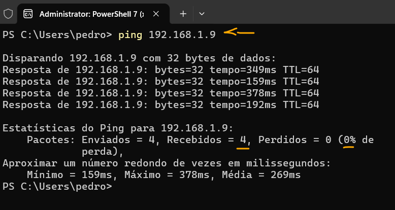
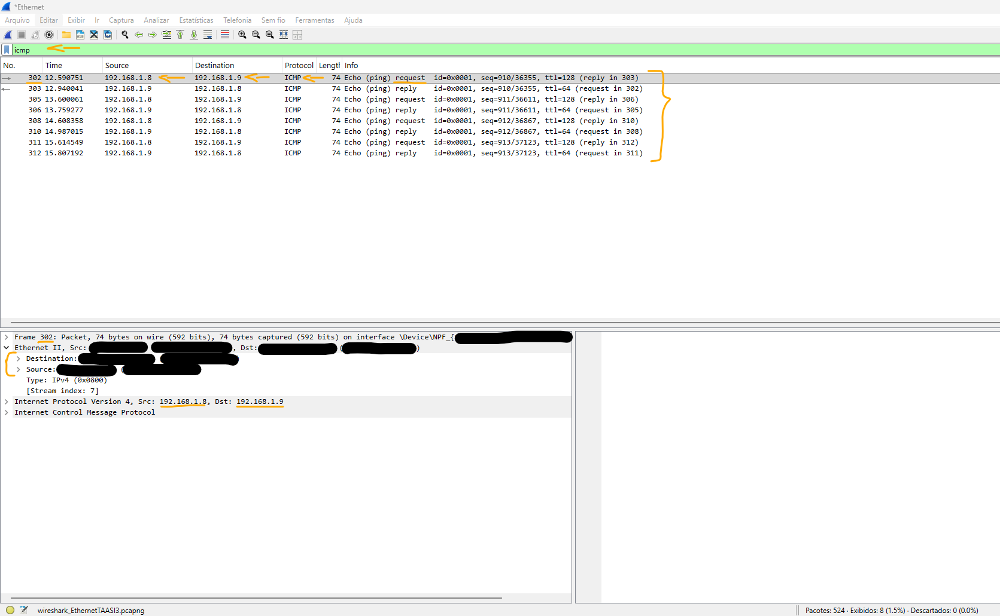
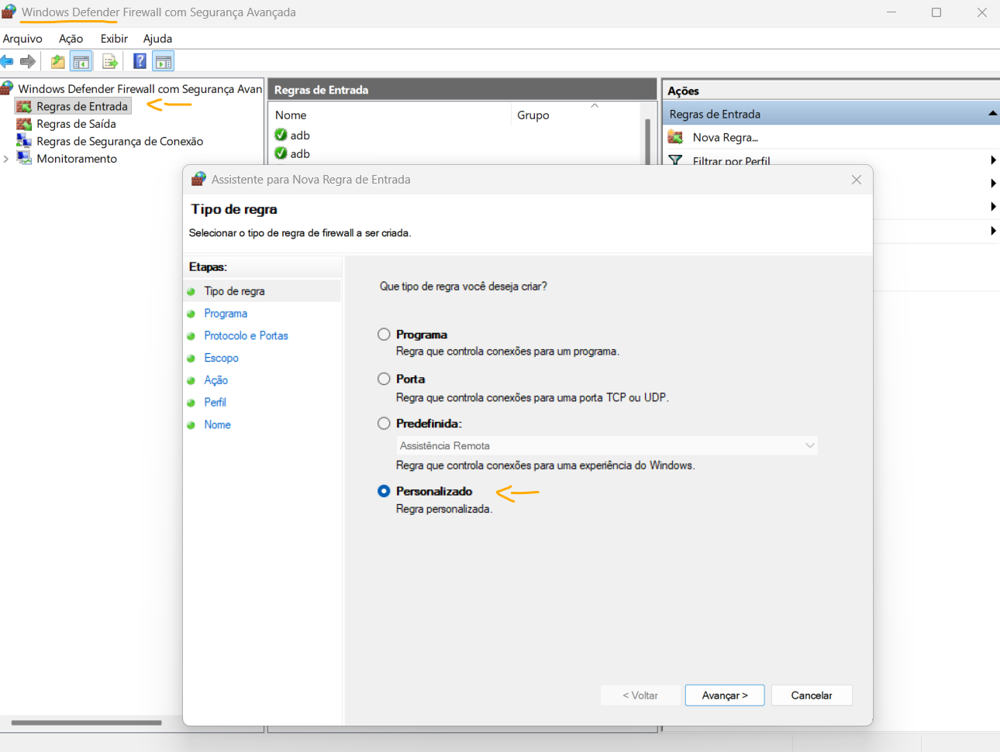

# Laboratório - Usar o Wireshark para ver o tráfego na Rede   

### Cisco: <a href="../../">cisco   </a>
### Cisco Networking Academy: cna   </a>
### Training Category: <a href="../../self_paced/">self-paced</a>
### Software/Subject: network   </a>
### Course: <a href="./">lab_009 (Laboratório - Usar o Wireshark para ver o tráfego na Rede)   </a>

---

### Theme:
- Network

### Used Tools:
- Operating System (OS): 
  - Windows 11 
- Cloud Services:
  - Google Drive 
- Language:
  - HTML   
  - Markdown   
- Integrated Development Environment (IDE) and Text Editor:
  - Visual Studio Code (VS Code)   
- Versioning: 
  - Git   
- Repository:
  - GitHub   
- Network:
  - ping   
  - Trace Route (tracert)   
  - Wireshark   
- Cibersecurity:
  - Windows Defender Firewall   

---

<h3><a name="item00">Course Strcuture:</a></h3>

1. <a href="#item01">Parte 1: Capturar e analisar dados locais ICMP no Wireshark</a> 
  1.1 <a href="#item01.01">Etapa 1: Recuperar os endereços de interface do PC.</a> 
  1.2 <a href="#item01.02">Etapa 2: Iniciar o Wireshark e começar a capturar os dados.</a> 
  1.3 <a href="#item01.03">Etapa 3: Examinar os dados capturados.</a> 
2. <a href="#item02">Parte 2: Capturar e analisar dados ICMP remotos no Wireshark</a> 
  2.1 <a href="#item02.01">Etapa 1: Iniciar a captura de dados na interface.</a> 
  2.2 <a href="#item02.02">Etapa 2: Examinar e analisar os dados dos hosts remotos.</a> 
3. <a href="#item03">Perguntas para reflexão</a> 
4. <a href="#item04">Anexo A: Permitir o tráfego ICMP pelo firewall</a> 
  4.1 <a href="#item04.01">Parte 1: Criar uma regra de entrada nova permitindo o tráfego ICMP pelo firewall.</a> 
  4.2 <a href="#item04.02">Parte 2: Desativar ou excluir a nova regra do ICMP.</a> 

---

### Objective:
Este laboratório visou a exploração do Wireshark através da captura de pacotes ICMP (ping). A atividade focou na análise de comunicações locais e remotas, permitindo a verificação detalhada dos endereços IP e MAC exibidos nas camadas de rede e enlace.

### Folder Structure:
- [README.md](./README.md): Este documento de README, escrito em **Markdown**, com o conteúdo do laboratório.
- [0-aux](./0-aux/): Pasta auxiliar com imagens utilizadas na construção dos arquivos de README desse curso.

### Development:

<a name="item01"><h4>1. Parte 1: Capturar e analisar dados locais ICMP no Wireshark</h4></a>[Back to summary](#item00)

Na parte 1 deste laboratório, você efetuará ping para outro computador na LAN e capturará solicitações e respostas ICMP no Wireshark. Você também verá quadros capturados para obter informações específicas. Essa análise ajudará a esclarecer como os cabeçalhos dos pacotes são usados para transportar os dados até o destino. 

<a name="item01.01"><h4>1.1 Etapa 1: Recuperar os endereços de interface do PC.</h4></a>[Back to summary](#item00)

Neste laboratório, você precisará recuperar o endereço IP do PC e o endereço físico da placa de interface de rede (NIC), também chamado de endereço MAC. 

- a. Em uma janela do prompt de comandos, insira ipconfig /all, ao endereço IP da interface do seu PC, sua descrição e seu endereço MAC (físico).
  - `C:\Users\Student> ipconfig /all`.
- b. Solicite a um ou mais membros da equipe o endereço IP do PC dele e forneça a ele o endereço IP do seu PC. Não forneça o seu endereço MAC a ele agora.
  - `C:\Users\Student> ipconfig /all`.

<a name="item01.02"><h4>1.2 Etapa 2: Iniciar o Wireshark e começar a capturar os dados.</h4></a>[Back to summary](#item00)

- a. Navegue para Wireshark. Clique duas vezes na interface desejada para iniciar a captura de pacotes. Verifique se a interface desejada tem tráfego. 
- b. As informações começarão a rolar abaixo da seção superior no Wireshark. As linhas de dados serão exibidas em cores diferentes com base no protocolo. Essas informações podem passar rapidamente dependendo da comunicação que estiver ocorrendo entre o PC e a LAN. Podemos aplicar um filtro para facilitar a visualização e o trabalho com os dados 
que estão sendo capturados pelo Wireshark. Neste laboratório, estamos apenas interessados em exibir as PDUs do ICMP (ping). Digite icmp na caixa Filter (Filtro), na parte superior do Wireshark, e pressione Enter ou clique no botão Apply (Aplicar) para exibir somente as PDUs ICMP (ping). 
- c. Este filtro faz com que todos os dados na janela superior desapareçam, mas você ainda captura o tráfego na interface. Navegue para uma janela do prompt de comando e execute ping no endereço IP que você recebeu do membro da equipe. Observação: se o PC da sua equipe não responde aos pings, pode ser porque o firewall do PC do membro da equipe está bloqueando as solicitações. Consulte Anexo A: Permitir o tráfego ICMP pelo firewall para obter informações sobre como permitir o tráfego ICMP através do firewall usando o 
Windows.
  - `C:\> ping 192.168.1.9`. A imagem 01 mostra o ping realizado da máquina física **Windows** para meu celular conectado a mesma LAN via Wi-Fi.
- d. Pare a captura de dados clicando no ícone Stop Capture (Parar captura).

<figure>
     
    <figcaption>Imagem 01.</figcaption>
</figure>
 

<a name="item01.03"><h4>1.3 Etapa 3: Examinar os dados capturados.</h4></a>[Back to summary](#item00)

Na etapa 3, examine os dados gerados pelas solicitações ping do PC da sua equipe. Os dados do Wireshark são exibidos em três seções: 1 - A seção superior exibe a lista de quadros de PDU capturada com um resumo das informações do pacote IP listadas; 2 - a seção média mostra as informações de PDU para o quadro selecionado na parte superior da tela e separa um quadro PDU capturado pelas camadas de protocolo; e 3 - a seção inferior exibe os dados brutos de cada camada. Os dados são exibidos em formato hexadecimal e decimal. 

- a. Clique nos primeiros quadros de PDU de requisição ICMP na seção da parte superior do Wireshark. Observe que a coluna Source (Origem) tem o endereço IP do PC, e a Destination (Destino) contém o endereço IP do PC do colega para o qual você efetuou ping. 
- b. Com esse quadro de PDU ainda selecionado na seção superior, vá até a seção média. Clique no sinal mais à esquerda da linha Ethernet II para ver os endereços MAC de origem e destino. O endereço MAC de origem corresponde à sua interface de PC?
  - Sim.
- b. O endereço MAC de destino no Wireshark corresponde ao endereço MAC do membro de sua equipe?
  - Sim.
- b. Como o endereço MAC do PC que recebeu ping é obtido pelo seu PC? Nota: No exemplo anterior de uma solicitação ICMP capturada, os dados ICMP são encapsulados dentro de uma PDU de pacote IPv4 (cabeçalho IPv4), que é então encapsulado em uma PDU de quadro Ethernet II (cabeçalho Ethernet II) para transmissão na LAN.
  - O PC usa o ARP para descobrir o endereço MAC correspondente ao endereço IP de destino. Ele envia uma requisição ARP em broadcast na rede local. O dispositivo com o IP correspondente responde informando seu endereço MAC.

A imagem 02 exibe a captura do tráfego ICMP pelo **Wireshark**.

<figure>
   
  <figcaption>Imagem 02.</figcaption>
</figure>
 

<a name="item02"><h4>2. Parte 2: Capturar e analisar dados ICMP remotos no Wireshark</h4></a>[Back to summary](#item00)

Na parte 2, você efetuará ping para hosts remotos (não nos hosts da LAN) e examinará os dados gerados desses pings. Você determinará o que há de diferente nesses dados a partir dos dados pesquisados na parte 1. 

<a name="item02.01"><h4>2.1 Etapa 1: Recuperar os endereços de interface do PC.</h4></a>[Back to summary](#item00)

- a. Inicie a captura de dados novamente. 
- b. Uma janela solicitará que você salve os dados capturados anteriormente antes de iniciar outra captura. Não é necessário salvar esses dados. Clique em Continue without Saving (Continuar sem salvar).
- c. Com a captura ativa, execute ping nos três URLs do site a seguir em um prompt de comando do Windows: www.yahoo.com, www.cisco.com e www.google.com. Nota: Quando você executa ping nos URLs listados, observe que o DNS (Domain Name Server) converte o URL em um endereço IP. Observe o endereço IP recebido para cada URL.
  - `ping -n 2 www.yahoo.com` -> `ping -n 2 www.cisco.com` -> `ping -n 2 www.google.com`.
- d. Pare a captura de dados clicando no ícone Stop Capture (Parar captura). 

<a name="item02.02"><h4>2.2 Etapa 2: Examinar e analisar os dados dos hosts remotos.</h4></a>[Back to summary](#item00)

- a. Analise os dados capturados no Wireshark e examine os endereços IP e MAC dos três locais para onde você efetuou ping. Liste os endereços IP e MAC de destino para todos os três locais no espaço fornecido. 
  - www.yahoo.com: IP - 2804:1bc:114::2005 | MAC - zte_97:a1:52 (cc:29:bd:97:a1:52)
  - www.cisco.com: IP - 2600:1419:8a00:187::b33 | MAC - zte_97:a1:52 (cc:29:bd:97:a1:52)
  - www.google.com: IP - 2800:3f0:4001:838::2004 | MAC - zte_97:a1:52 (cc:29:bd:97:a1:52)
- a. Qual é a importância dessas informações? 
  - Elas mostram para onde o tráfego está sendo encaminhado e como a comunicação ocorre em cada camada, permitindo identificar o IP de destino e o MAC usado no enlace local para entregar o pacote.
- b. Como essas informações diferem das informações do ping local que você recebeu na parte 1? 
  - No ping local, o MAC de destino é do próprio host na LAN. No ping para sites externos, o MAC de destino é o do gateway padrão (roteador), enquanto o IP de destino é o do servidor remoto.

<a name="item03"><h4>3. Perguntas para reflexão</h4></a>[Back to summary](#item00)

- a. Por que o Wireshark mostra o endereço MAC real dos hosts locais, mas não o endereço MAC real para os hosts remotos? 
  - O Wireshark mostra o MAC real dos hosts locais porque eles estão no mesmo domínio de broadcast. Para hosts remotos, o quadro Ethernet usa o MAC do gateway, pois os endereços MAC não atravessam roteadores.

<a name="item04"><h4>4. Anexo A: Permitir o tráfego ICMP pelo firewall</h4></a>[Back to summary](#item00)

Se os membros de sua equipe não conseguirem efetuar ping em seu PC, o firewall pode estar bloqueando essas solicitações. Este anexo descreve como criar uma regra no firewall para permitir requisições ping. Também descreve como desativar a nova regra ICMP depois que você tiver concluído o laboratório. 

<a name="item04.01"><h4>4.1 Parte 1: Criar uma regra de entrada nova permitindo o tráfego ICMP pelo firewall.</h4></a>[Back to summary](#item00)

- a. Navegue até o Painel de Controle e clique na opção Sistema e Segurança na exibição Categoria.
- b. Na janela Sistema e segurança, clique em Windows Defender Firewall ou Windows Firewall. 
- c. No painel esquerdo da janela do Windows Defender Firewall ou Firewall do Windows, clique em Configurações avançadas.
- d. Na janela Segurança Avançada, clique na opção Regras de Entrada na barra lateral esquerda e clique em Nova Regra ... na barra lateral direita.
- e. Isso inicia o assistente Nova regra de entrada. Na tela Tipo de regra, clique no botão de opção Personalizado e clique em Avançar.
- f. No painel esquerdo, clique na opção Protocolo e portas e, usando o menu suspenso Tipo de protocolo, selecione ICMPv4 e clique em Avançar. 
- g. Verifique se qualquer endereço IP para os endereços IP local e remoto está selecionado. Clique em Avançar para continuar.
- h. Selecione Permitir a conexão. Clique em Avançar para continuar.
- i. Por padrão, essa regra se aplica a todos os perfis. Clique em Avançar para continuar. 
- j. Nomeie a regra com Permitir Solicitações ICMP. Clique em Concluir para continuar. Essa nova regra deve permitir que os membros da equipe recebam respostas de ping vindo do seu PC.

A imagem 03 mostra uma simulação da criação de uma regra de entrada personalizada do firewall **Windows Defender** na máquina física **Windows**. Contudo, como o ping na rede local foi feito para o dispositivo móvel, não foi necessário a criação da regra.

<figure>
   
  <figcaption>Imagem 03.</figcaption>
</figure>
 

<a name="item04.02"><h4>4.2 Parte 2: Desativar ou excluir a nova regra do ICMP.</h4></a>[Back to summary](#item00)

Após o laboratório ser concluído, talvez você queira desativar ou até mesmo excluir a nova regra criada na etapa 1. Usar a opção Desativar regra permite que posteriormente a regra seja ativada de novo. Excluir a regra permanentemente a exclui da lista de regras de entrada.

- a. Na janela Segurança Avançada, clique em Regras de Entrada no painel esquerdo e localize a regra que você criou anteriormente. 
- b. Clique com o botão direito do mouse na regra ICMP e selecione Desativar Regra se desejar. Você também pode selecionar Excluir se quiser excluí-la permanentemente. Se você selecionar essa opção, você pode recriar a regra novamente para permitir respostas ICMP. 