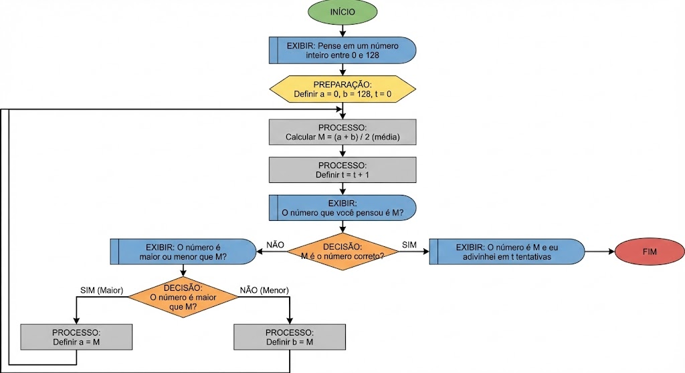

# Laboratório - Criar um fluxograma de processo   

### Cisco: <a href="../../">cisco   </a>
### Cisco Networking Academy: cna   </a>
### Training Category: <a href="../../self_paced/">self-paced</a>
### Software/Subject: programming_logic   </a>
### Course: <a href="./">lab_010 (Laboratório - Criar um fluxograma de processo)   </a>

---

### Theme:
- Programming Logic

### Used Tools:
- Operating System (OS): 
  - Windows 11 
- Cloud Services:
  - Google Drive 
- Language:
  - HTML   
  - Markdown   
- Integrated Development Environment (IDE) and Text Editor:
  - Visual Studio Code (VS Code)   
- Versioning: 
  - Git   
- Repository:
  - GitHub   

---

<h3><a name="item00">Course Strcuture:</a></h3>

1. <a href="#item01">Parte 1: Liste as etapas lógicas para resolver um problema</a> 
2. <a href="#item02">Parte 2: Desenhe o Fluxograma</a> 
  2.1 <a href="#item02.01">Parte 1: Liste as etapas lógicas para resolver um problema</a> 
  2.2 <a href="#item02.02">Etapa 2: Desenhe o fluxograma completo.</a> 
3. <a href="#item03">Reflexão</a> 

---

### Objective:
Criar um fluxograma com base na construção de um processo de identificação de um número em um intervalo específico.

### Folder Structure:
- [README.md](./README.md): Este documento de README, escrito em **Markdown**, com o conteúdo do laboratório.
- [0-aux](./0-aux/): Pasta auxiliar com imagens utilizadas na construção dos arquivos de README desse curso.

### Development:

<a name="item01"><h4>1. Parte 1: Liste as etapas lógicas para resolver um problema</h4></a>[Back to summary](#item00)

O problema é desenvolver um processo para encontrar um número predeterminado. O processo pode ser programado como um jogo de computador simples. É solicitado que um jogador pense em um número inteiro entre 0 e 128. O programa usará o método de bissecção para encontrar o número.

- a. Liste as etapas lógicas para resolver um problema:
  - Pergunte o que o jogador pensa sobre um número inteiro entre 0 e 128.
  - Defina a como a extremidade inferior b como a extremidade superior e t como a hora do cálculo.
  - Defina os valores iniciais, a = 0, b = 128, t = 0.
  - Calcule o número médio entre a e b. Defina-o como M.
  - Defina t = t + 1
  - Pergunte ao jogador se M é o número correto. Se sim, imprima “O número que você pensou é M e eu adivinhei em t tentativas”. Finalize o processo.
  - Caso M não seja o número correto, pergunte ao jogador se o número pensado é maior ou menor que M.
  - Se o número for maior que M, atualize a extremidade inferior definindo a = M.
  - Se o número for menor que M, atualize a extremidade superior definindo b = M.
  - Retorne ao cálculo do número médio entre a e b e repita o processo até que o número seja encontrado.
- b. O processo pode detectar se o número que o jogador escolheu é 0 ou 128? Explique.
  - Não. Da forma como o processo está descrito, não há garantia de que os valores 0 ou 128 sejam detectados. Isso ocorre porque o método da bissecção baseia-se no cálculo do valor médio entre os limites inferior (a) e superior (b). Como 0 e 128 são valores extremos do intervalo, eles não serão obtidos como valor médio. Se o algoritmo não verificar explicitamente esses limites, o processo pode continuar indefinidamente sem encontrar o número escolhido.
- c. Se 0 ou 128 não puder ser detectado, o que deve ser feito para corrigir isso?
  - O processo deve ser ajustado para testar explicitamente os limites do intervalo. Em cada iteração, deve-se verificar se o número pensado pelo jogador é igual ao valor de a ou b. Caso seja, o processo deve ser finalizado, garantindo que os valores extremos também possam ser corretamente detectados.

<a name="item02"><h4>2. Parte 2: Desenhe o Fluxograma</h4></a>[Back to summary](#item00)

<a name="item02.01"><h4>2.1 Etapa 1: Use símbolos de fluxograma apropriados para cada função.</h4></a>[Back to summary](#item00)

Como a lista de etapas do processo é identificada, podemos usar símbolos de fluxograma para representar cada etapa.

- a. Use um símbolo oval como Iniciar e um símbolo de exibição para perguntas. Use uma linha para vinculá-los.
- b. Use um símbolo de preparação para fazer a atribuição inicial de valores.
- c. Use um símbolo de processo predefinido para definir uma função ou rotina de processo.
- d. Use um símbolo de decisão para representar um teste de condição.
- e. Use um símbolo de processo para representar uma operação.

<a name="item02.02"><h4>2.2 Etapa 2: Desenhe o fluxograma completo.</h4></a>[Back to summary](#item00)

Agora podemos usar símbolos para desenhar um fluxograma completo. Usaremos o Conector fora da página e Conector para estender o fluxograma para a próxima página.

A imagem 01 exibe o fluxograma construído.

<figure>
     
    <figcaption>Imagem 01.</figcaption>
</figure>
 

<a name="item03"><h4>3 Reflexão</h4></a>[Back to summary](#item00)

- a. Qual é o significado de teste se t = 6?
  - O teste t = 6 indica que o número máximo de tentativas permitidas foi atingido. Como o intervalo inicial vai de 0 a 128, o método da bissecção necessita, no máximo, 7 comparações para encontrar qualquer número nesse intervalo. Assim, quando t = 6, o processo está verificando se o limite esperado de tentativas foi alcançado, evitando que o algoritmo entre em um loop infinito.
- b. Onde o teste para os números 0 e 128 deve ser colocado?
  - O teste para os números 0 e 128 deve ser colocado no início do processo ou imediatamente após a definição dos valores iniciais de a e b. Dessa forma, o algoritmo pode verificar se o número pensado pelo jogador corresponde a um dos limites do intervalo antes de iniciar o cálculo do valor médio, garantindo que os valores extremos sejam corretamente detectados.