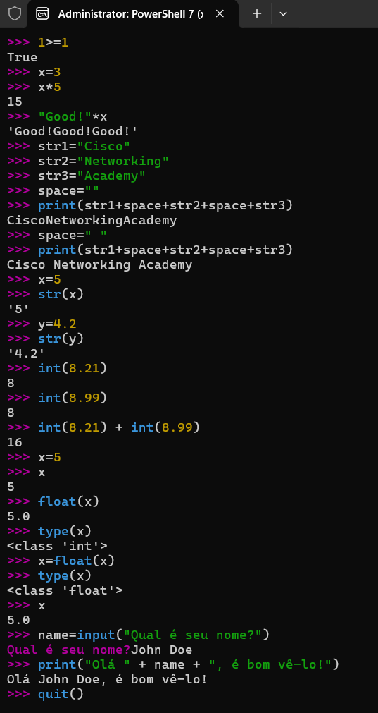
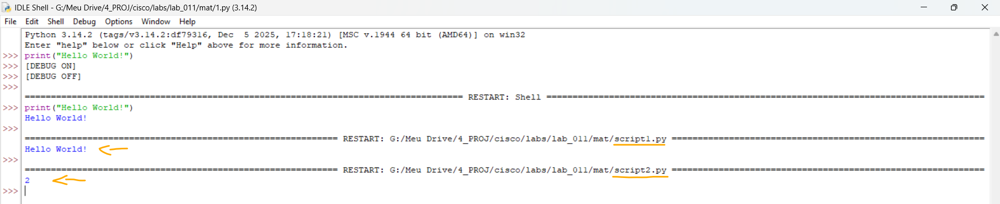

# Laboratório - Programação básica em Python   

### Cisco: <a href="../../">cisco   </a>
### Cisco Networking Academy: cna   </a>
### Training Category: <a href="../../self_paced/">self-paced</a>
### Software/Subject: python   </a>
### Course: <a href="./">lab_011 (Laboratório - Programação básica em Python)   </a>

---

### Theme:
- Programming

### Used Tools:
- Operating System (OS): 
  - Windows 11 
- Cloud Services:
  - Google Drive 
- Language:
  - HTML   
  - Markdown   
  - Python   
- Integrated Development Environment (IDE) and Text Editor:
  - Integrated Development and Learning Environment (IDLE)   
  - Visual Studio Code (VS Code)   
- Versioning: 
  - Git   
- Repository:
  - GitHub   

---

<h3><a name="item00">Course Strcuture:</a></h3>

1. <a href="#item01">Parte 1: Pratique o básico do Python</a> 
  1.1 <a href="#item01.01">Etapa 1: Baixe e instale o Python3.</a> 
  1.2 <a href="#item01.02">Etapa 2: Programação em Python no interpretador interativo.</a> 
2. <a href="#item02">Parte 2: crie um script usando o IDLE para Python</a> 
  2.1 <a href="#item02.01">Etapa 1: Inicie o IDLE.</a> 
  2.2 <a href="#item02.02">Etapa 2: Crie seu próprio script.</a> 

---

### Objective:
Introduzir a programação com linguagem Python.

### Folder Structure:
- [README.md](./README.md): Este documento de README, escrito em **Markdown**, com o conteúdo do laboratório.
- [0-aux](./0-aux/): Pasta auxiliar com imagens utilizadas na construção dos arquivos de README desse curso.

### Development:

<a name="item01"><h4>1. Parte 1: Pratique o básico do Python</h4></a>[Back to summary](#item00)

Nesta parte, você aprenderá e praticará alguma programação básica em Python.

<a name="item01.01"><h4>1.1 Etapa 1: Baixe e instale o Python3.</h4></a>[Back to summary](#item00)

- a. Navegue até www.python.org/downloads/ e baixe a versão mais recente para o sistema operacional.
- b. Localize o arquivo baixado e instale o Python. Selecione Adicionar Python 3.x ao PATH, em que x é a versão de lançamento. Adicionar o Python ao PATH informa ao Windows onde você instalou o Python. Em seguida, clique em Instalar agora. Você também pode instalar o Python 3.x usando a Microsoft Store. Pesquise Python e selecione a versão mais recente do Python. Para a maioria das distribuições Linux, o Python já está instalado. Para instalar o IDLE no Ubuntu, insira o seguinte comando: `user@Ubuntu:~$ sudo apt-get install idle3`. Para iOS, consulte https://www.python.org/download/mac/tcltk/.

<a name="item01.02"><h4>1.2 Etapa 2: Programação em Python no interpretador interativo.</h4></a>[Back to summary](#item00)

Como uma linguagem interpretada, os comandos do Python podem ser emitidos em um interpretador interativo. Nesta atividade, as etapas são escritas para Python3 em execução no Windows.

- a. Inicie o Python3. (No Windows, clique em Iniciar > Python3.x > Python3, em que x é a versão de lançamento.)
- b. Faça alguns cálculos básicos. Insira os cálculos no prompt do Python >>>.
  - `1 + 2` -> `2 + 4` -> `6 / 2`.
- c. Imprima uma string de texto.
  - `“How are you?”`.
- d. Use o comando type() para determinar o tipo de dados básico: integer (int), float, string (str) e Boolean.
  - `type(65)` -> `type(45.6)` -> `type("Hi!")` -> `type(True)` -> `1<2` -> `1<1` -> `1==1` -> `1>=1`.
- e. Crie uma variável.
  - `x=3` -> `x*5` -> `"Good!"*x`.
- f. Combine várias strings e imprima como uma string única.
  - `str1="Cisco"` -> `str2="Networking"` -> `str3="Academy"` -> `space=" "` -> `print(str1+space+str2+space+str3)`.
- g. Converta o tipo de dados de um número para uma string.
  - `x=5` -> `str(x)` -> `y=4.2` -> `str(y)`.
- h. Observe que inteiros não são arredondados para cima ao serem convertidos de flutuantes. O decimal é ignorado.
  - `int(8.21)` -> `int(8.99)` -> `int(8.21) + int(8.99)`.
- i. Converta um número inteiro em flutuante.
  - `x=5` -> `x` -> `float(x)` -> `type(x)` -> `x=float(x)` -> `type(x)` -> `x`.
- j. Obtenha opinião do usuário.
  - `name=input("Qual é seu nome? ")` -> `print("Olá " + name + ", é bom vê-lo!")`.
- g. Use quit() para sair do interpretador interativo.
  - `quit()`.

A imagem 01 mostra a conclusão da parte 1.

<figure>
     
    <figcaption>Imagem 01.</figcaption>
</figure>
 

<a name="item02"><h4>2. Parte 2: crie um script usando o IDLE para Python</h4></a>[Back to summary](#item00)

Nesta parte, você iniciará o IDLE e criará um script simples. IDLE significa Integrated Development and Learning Environment (Desenvolvimento e ambiente de aprendizado integrados). Ele é suportado e incluído no pacote Python. Alguns dos principais recursos do IDLE para Python incluem:
- Uma janela de shell do Python (interpretador interativo) com entrada e saída codificada por cores e com mensagens de erro.
- Um editor de texto de várias janelas com vários recursos: Desfazer, codificação por cores do Python, recuo inteligente, dicas de chamada, preenchimento automático e outros recursos.
- A capacidade de pesquisar em qualquer janela, substituir nas janelas do editor e pesquisar em vários arquivos.
- Um depurador com pontos de interrupção persistentes, revisão e visualização de espaços de nomes globais e locais.
- Configuração, navegadores e outras caixas de diálogo.

<a name="item02.01"><h4>2.1 Etapa 1: Inicie o IDLE.</h4></a>[Back to summary](#item00)

- a. Inicie o IDLE no menu Iniciar do Windows.
- b. Clique em Arquivo> Novo arquivo para abrir um novo script Python (sem título).
- c. No novo arquivo, insira print(“Hello World!”), observe que os códigos são coloridos e os parênteses de abertura e fechamento são correspondentes.
- d. Clique em Arquivo> Salvar e salve o script atual como script1.py no diretório Documentos (C:/Usuários/seu nome/Documentos). Clique no botão Salvar.
- e. Clique em Executar > Executar módulo (ou pressione F5). A janela de shell exibirá o resultado.

<a name="item02.02"><h4>2.2 Etapa 2: Crie seu próprio script.</h4></a>[Back to summary](#item00)

Você pode não saber como criar um script Python complexo por conta própria. Mas você pode criar um script Python simples usando os exemplos da parte anterior. 

- a. Por exemplo, crie e salve o novo arquivo como script2.py no diretório Documentos. Insira print(1+1) no novo arquivo e salve-o novamente. Execute o módulo e imprima os resultados de 1+1 e exiba no shell. Experimente diferentes funções e você estará pronto para usar uma linguagem de programação eficiente.

A imagem 02 mostra a conclusão da parte 2.

<figure>
     
    <figcaption>Imagem 02.</figcaption>
</figure>
 