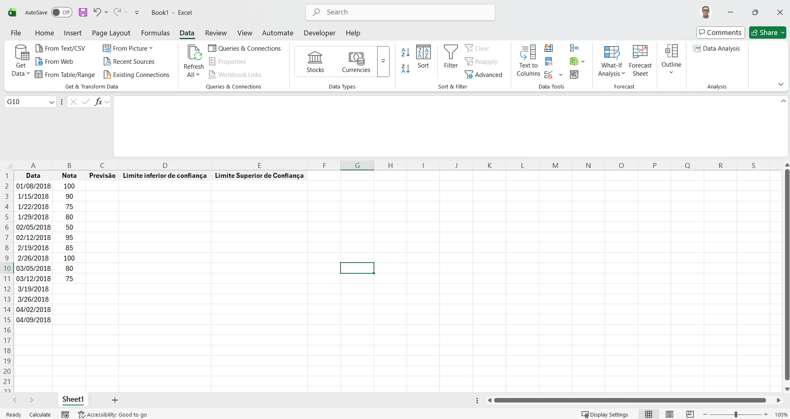

# Laboratório - Use o Excel para fazer previsões   

### Cisco: <a href="../../">cisco   </a>
### Cisco Networking Academy: cna   </a>
### Training Category: <a href="../../self_paced/">self-paced</a>
### Software/Subject: Excel   </a>
### Course: <a href="./">lab_015 (Laboratório - Use o Excel para fazer previsões)   </a>

---

### Theme:
- Big Data

### Used Tools:
- Operating System (OS): 
  - Windows 11 
- Cloud Services:
  - Google Drive 
- Language:
  - HTML   
  - Markdown   
- BI Tool:
  - Excel   
- Integrated Development Environment (IDE) and Text Editor:
  - Visual Studio Code (VS Code)   
- Versioning: 
  - Git   
- Repository:
  - GitHub   

---

<h3><a name="item00">Course Strcuture:</a></h3>

1. <a href="#item01">Parte 1: Inserir dados</a> 
  1.1 <a href="#item01.01">Etapa 1: Ative o complemento Analysis ToolPak.</a> 
  1.2 <a href="#item01.02">Etapa 2: Insira notas e datas em células específicas do Microsoft Excel.</a> 
2. <a href="#item02">Parte 2: Executar uma previsão de dados</a> 
  2.1 <a href="#item02.01">Etapa 1: Usar a função Planilha de previsão.</a> 
  2.2 <a href="#item02.02">Etapa 2: Modificar os dados.</a> 

---

### Objective:
O objetivo deste laboratório foi utilizar o suplemento Analysis ToolPak do Microsoft Excel para realizar previsões.

### Folder Structure:
- [README.md](./README.md): Este documento de README, escrito em **Markdown**, com o conteúdo do laboratório.
- [0-aux](./0-aux/): Pasta auxiliar com imagens utilizadas na construção dos arquivos de README desse curso.

### Development:

<a name="item01"><h4>1. Parte 1: Inserir dados</h4></a>[Back to summary](#item00)

<a name="item01.01"><h4>1.1 Etapa 1: Ative o complemento Analysis ToolPak.</h4></a>[Back to summary](#item00)

- a. Abra uma planilha do Excel em branco.
- b. Clique em Arquivo e em Opções.
- c. Clique em Suplementos. Na parte inferior da página, selecione Suplementos do Excel no menu suspenso Gerenciar, se necessário, e clique em Ir.
- d. Na janela Suplementos, selecione Analysis ToolPak and Solver Add-in e clique em OK para continuar.

<a name="item01.02"><h4>1.2 Etapa 2: Insira notas e datas em células específicas do Microsoft Excel.</h4></a>[Back to summary](#item00)

- a. Na célula A1, insira Data.
- b. Na célula B1, insira Nota.
- c. Na célula C1, insira Previsão.
- d. Na célula D1, insira Limite inferior de confiança.
- e. Na célula E1, insira Limite Superior de Confiança.
- f. Começando com a célula A2, digite as seguintes datas nas células A2 a A15: 1/8/2018, 1/15/2018, 1/22/2018, 1/29/2018, 2/5/2018, 2/12/2018, 2/19/2018, 2/26/2018, 3/5/2018, 3/12/2018, 3/19/2018, 3/26/2018, 4/2/2018, 4/9/2018. Observação: o formato de data pode ser diferente em sua região. No exemplo, ele está usando dd/mm/aaaa para o formato de data. Nota: Se aparecerem tralhas (###) em sua célula, clique, mantenha pressionado e arraste a linha à direita das datas para tornar a coluna A mais larga ou você pode clicar com o botão direito no A que está acima da palavra Data, selecioneLargura da coluna, digite 10 e clique em OK.
- g. Começando com a célula B2, digite as seguintes notas nas células de B2 a B11: 100, 90, 75, 80, 50, 95, 85, 100, 80, 75

A imagem 01 mostra a conclusão da parte 1.

<figure>
     
    <figcaption>Imagem 01.</figcaption>
</figure>
 

<a name="item02"><h4>2. Parte 2: Executar uma previsão de dados</h4></a>[Back to summary](#item00)

Nesta parte, você usará o Excel para prever quais serão suas notas nas semanas restantes. Lembre-se de que essa previsão é baseada nas notas que você já obteve e digitou na planilha.

<a name="item02.01"><h4>2.1 Etapa 1: Usar a função Planilha de previsão.</h4></a>[Back to summary](#item00)

- a. Destaque as células A2 a A15.
- b. Na guia Dados, clique em Texto em colunas para iniciar o Assistente de texto em colunas.
- c. Na Etapa 1 de 3, deixe a opção padrão como Delimitado e clique em Avançar.
- d. Na Etapa 2 de 3, deixe a opção padrão como Guia e clique em Avançar.
- e. Na Etapa 3 de 3, selecione Data e altere o campo na caixa suspensa para MDY (mês/data/ano). Clique em Finish (Concluir).
- f. Selecione as células de A1 a B11.
- g. Na guia Data, selecione Forecast Sheet para abrir a janela Create Forecast Worksheet.
- h. Na janela de calendário Término de previsão, selecione 4/9/2018 como a data de término.
- i. Expanda Opções. Observe que você pode ajustar o intervalo de confiança. O intervalo de confiança são os limites superior e inferior do que o Excel prevê que você pontuará nas próximas semanas.
- j. Clique em Criar para criar o gráfico e gerar dados de previsão em uma nova planilha. Observe que o gráfico pode ser movido se estiver cobrindo alguma célula de dados. 
- k. Observe que o Excel prevê que você vai fazer 80,39 em 19 de março, mas tem 95% de certeza de que realmente será uma pontuação em algum lugar entre 47,54 e 113,23. Qual pontuação é prevista para 2 de abril?
  - 78,96.
- k. Dentro de qual intervalo de pontuações o Excel tem 95% de confiança que será sua pontuação em 9 de abril?
  - 42,40 à 114,08.
- l. Se preferir usar uma fórmula em vez de usar o menu, você pode inserir uma fórmula e obter os mesmos números na planilha original.
  - Em C12 insira a seguinte fórmula: `=FORECAST.ETS(A12,$B$2:$B$11,$A$2:$A$11,1,1)`. 
  - Em D12, insira a seguinte formula: `=C12-FORECAST.ETS.CONFINT(A12,$B$2:B$11,$A$2:$A$11,0.95,1,1)`.
  - Em E12, insira a seguinte fórmula: `=C12+FORECAST.ETS.CONFINT(A12,$B$2:B$11,$A$2:$A$11,0.95,1,1)`.

<a name="item02.02"><h4>2.2 Etapa 2: Modificar os dados.</h4></a>[Back to summary](#item00)

- a. Altere os dados para as notas que refletem mais suas próprias notas.
- b. Destaque os conjuntos de dados nas células A1 e B1 até A11 e B11.
- c. Na guia Data, selecione Forecast Sheet para abrir a janela Create Forecast Worksheet.
- d. Expanda as Opções e ajuste o intervalo de confiança de 95% para 98%. Como a alteração do nível de confiança de 95% para 98% afetou o intervalo previsto de notas?
  - A alteração do nível de confiança de 95% para 98% aumentou o intervalo previsto de notas, tornando-o mais amplo. Isso ocorre porque um nível de confiança maior exige maior margem para garantir que os valores reais estejam dentro do intervalo.
- d. Liste três exemplos de onde você acha que a previsão seria usada no Big Data.
  - A previsão é usada para estimar a demanda de produtos no varejo. Também é aplicada na análise de comportamento de usuários em plataformas digitais. Além disso, é utilizada para prever tendências financeiras e riscos de mercado.

A imagem 02 mostra a conclusão da parte 2.

<figure>
     
    <figcaption>Imagem 02.</figcaption>
</figure>
 