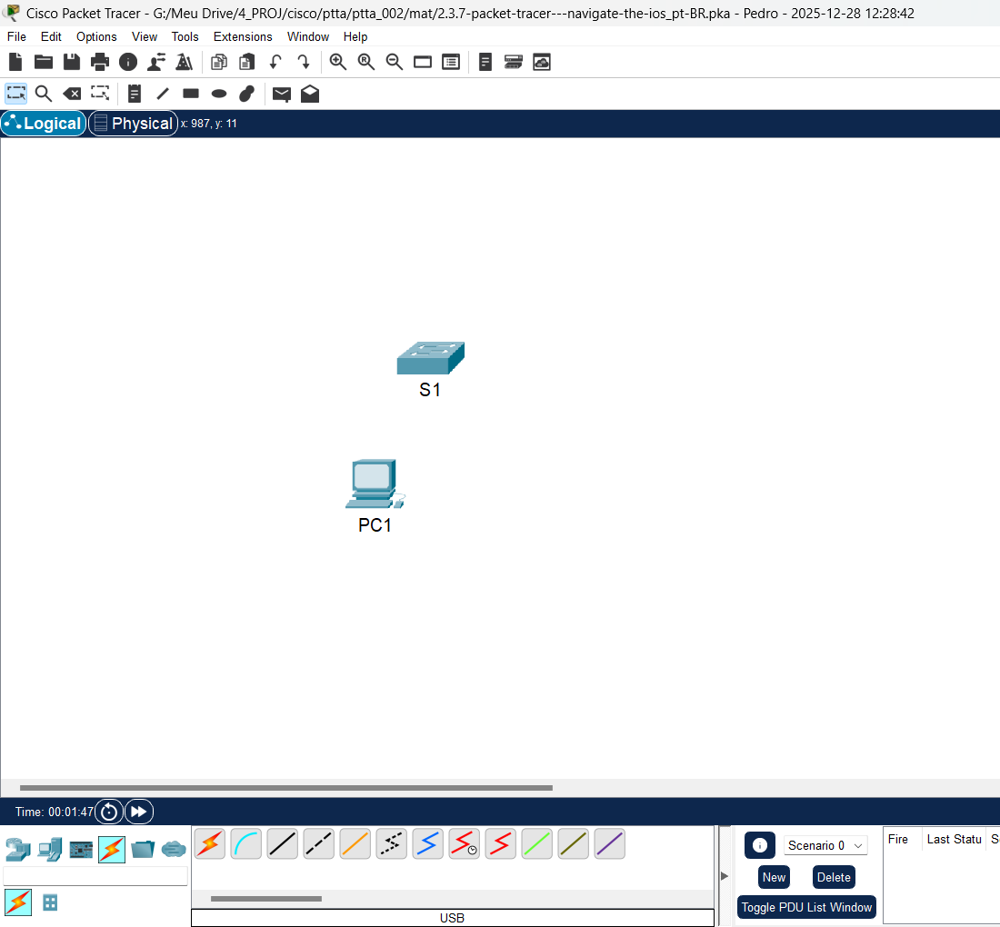
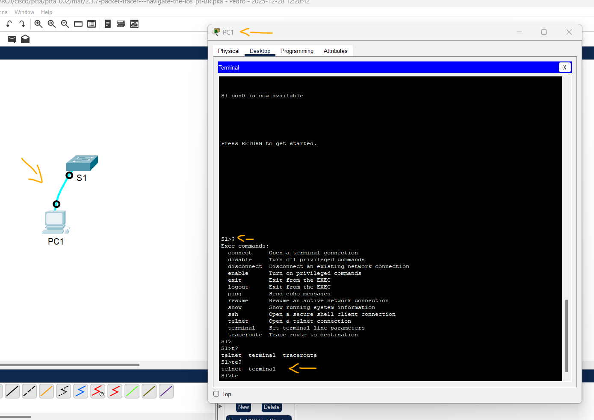
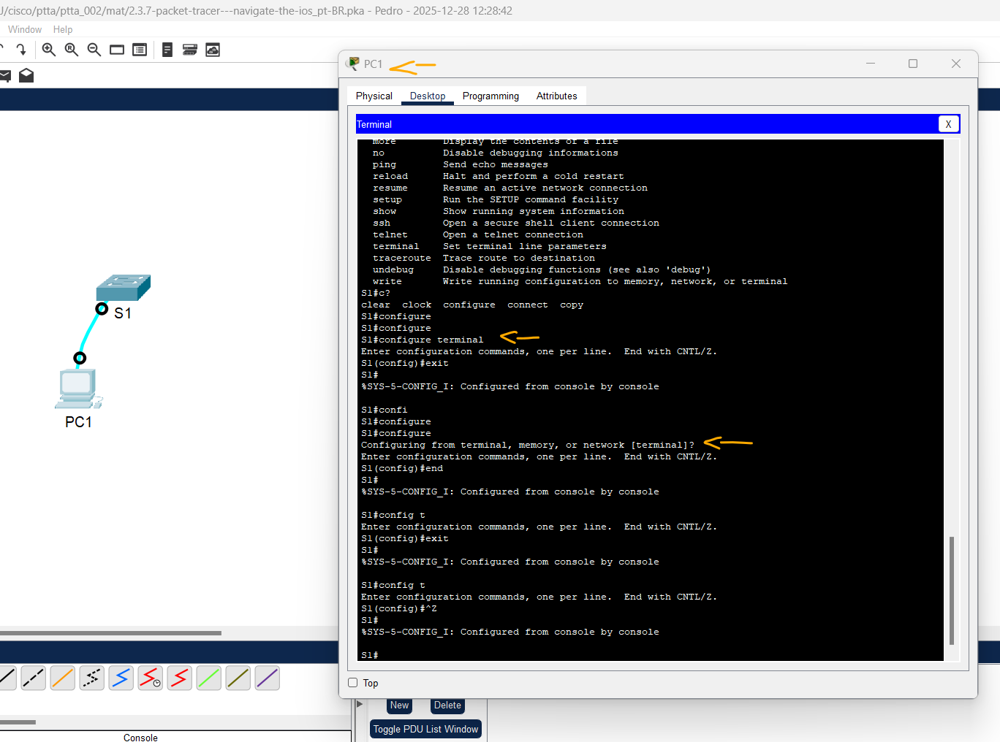
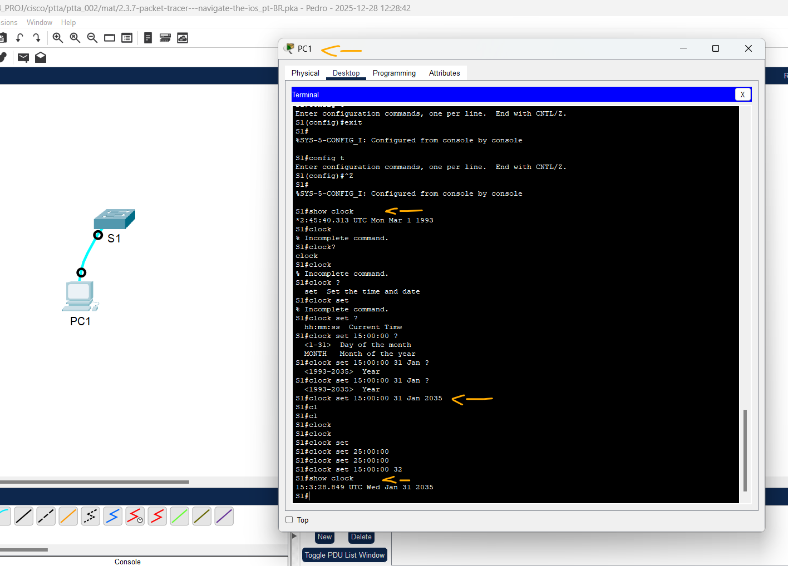

# Packet Tracer - Navegue no IOS   

### Cisco: <a href="../../">cisco   </a>
### Cisco Networking Academy: cna   </a>
### Training Category: <a href="../../pkt/">pkt</a>
### Software/Subject: network   </a>
### Course: <a href="./">pkt_002 (Packet Tracer - Navegue no IOS)   </a>

---

### Theme:
- Network

### Used Tools:
- Operating System (OS): 
  - Windows 11 
- Cloud Services:
  - Google Drive 
- Language:
  - HTML   
  - Markdown   
- Integrated Development Environment (IDE) and Text Editor:
  - Visual Studio Code (VS Code)   
- Versioning: 
  - Git   
- Repository:
  - GitHub   
- Network:
  - Cisco Internetwork Operating System (Cisco IOS)   
  - Cisco Packet Tracer   

---

<h3><a name="item00">Course Strcuture:</a></h3>

1. <a href="#item01">Parte 1: Estabelecer conexões básicas, acesso à CLI e explorar a ajuda</a> 
  1.1 <a href="#item01.01">Etapa 1: Conectar o PC1 ao S1 usando um cabo de console.</a> 
  1.2 <a href="#item01.02">Etapa 2: Estabelecer uma sessão de terminal com S1.</a> 
  1.3 <a href="#item01.03">Etapa 3: Explorar a Ajuda do IOS.</a> 
2. <a href="#item02">Parte 2: Explorar modos EXEC</a> 
  2.1 <a href="#item02.01">Etapa 1: Entrar no modo EXEC privilegiado.</a> 
  2.2 <a href="#item02.02">Etapa 2: Entre no modo de configuração global</a> 
3. <a href="#item03">Parte 3: Ajustar o Relógio.</a> 
  3.1 <a href="#item03.01">Etapa 1: Usar o comando clock.</a> 
  3.2 <a href="#item03.02">Etapa 2: explore mensagens de comando adicionais.</a> 

---

### Objective:   
Este PTTA teve como foco a exploração do **Cisco IOS**, o sistema operacional presente nos dispositivos de rede da Cisco. O objetivo principal foi compreender a hierarquia de modos de operação, abrangendo desde os modos Exec Usuário e Exec Privilegiado até o modo de Configuração Global. Durante a atividade, foram praticados comandos fundamentais de navegação e a configuração de parâmetros de sistema, como o comando clock para ajuste de data e hora. Além disso, foi enfatizada a utilização da ajuda sensível ao contexto (uso do caractere ?) como ferramenta essencial para a descoberta e sintaxe de comandos.

### Folder Structure:
- [README.md](./README.md): Este documento de README, escrito em **Markdown**, com o conteúdo desta atividade.
- [0-aux](./0-aux/): Pasta auxiliar com imagens utilizadas na construção dos arquivos de README desse curso.

### Development:

<a name="item01"><h4>1. Parte 1: Estabelecer conexões básicas, acesso à CLI e explorar a ajuda</h4></a>[Back to summary](#item00)

A imagem 01 mostra a topologia inicial.

<figure>
     
    <figcaption>Imagem 01.</figcaption>
</figure>
 

<a name="item01.01"><h4>1.1 Etapa 1: Conectar o PC1 ao S1 usando um cabo de console.</h4></a>[Back to summary](#item00)

- a. Clique no ícone Conexões (aquele que se parece com um raio) no canto inferior esquerdo da janela do Packet Tracer. 
- b. Clique no cabo de Console azul-claro para selecioná-lo. O ponteiro do mouse se transformará no que parece ser um conector com um cabo pendente.  
- c. Clique em PC1. Uma janela exibe uma opção para uma conexão RS-232. Conecte o cabo à porta RS-232. 
- d. Arraste a outra extremidade da conexão do console para o switch S1 e clique no nele para acessar a lista de conexões.  
- e. Selecione a porta do console para concluir a conexão. 

<a name="item01.02"><h4>1.2 Etapa 2: Estabelecer uma sessão de terminal com S1.</h4></a>[Back to summary](#item00)

- a. Clique em PC1 e selecione a guia Área de trabalho.
- b. Clique no ícone do aplicativo Terminal. Verifique se as configurações padrão da porta estão corretas. Pergunta: Qual é a configuração para bits por segundo?
  - 9600 bps.
- c. Clique em OK.
- d. A tela exibida pode ter várias mensagens. Em algum lugar na tela deve haver a mensagem Press RETURN to get started!. Pressione ENTER. Qual é o prompt exibido na tela?
  - `S1>`.

<a name="item01.03"><h4>1.3 Etapa 3: Explorar a Ajuda do IOS.</h4></a>[Back to summary](#item00)

- a. O IOS pode fornecer assistência para comandos dependendo do nível acessado. O prompt exibido no momento é chamado User EXEC e o dispositivo está esperando por um comando. A forma mais básica de ajuda é digitar um ponto de interrogação (?) no prompt para exibir uma lista de comandos: `S1> ?`. Pergunta: Que comando começa com a letra "C"?
  - `connect`.
- b. No prompt, digite t, seguido de um ponto de interrogação (?): `S1> t?`. Pergunta: Quais comandos são exibidos? 
  - `telnet`, `terminal` e `traceroute`.
- c. No prompt, digite te, seguido de um ponto de interrogação (?): `S1> te?`. Pergunta: Quais comandos são exibidos? Esse tipo de ajuda é conhecido como ajuda sensível ao contexto. Ele apresenta mais informações conforme os comandos são expandidos.  
  - `telnet` e `terminal`.

A imagem 02 exibe a conclusão da Parte 1.

<figure>
     
    <figcaption>Imagem 02.</figcaption>
</figure>
 

<a name="item02"><h4>2. Parte 2: Explorar modos EXEC</h4></a>[Back to summary](#item00)

<a name="item02.01"><h4>2.1 Etapa 1: Entrar no modo EXEC privilegiado.</h4></a>[Back to summary](#item00)

- a. No prompt, digite o ponto de interrogação (?): `S1> enable?`. Pergunta: Quais informações são exibidas para o comando enable? 
  - `<0-15>` e `<cr>`.
- b. Digite `en` e pressione a tecla Tab. `S1> en<Tab>`. Pergunta: O que é exibido após pressionar a tecla Tab? 
  - `enable`.
- b. Isso é chamado conclusão do comando (ou conclusão tab). Quando parte de um comando é digitada, a tecla Tab pode ser usada para concluir o comando parcial. Se os caracteres digitados forem suficientes para que o comando seja exclusivo, como no caso do comando enable, a parte restante do comando é exibida. O que acontece se você digitar `te<Tab>` no prompt?
  - Nada, pois existem mais de um comando iniciado por `te`.
- c. Digite o comando `enable` e pressione `ENTER`. Pergunta: Como o prompt muda? 
  - O prompt altera do modo User Exec para o modo Exec privilegiado.
- d. Quando solicitado, digite o ponto de interrogação (?): `S1# ?`. Um comando começa com a letra “C” no modo EXEC usuário. Quantos comandos são exibidos agora que o modo EXEC privilegiado está ativo? (Dica: você pode digitar `c?` para listar apenas os comandos que começam com a letra "C".)
  - 5.

<a name="item02.02"><h4>2.2 Etapa 2: Entre no modo de configuração global</h4></a>[Back to summary](#item00)

- a. No modo Exec privilegiado, um dos comando que começa com a letra "C" é configure. Digite o nome completo do comando ou parte dele que seja suficiente para que seja único. Pressione a tecla `<Tab>` para escolher o comando e aperte ENTER: `S1# configure`. Pergunta: Qual é a mensagem exibida? 
  - Questiona em qual configuração deseja entrar, terminal, memória ou rede.
- b. Pressione Enter para aceitar o parâmetro padrão entre colchetes `[terminal]`. Pergunta: Como o prompt muda?  
  - O prompt muda para o modo de configuração de terminal.
- c. Isso é chamado de modo de configuração global. Este modo será mais explorado nas próximas atividades e em laboratórios. Por enquanto, volte para o modo EXEC privilegiado digitando end, exit ou Ctrl-Z: `S1(config)# exit`.

A imagem 03 exibe a conclusão da Parte 2.

<figure>
     
    <figcaption>Imagem 03.</figcaption>
</figure>
 

<a name="item03"><h4>3. Parte 3: Ajustar o Relógio.</h4></a>[Back to summary](#item00)

<a name="item03.01"><h4>3.1 Etapa 1: Usar o comando clock.</h4></a>[Back to summary](#item00)

- a. Use o comando clock para explorar ainda mais a Ajuda e a sintaxe do comando. Digite show clock no prompt EXEC privilegiado: `S1# show clock`. Pergunta: Que informações são exibidas? Qual ano é exibido?  
  - É exibido informações de data e hora, cujo ano é 1993.
- b. Use a ajuda sensível ao contexto e o comando clock para definir a hora no comutador para a hora atual. Digite o comando clock e pressione ENTER: `S1# clock<ENTER>`. Pergunta: Que informações são exibidas? 
  - `% Incomplete command.`
- c. A mensagem “% Incomplete command” é exibida pelo IOS. Isso indica que o comando clock precisa de mais parâmetros. Sempre que houver a necessidade de mais informações, você poderá obter ajuda ao digitar um espaço depois do comando e antes do ponto de interrogação (?): `S1# clock ? ` Pergunta: Que informações são exibidas? 
  - O parâmetro `set`.
- c. O que é exibido se apenas o comando clock set for inserido e nenhuma solicitação de ajuda for feita com o uso do ponto de interrogação? 
  - `% Incomplete command.`
- d. Acerte o relógio usando o comando clock set. Prossiga com o comando, executando uma etapa de cada vez: `S1# clock set ?`. Perguntas: Quais informações estão sendo solicitadas? 
  - Hora atual (Current Time - hh:mm:ss).
- e. Com base nas informações solicitadas pelo comando clock set ?, insira a hora 3:00 p.m. usando o formato de 24 horas (15:00:00). Verifique se há necessidade de mais parâmetros: `S1# clock set 15:00:00 ?`. A saída retorna a solicitação para mais informações: `<1-31> Day of the month` e `MONTH Month of the year`.
- f. Tente ajustar a data para 31/01/2035, com o formato solicitado. Pode ser necessário solicitar ajuda adicional usando a ajuda sensível ao contexto para concluir o processo. Quando terminar, envie o comando show clock para exibir a configuração do relógio. A saída resultante do comando deverá ser exibida como: `S1# show clock   *15:0:4.869 UTC Tue Jan 31 2035`.
  - `clock set 15:00:00 31 Jan 2035`
- g. Caso você não tenha sido bem-sucedido, tente o seguinte comando para gerar a saída acima: `S1# clock set 15:00:00 31 Jan 2035`.

<a name="item03.02"><h4>3.2 Etapa 2: explore mensagens de comando adicionais.</h4></a>[Back to summary](#item00)

- a. O IOS fornece várias saídas para comandos incorretos ou incompletos. Continue usando o comando clock para explorar as mensagens adicionais, que podem ser encontradas à medida que você aprende a usar o IOS.  
- b. Emita os seguintes comandos e registre as mensagens: `S1# cl<tab>`. Perguntas: Que informações foram exibidas?
  - Nada.
- b. `S1# clock`. Pergunta: Que informações foram exibidas? 
  - `clock`.
- b. `S1# clock set 25:00:00`. Pergunta: Que informações foram exibidas?
  - Nada.
- b. `S1# clock set 15:00:00 32`. Pergunta: Que informações foram exibidas? 
  - `clock set 15:00:00 32`.

A imagem 04 exibe a conclusão da Parte 3.

<figure>
     
    <figcaption>Imagem 04.</figcaption>
</figure>
 