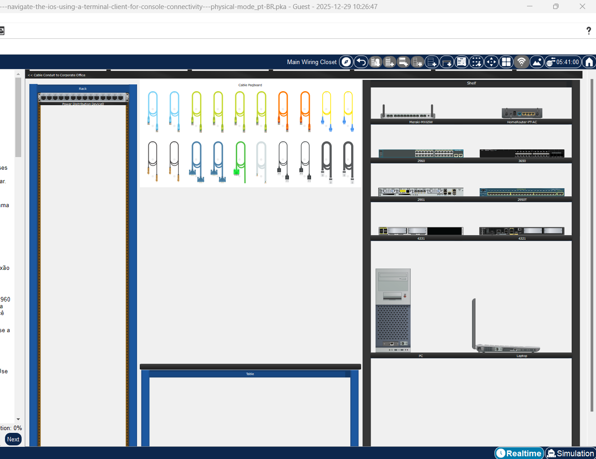
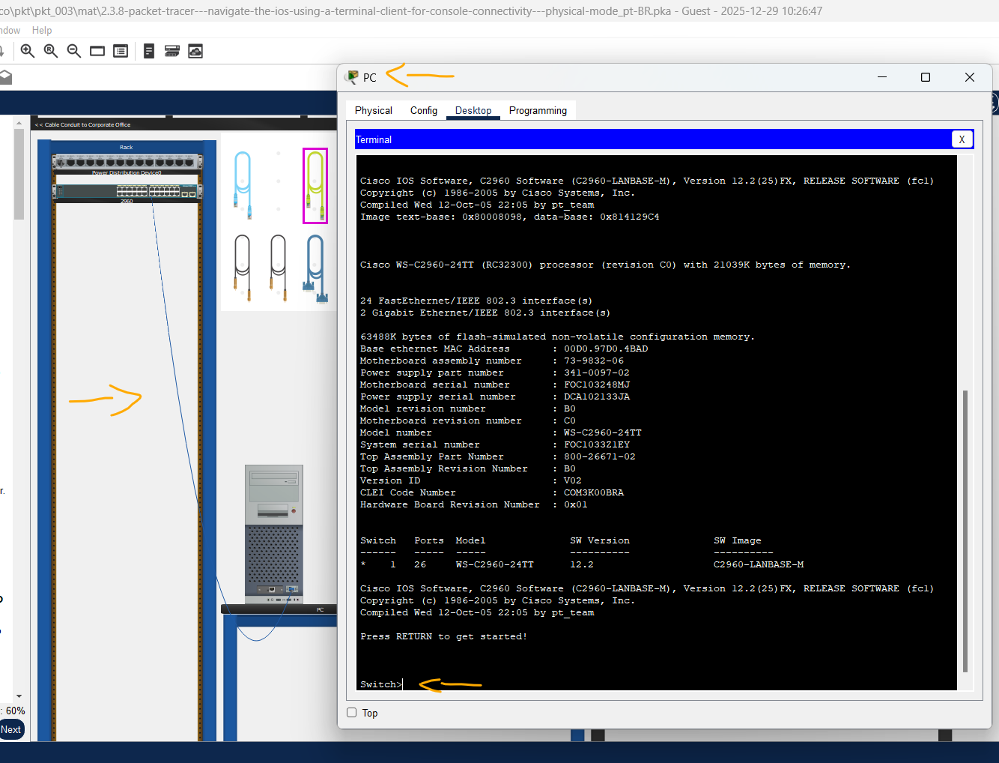
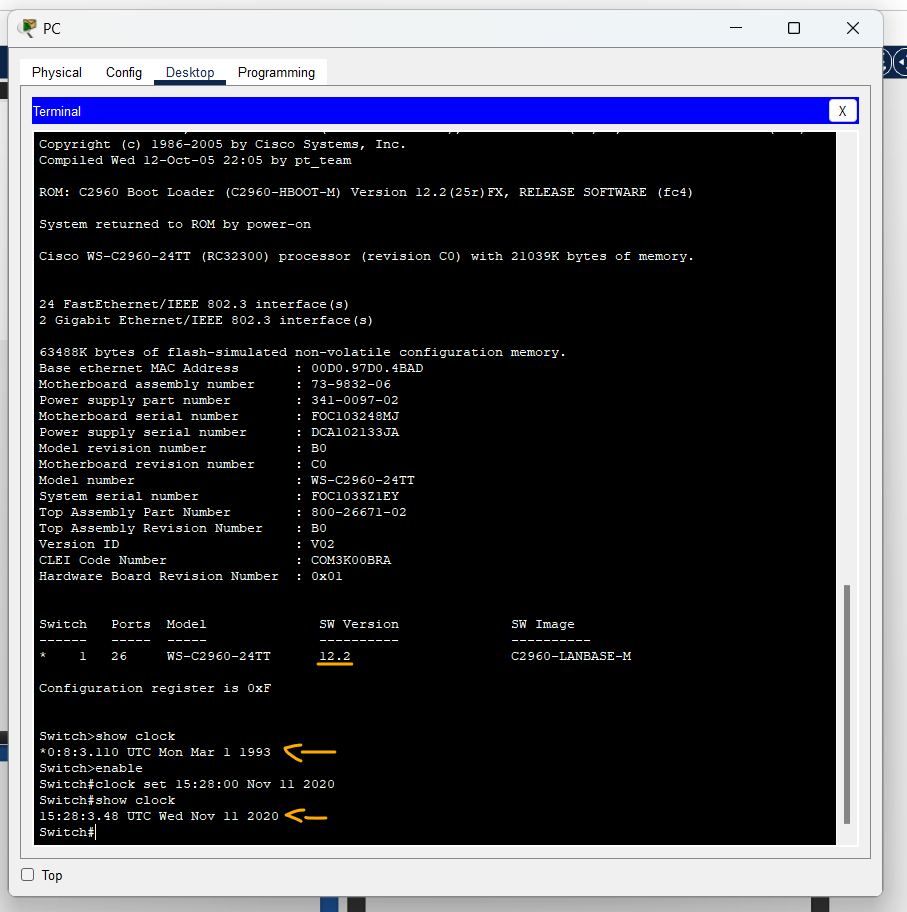
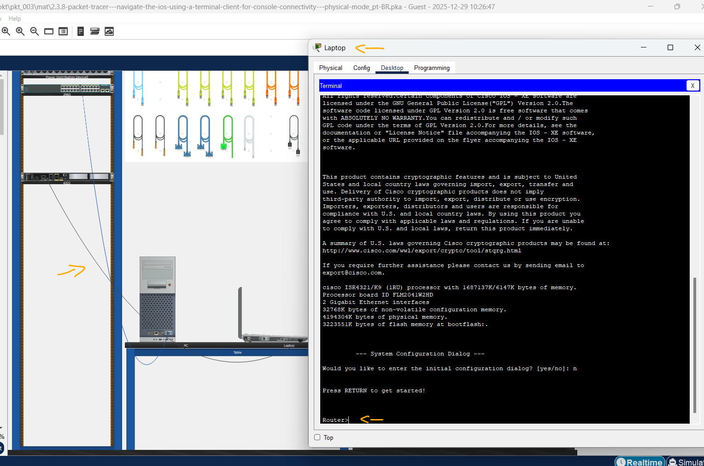

# Packet Tracer - Navegue pelo IOS usando um cliente terminal para conectividade de console - Modo Físico   

### Cisco: <a href="../../../">cisco   </a>
### Cisco Networking Academy: cna   </a>
### Training Category: <a href="../../../pkt/">pkt</a>
### Software/Subject: network   </a>
### Course: <a href="./">pkt_003 (Packet Tracer - Navegue pelo IOS usando um cliente terminal para conectividade de console - Modo Físico)   </a>

---

### Theme:
- Network

### Used Tools:
- Operating System (OS): 
  - Windows 11 
- Cloud Services:
  - Google Drive 
- Language:
  - HTML   
  - Markdown   
- Integrated Development Environment (IDE) and Text Editor:
  - Visual Studio Code (VS Code)   
- Versioning: 
  - Git   
- Repository:
  - GitHub   
- Network:
  - Cisco Internetwork Operating System (Cisco IOS)   
  - Cisco Packet Tracer   

---

<h3><a name="item00">Course Strcuture:</a></h3>

1. <a href="#item01">Parte 1: acessar um Switch Cisco pela porta serial de console</a> 
  1.1 <a href="#item01.01">Etapa 1: Instale e investigue um switch 2960.</a> 
  1.2 <a href="#item01.02">Etapa 2: Instale e investigue o PC.</a> 
  1.3 <a href="#item01.03">Etapa 3: Conecte um switch Cisco e um computador com um cabo rollover de console.</a> 
  1.4 <a href="#item01.04">Etapa 4: Configure o programa Terminal de Packet Tracer para estabelecer uma sessão de console com o switch.</a> 
2. <a href="#item02">Parte 2: exibir e definir configurações básicas de dispositivos</a> 
  2.1 <a href="#item02.01">Etapa 1: Exibir a versão da imagem do IOS do switch.</a> 
  2.2 <a href="#item02.02">Etapa 2: Configurar o relógio.</a> 
3. <a href="#item03">Parte 3: Acesse um roteador Cisco usando um cabo de console Mini-USB</a> 
  3.1 <a href="#item03.01">Etapa 1: Instale e investigue um roteador 4321.</a> 
  3.2 <a href="#item03.02">Etapa 2: Instale e investigue o laptop.</a> 
  3.3 <a href="#item03.03">Etapa 3: Conecte o roteador e o laptop usando um cabo mini-USB.</a> 
  3.4 <a href="#item03.04">Etapa 4: Configure o programa Terminal do Packet Tracer para estabelecer uma sessão de console com o switch.</a> 
4. <a href="#item04">Perguntas para reflexão</a> 

---

### Objective:
O objetivo deste PTPM foi realizar o acesso local a dispositivos Cisco (Switch e Roteador) através de uma conexão via porta Console. A prática envolveu o cabeamento físico e o uso de um emulador de terminal para estabelecer a comunicação entre a estação de trabalho e o hardware. Após o acesso, foram executados procedimentos de inspeção de parâmetros do sistema e a configuração manual do relógio interno (clock), consolidando o entendimento sobre o acesso de gerenciamento inicial "out-of-band".

### Folder Structure:
- [README.md](./README.md): Este documento de README, escrito em **Markdown**, com o conteúdo desta atividade.
- [0-aux](./0-aux/): Pasta auxiliar com imagens utilizadas na construção dos arquivos de README desse curso.

### Development:

<a name="item01"><h4>1. Parte 1: acessar um Switch Cisco pela porta serial de console</h4></a>[Back to summary](#item00)

A imagem 01 mostra a topologia inicial.

<figure>
     
    <figcaption>Imagem 01.</figcaption>
</figure>
 

<a name="item01.01"><h4>1.1 Etapa 1: Instale e investigue um switch 2960.</h4></a>[Back to summary](#item00)

- a. Existem vários switches, roteadores e outros dispositivos na Prateleira. Clique e arraste o 2960 para o Rack. No Packet Tracer, a maioria dos dispositivos que você arrasta para o rack ou a mesa são conectados automaticamente à alimentação. Alguns dispositivos exigem que você ligue a energia. No entanto, um interruptor 2960 liga assim que você movê-lo para o Rack.  
- b. Clique com o botão direito do mouse no interruptor 2960 e selecione Inspecionar Frente. Use a ferramenta de zoom para obter uma visualização melhor. Observe que há 24 portas para conectar usuários e duas portas adicionais para conectar o switch a outros switches ou roteadores. 
- c. Clique no X para fechar a vista Inspecionar frente. 
- d. Clique com o botão direito do mouse no interruptor 2960 e selecione Inspecionar traseira. Use a ferramenta de zoom para obter uma visualização melhor. Observe que há uma porta CONSOLE para conectar um cabo de rolagem a um PC.   
- e. Clique no X para fechar a visão Inspecionar a traseira . 

<a name="item01.02"><h4>1.2 Etapa 2: Instale e investigue o PC.</h4></a>[Back to summary](#item00)

- a. Clique e arraste o PC para a tabela.  
- b. Clique com o botão direito do mouse no PC e selecione Inspecionar Frente. Clique no botão de energia vermelho para ligar o servidor. Agora você deve ver uma luz verde na frente do PC. Na parte inferior do PC, observe que há uma interface Fast Ethernet. Ao lado dele é uma porta RS 232 para conectar um cabo de rolagem. Abaixo destas estão duas portas USB que também podem ser usadas para acesso ao console. 

<a name="item01.03"><h4>1.3 Etapa 3: Conecte um switch Cisco e um computador com um cabo rollover de console.</h4></a>[Back to summary](#item00)

- a. No Cabo Pegboard, clique em um cabo de console de rolagem azul.  
- b. No PC, clique na porta RS 232.  
- c. Clique com o botão direito do mouse no switch2960 e escolha Inspecionar traseira. 
- d. Clique na porta CONSOLE para conectar o cabo do console de rolagem. 

<a name="item01.04"><h4>1.4 Etapa 4: Configure o programa Terminal de Packet Tracer para estabelecer uma sessão de console com o switch.</h4></a>[Back to summary](#item00)

- a. Clique em PC > aba Desktop > Terminal. Os parâmetros padrão para a porta de console são 9600 baud, 8 bits de dados, sem paridade, 1 bit de parada, sem controle de fluxo. As configurações padrão do Terminal correspondem às configurações da porta do console para comunicações com o Cisco IOS no switch. 
- b. Clique em OK. A última linha na saída do terminal deve ser Pressione RETURN para começar!.  
- c. Pressione a tecla ENTER para obter à alerta do interruptor do modo do EXEC do usuário. 

A imagem 02 exibe a conclusão da Parte 1.

<figure>
     
    <figcaption>Imagem 02.</figcaption>
</figure>
 

<a name="item02"><h4>2. Parte 2: exibir e definir configurações básicas de dispositivos</h4></a>[Back to summary](#item00)

<a name="item02.01"><h4>2.1 Etapa 1: Exibir a versão da imagem do IOS do switch.</h4></a>[Back to summary](#item00)

- a. Enquanto estiver no modo EXEC do usuário, use o comando show version para exibir a versão do IOS para o switch: `Switch> show version`. Pergunta: Qual versão da imagem do IOS é usada no momento pelo seu switch? 
  - 12.2.

<a name="item02.02"><h4>2.2 Etapa 2: Configurar o relógio.</h4></a>[Back to summary](#item00)

- a. Exiba as configurações atuais do relógio: `Switch> show clock`.
- b. Você deve estar no modo EXEC privilegiado para alterar as configurações do relógio. Para entrar no modo EXEC privilegiado, digite enable no prompt do modo EXEC usuário: `Switch> enable`.
- c. Configure o relógio. O ponto de interrogação (?) fornece ajuda e permite determinar a entrada esperada para configuração da hora, data e ano atuais. Pressione Enter para concluir a configuração do relógio: `Switch# clock set ?` -> `Switch# clock set 15:28:00 ?` -> `Switch# clock set 15:28:00 Nov 11 ?` -> `Switch# clock set 15:28:00 Nov 11 2020`.
- d. Digite o comando show clock para verificar se a configuração do relógio foi atualizada: `Switch# show clock`.

A imagem 03 exibe a conclusão da Parte 2.

<figure>
     
    <figcaption>Imagem 03.</figcaption>
</figure>
 

<a name="item03"><h4>3. Parte 3: Acesse um roteador Cisco usando um cabo de console Mini-USB</h4></a>[Back to summary](#item00)

<a name="item03.01"><h4>3.1 Etapa 1: Instale e investigue um roteador 4321.</h4></a>[Back to summary](#item00)

- a. Localize o roteador 4321 na prateleira. Clique e arraste o roteador 4321 para o Rack. 
- b. Clique com o botão direito do mouse no roteador 4321 e selecione Inspecionar frente. Use a ferramenta de zoom para obter uma visualização melhor. Observe que há um interruptor de alimentação à esquerda. Clique nele para ligar o roteador. Observe também as outras portas que estão disponíveis. Há um RJ-45 e uma porta mini-USB para conectividade de console.  
- c. Clique no X para fechar a vista Inspecionar frente.

<a name="item03.02"><h4>3.2 Etapa 2: Instale e investigue o laptop.</h4></a>[Back to summary](#item00)

- a. Clique e arraste o Laptop para a mesa. 
- b. Clique com o botão direito do mouse no laptop e selecione Inspecionar frente. Clique no botão liga/desliga no extremo esquerdo para ligar o laptop. Agora você deve ver uma luz verde. Observe que há duas portas RJ-45: uma para RS 232 e outra para Fast Ethernet. Existem também duas portas USB. Você pode usar qualquer um destes para conectar à porta mini-USB no roteador 4321. 
- c. Clique no X para fechar a vista Inspecionar frente.

<a name="item03.03"><h4>3.3 Etapa 3: Conecte o roteador e o laptop usando um cabo mini-USB.</h4></a>[Back to summary](#item00)

- a. No cabo Pegboard, clique em um cabo mini-USB.  
- b. No Laptop, clique em uma porta mini-USB.   
- c. Clique na porta mini-USB no roteador 4321. Você pode querer clicar com o botão direito do mouse e selecione Inspecionar Frente para obter uma visão mais próxima.

<a name="item03.04"><h4>3.4 Etapa 4: Configure o programa Terminal do Packet Tracer para estabelecer uma sessão de console com o switch.</h4></a>[Back to summary](#item00)

- a. Clique Laptop > aba Desktop >Terminal. As configurações padrão do Terminal correspondem às configurações da porta do console para comunicações com o Cisco IOS no switch.
- b. Depois que o roteador tiver concluído seu processo de inicialização, a seguinte mensagem é exibida. Digite n para continuar.  
- c. Pressione a tecla ENTER para acessar o prompt do roteador no modo EXEC do usuário. 

A imagem 04 exibe a conclusão da Parte 3.

<figure>
     
    <figcaption>Imagem 04.</figcaption>
</figure>
 

<a name="item04"><h4>4. Perguntas para reflexão</h4></a>[Back to summary](#item00)

- a. Como evitar que pessoas não autorizadas acessem seu dispositivo Cisco por meio da porta de console?
  - Configurando senhas para os dois modos de acesso (User e Privilegiado).
- b. Quais são as vantagens e desvantagens de usar a conexão de console serial em comparação com a conexão de console USB com um roteador ou switch Cisco? 
  - A principal vantagem da conexão serial é a sua compatibilidade universal com equipamentos antigos e a estabilidade física do conector RJ-45, embora exija adaptadores em computadores modernos. Já a conexão USB dispensa adaptadores e cabos proprietários (rollover), mas pode apresentar desvantagens como a necessidade de instalação de drivers específicos e a falta de suporte em dispositivos Cisco legados. No geral, enquanto o USB oferece conveniência plug-and-play, o console serial permanece como o padrão mais confiável para recuperação de desastres em ambientes críticos.

