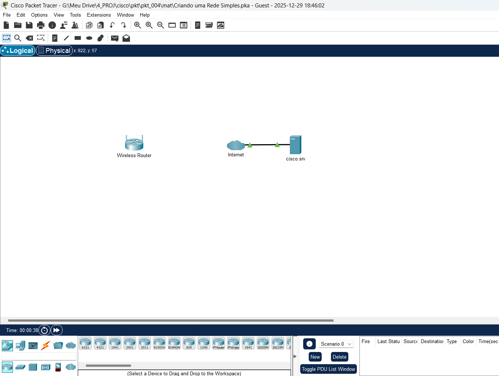
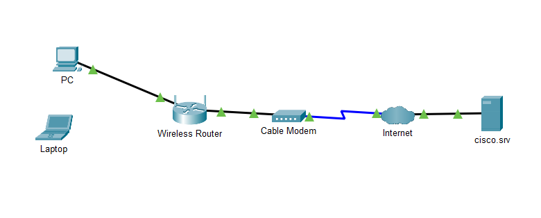
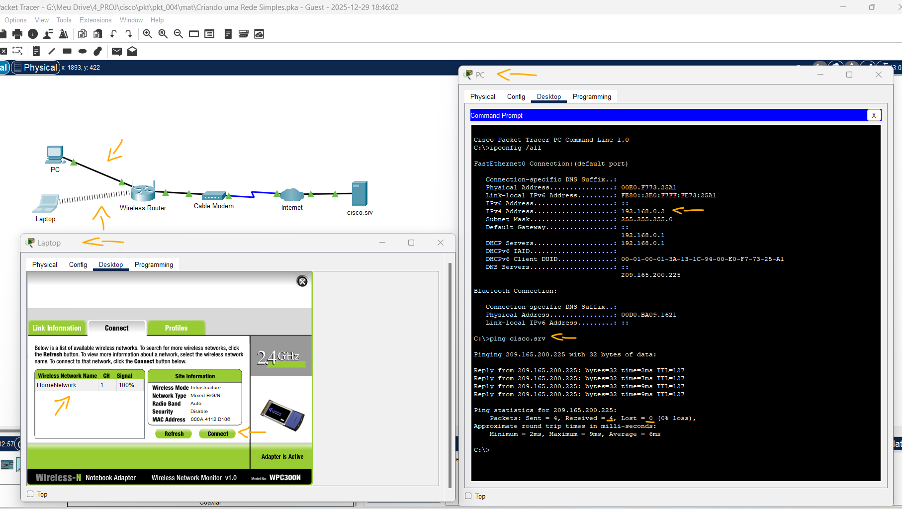

# Packet Tracer – Criar uma Rede Simples   

### Cisco: <a href="../../../">cisco   </a>
### Cisco Networking Academy: cna   </a>
### Training Category: <a href="../../../pkt/">pkt</a>
### Software/Subject: network   </a>
### Course: <a href="./">pkt_004 (Packet Tracer – Criar uma Rede Simples)   </a>

---

### Theme:
- Network

### Used Tools:
- Operating System (OS): 
  - Windows 11 
- Cloud Services:
  - Google Drive 
- Language:
  - HTML   
  - Markdown   
- Integrated Development Environment (IDE) and Text Editor:
  - Visual Studio Code (VS Code)   
- Versioning: 
  - Git   
- Repository:
  - GitHub   
- Network:
  - Cisco Packet Tracer   
  - ping   
  
---

<h3><a name="item00">Course Strcuture:</a></h3>

1. <a href="#item01">Parte 1: Construa uma rede simples.</a> 
  1.1 <a href="#item01.01">Etapa 1: Adicione dispositivos de rede ao ambiente de trabalho.</a> 
  1.2 <a href="#item01.02">Etapa 2: Altere os nomes de exibição dos dispositivos de rede.</a> 
  1.3 <a href="#item01.03">Etapa 3: Adicionar o cabeamento físico entre dispositivos no ambiente de trabalho</a> 
2. <a href="#item02">Parte 2: Configurar os End Devices e Verificar a Conectividade</a> 
  2.1 <a href="#item02.01">Etapa 1: Configurar o computador</a> 
  2.2 <a href="#item02.02">Etapa 2: Configurar o notebook.</a> 
3. <a href="#item03">Reflexão</a> 

---

### Objective:
O objetivo desta atividade foi construir uma rede local conectada à internet via roteador sem fio e modem, configurando os dispositivos finais para a obtenção de IP via DHCP e validando a conectividade através do acesso ao servidor.

### Folder Structure:
- [README.md](./README.md): Este documento de README, escrito em **Markdown**, com o conteúdo desta atividade.
- [0-aux](./0-aux/): Pasta auxiliar com imagens utilizadas na construção dos arquivos de README desse curso.

### Development:

<a name="item01"><h4>1. Parte 1: Construa uma rede simples.</h4></a>[Back to summary](#item00)

A imagem 01 mostra a topologia inicial.

<figure>
     
    <figcaption>Imagem 01.</figcaption>
</figure>
 

<a name="item01.01"><h4>1.1 Etapa 1: Adicione dispositivos de rede ao ambiente de trabalho.</h4></a>[Back to summary](#item00)

- a. Nesta etapa, você adicionará um PC, um laptop e um cable modem ao Logical Workspace. Um cable modem é um dispositivo de hardware que permite a comunicação com um provedor de serviços de Internet (ISP). O cabo coaxial do ISP está conectado ao cable modem, e um cabo Ethernet da rede local também está conectado. O cable modem converte a conexão coaxial em uma conexão Ethernet. Usando a caixa de seleção Tipo de dispositivo, adicione os seguintes dispositivos à área de trabalho. A categoria e a subcategoria associadas ao dispositivo estão listadas abaixo:
  - PC: End Devices > End Devices > PC
  - Laptop: End Devices > End Devices > Laptop
  - Cable Modem: Network Devices> WAN Emulation> Cable Modem

<a name="item01.02"><h4>1.2 Etapa 2: Altere os nomes de exibição dos dispositivos de rede.</h4></a>[Back to summary](#item00)

- a. Para alterar os nomes de exibição dos dispositivos de rede, clique no ícone de dispositivo no Logical Workspace.
- b. Clique na guia Config na janela de dispositivos da nuvem.
- c. Insira o novo nome do dispositivo recém-adicionado no campo Nome para exibição: PC, Laptop e Cable Modem.

<a name="item01.03"><h4>1.3 Etapa 3: Adicionar o cabeamento físico entre dispositivos no ambiente de trabalho</h4></a>[Back to summary](#item00)

- a. O computador precisará de um cabo straight-through de cobre para se conectar ao roteador sem fio. Usando a Caixa de seleção de tipo de dispositivo, clique em Conexões (ícone de um raio). Selecione o cabo de cobre straight-through na caixa de seleção de dispositivos e conecte-o à interface FastEthernet 0 do computador e à interface Ethernet 1 do roteador sem fio
- b. O roteador sem fio precisará de um cabo straight-through para se conectar ao cable modem. Selecione o cabo straight-through na caixa de seleção de dispositivos e conecte-o à interface de Internet do roteador sem fio e à interface de Porta 1 do cable modem. 
- c. O cable modem precisará de um cabo coaxial para conectar-se à nuvem da Internet. Selecione o cabo coaxial na caixa de seleção de dispositivos e conecte-o à interface da Porta 0 do cable modem e à interface coaxial 7 da nuvem da Internet. 

A imagem 02 exibe a conclusão da Parte 1.

<figure>
     
    <figcaption>Imagem 02.</figcaption>
</figure>
 

<a name="item02"><h4>2. Parte 2: Configurar os End Devices e Verificar a Conectividade</h4></a>[Back to summary](#item00)

- Nesta parte, você conectará um PC e um laptop ao roteador sem fio. O PC será conectado à rede usando um cabo Ethernet. No notebook, você substituirá a placa de interface de rede com fio (NIC) por uma NIC sem fio e conectará o laptop ao roteador sem fio.
- Depois que os dois End Devices estiverem conectados à rede, você verificará a conectividade com cisco.srv. Ao PC e ao laptop será atribuído um endereço IP (Internet Protocol). O IP (Internet Protocol) é um conjunto de regras para roteamento e endereçamento de dados na Internet. Os endereços IP são usados para identificar os dispositivos em uma rede e permitir que os dispositivos se conectem e transfiram dados em uma rede.

<a name="item02.01"><h4>2.1 Etapa 1: Configurar o computador</h4></a>[Back to summary](#item00)

- a. Você vai configurar o PC para a rede com fio nesta etapa. Clique em PC. Na guia Desktop, navegue até IP Configuration para verificar se o DHCP está ativado e se o PC recebeu um endereço IP. Selecione DHCP em IP Configuration se um endereço IP não estiver configurado no campo Endereço IPv4. Observe o processo enquanto o PC está recebendo um endereço IP do servidor DHCP. DHCP - Protocolo de configuração de host dinâmico (Dynamic Host Configuration Protocol). Esse protocolo atribui endereços IP aos dispositivos de forma dinâmica. Nessa rede simples, o Roteador sem fio é configurado para atribuir endereços IP a dispositivos que solicitam endereços IP. Se o DHCP estiver desativado, você precisará atribuir um endereço IP e configurar todas as informações necessárias para se comunicar com outros dispositivos na rede e na Internet.
- b. Fechar IP Configuration. Na guia Desktop, clique em Command Prompt.
- c. No prompt, digite ipconfig /all para verificar as informações de endereçamento IPv4 do servidor DHCP. O computador deve receber um endereço IPv4 no intervalo 192.168.0.x. Observação: existem dois tipos de endereços IP: IPv4 e IPv6. Um endereço IPv4 (Internet Protocol versão 4) é uma sequência de números no formato x.x.x.x, como você usou neste laboratório. À medida que a Internet cresceu, tornou-se necessário ter mais endereços IP. Então, o IPv6 (protocolo de Internet versão 6) foi introduzido no final dos anos 90 para abordar as limitações do IPv4. Os detalhes do endereçamento IPv6 estão além do escopo dessa atividade.
- d. Teste a conectividade com o cisco.srv do PC. Do command prompt, digitando o comando ping cisco.srv. Pode levar alguns segundos para que o ping retorne. Quatro respostas devem ser recebidas, como mostrado na figura.

<a name="item02.02"><h4>2.2 Etapa 2: Configurar o notebook.</h4></a>[Back to summary](#item00)

- a. Nesta etapa você irá configurar o notebook para acessar a rede sem fio. Clique em Laptop e selecione a guia Physical.
- b. Na guia Physical será necessário remover o módulo de cobre da Ethernet e substituí-lo com o módulo WPC300N sem fio.
  - Primeiro desligue o notebook clicando no botão Liga/Desliga.
  - Em seguida, remova o módulo de cobre da Ethernet atualmente instalado clicando no módulo na lateral do notebook e arrastando-o para o painel MODULES à esquerda da janela do notebook.
  - Depois, instale o módulo WPC300N sem fio clicando nele no painel MODULES e arrastando-o para a porta do módulo vazia na lateral do notebook.
  - Por fim ligue o notebook novamente, clicando no botão Liga/Desliga do notebook novamente.
- c. Com o módulo sem fio instalado, a próxima tarefa é conectar o notebook à rede sem fio. Clique na guia Desktop e clique em PC Wireless.
- d. Selecione a guia Connect. Após um breve atraso, a rede sem fio HomeNetwork estará visível na lista de redes sem fio. Clique em Refresh (Atualizar) se necessário para ver a lista de redes disponíveis. Selecione HomeNetwork. Clique em Conectar.
- e. Feche a janela PC Wireless. Selecione a guia Desktop e abra o Web Browser.
- f. No navegador da Web, acesse cisco.srv.

A imagem 03 exibe a conclusão da Parte 2.

<figure>
     
    <figcaption>Imagem 03.</figcaption>
</figure>
 

<a name="item03"><h4>3. Reflexão</h4></a>[Back to summary](#item00)

- a. Agora que você verificou a conectividade com o cisco.srv, use o comando ipconfig do prompt de comando para preencher a tabela de endereçamento IP abaixo:

| Dispositivo | Endereço IPv4 | Máscara de sub-rede | Gateway padrão |
| :---: | :---: | :---: | :---: |
| PC | 192.168.0.2 | 255.255.255.0 | 192.168.0.1 |
| Laptop | 192.168.0.3 | 255.255.255.0 | 192.168.0.1 |

