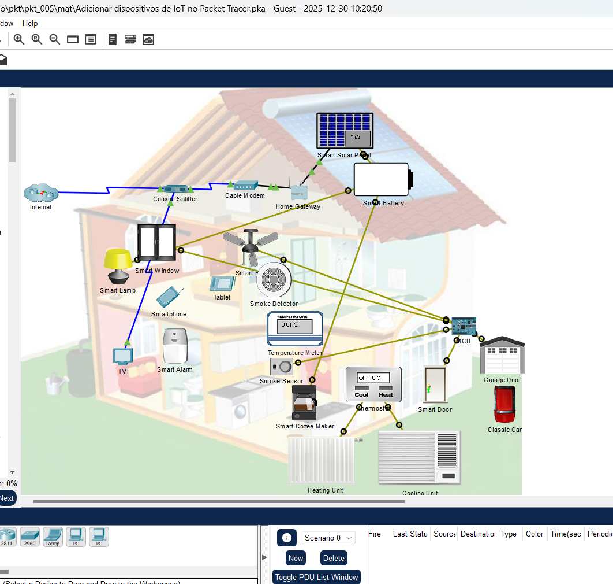
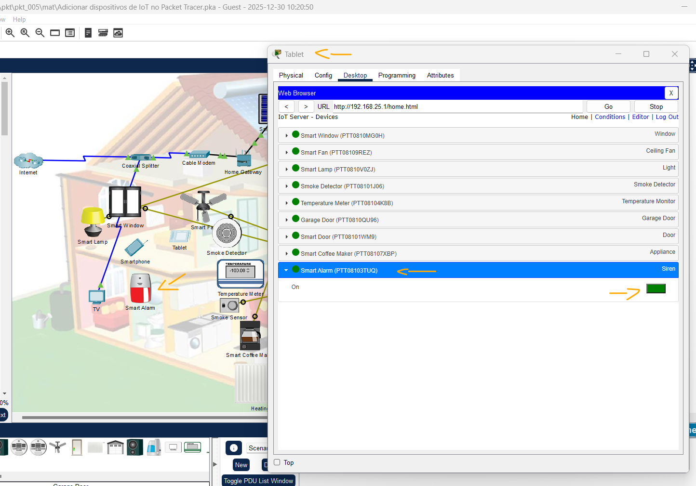
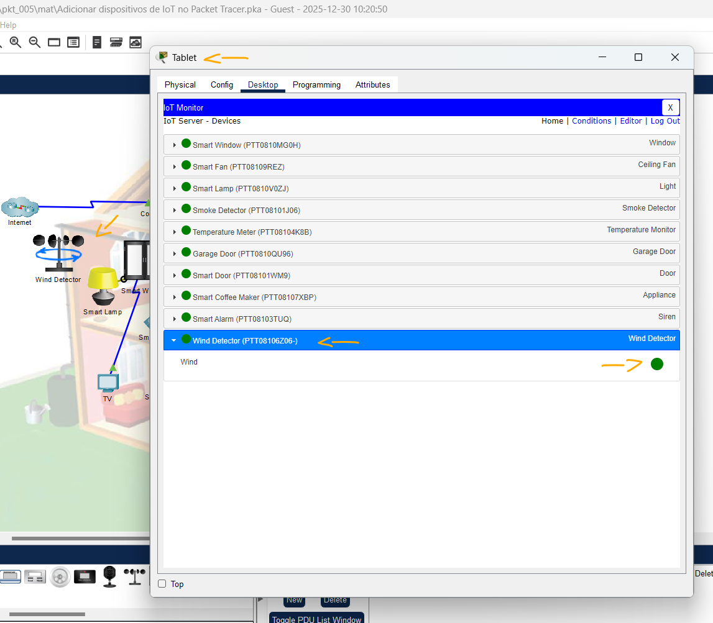
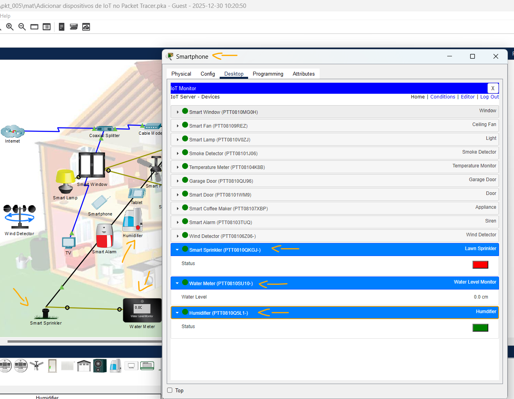

# Packet Tracer - Adicionar dispositivos de IoT no Packet Tracer   

### Cisco: <a href="../../../">cisco   </a>
### Cisco Networking Academy: cna   </a>
### Training Category: <a href="../../../pkt/">pkt</a>
### Software/Subject: iot   </a>
### Course: <a href="./">pkt_005 (Packet Tracer - Adicionar dispositivos de IoT no Packet Tracer)   </a>

---

### Theme:
- Internet of Things (IoT)
- Network

### Used Tools:
- Operating System (OS): 
  - Windows 11 
- Cloud Services:
  - Google Drive 
- Language:
  - HTML   
  - Markdown   
- Integrated Development Environment (IDE) and Text Editor:
  - Visual Studio Code (VS Code)   
- Versioning: 
  - Git   
- Repository:
  - GitHub   
- Network:
  - Cisco Packet Tracer   

---

<h3><a name="item00">Course Strcuture:</a></h3>

1. <a href="#item01">Parte 1: Explorar a rede existente da casa inteligente</a> 
  1.1 <a href="#item01.01">Etapa 1: Explore os dispositivos finais de IoT disponíveis.</a> 
  1.2 <a href="#item01.02">Etapa 2: Explore a rede da casa inteligente.</a> 
2. <a href="#item02">Parte 2: Adicionar dispositivos de IoT sem fio à rede da casa inteligente</a> 
  2.1 <a href="#item02.01">Etapa 1: Adicione um dispositivo sem fio à rede.</a> 
  2.2 <a href="#item02.02">Etapa 2: Verifique se o Detector de Vento está na rede.</a> 
3. <a href="#item03">Parte 3: Adicionar dispositivos de IoT com fio à rede da casa inteligente</a> 
  3.1 <a href="#item03.01">Etapa 1: Conecte, via cabo, um dispositivo à rede.</a> 
  3.2 <a href="#item03.02">Etapa 2: Configure o Lawn Sprinkler para conectividade de rede.</a> 
  3.3 <a href="#item03.03">Etapa 3: Verifique se o Smart Sprinkler está na rede.</a> 
  3.4 <a href="#item03.04">Etapa 4: Adicione um Monitor de Nível de Água (Water Level Monitor).</a> 
  3.5 <a href="#item03.05">Etapa 5: Verifique se o medidor de nível de água está na rede.</a> 
  3.6 <a href="#item03.06">Etapa 6: Adicione outros dispositivos de IoT.</a> 

---

### Objective:
O objetivo deste PTTA foi integrar e configurar dispositivos inteligentes (Smart Things) em uma rede local, utilizando conexões cabeadas e sem fios para estabelecer a comunicação.

### Folder Structure:
- [README.md](./README.md): Este documento de README, escrito em **Markdown**, com o conteúdo desta atividade.
- [0-aux](./0-aux/): Pasta auxiliar com imagens utilizadas na construção dos arquivos de README desse curso.

### Development:

<a name="item01"><h4>1. Parte 1: Explorar a rede existente da casa inteligente</h4></a>[Back to summary](#item00)

A imagem 01 mostra a topologia inicial.

<figure>
     
    <figcaption>Imagem 01.</figcaption>
</figure>
 

<a name="item01.01"><h4>1.1 Etapa 1: Explore os dispositivos finais de IoT disponíveis.</h4></a>[Back to summary](#item00)

- a. No canto inferior esquerdo da janela do Packet Tracer, localize e clique no ícone End Devices (Ctrl + Alt + V) na linha superior e no ícone Home (Ctrl + Alt + H) na linha inferior.
- b. A caixa Seleção específica do dispositivo exibe os diversos dispositivos Smart Home IoT disponíveis. Mova o ponteiro do mouse sobre cada dispositivo e observe que o nome descritivo do dispositivo é exibido na parte inferior da caixa Device-Specific Selection (Seleção específica de dispositivo). Pense um pouco para examinar cada tipo de dispositivo.

<a name="item01.02"><h4>1.2 Etapa 2: Explore a rede da casa inteligente.</h4></a>[Back to summary](#item00)

- a. No ambiente de trabalho lógico, há uma rede de casa inteligente, previamente desenvolvida, que consiste em vários dispositivos de IoT com e sem fio e em dispositivos de infraestrutura de rede. Quando você coloca o cursor sobre um dispositivo, como o ventilador inteligente, uma janela informativa é aberta que contém informações básicas de rede sobre o dispositivo.
- b. Para ligar ou ativar um dispositivo, mantenha pressionada a tecla Alt e clique no dispositivo que deseja testar. Tente fazer isso em cada um dos dispositivos inteligentes para observar o que eles fazem.
- c. Clique no Home Gateway. (Gateway Doméstico). A guia Physical (Física) é selecionada por padrão e mostra uma imagem do gateway doméstico.
- d. Clique na guia Config e, no painel esquerdo, clique em LAN para visualizar as configurações de LAN do Home Gateway. Anote o endereço IP da rede doméstica para referência futura.
  - 192.168.25.1
- e. Clique em Wireless no painel esquerdo. Expanda a janela, se necessário. Anote o SSID da rede doméstica.
  - HomeGateway
- e. Anote a frase secreta WPA2-PSK.
  - mySecretKey
- f. Clique no dispositivo Tablet e, em seguida, clique na guia Desktop > Web Browser.
- g. No campo URL, insira o endereço IP do gateway doméstico que você anotou e clique em Go.
- h. Digite admin como nome de usuário e senha e clique em Enviar.
- i. Uma lista de todos os dispositivos de IoT conectados é exibida. Clique em um dispositivo na lista para ver o status e as configurações. Tente interagir com alguns dos dispositivos para ver como você pode gerenciar seus estados no Tablet. Por exemplo, abra e feche a porta da garagem, ligue e desligue o Smart Lamp e assim por diante.

A imagem 02 exibe a conclusão da Parte 1.

<figure>
     
    <figcaption>Imagem 02.</figcaption>
</figure>
 

<a name="item02"><h4>2. Parte 2: Adicionar dispositivos de IoT sem fio à rede da casa inteligente</h4></a>[Back to summary](#item00)

<a name="item02.01"><h4>2.1 Etapa 1: Adicione um dispositivo sem fio à rede.</h4></a>[Back to summary](#item00)

- a. Na caixa Device-Specific Selection (Seleção específica de dispositivo), clique no ícone Wind Detector (Detector de vento) e, em seguida, clique no ambiente de trabalho em que deseja localizar o Wind Detector (Detector de vento). (Clique em End Devices > Home > Wind Detector)
- b. Para configurar o Detector de vento, clique nele e, em seguida, clique na guia Configuração.
- c. Altere o nome de exibição para Wind Detector. Observação: para pontuar corretamente, o nome de exibição deve ser o mesmo indicado nas instruções.
- d. No painel inferior, altere o IoT Server para Home Gateway.
- e. Clique em Wireless0 no painel esquerdo. Altere o Tipo de autenticação para WPA2-PSK e, na caixa Frase secreta de PSK, insira a frase secreta anotada na parte anterior. Em alguns segundos, uma conexão sem fio deverá ser formada entre o Detector de Vento e o Home Gateway. Você pode fechar a janela do Detector de vento.

<a name="item02.02"><h4>2.2 Etapa 2: Verifique se o Detector de Vento está na rede.</h4></a>[Back to summary](#item00)

- a. Clique no tablet.
- b. Se necessário, faça login novamente no gateway doméstico.
- c. O dispositivo Water Meter agora aparece no final da lista IoT Server - Devices.

A imagem 03 exibe a conclusão da Parte 2.

<figure>
     
    <figcaption>Imagem 03.</figcaption>
</figure>
 

<a name="item03"><h4>3. Parte 3: Adicionar dispositivos de IoT com fio à rede da casa inteligente</h4></a>[Back to summary](#item00)

<a name="item03.01"><h4>3.1 Etapa 1: Conecte, via cabo, um dispositivo à rede.</h4></a>[Back to summary](#item00)

- a. Na caixa Seleção específica do dispositivo, clique em Lawn Sprinkler (End Devices > Home > Lawn Sprinkler), e, em seguida, clique na área de trabalho onde deseja colocá-lo.
- b. Clique em Lawn Sprinkler e, em seguida, clique em Advanced no canto inferior direito. Mais guias estão disponíveis agora.
- c. Clique na guia I/O Config.
- d. No menu suspenso de Network Adapter, altere-o para PT-IOT-NM-1CFE para ter uma conexão FastEthernet.
- e. Conecte via cabo o Lawn Sprinkler ao Home Gateway. Na caixa Device-Type Selection (Seleção de tipo de dispositivo), clique no ícone Connections (Conexões) (esse ícone se parece com um raio). Clique no ícone de tipo de conector Copper Straight Through na caixa de seleção específica do dispositivo e, em seguida, clique no ícone Lawn Sprinkler e conecte-o à interface FastEthernet0. Em seguida, clique no ícone Home Gateway (gateway doméstico) e conecte a outra extremidade do cabo a uma Interface Ethernet disponível.

<a name="item03.02"><h4>3.2 Etapa 2: Configure o Lawn Sprinkler para conectividade de rede.</h4></a>[Back to summary](#item00)

- a. Na janela Lawn Sprinkler, clique na guia Config para editar as definições de configuração do dispositivo.
- b. Defina o nome de exibição como Smart Sprinkler.
- c. Defina o IoT Server como Home Gateway.
- d. No painel esquerdo, clique em FastEthernet0 e, em seguida, clique em DHCP para a IP Configuration.

<a name="item03.03"><h4>3.3 Etapa 3: Verifique se o Smart Sprinkler está na rede.</h4></a>[Back to summary](#item00)

- a. Clique no tablet.
- b. Se necessário, faça login novamente no gateway doméstico.
- c. O dispositivo Lawn Sprinkler agora aparece na parte inferior da lista de Servidor de IoT – Dispositivos. Observação: pode levar alguns segundos para que o Smart Sprinkler seja listado.

<a name="item03.04"><h4>3.4 Etapa 4: Adicione um Monitor de Nível de Água (Water Level Monitor).</h4></a>[Back to summary](#item00)

- a. Na caixa seleção específica do dispositivo, clique no Water Level Monitor (End Devices > Home > Water Level Monitor) e clique na área de trabalho em que você gostaria de colocá-lo.
- b. Clique no Water Level Monitor e, em seguida, clique em Advanced para exibir mais guias.
- c. Clique na guia Config e altere o nome de exibição para Water Meter.
- d. Defina o IoT Server como Home Gateway.
- e. Clique em Wireless0 e verifique se o medidor de água está usando o HomeGateway como SSID.
- f. Configure a frase secreta da rede sem fio.
- g. Verifique se ele está configurado para receber um endereço IP do servidor DHCP no Home Gateway.
- h. Clique na guia I/O Config e, em seguida, altere o número de Digital Slots para 1.
- i. Na configuração Usage, altere para Component.
- j. Connecte o Water Meter ao Smart Sprinkler. Clique em Connections na caixa Seleção de tipo de dispositivo, e click em IoT Custom Cable na caixa Seleção específica do dispositivo. Clique em Smart Sprinkler e conecte uma extremidade do cabo à interface D0. Clique em Water Meter e conecte o cabo à interface D0.

<a name="item03.05"><h4>3.5 Etapa 5: Verifique se o medidor de nível de água está na rede.</h4></a>[Back to summary](#item00)

- a. Click the Smartphone, e depois na guia Desktop > Web Browser.
- b. Faça login no gateway doméstico.
- c. O dispositivo Water Meter agora aparece no final da lista IoT Server - Devices.

<a name="item03.06"><h4>3.6 Etapa 6: Adicione outros dispositivos de IoT.</h4></a>[Back to summary](#item00)

- a. Experimente adicionar outros tipos de dispositivos IoT à rede sem fio doméstica inteligente.
  - Foi adicionado o umidificador de ar.

A imagem 04 exibe a conclusão da Parte 3.

<figure>
     
    <figcaption>Imagem 04.</figcaption>
</figure>
 