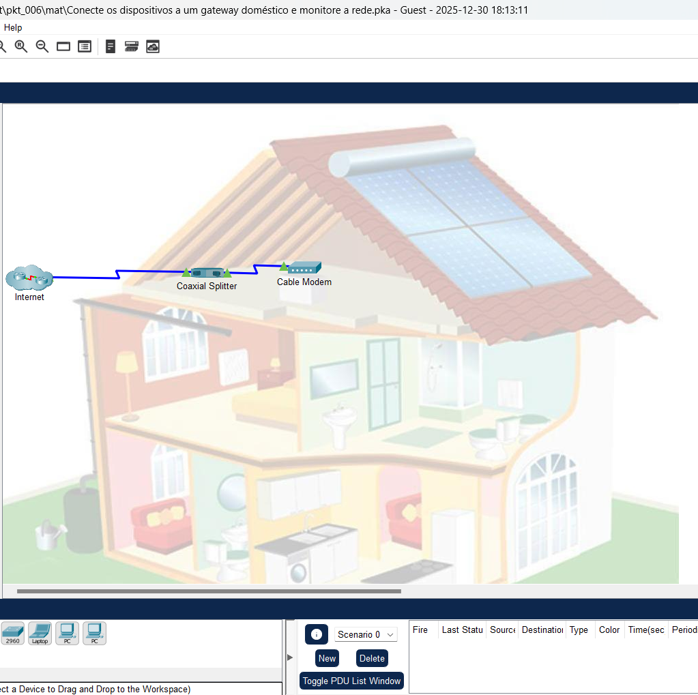
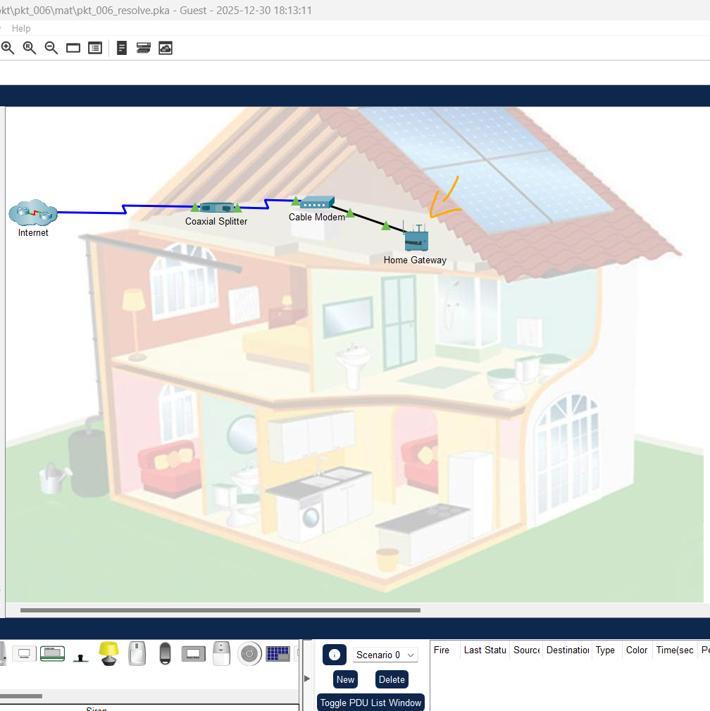
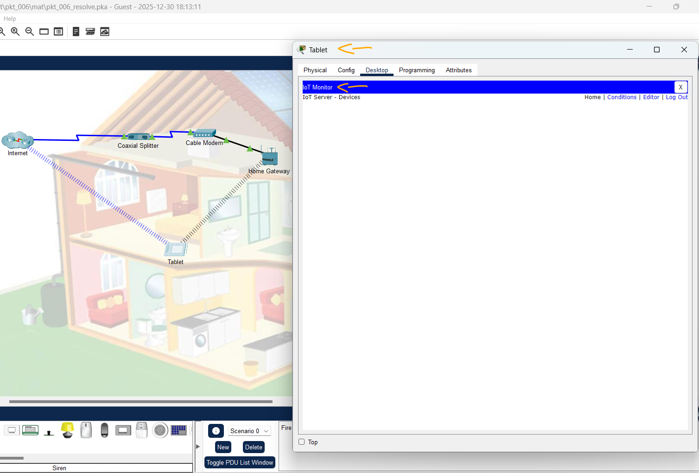
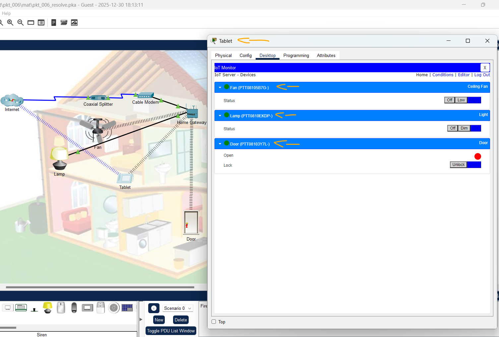
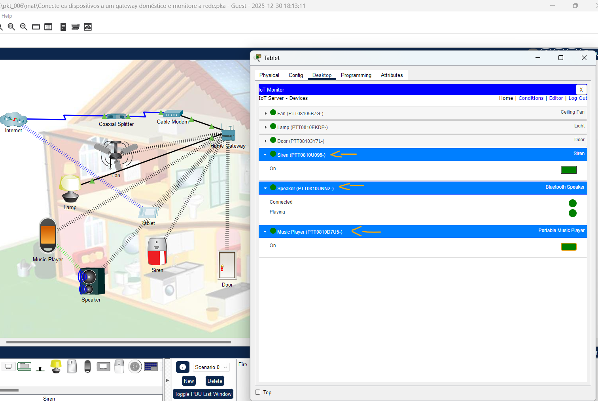

# Packet Tracer - Conecte os dispositivos a um gateway doméstico e monitore a rede   

### Cisco: <a href="../../../">cisco   </a>
### Cisco Networking Academy: cna   </a>
### Training Category: <a href="../../../pkt/">pkt</a>
### Software/Subject: iot   </a>
### Course: <a href="./">pkt_006 (Packet Tracer - Conecte os dispositivos a um gateway doméstico e monitore a rede)   </a>

---

### Theme:
- Internet of Things (IoT)
- Network

### Used Tools:
- Operating System (OS): 
  - Windows 11 
- Cloud Services:
  - Google Drive 
- Language:
  - HTML   
  - Markdown   
- Integrated Development Environment (IDE) and Text Editor:
  - Visual Studio Code (VS Code)   
- Versioning: 
  - Git   
- Repository:
  - GitHub   
- Network:
  - Cisco Packet Tracer   

---

<h3><a name="item00">Course Strcuture:</a></h3>

1. <a href="#item01">Parte 1: Conectar um gateway doméstico à rede</a> 
  1.1 <a href="#item01.01">Etapa 1: Adicione um Gateway Doméstico.</a> 
  1.2 <a href="#item01.02">Etapa 2: Conecte o gateway doméstico ao cable modem.</a> 
2. <a href="#item02">Parte 2: Adicionar dispositivos de usuário final à rede</a> 
  2.1 <a href="#item02.01">Etapa 1: Adicione um tablet sem fio à àrea de trabalho.</a> 
  2.2 <a href="#item02.02">Etapa 2: Conecte o tablet à rede.</a> 
  2.3 <a href="#item02.03">Etapa 3: Acesse o gateway doméstico apartir do tablet.</a> 
3. <a href="#item03">Parte 3: Conectar dispositivos IoT à rede</a> 
  3.1 <a href="#item03.01">Etapa 1: Adicione dispositivos de IoT à rede com fio.</a> 
  3.2 <a href="#item03.02">Etapa 2: Adicione dispositivos de IoT à rede sem fio do Gateway Doméstico.</a> 
  3.3 <a href="#item03.03">Etapa 3: Configure dispositivos de IoT para serem registrados com o servidor do gateway doméstico.</a> 
  3.4 <a href="#item03.04">Etapa 4: Verifique se os dispositivos estão agora registrados no servidor do gateway doméstico.</a> 
4. <a href="#item04">Parte 4: Adicionar dispositivos Bluetooth</a> 
  4.1 <a href="#item04.01">Etapa 1: Adicione um alto-falante Bluetooth à rede sem fio.</a> 
  4.2 <a href="#item04.02">Etapa 2: Adicione um reprodutor de mídia portátil à rede sem fio</a> 
  4.3 <a href="#item04.03">Etapa 3: Emparelhe o reprodutor de música ao alto-falante.</a> 
  4.4 <a href="#item04.04">Etapa 4: Explore a Rede.</a> 

---

### Objective:
O objetivo desta atividade foi implementar uma rede IoT local, utilizando um Gateway como servidor central e um tablet para o gerenciamento de seis dispositivos, incluindo a configuração de conectividade Bluetooth entre dois desses componentes.

### Folder Structure:
- [README.md](./README.md): Este documento de README, escrito em **Markdown**, com o conteúdo desta atividade.
- [0-aux](./0-aux/): Pasta auxiliar com imagens utilizadas na construção dos arquivos de README desse curso.

### Development:

<a name="item01"><h4>1. Parte 1: Conectar um gateway doméstico à rede</h4></a>[Back to summary](#item00)

A imagem 01 mostra a topologia inicial.

<figure>
     
    <figcaption>Imagem 01.</figcaption>
</figure>
 

<a name="item01.01"><h4>1.1 Etapa 1: Adicione um Gateway Doméstico.</h4></a>[Back to summary](#item00)

- a. Na caixa Device-Type, clique em Network Device (Dispositivo de rede) e, em seguida, em Wireless Devices (Dispositivos sem fio).
- b. Clique no ícone do dispositivo Home Gateway(Gateway doméstico) e, em seguida, clique no ambiente de trabalho Logical para adicionar o dispositivo.
- c. Clique em Home Gateway0 e, em seguida, na guia Config (Configuração). Altere o nome de exibição para Home Gateway (Gateway doméstico).

<a name="item01.02"><h4>1.2 Etapa 2: Conecte o gateway doméstico ao cable modem.</h4></a>[Back to summary](#item00)

- a. Na caixa Device-Type, clique em Connections (Conexões)  e, em seguida, em Copper Straight-Trough (cabo direto).
- b. Clique em Cable Modem e conecte uma extremidade do cabo à porta 1.
- c. Em seguida, clique no ícone Home Gateway (gateway doméstico) e conecte a outra extremidade do cabo a uma Interface Ethernet disponível.

A imagem 02 exibe a conclusão da Parte 1.

<figure>
     
    <figcaption>Imagem 02.</figcaption>
</figure>
 

<a name="item02"><h4>2. Parte 2: Adicionar dispositivos de usuário final à rede</h4></a>[Back to summary](#item00)

<a name="item02.01"><h4>2.1 Etapa 1: Adicione um tablet sem fio à àrea de trabalho.</h4></a>[Back to summary](#item00)

- a. Na caixa Device-Type (Tipo de Dispositivos), clique em End Devices (Dispositivos Finais) e, em seguida, em Tablet. Adicione o tablet à área de trabalho.
- b. Clique em Tablet PC0 e, em seguida, na guia Config (Configuração). Altere o Display Name (Nome de Exibição) para Tablet.

<a name="item02.02"><h4>2.2 Etapa 2: Conecte o tablet à rede.</h4></a>[Back to summary](#item00)

- a. Observe que o Tablet já está conectado à rede celular. O sinal sem fio azul está conectado à nuvem da Internet em que o provedor de celular está localizado. Para conectar o Tablet à rede sem fio doméstica, clique na Interface Wireless0 no painel esquerdo da guia Config (Configuração).
- b. Altere o SSID de Default (Padrão) para HomeGateway. O Tablet será conectado à rede Wi-Fi doméstica. Pode levar um minuto ou dois para que o endereçamento IP mude para um endereço da rede 192.168.25.x. Você pode clicar em Fast Forward Time (Alt+D) para acelerar o processo.
- c. Observe agora que o Tablet tem duas conexões sem fio: celular e Wi-Fi. Isso é comum para tablets e smartphones habilitados para celular.

<a name="item02.03"><h4>2.3 Etapa 3: Acesse o gateway doméstico apartir do tablet.</h4></a>[Back to summary](#item00)

- a. No Tablet, clique na guia Desktop > IoT Monitor. Observe que o endereço do servidor de IoT é o endereço IP do gateway doméstico e admin é usado para o nome de usuário e a senha. Clique em Login. Observação: isso verifica se você pode acessar o servidor de IoT do gateway doméstico. Observe que nenhum dispositivo aparece na lista de dispositivos do servidor de IoT do gateway doméstico.

A imagem 03 exibe a conclusão da Parte 2.

<figure>
     
    <figcaption>Imagem 03.</figcaption>
</figure>
 

<a name="item03"><h4>3. Parte 3: Conectar dispositivos IoT à rede</h4></a>[Back to summary](#item00)

- Nesta parte, você adicionará três novos dispositivos de IoT à rede e os registrará no servidor de gateway doméstico.

<a name="item03.01"><h4>3.1 Etapa 1: Adicione dispositivos de IoT à rede com fio.</h4></a>[Back to summary](#item00)

- a. Clique na caixa Device-Type Selection (Seleção do tipo de dispositivo), clique em End Devices (Dispositivos Finais) > Home , e então clique Lamp (lâmpada) e adicione à área de trabalho. 
- b. Clique no dispositivo Lamp (Lâmpada) e, em seguida, clique em  Advanced (Avançado) para revelar mais guias.
- c. Clique em I/O Config para alterar o adaptador de rede para PT-IOT-NM-1CFE.
- d. Clique na guia Config e renomeie o dispositivo como Lamp.
- e. No painel esquerdo, clique em FastEthernet0 e selecione o botão de opção DHCP para que a lâmpada receba um endereço IPv4 do gateway doméstico.
- f. Clique em Connections (Conexões) > Copper Straight-Through e conecte a porta Fastethernet0 da lâmpada a uma das portas Ethernet disponíveis no gateway doméstico.

<a name="item03.02"><h4>3.2 Etapa 2: Adicione dispositivos de IoT à rede sem fio do Gateway Doméstico.</h4></a>[Back to summary](#item00)

- a. Nesta etapa, você conectará dois novos dispositivos de IoT à rede sem fio. Na caixa Device-Type Selection (Seleção de tipo de dispositivo), clique em End Devices (Dispositivos finais) > Home (Página inicial.) Adicione um Fan (ventilador) e uma Door (porta) à área de trabalho.
- b. Altere o nome de exibição do dispositivo fan para Ventilador.
- c. Altere o nome de exibição da door para Porta.
- d. Na configuração Wireless0 de cada dispositivo, observe que o SSID já está definido como HomeGateway e que cada dispositivo recebeu um endereço IP da rede 192.168.25.x. Você pode clicar no botão "Fast Forward Time" para acelerar o processo.

<a name="item03.03"><h4>3.3 Etapa 3: Configure dispositivos de IoT para serem registrados com o servidor do gateway doméstico.</h4></a>[Back to summary](#item00)

- a. Para cada um dos três dispositivos de IoT, clique na guia Config (Configuração) e, em seguida, em Settings( Configurações) no painel esquerdo, se necessário. Role para baixo até a lista de opções do IoT Server e clique em Home Gateway.

<a name="item03.04"><h4>3.4 Etapa 4: Verifique se os dispositivos estão agora registrados no servidor do gateway doméstico.</h4></a>[Back to summary](#item00)

- a. No Tablet, clique na guia Desktop > IoT Monitor e, em seguida, clique em Login. Você deve ver as entradas para todos os três novos dispositivos de IoT. Expanda as entradas para ver os detalhes dos dispositivos. Tente controlar os dispositivos e observe os resultados no espaço de trabalho. Observação: pode levar um minuto ou dois para que os três dispositivos sejam registrados no servidor e sejam listados no IoT Monitor.

A imagem 04 exibe a conclusão da Parte 3.

<figure>
     
    <figcaption>Imagem 04.</figcaption>
</figure>
 

<a name="item04"><h4>4. Parte 4: Adicionar dispositivos Bluetooth</h4></a>[Back to summary](#item00)

- Nesta parte, você adicionará um alto-falante Bluetooth à rede sem fio. Você conectará um reprodutor de música portátil ao alto-falante.

<a name="item04.01"><h4>4.1 Etapa 1: Adicione um alto-falante Bluetooth à rede sem fio.</h4></a>[Back to summary](#item00)

- a. Na caixa Device-Type Selection (Seleção de tipo de dispositivo), clique em End Devices (Dispositivos finais) > Home (Página inicial). Adicione um dispositivo de alto-falante Bluetooth ao espaço de trabalho.
- b. Observe que o alto-falante é conectado automaticamente ao Home Gateway. Após alguns minutos, o alto-falante será configurado com um endereço IP da rede 192.168.25.x.
- c. Altere o nome de exibição do speaker(alto-falante) para Alto-falante.
- d. Na guia Config do alto-falante, clique em Bluetooth no painel esquerdo e ative o Port Stat (Estado da porta) para On.

<a name="item04.02"><h4>4.2 Etapa 2: Adicione um reprodutor de mídia portátil à rede sem fio</h4></a>[Back to summary](#item00)

- a. Na caixa Device-Type Selection (Seleção de tipo de dispositivo), clique em End Devices (Dispositivos finais) > Home (Página inicial). Adicione um reprodutor de música portátil à área de trabalho.
- b. Observe que o reprodutor de música é conectado automaticamente ao Home Gateway. Após alguns minutos, ele será configurado com um endereço IP da rede 192.168.25.x.
- c. Altere o nome de exibição para Reprodutor de Música.

<a name="item04.03"><h4>4.3 Etapa 3: Emparelhe o reprodutor de música ao alto-falante.</h4></a>[Back to summary](#item00)

- a. Ative o Port Status (Status da porta) Bluetooth para On.
- b. Clique em Discover (Descobrir) em Discoverable Devices (Dispositivos detectáveis), clique em Speaker (Alto-falante), clique em Pair (Emparelhar) e, em seguida, clique em Yes.
- c. Mantenha pressionada a tecla Alt e clique em Music Player. (Dica: verifique se os alto-falantes do computador físico estão ligados.) O que acontece?
  - Sai som no computador físico, simulando a reprodução de música pelo Music Player.

<a name="item04.04"><h4>4.4 Etapa 4: Explore a Rede.</h4></a>[Back to summary](#item00)

- a. Sinta-se à vontade para adicionar mais dispositivos com e sem fio à rede. Para dispositivos de IoT, mantenha pressionada a tecla Alt e clique nos dispositivos para interagir com eles. Com a tecla Alt pressionada, você pode ligar o reprodutor de música, abrir a porta e ligar a lâmpada e o ventilador. Não se esqueça de que você também pode controlar os dispositivos de IoT no aplicativo IoT Monitor no smartphone ou tablet.
  - Foi adicionado uma Sirene.
  - Além da Sirene, o Reprodutor de Música e o Alto Falante teve seu servidor IoT definido como o Home Gateway.
  - Foi necessário alterar os nomes dos dispositivos de IoT de inglês para português para que a atividade fosse validada.

A imagem 05 exibe a conclusão da Parte 4.

<figure>
     
    <figcaption>Imagem 05.</figcaption>
</figure>
 