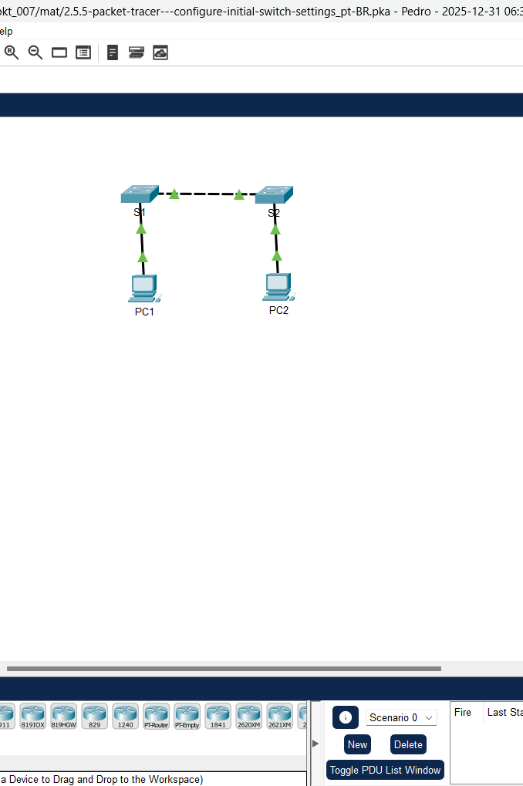
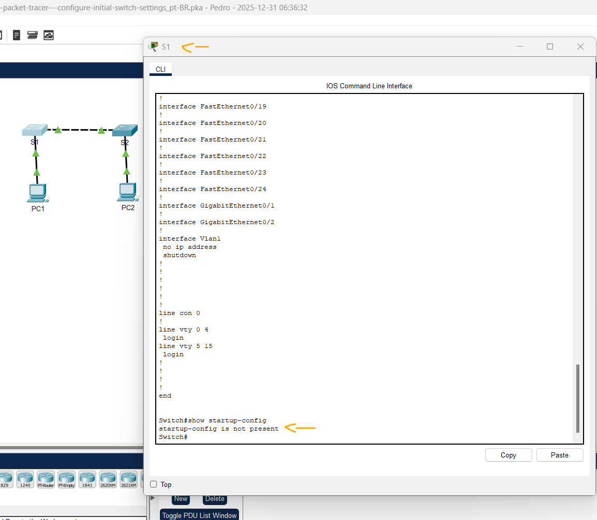
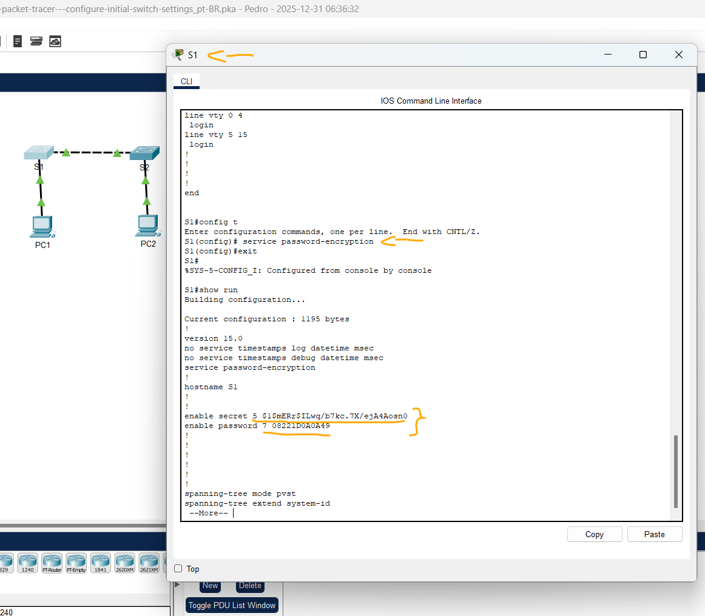
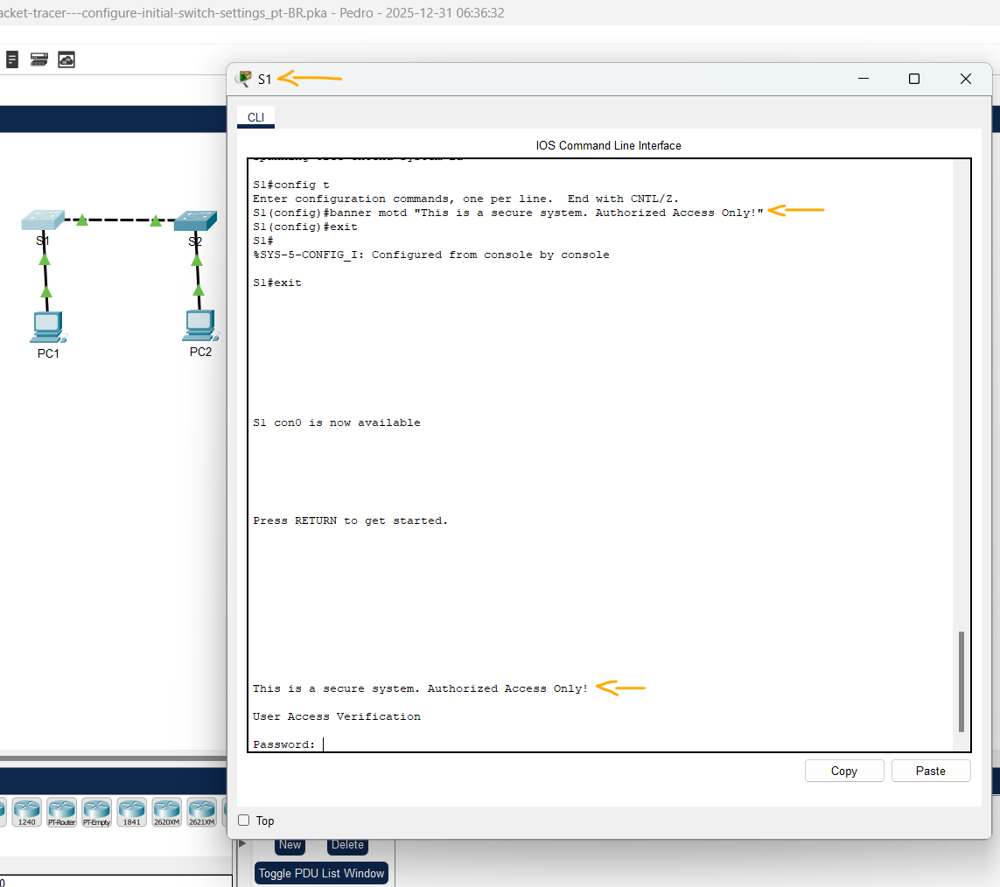
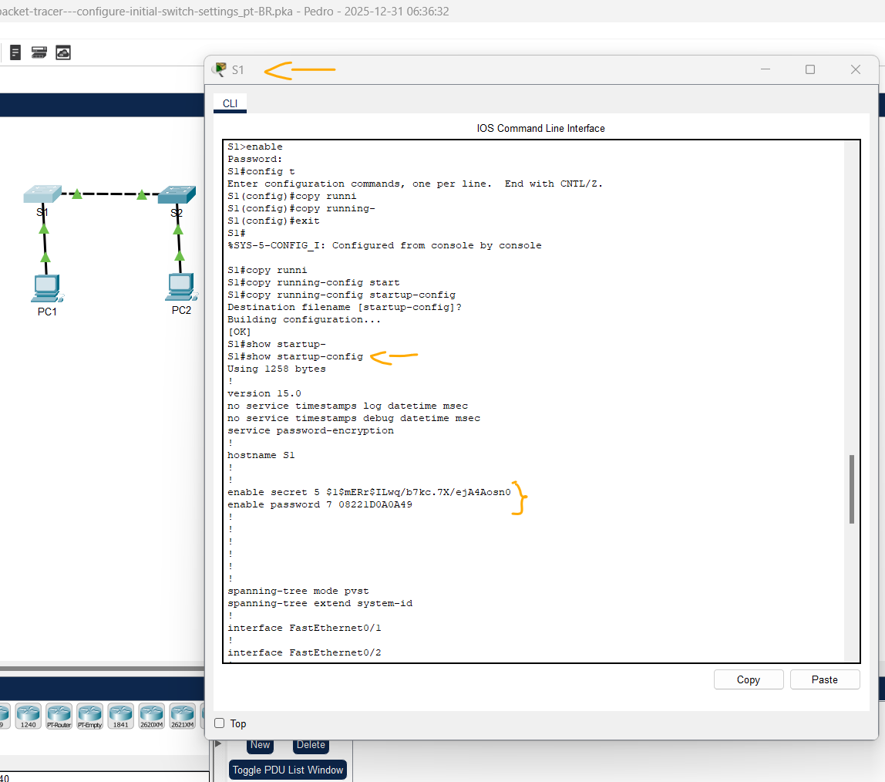
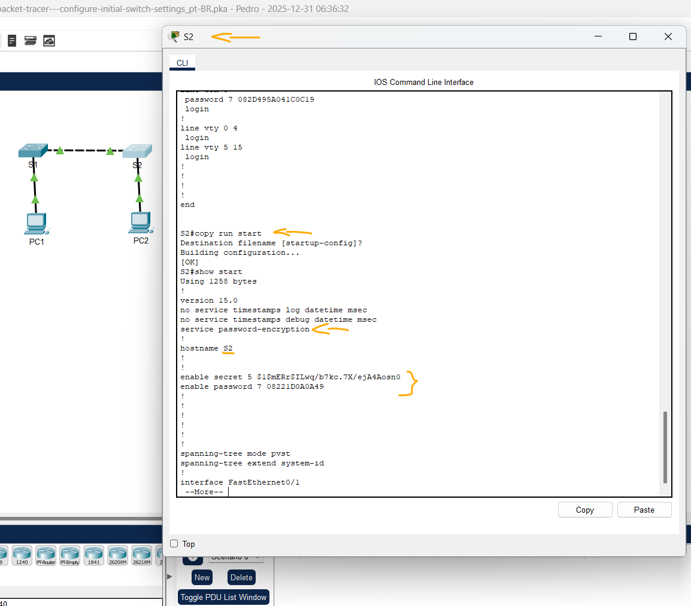

# Packet Tracer - Definir configurações iniciais do switch   

### Cisco: <a href="../../../">cisco   </a>
### Cisco Networking Academy: cna   </a>
### Training Category: <a href="../../../pkt/">pkt</a>
### Software/Subject: network   </a>
### Course: <a href="./">pkt_007 (Packet Tracer - Definir configurações iniciais do switch)   </a>

---

### Theme:
- Network

### Used Tools:
- Operating System (OS): 
  - Cisco Internetwork Operating System (Cisco IOS)   
  - Windows 11 
- Cloud Services:
  - Google Drive 
- Language:
  - HTML   
  - Markdown   
- Integrated Development Environment (IDE) and Text Editor:
  - Visual Studio Code (VS Code)   
- Versioning: 
  - Git   
- Repository:
  - GitHub   
- Network:
  - Cisco Packet Tracer   
  
---

<h3><a name="item00">Course Strcuture:</a></h3>

1. <a href="#item01">Parte 1: Verificar a configuração padrão do switch</a> 
  1.1 <a href="#item01.01">Etapa 1: Entrar no modo EXEC privilegiado.</a> 
  1.2 <a href="#item01.02">Etapa 2: Examinar a configuração atual do switch.</a> 
2. <a href="#item02">Parte 2: Criar uma configuração básica do switch</a> 
  2.1 <a href="#item02.01">Etapa 1: Atribuir um nome a um switch.</a> 
  2.2 <a href="#item02.02">Etapa 2: Acesso seguro à linha do console.</a> 
  2.3 <a href="#item02.03">Etapa 3: Verificar se o acesso do console está protegido.</a> 
  2.4 <a href="#item02.04">Etapa 4: Acesso seguro ao modo privilegiado.</a> 
  2.5 <a href="#item02.05">Etapa 5: Verificar se o acesso ao modo privilegiado é seguro.</a> 
  2.6 <a href="#item02.06">Etapa 6: Configure uma senha criptografada para proteger o acesso ao modo privilegiado.</a> 
  2.7 <a href="#item02.07">Etapa 7: Verifique se a senha de enable secret é adicionada ao arquivo de configuração.</a> 
  2.8 <a href="#item02.08">Etapa 8: Criptografar as senhas de enable e console.</a> 
3. <a href="#item03">Parte 3: Configurar um banner MOTD</a> 
  3.1 <a href="#item03.01">Etapa 1: Configurar um banner da mensagem do dia (MOTD).</a> 
4. <a href="#item04">Parte 4: Salvar os arquivos de configuração na NVRAM</a> 
  4.1 <a href="#item04.01">Etapa 1: Verificar se a configuração é precisa usando o comando show run.</a> 
5. <a href="#item05">Parte 5: Configurar S2</a> 

---

### Objective:
Esta atividade visou a segurança básica de um Switch através da configuração de senhas para a interface de linha de comando e porta console, abrangendo a criptografia de senhas, a implementação de uma mensagem de aviso contra acessos não autorizados e o backup das configurações na NVRAM para garantir a persistência dos dados.

### Folder Structure:
- [README.md](./README.md): Este documento de README, escrito em **Markdown**, com o conteúdo desta atividade.
- [0-aux](./0-aux/): Pasta auxiliar com imagens utilizadas na construção dos arquivos de README desse curso.

### Development:

<a name="item01"><h4>1. Parte 1: Verificar a configuração padrão do switch</h4></a>[Back to summary](#item00)

A imagem 01 mostra a topologia inicial.

<figure>
     
    <figcaption>Imagem 01.</figcaption>
</figure>
 

<a name="item01.01"><h4>1.1 Etapa 1: Entrar no modo EXEC privilegiado.</h4></a>[Back to summary](#item00)

- a. Você pode acessar todos os comandos do switch no modo EXEC privilegiado. No entanto, como muitos dos comandos privilegiados configuram parâmetros operacionais, o acesso privilegiado deve ser protegido por senha para evitar o uso não autorizado. O conjunto de comandos EXEC privilegiados inclui os comandos disponíveis no modo EXEC do usuário, 
muitos comandos adicionais e o comando configure através do qual o acesso aos modos de configuração é obtido. Clique em S1 e depois na guia CLI. Pressione Enter. 
- b. Entre no modo EXEC privilegiado inserindo o comando enable: `Switch> enable`. Observe que o prompt foi alterado para refletir o modo EXEC privilegiado. 

<a name="item01.02"><h4>1.2 Etapa 2: Examinar a configuração atual do switch.</h4></a>[Back to summary](#item00)

- a. Insira o comando show running-config: `Switch# show running-config`. Responda às perguntas a seguir:
  - Quantas interfaces Fast Ethernet o switch possui?
    - 24.
  - Quantas interfaces Gigabit Ethernet o switch possui? 
    - 2.
  - Qual é a faixa de valores mostrados nas linhas VTY? 
    - 0 à 15.
  - Que comando exibirá o conteúdo atual da memória de acesso aleatório não volátil (NVRAM)? 
    - `show startup-config`.
  - Por que o switch responde com "startup-config is not present?" 
    - Porque ainda não há nenhuma configuração de inicialização salva na NVRAM do switch.

A imagem 02 exibe a conclusão da Parte 1.

<figure>
     
    <figcaption>Imagem 02.</figcaption>
</figure>
 

<a name="item02"><h4>2. Parte 2: Criar uma configuração básica do switch</h4></a>[Back to summary](#item00)

<a name="item02.01"><h4>2.1 Etapa 1: Atribuir um nome a um switch.</h4></a>[Back to summary](#item00)

- a. Para configurar parâmetros em um switch, pode ser necessário mover-se entre vários modos de configuração. Observe como o prompt muda à medida que você navega pelo switch.
  - `Switch# configure terminal` -> `Switch(config)# hostname S1` -> `S1(config)# exit`.

<a name="item02.02"><h4>2.2 Etapa 2: Acesso seguro à linha do console.</h4></a>[Back to summary](#item00)

- a. Para proteger o acesso à linha do console, acesse o modo config-line e defina a senha da console como letmein.
  - `S1# configure terminal` -> `S1(config)# line console 0` -> `S1 (config-line)# password letmein` -> `S1(config-line)# login` -> `S1(config-line)# exit` -> `S1(config)# exit`.
- a. Por que o comando login é necessário? 
  - Porque o comando login obriga o switch a solicitar a senha configurada quando alguém acessa a linha do console.

<a name="item02.03"><h4>2.3 Etapa 3: Verificar se o acesso do console está protegido.</h4></a>[Back to summary](#item00)

- a. Saia do modo privilegiado para verificar se a senha da porta de console está em vigor. Nota: Se o switch não solicitar uma senha, você não configurou o parâmetro de login na Etapa 2. 
  - `S1# exit`.

<a name="item02.04"><h4>2.4 Etapa 4: Acesso seguro ao modo privilegiado.</h4></a>[Back to summary](#item00)

- a. Defina a senha de enable como c1$c0. Essa senha protege o acesso ao modo privilegiado. Nota: O 0 em c1$c0 é um zero, não um O maiúsculo. Essa senha não será classificada como correta até depois que você a criptografar na Etapa 8. 
  - `S1> enable` -> `S1# configure terminal` -> `S1(config)# enable password c1$c0` -> `S1(config)# exit`.

<a name="item02.05"><h4>2.5 Etapa 5: Verificar se o acesso ao modo privilegiado é seguro.</h4></a>[Back to summary](#item00)

- a. Insira o comando exit novamente para fazer logoff do switch: `S1# exit`.
- b. Pressione Enter e uma senha será solicitada a você.
- c. A primeira é a senha do console que você configurou com line con 0. Digite essa senha para voltar ao modo EXEC usuário.
  - `letmein`.
- d. Digite o comando para acessar o modo privilegiado.
  - `enable`.
- e. Digite a segunda senha que você configurou para proteger o modo EXEC privilegiado.
  - `c1$c0`.
- f. Verifique sua configuração examinando o conteúdo do arquivo de configuração em execução. Observe que o console e as senhas de habilitação estão em texto simples. Isso pode representar um risco de segurança se alguém estiver olhando por cima do seu ombro ou obtiver acesso a arquivos de configuração armazenados em um local de backup. 
  - `S1# show running-config`.

<a name="item02.06"><h4>2.6 Etapa 6: Configure uma senha criptografada para proteger o acesso ao modo privilegiado.</h4></a>[Back to summary](#item00)

- a. A senha de enable deve ser substituída pela senha secreta criptografada mais recente usando o comando enable secret. Defina a senha de enable secret como itsasecret. Nota: A senha secreta de ativação substitui a senha de ativação. Se ambos estiverem configurados no comutador, você deverá inserir a senha secreta de ativação para entrar no modo EXEC privilegiado.  
  - `S1# config t` -> `S1(config)# enable secret itsasecret` -> `S1(config)# exit`.

<a name="item02.07"><h4>2.7 Etapa 7: Verifique se a senha de enable secret é adicionada ao arquivo de configuração.</h4></a>[Back to summary](#item00)

- a. Digite o comando show running-config de novo para verificar se a nova senha de enable secret está configurada. Nota: Você pode abreviar show running-config como `S1# show run`. O que é exibido como a senha de enable secret? 
  - A senha criptografada `5 $1$mERr$ILwq/b7kc.7X/ejA4Aosn0`.
- a. Por que a senha de enable secret é exibida de forma diferente do que configuramos?
  - Porque o enable secret é armazenado e exibido de forma criptografada (hash) para proteger a senha contra leitura direta.

<a name="item02.08"><h4>2.8 Etapa 8: Criptografar as senhas de enable e console. </h4></a>[Back to summary](#item00)

- a. Como você notou na Etapa 7, a senha secreta de ativação foi criptografada, mas as senhas de ativação e console ainda estavam em texto sem formatação. Nós criptografaremos agora essas senhas de texto simples com o comando service password-encryption. 
  - `S1# config t` -> `S1(config)# service password-encryption` -> `S1(config)# exit`.
- a. Se você configurar mais senhas no switch, elas serão exibidas no arquivo de configuração como texto simples ou em formato criptografado? Explique. 
  - Elas serão exibidas em formato criptografado, porque o comando service password-encryption faz com que todas as senhas configuradas posteriormente sejam armazenadas de forma cifrada no arquivo de configuração.

A imagem 03 exibe a conclusão da Parte 2.

<figure>
     
    <figcaption>Imagem 03.</figcaption>
</figure>
 

<a name="item03"><h4>3. Parte 3: Configurar um banner MOTD</h4></a>[Back to summary](#item00)

<a name="item03.01"><h4>3.1 Etapa 1: Configurar um banner da mensagem do dia (MOTD).</h4></a>[Back to summary](#item00)

- a. O conjunto de comandos do CISCO IOS inclui um recurso que permite configurar as mensagens que qualquer pessoa conectada no switch vê. Essas mensagens são chamadas de mensagem do dia ou banners MOTD. Insira o texto de banner entre aspas ou use um delimitador diferente de qualquer caractere que aparece na sequência MOTD. 
  - `S1# config t` -> `S1(config)# banner motd "This is a secure system. Authorized Access Only!"` -> `S1(config)# exit`.
- a. Quando esse banner será exibido? 
  - Quando ocorre o acesso a uma linha (console, VTY ou AUX), antes de entrar no modo EXEC do usuário.
- a. Por que cada switch deve ter um banner MOTD?
  - Cada switch deve ter um banner MOTD para avisar sobre uso restrito do sistema, alertar usuários não autorizados e fornecer respaldo legal em caso de acesso indevido.

A imagem 04 exibe a conclusão da Parte 3.

<figure>
     
    <figcaption>Imagem 04.</figcaption>
</figure>
 

<a name="item04"><h4>4. Parte 4: Salvar os arquivos de configuração na NVRAM</h4></a>[Back to summary](#item00)

<a name="item04.01"><h4>4.1 Etapa 1: Verificar se a configuração é precisa usando o comando show run.</h4></a>[Back to summary](#item00)

- a. Salvar o arquivo de configuração. Você concluiu a configuração básica do switch. Agora, faça o backup do arquivo de configuração atual na NVRAM para garantir que as alterações feitas não sejam perdidas se o sistema for reinicializado ou se houver queda de energia. 
  - `S1# copy running-config startup-config`.
- a. Qual é a versão mais curta abreviada do comando copy running-config startup-config? 
  - `copy run start`.
- a. Examinar o arquivo de configuração inicial. Que comando exibirá o conteúdo da NVRAM? 
  - `show startup-config` ou `show start`.
- a. Todas as alterações que foram digitadas foram registradas no arquivo? 
  - Sim, porque o comando copy running-config startup-config salva a configuração atual na NVRAM.

A imagem 05 exibe a conclusão da Parte 4.

<figure>
     
    <figcaption>Imagem 05.</figcaption>
</figure>
 

<a name="item05"><h4>5. Parte 5: Configurar S2</h4></a>[Back to summary](#item00)

- a. Você concluiu a configuração em S1. Você vai configurar o S2 agora. Se você não se lembrar dos comandos, consulte as Partes 1 a 4 para obter ajuda. Configure S2 com os seguintes parâmetros: 
  - Nome do Dispositivo: S2.
    - `enable` -> `conf t` -> `hostname S2`.
  - Proteja o acesso ao console com a senha letmein.
    - `line console 0` -> `password letmein` -> `login` -> `exit`.
  - Configure uma senha de habilitação de c1$c0 e uma senha secreta de habilitação de itsasecret.
    - `enable password c1$c0` -> `enable secret itsasecret`.
  - Configure uma mensagem apropriada para aqueles que fazem login no switch.
    - `banner motd "This is a secure system. Authorized Access Only!"`.
  - Criptografe todas as senhas em texto claro. 
    - `service password-encryption` -> `exit`.
  - Verifique se a configuração está correta. 
    - `show running-config`.
  - Salve o arquivo de configuração para evitar perdas se o switch for desligado. 
    - `copy run start` -> `show start`.

A imagem 06 exibe a conclusão da Parte 5.

<figure>
     
    <figcaption>Imagem 06.</figcaption>
</figure>
 