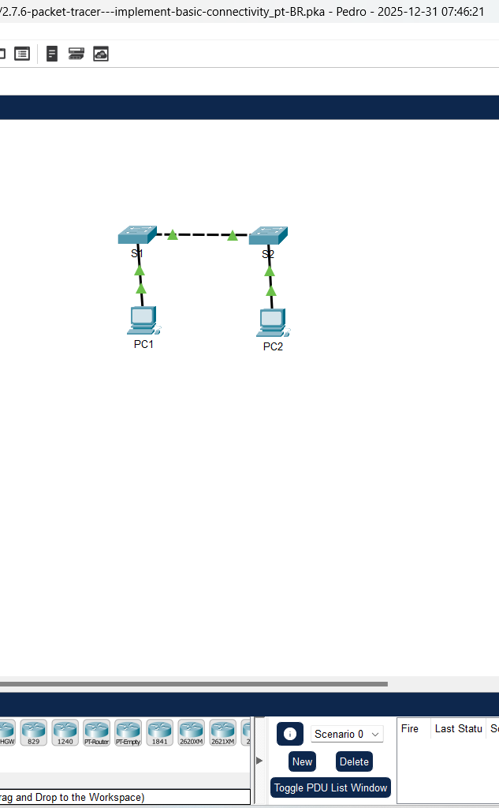
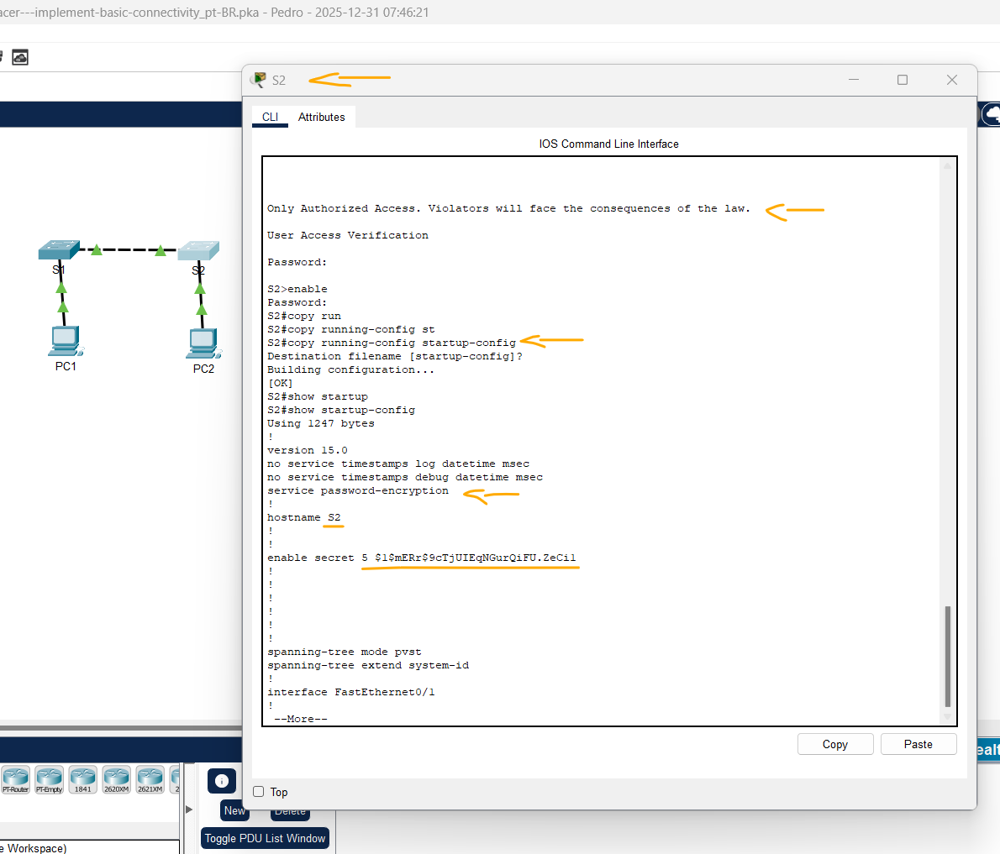
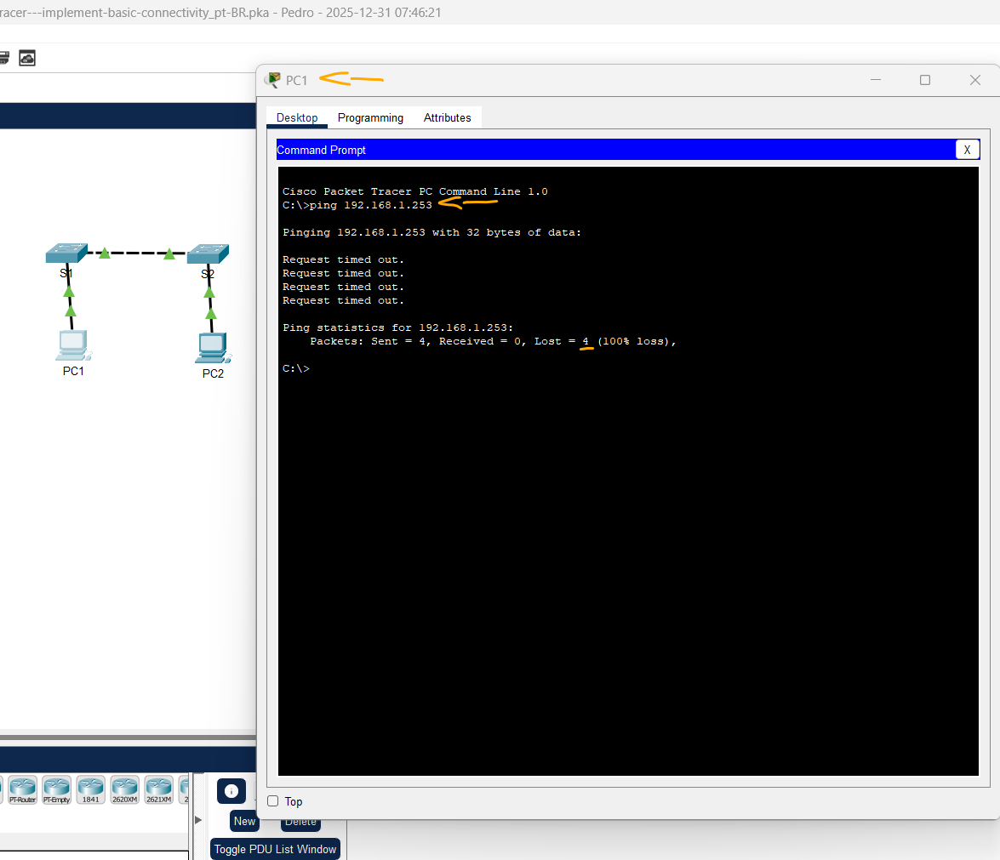
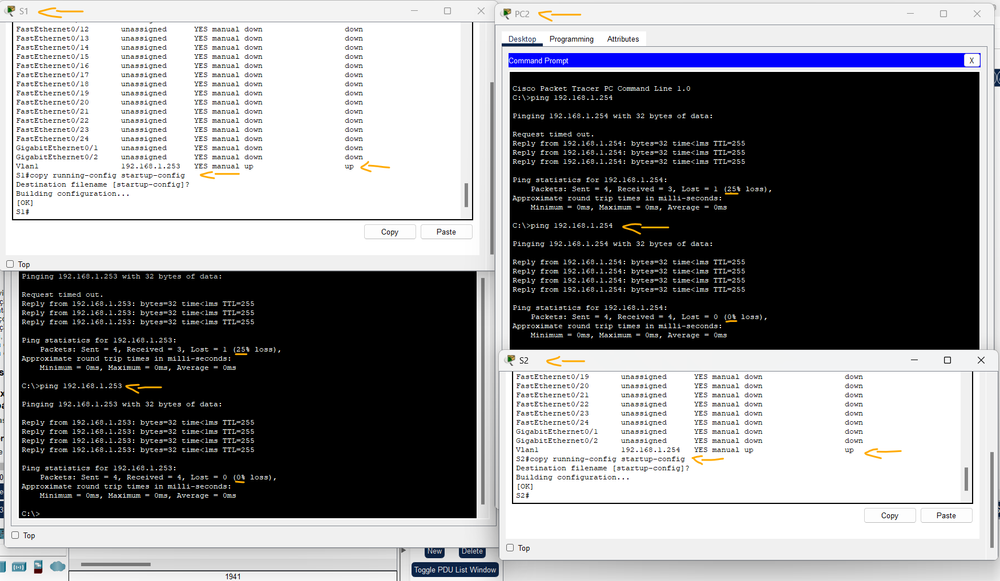

# Packet Tracer - Implementação da conectividade básica   

### Cisco: <a href="../../">cisco   </a>
### Cisco Networking Academy: cna   </a>
### Training Category: <a href="../../pkt/">pkt</a>
### Software/Subject: network   </a>
### Course: <a href="./">pkt_008 (Packet Tracer - Implementação da conectividade básica)   </a>

---

### Theme:
- Network

### Used Tools:
- Operating System (OS): 
  - Windows 11 
- Cloud Services:
  - Google Drive 
- Language:
  - HTML   
  - Markdown   
- Integrated Development Environment (IDE) and Text Editor:
  - Visual Studio Code (VS Code)   
- Versioning: 
  - Git   
- Repository:
  - GitHub   
- Network:
  - Cisco Internetwork Operating System (Cisco IOS)   
  - Cisco Packet Tracer   
  - ping   
  
---

<h3><a name="item00">Course Strcuture:</a></h3>

1. <a href="#item01">Parte 1: executar uma configuração básica em S1 e S2</a> 
  1.1 <a href="#item01.01">Etapa 1: Configurar S1 com um hostname.</a> 
  1.2 <a href="#item01.02">Etapa 2: Configure o console e as senhas criptografadas no modo EXEC privilegiado.</a> 
  1.3 <a href="#item01.03">Etapa 3: Verificar as configurações de senha para S1.</a> 
  1.4 <a href="#item01.04">Etapa 4: Configurar um banner MOTD.</a> 
  1.5 <a href="#item01.05">Etapa 5: Salvar o arquivo de configuração na NVRAM.</a> 
  1.6 <a href="#item01.06">Etapa 6: Repitir as etapas de 1 a 5 para S2.</a> 
2. <a href="#item02">Parte 2: configurar os PCs</a> 
  2.1 <a href="#item02.01">Etapa 1: Configurar ambos os PCs com endereços IP.</a> 
  2.2 <a href="#item02.02">Etapa 2: Testar a conectividade com os switches.</a> 
3. <a href="#item03">Parte 3: configurar a interface de gerenciamento do switch</a> 
  3.1 <a href="#item03.01">Etapa 1: Configurar o S1 com um endereço IP.</a> 
  3.2 <a href="#item03.02">Etapa 2: Configurar o S2 com um endereço IP.</a> 
  3.3 <a href="#item03.03">Etapa 3: Verificar a configuração de endereço IP em S1 e S2.</a> 
  3.4 <a href="#item03.04">Etapa 4: Salvar configurações de S1 e S2 na NVRAM.</a> 
  3.5 <a href="#item03.05">Etapa 5: Verificar a conectividade de rede.</a> 

---

### Objective:
O objetivo deste PTTA foi realizar a configuração básica de dois switches e estabelecer a conectividade da rede através do endereçamento IP nos ativos e nos computadores conectados. A atividade foi finalizada com a inspeção das configurações aplicadas e a validação da comunicação entre todos os dispositivos.

### Folder Structure:
- [README.md](./README.md): Este documento de README, escrito em **Markdown**, com o conteúdo desta atividade.
- [0-aux](./0-aux/): Pasta auxiliar com imagens utilizadas na construção dos arquivos de README desse curso.

### Development:

<a name="item01"><h4>1. Parte 1: executar uma configuração básica em S1 e S2</h4></a>[Back to summary](#item00)

- Conclua as seguintes etapas em S1 e S2.

A imagem 01 mostra a topologia inicial.

<figure>
     
    <figcaption>Imagem 01.</figcaption>
</figure>
 

<a name="item01.01"><h4>1.1 Etapa 1: Configurar S1 com um hostname.</h4></a>[Back to summary](#item00)

- a. Clique em S1 e clique na guia CLI.
- b. Digite o comando correto para configurar o hostname como S1.
  - `enable` -> `configure terminal` -> `hostname S1`.

<a name="item01.02"><h4>1.2 Etapa 2: Configure o console e as senhas criptografadas no modo EXEC privilegiado.</h4></a>[Back to summary](#item00)

- a. Use cisco para a senha do console. 
  - `line console 0` -> `password cisco` -> `login` -> `exit`.
- b. Use class para a senha privilegiada do modo EXEC. 
  - `enable secret class` -> `service password-encryption`.

<a name="item01.03"><h4>1.3 Etapa 3: Verificar as configurações de senha para S1.</h4></a>[Back to summary](#item00)

- a. Como você pode verificar que as duas senhas foram configuradas corretamente?   
  - `exit` -> `exit` -> `cisco` -> `enable` -> `class`.

<a name="item01.04"><h4>1.4 Etapa 4: Configurar um banner MOTD.</h4></a>[Back to summary](#item00)

- a. Use um texto apropriado no banner para avisar sobre o acesso não autorizado. Este texto é um exemplo disso: Somente Acesso Autorizado. Infratores sofrerão as consequências da lei. 
  - `config t` -> `banner motd "Only Authorized Access. Violators will face the consequences of the law."` -> `exit`.

<a name="item01.05"><h4>1.5 Etapa 5: Salvar o arquivo de configuração na NVRAM.</h4></a>[Back to summary](#item00)

- a. Qual comando você deve usar para executar esta etapa? 
  - `copy running-config startup-config` -> `show startup-config`.

<a name="item01.06"><h4>1.6 Etapa 6: Repitir as etapas de 1 a 5 para S2.</h4></a>[Back to summary](#item00)

- `enable` -> `configure terminal` -> `hostname S2`.
- `line console 0` -> `password cisco` -> `login` -> `exit`.
- `enable secret class` -> `service password-encryption`.
- `exit` -> `exit` -> `cisco` -> `enable` -> `class`.
- `config t` -> `banner motd "Only Authorized Access. Violators will face the consequences of the law."` -> `exit`.
- `copy running-config startup-config` -> `show startup-config`.

A imagem 02 exibe a conclusão da Parte 1.

<figure>
     
    <figcaption>Imagem 02.</figcaption>
</figure>
 

<a name="item02"><h4>2. Parte 2: configurar os PCs</h4></a>[Back to summary](#item00)

- Configure PC1 e PC2 com endereços IP. 

<a name="item02.01"><h4>2.1 Etapa 1: Configurar ambos os PCs com endereços IP.</h4></a>[Back to summary](#item00)

- a. Clique no PC1 e na clique na guia Desktop. 
- b. Clique em IP Configuration (Configuração de IP). Na Tabela de endereços acima, você pode ver que o endereço IP do PC1 é 192.168.1.1 e a máscara de sub-rede é 255.255.255.0. Digite essas informações no PC1 na janela IP Configuration (Configuração de IP). 
- c. Repita as etapas 1a e 1b no PC2. 

<a name="item02.02"><h4>2.2 Etapa 2: Testar a conectividade com os switches.</h4></a>[Back to summary](#item00)

- a. Clique em PC1. Feche a janela IP Configuration (Configuração de IP) se ainda estiver aberta. Na guia Desktop, clique em Command Prompt (Prompt de comando). 
- b. Digite o comando ping e o endereço IP para S1 e pressione Enter: `PC> ping 192.168.1.253`. Pergunta: Deu certo? Explique. 
  - Não, todos os pacotes foram perdidos, pois o switch ainda não possui um endereço IP configurado em uma interface VLAN para permitir comunicação de rede. Contudo, a comunicação entre os dois PCs já está funcionando, pois eles estão na mesma rede local e o switch consegue encaminhar quadros na Camada 2, mesmo sem um endereço IP configurado.

A imagem 03 exibe a conclusão da Parte 2.

<figure>
     
    <figcaption>Imagem 03.</figcaption>
</figure>
 

<a name="item03"><h4>3. Parte 3: configurar a interface de gerenciamento do switch</h4></a>[Back to summary](#item00)

- Configure S1 e S2 com um endereço IP. 

<a name="item03.01"><h4>3.1 Etapa 1: Configurar o S1 com um endereço IP.</h4></a>[Back to summary](#item00)

- a. Os switches podem ser usados como dispositivos plug-and-play. Isso significa que não precisam ser configurados para funcionar. Os switches encaminham informações de uma porta para outra com base nos endereços MAC. Se esse é o caso, por que configurar com um endereço IP?
  - Embora o switch funcione sem configuração por operar na Camada 2 usando endereços MAC, o endereço IP não é necessário para o encaminhamento de tráfego. Ele é usado para gerenciamento remoto do switch, permitindo acesso via SSH, Telnet ou interface web. Sem IP, o gerenciamento fica restrito ao acesso local pelo console.
- a. Use os comandos a seguir para configurar S1 com um endereço IP.
  - `S1# configure terminal` -> `S1(config)# interface vlan 1` -> `S1(config-if)# ip address 192.168.1.253 255.255.255.0` -> `S1(config-if)# no shutdown` -> `S1(config-if)# exit` -> `S1(config)# exit`.
- a. Por que digitar o comando no shutdown? 
  - Porque, por padrão, a interface VLAN fica em estado administrativamente down, e o comando no shutdown a ativa. Sem esse comando, o endereço IP configurado não entra em operação e o switch não consegue se comunicar pela rede.

<a name="item03.02"><h4>3.2 Etapa 2: Configurar o S2 com um endereço IP.</h4></a>[Back to summary](#item00)

- a. Use as informações na Tabela de endereços para configurar S2 com um endereço IP.
  - `cisco` -> `enable` -> `class` -> `configure terminal` -> `interface vlan 1` -> `ip address 192.168.1.254 255.255.255.0` -> `no shutdown` -> `exit` -> `exit`.

<a name="item03.03"><h4>3.3 Etapa 3: Verificar a configuração de endereço IP em S1 e S2.</h4></a>[Back to summary](#item00)

- a. Use o comando show ip interface brief para exibir o endereço IP e o status de todas as portas e interfaces de switch. Também é possível usar o comando show running-config.
  - `show ip interface brief`.

<a name="item03.04"><h4>3.4 Etapa 4: Salvar configurações de S1 e S2 na NVRAM.</h4></a>[Back to summary](#item00)

- a. Qual comando é usado para salvar o arquivo de configuração na RAM para a NVRAM? 
  - `copy running-config startup-config`.

<a name="item03.05"><h4>3.5 Etapa 5: Verificar a conectividade de rede.</h4></a>[Back to summary](#item00)

- a. É possível verificar a conectividade de rede com o comando ping. É muito importante haver conectividade pela rede. Ações corretivas devem ser tomadas se houver falha. Execute ping de PC1 e PC2 para S1 e S2. Clique no PC1 e na guia Desktop. Nota: Você também pode usar o comando ping na CLI do switch e no PC2. Todos os pings devem ser bem-sucedidos. Se o resultado do primeiro ping for 80%, tente de novo. Agora, ele deve ser 100%. Posteriormente, você vai descobrir por que um ping às vezes pode falhar na primeira vez. Se não conseguir executar o ping em nenhum dos dispositivos, verifique novamente se há erros na sua configuração. 
- b. Clique em Command Prompt (Prompt de comando). 
- c. Faça ping no endereço IP do PC2.
  - `ping 192.168.1.2`.
- d. Faça ping no endereço IP do S1.
  - `ping 192.168.1.253`.
- e. Faça ping no endereço IP do S2. 
  - `ping 192.168.1.254`.

A imagem 04 exibe a conclusão da Parte 3.

<figure>
     
    <figcaption>Imagem 04.</figcaption>
</figure>
 
