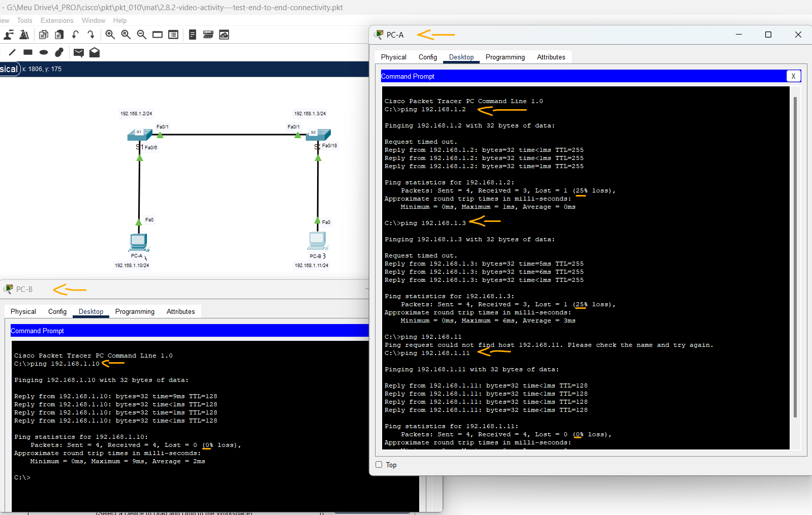

# Vídeo Activity - Teste a conectividade de ponta a ponta   

### Cisco: <a href="../../">cisco   </a>
### Cisco Networking Academy: cna   </a>
### Training Category: <a href="../../pkt/">pkt</a>
### Software/Subject: network   </a>
### Course: <a href="./">pkt_010 (Vídeo Activity - Teste a conectividade de ponta a ponta)   </a>

---

### Theme:
- Network

### Used Tools:
- Operating System (OS): 
  - Windows 11 
- Cloud Services:
  - Google Drive 
- Language:
  - HTML   
  - Markdown   
- Integrated Development Environment (IDE) and Text Editor:
  - Visual Studio Code (VS Code)   
- Versioning: 
  - Git   
- Repository:
  - GitHub   
- Network:
  - Cisco Packet Tracer   
  - ping   

---

<h3><a name="item00">Course Strcuture:</a></h3>

1. <a href="#item01">Vídeo Activity - Teste a conectividade de ponta a ponta</a> 

---

### Objective:
O objetivo desta Video Activity foi validar a conectividade de uma rede local (LAN) através do comando ping, verificando a comunicação fim-a-fim entre computadores e switches previamente configurados com endereçamento IP.

### Folder Structure:
- [README.md](./README.md): Este documento de README, escrito em **Markdown**, com o conteúdo desta atividade.
- [0-aux](./0-aux/): Pasta auxiliar com imagens utilizadas na construção dos arquivos de README desse curso.

### Development:

<a name="item01"><h4>1. Vídeo Activity - Teste a conectividade de ponta a ponta</h4></a>[Back to summary](#item00)

- PC-A -> Desktop -> Terminal -> Command Prompt -> Executar comandos:
  - PC-A - S1: `ping 192.168.1.2`.
  - PC-A - S2: `ping 192.168.1.3`.
  - PC-A - PC-B: `ping 192.168.1.11`.
- PC-B -> Desktop -> Terminal -> Command Prompt -> Executar comandos:
  - PC-B - PC-A: `ping 192.168.10`.

A imagem 01 exibe os resultados dos testes de conectividade.

<figure>
     
    <figcaption>Imagem 01.</figcaption>
</figure>
 