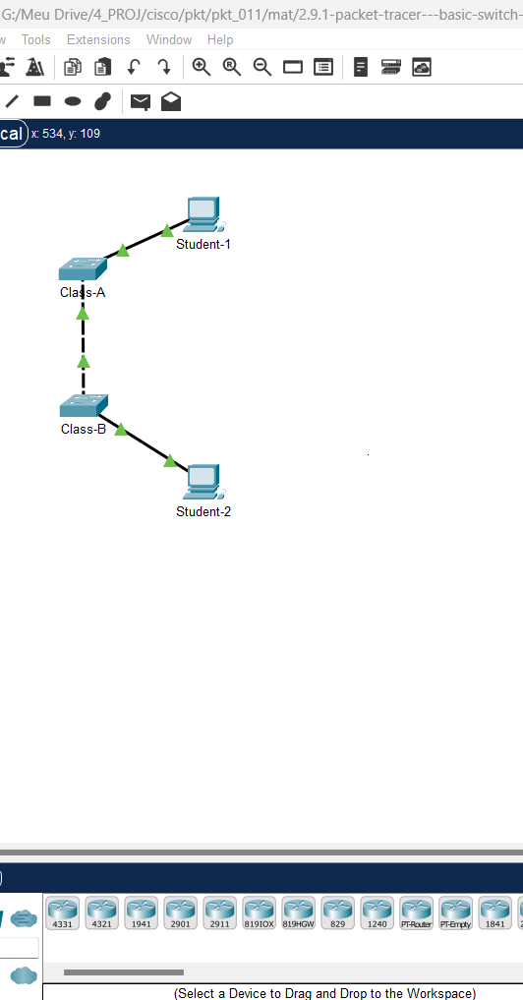
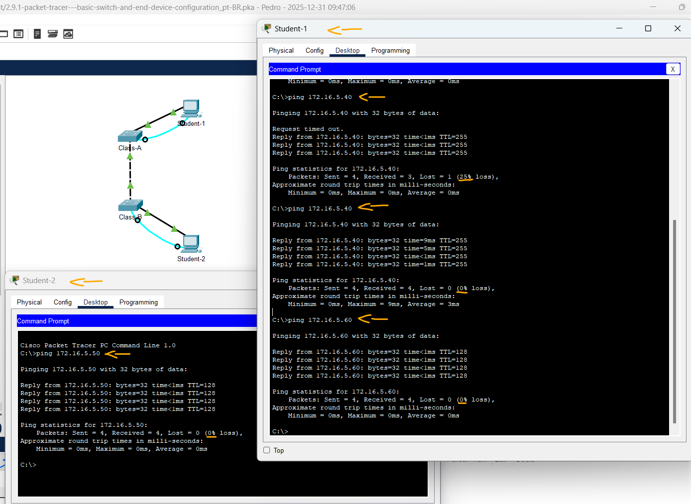

# Packet Tracer - Configuração básica do switch e do dispositivo final   

### Cisco: <a href="../../../">cisco   </a>
### Cisco Networking Academy: cna   </a>
### Training Category: <a href="../../../pkt/">pkt</a>
### Software/Subject: network   </a>
### Course: <a href="./">pkt_011 (Packet Tracer - Configuração básica do switch e do dispositivo final)   </a>

---

### Theme:
- Network

### Used Tools:
- Operating System (OS): 
  - Windows 11 
- Cloud Services:
  - Google Drive 
- Language:
  - HTML   
  - Markdown   
- Integrated Development Environment (IDE) and Text Editor:
  - Visual Studio Code (VS Code)   
- Versioning: 
  - Git   
- Repository:
  - GitHub   
- Network:
  - Cisco Internetwork Operating System (Cisco IOS)   
  - Cisco Packet Tracer   
  - ping   
  
---

<h3><a name="item00">Course Strcuture:</a></h3>

1. <a href="#item01">Packet Tracer - Configuração básica do switch e do dispositivo final</a> 

---

### Objective:
O objetivo deste PTTA foi realizar a configuração básica e de segurança em dois switches, acessados localmente via cabo console. A atividade envolveu a implementação de senhas criptografadas, a definição de banners de aviso e o endereçamento IP estático nos terminais e switches (VLAN). O processo foi finalizado com o teste de conectividade e o backup das configurações na NVRAM para garantir a persistência dos dados.

### Folder Structure:
- [README.md](./README.md): Este documento de README, escrito em **Markdown**, com o conteúdo desta atividade.
- [0-aux](./0-aux/): Pasta auxiliar com imagens utilizadas na construção dos arquivos de README desse curso.

### Development:

<a name="item01"><h4>1. Packet Tracer - Configuração básica do switch e do dispositivo final</h4></a>[Back to summary](#item00)

Nesta atividade foram passados os seguintes objetivos e requisitos:
- Objetivos:
  - Configurar nomes de host e endereços IP em dois switches Cisco Internetwork Operating System (IOS) pela interface de linha de comando (CLI). 
  - Usar comandos do Cisco IOS para especificar ou limitar o acesso às configurações de dispositivo.  
  - Usar os comandos IOS para salvar a configuração em execução. 
  - Configurar dois dispositivos host com endereços IP. 
  - Verificar a conectividade entre os dois dispositivos finais de PC.
- Requisitos:
  - Use uma conexão de console para acessar cada switch. 
  - Nomeie os switches como [[S1Name]] e [[S2Name]]. 
  - Use a senha [[LinePW]] para todas as linhas.  
  - Use a senha secreta [[SecretPW]]. 
  - Criptografe todas as senhas em texto simples. 
  - Configure um banner de mensagem do dia (MOTD) apropriado. 
  - Configure o endereçamento de todos os dispositivos de acordo com a Tabela de endereços. 
  - Salve suas configurações. 
  - Verifique a conectividade entre todos os dispositivos. 

A imagem 01 mostra a topologia inicial.

<figure>
     
    <figcaption>Imagem 01.</figcaption>
</figure>
 

- Use uma conexão de console para acessar cada switch. 
  - Student-1 -> Conectar ao Switch Class-A via cabo console (RS 232 - Console).
  - Student-2 -> Conectar ao Switch Class-B via cabo console (RS 232 - Console).
- Usar comandos do Cisco IOS para especificar ou limitar o acesso às configurações de dispositivo.  
  - Student-1 -> Desktop -> Terminal -> Configurações Padrão (Ok) -> Executar comandos no switch Class-A.
  - Student-2 -> Desktop -> Terminal -> Configurações Padrão (Ok) -> Executar comandos no switch Class-B.
- Nomeie os switches como Class-A e Class-B.:
  - Student-1: `enable` -> `configure terminal` -> `hostname Class-A`.
  - Student-2: `enable` -> `configure terminal` -> `hostname Class-B`.
- Use a senha 8ubRu para todas as linhas:
  - `line console 0` -> `password 8ubRu` -> `login` -> `exit`.
  - `line vty 0 15` -> `password 8ubRu` -> `login` -> `exit`.
- Use a senha secreta C9WrE:
  - `enable secret C9WrE`.
- Criptografe todas as senhas em texto simples:
  - `service password-encryption`.
- Configure um banner de mensagem do dia (MOTD) apropriado:
  - `banner motd "Only Authorized Access. Violators will face the consequences of the law."`.
- Configure o endereçamento de todos os dispositivos de acordo com a Tabela de endereços:
  - Student-1: `interface vlan 1` -> `ip address 172.16.5.35 255.255.255.0` -> `no shutdown` -> `exit` -> `exit`.
  - Student-2: `interface vlan 1` -> `ip address 172.16.5.40 255.255.255.0` -> `no shutdown` -> `exit` -> `exit`.
- Usar os comandos IOS para salvar a configuração em execução.   |   Salve suas configurações:
  - `copy running-config startup-config` -> `show startup-config`.
- Configurar dois dispositivos host com endereços IP. 
  - Student-1 -> Desktop -> IP Configuration -> IP Configuration:
    - Static.
    - IPv4 Address: `172.16.5.50`.
    - Subnet Mask: `255.255.255.0`.
  - Student-2 -> Desktop -> IP Configuration -> IP Configuration:
    - Static.
    - IPv4 Address: `172.16.5.60`.
    - Subnet Mask: `255.255.255.0`.
- Verificar a conectividade entre os dois dispositivos finais de PC.
  - Student-1 -> Desktop -> Command Prompt:
    - Student-1 - Class-A: `ping 172.16.5.35`.
    - Student-1 - Class-B: `ping 172.16.5.40`.
    - Student-1 - Student-2: `ping 172.16.5.60`.
  - Student-2 -> Desktop -> Command Prompt:
    - Student-2 - Student-1: `ping 172.16.5.50`.

<figure>
     
    <figcaption>Imagem 02.</figcaption>
</figure>
 