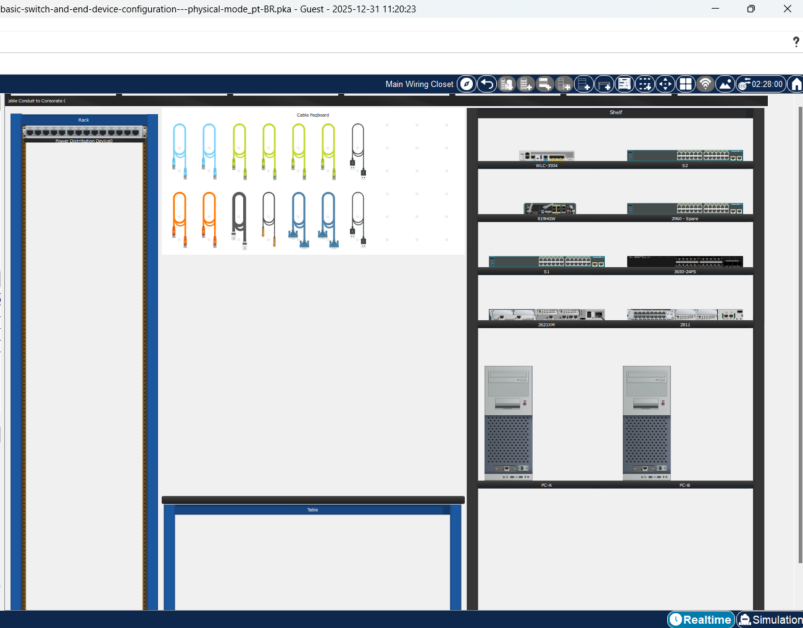
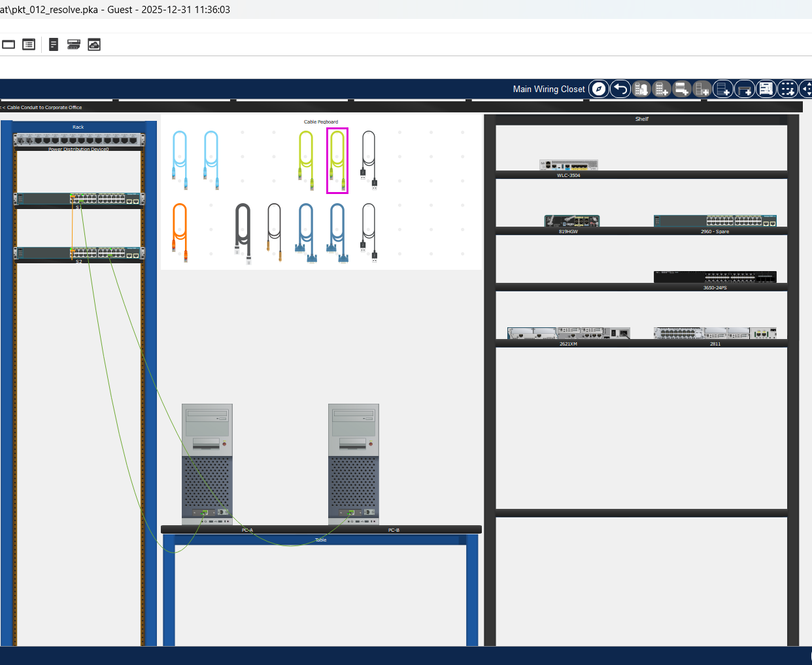
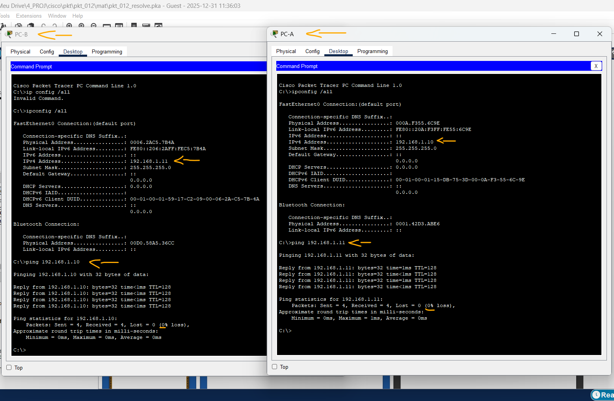
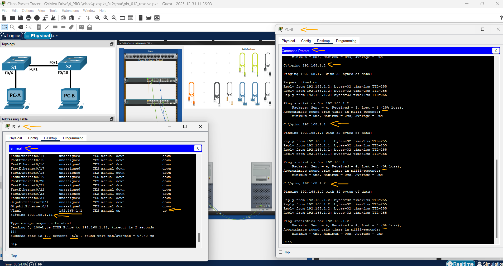

# Packet Tracer - Configuração básica do switch e do dispositivo final - Modo Físico   

### Cisco: <a href="../../../">cisco   </a>
### Cisco Networking Academy: cna   </a>
### Training Category: <a href="../../../pkt/">pkt</a>
### Software/Subject: network   </a>
### Course: <a href="./">pkt_012 (Packet Tracer - Configuração básica do switch e do dispositivo final - Modo Físico)   </a>

---

### Theme:
- Network

### Used Tools:
- Operating System (OS): 
  - Windows 11 
- Cloud Services:
  - Google Drive 
- Language:
  - HTML   
  - Markdown   
- Integrated Development Environment (IDE) and Text Editor:
  - Visual Studio Code (VS Code)   
- Versioning: 
  - Git   
- Repository:
  - GitHub   
- Network:
  - Cisco Internetwork Operating System (Cisco IOS)   
  - Cisco Packet Tracer   
  - ping   
  
---

<h3><a name="item00">Course Strcuture:</a></h3>

1. <a href="#item01">Parte 1: Configurar a topologia de rede (somente Ethernet)</a> 
2. <a href="#item02">Parte 2: Configurar hosts PC</a> 
3. <a href="#item03">Parte 3: Configurar e verificar configurações básicas de switch</a> 
4. <a href="#item04">Perguntas para reflexão</a> 

---

### Objective:
Este PTPM visou a construção física de uma rede com dois switches e dois PCs, explorando o uso correto de cabeamento estruturado (Console, Ethernet e Cross-over). Após a montagem, foram aplicadas diretrizes de segurança inicial e endereçamento IP, seguidos por testes de comunicação para garantir o funcionamento do ambiente.

### Folder Structure:
- [README.md](./README.md): Este documento de README, escrito em **Markdown**, com o conteúdo desta atividade.
- [0-aux](./0-aux/): Pasta auxiliar com imagens utilizadas na construção dos arquivos de README desse curso.

### Development:

<a name="item01"><h4>1. Parte 1: Configurar a topologia de rede (somente Ethernet)</h4></a>[Back to summary](#item00)

A imagem 01 mostra a topologia inicial.

<figure>
     
    <figcaption>Imagem 01.</figcaption>
</figure>
 

- a. Ligue os PCs e ligue os dispositivos de acordo com a topologia. Para selecionar a porta correta em um switch, clique com o botão direito do mouse e selecione Inspecionar Frente. Use a ferramenta Zoom, se necessário. Flutue o mouse sobre as portas para ver os números das portas. O Packet Tracer marcará as conexões corretas do cabo e da porta. Existem vários switches, roteadores e outros dispositivos na prateleira. Clique e arraste os switches S1 e S2 para o Rack. Clique e arraste dois PCs para a mesa.
- b. Ligue os PCs.
- c. No cabo Pegboard, clique em um cabo Cross-Over de cobre. Clique a porta FastEtherNet0/1 em S1 e clique então a porta FastEtherNet0/1 no S2 para conectá-los. Você deve ver o cabo que conecta as duas portas. 
- d. No cabo Pegboard, clique em um cabo reto de cobre. Clique a porta FastEtherNet0/6 em S1 e clique então a porta FastEtherNet0 no PC-A para conectá-los.  
- e. No cabo Pegboard, clique em um cabo reto de cobre. Clique a porta FastEtherNet0/18 em S2 e clique então a porta FastEtherNet0 no PC-B para conectá-los. 
- f. Inspecionar visualmente as conexões de rede. Inicialmente, quando você conecta dispositivos a uma porta de comutação, as luzes de link serão âmbar. Depois de um minuto ou mais, as luzes do link ficarão verdes.  

A imagem 02 exibe a conclusão da Parte 1.

<figure>
     
    <figcaption>Imagem 02.</figcaption>
</figure>
 

<a name="item02"><h4>2. Parte 2: Configurar hosts PC</h4></a>[Back to summary](#item00)

- a. Configure informações de endereço IP estático nos PCs de acordo com a Tabela de Endereçamento. 
  - PC-A -> Desktop -> IP Configuration:
    - Static.
    - IPv4 Address: 192.168.1.11
    - Subnet Mask: 255.255.255.0
  - PC-B -> Config -> FastEthernet0 -> IP Configuration:
    - Static.
    - IPv4 Address: 192.168.1.10
    - Subnet Mask: 255.255.255.0
- b. Verificar as configurações de IP e testar a conectividade.
  - PC-A -> Desktop -> Command Prompt -> `ipconfig /all` -> `ping 192.168.1.11`.
  - PC-B -> Desktop -> Command Prompt -> `ipconfig /all` -> `ping 192.168.1.10`.

A imagem 03 exibe a conclusão da Parte 2.

<figure>
     
    <figcaption>Imagem 03.</figcaption>
</figure>
 

<a name="item03"><h4>3. Parte 3: Configurar e verificar configurações básicas de switch</h4></a>[Back to summary](#item00)

- a. No cabo Pegboard, clique um cabo do console. Conecte o cabo do console entre S1 e PC-A.
- b. Dê ao switch um nome de acordo com a Tabela de Endereçamento.
  - PC-A -> Desktop -> Terminal -> Configurações Padrão (Ok).
  - `enable` -> `configure terminal` -> `hostname S1`.
- b. Digitar senhas locais. Use class como a senha EXEC privilegiada e cisco como a senha para acesso ao console. 
  - `enable secret class` -> `line console 0` -> `password cisco` -> `login` -> `exit`.
- c. Configure e habilite a interface VLAN 1 de acordo com a Tabela de Endereçamento. 
  - `interface vlan 1` -> `ip address 192.168.1.1 255.255.255.0` -> `no shutdown` -> `exit`.
- d. Configurar um banner MOTD apropriado para avisar sobre o acesso não autorizado.
  - `banner motd "Only Authorized Access. Violators will face the consequences of the law."`.
- e. Salve a configuração Display the current configuration.
  - `exit` -> `copy running-config startup-config` -> `show startup-config`.
- f. Exibir a versão do IOS e outras informações úteis do switch.
  - `show version`.
- g. Exibe o status das interfaces conectadas no switch.
  - `show ip interface brief`.
- h. Repita as etapas anteriores para o Switch S2.
  - PC-B -> Conectar ao switch S2 via cabo console (RS 232 - Console).
  - PC-B -> Desktop -> Terminal -> Configurações Padrão (Ok).
  - `enable` -> `configure terminal` -> `hostname S2`.
  - `enable secret class` -> `line console 0` -> `password cisco` -> `login` -> `exit`.
  - `interface vlan 1` -> `ip address 192.168.1.2 255.255.255.0` -> `no shutdown` -> `exit`.
  - `banner motd "Only Authorized Access. Violators will face the consequences of the law."`.
  - `exit` -> `copy running-config startup-config` -> `show startup-config`.
  - `show version`.
  - `show ip interface brief`.
- h. Registrar o status de interface das interfaces a seguir (Interface | S1 Status | S1 Protocol | S2 Status | S2 Protocol).
  - FastEthernet0/1 (F0/1): up - up - up - up
  - FastEthernet0/6 (F0/6): up - up - down - down
  - FastEthernet0/18 (F0/18): down - down - up - up
  - Vlan1 (VLAN1): up - up - up - up
- i. De um PC, ping S1 e S2. Os pings devem ser bem-sucedidos. 
  - PC-B -> Desktop -> Command Prompt -> `ping 192.168.1.1` -> `ping 192.168.1.2`.
- j. De um switch, teste a conectividade PC-A e PC-B. Os pings devem ser bem-sucedidos.   
  - PC-A -> Desktop -> Terminal -> Configurações Padrão (Ok).
  - `enable` -> `ping 192.168.1.11`.

A imagem 04 exibe a conclusão da Parte 3.

<figure>
     
    <figcaption>Imagem 04.</figcaption>
</figure>
 

<a name="item04"><h4>4. Perguntas para reflexão</h4></a>[Back to summary](#item00)

- a. Por que algumas portas FastEthernet nos switches estão ativas e outras estão inativas? 
  - Algumas portas estão ativas porque possuem dispositivos conectados e link físico estabelecido. As portas inativas não têm cabos conectados, o dispositivo está desligado ou a interface foi desabilitada administrativamente.
- b. O que pode impedir que um ping seja enviado entre os PCs? 
  - Configuração incorreta de endereço IP, máscara de rede ou gateway pode impedir a comunicação. Além disso, portas desativadas, VLANs diferentes ou bloqueio por firewall também podem impedir o ping.