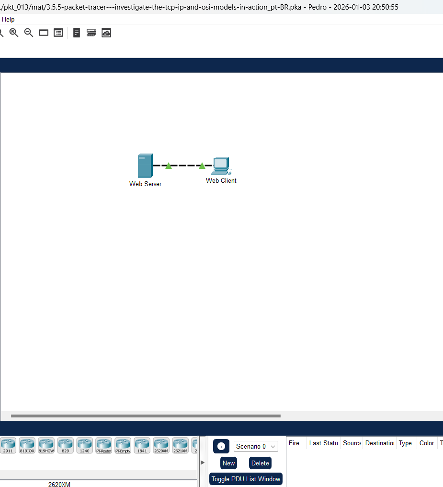
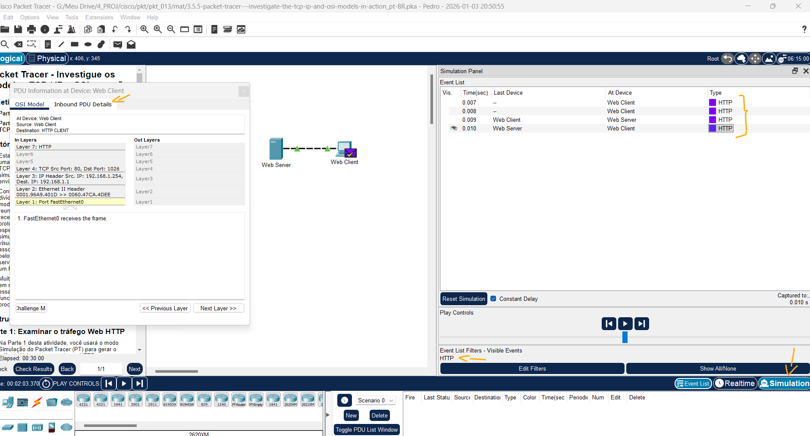
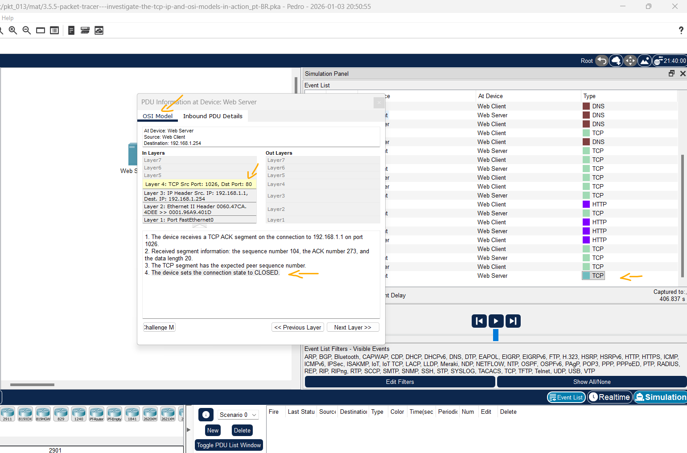
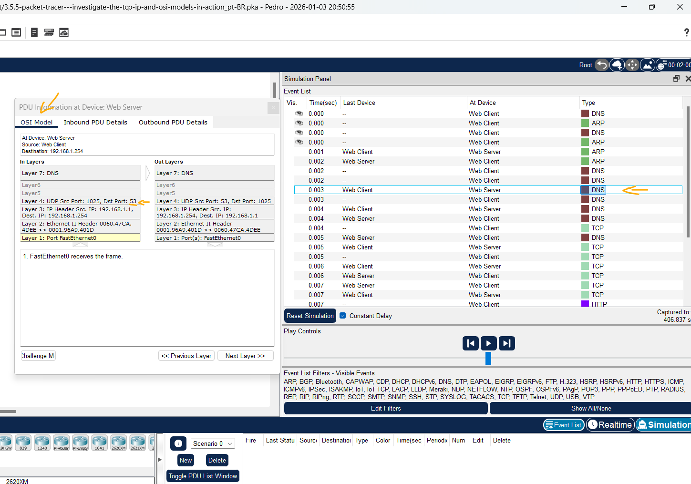

# Packet Tracer - Investigue os modelos TCP / IP e OSI em ação   

### Cisco: <a href="../../">cisco   </a>
### Cisco Networking Academy: cna   </a>
### Training Category: <a href="../../pkt/">pkt</a>
### Software/Subject: network   </a>
### Course: <a href="./">pkt_013 (Packet Tracer - Investigue os modelos TCP / IP e OSI em ação)   </a>

---

### Theme:
- Network

### Used Tools:
- Operating System (OS): 
  - Windows 11 
- Cloud Services:
  - Google Drive 
- Language:
  - HTML   
  - Markdown   
- Integrated Development Environment (IDE) and Text Editor:
  - Visual Studio Code (VS Code)   
- Versioning: 
  - Git   
- Repository:
  - GitHub   
- Network:
  - Cisco Packet Tracer   
  
---

<h3><a name="item00">Course Strcuture:</a></h3>

1. <a href="#item01">Parte 1: Examinar o tráfego Web via HTTP</a> 
  1.1 <a href="#item01.01">Etapa 1: Alternar do modo Realtime (Tempo real) para o modo Simulation (Simulação).</a> 
  1.2 <a href="#item01.02">Etapa 2: Gerar tráfego Web (HTTP).</a> 
  1.3 <a href="#item01.03">Etapa 3: Explorar o conteúdo do pacote HTTP.</a> 
2. <a href="#item02">Parte 2: Exibir elementos da suíte de protocolos TCP/IP</a> 
  2.1 <a href="#item02.01">Etapa 1: Visualizar Eventos Adicionais</a> 
3. <a href="#item03">Perguntas desafiadoras</a> 

---

### Objective:
O objetivo deste PTTA foi utilizar o modo de simulação do Packet Tracer para monitorar o fluxo de PDUs entre um cliente e um servidor web. A atividade focou na análise dos processos de encapsulamento e desencapsulamento, observando o comportamento de diferentes protocolos como DNS, HTTP e TCP através das camadas do modelo OSI.

### Folder Structure:
- [README.md](./README.md): Este documento de README, escrito em **Markdown**, com o conteúdo desta atividade.
- [0-aux](./0-aux/): Pasta auxiliar com imagens utilizadas na construção dos arquivos de README desse curso.

### Development:

<a name="item01"><h4>1. Parte 1: Examinar o tráfego Web via HTTP</h4></a>[Back to summary](#item00)

Na Parte 1 desta atividade, você usará o modo Simulation (Simulação) do Packet Tracer (PT) para gerar o tráfego Web e para examinar o HTTP. 

A imagem 01 mostra a topologia inicial.

<figure>
     
    <figcaption>Imagem 01.</figcaption>
</figure>
 

<a name="item01.01"><h4>1.1 Etapa 1: Alternar do modo Realtime (Tempo real) para o modo Simulation (Simulação).</h4></a>[Back to summary](#item00)

No canto inferior direito da interface do Packet Tracer, existem botões que alternam entre o modo Realtime e Simulação. O PT sempre inicia no modo Realtime (Tempo real), no qual os protocolos de rede operam com temporizações realistas. No entanto, um recurso eficaz do Packet Tracer permite que o usuário "pare o tempo" ao mudar para o modo Simulation (Simulação). No modo Simulation (Simulação), os pacotes são exibidos como envelopes animados, o tempo é orientado por eventos e o usuário pode caminhar através de 
eventos da rede.

- a. Clique no ícone do modo Simulation (Simulação) para alternar do modo Realtime (Tempo real) para o modo Simulation (Simulação). 
- b. Selecione HTTP em Event List Filters (Filtros de lista de eventos). O HTTP pode já ser o único evento visível. Se necessário, clique no botão Editar filtros na parte 
inferior do painel de simulação para exibir os eventos visíveis disponíveis. Alterne a caixa de seleção Show All/None (Exibir tudo/nenhum) e observe como as caixas mudam de desmarcada para marcada ou de marcada para desmarcada, dependendo do estado atual. 
- b. Clique na caixa de seleção Mostrar tudo/nenhum até que todas as caixas estejam limpas e selecione HTTP na guia Diversos da janela Editar filtros. Clique no X no canto superior direito da janela para fechar a janela Editar filtros. Os eventos visíveis agora devem exibir somente HTTP. 

<a name="item01.02"><h4>1.2 Etapa 2: Gerar tráfego Web (HTTP).</h4></a>[Back to summary](#item00)

Atualmente, o Simulation Panel (Painel de simulação) está vazio. Existem cinco colunas listadas na parte superior da Lista de Eventos no Painel de Simulação. Enquanto o tráfego é gerado e suas etapas são seguidas completamente, eventos aparecem na lista. Nota: O servidor da Web e o cliente da Web são exibidos no painel esquerdo. O tamanho dos painéis pode ser ajustado. Basta passar o cursor próximo à barra de rolagem e arrastá-la para a esquerda ou direita quando a seta dupla for exibida.

- a. Clique em Web Client (Cliente da Web) no painel à esquerda.
- b. Clique na guia Desktop e no ícone Web Browser (Navegador da Web) para abri-lo. 
- c. No campo URL, digite www.osi.local e clique em Go (Ir). Como o tempo no modo Simulation (Simulação) é orientado por eventos, você precisa usar o botão Capture/Forward (Capturar/Avançar) para exibir eventos de rede. O botão de captura para frente está localizado no lado esquerdo da faixa azul que está abaixo da janela de topologia. Dos três botões ali, é o da direita. 
- d. Clique em Capture/Forward (Capturar/Avançar) quatro vezes. Deve haver quatro eventos na Event List (Lista de eventos). Examine a página do navegador do Web Client (Cliente Web). Alguma coisa mudou? 
  - Sim, houve resposta a solicitação e o site foi exibido.

<a name="item01.03"><h4>1.3 Etapa 3: Explorar o conteúdo do pacote HTTP.</h4></a>[Back to summary](#item00)

- a. Clique na primeira caixa quadrada colorida na coluna Lista de eventos>Tipo. Talvez seja necessário expandir o Simulation Panel (Painel de simulação) ou usar a barra de rolagem diretamente abaixo da Event List (Lista de eventos). A janela PDU Information at Device: Web Client (Informação da PDU no dispositivo: cliente Web) é exibida. Nessa janela, há apenas duas guias (OSI Model [Modelo OSI] e Outbound PDU Details [Detalhes da PDU de saída]) porque esse é o início da transmissão. Com o aumento de eventos 
examinados, três guias serão exibidas, adicionando uma guia para Inbound PDU Details (Detalhes da PDU de entrada). Quando um evento é o último no fluxo do tráfego, apenas as guias OSI Model (Modelo OSI) e Inbound PDU Details (Detalhes da PDU de entrada) são exibidas.  
- b. A guia OSI Model (Modelo OSI) deve estar selecionada. Na coluna Camadas de saída, clique em Camada 7. Quais informações estão listadas nas etapas numeradas diretamente abaixo das caixas In Layers e Out Layers para a camada 7? 
  - In Layers: `Layer7`. Out Layers: `Layer 7: HTTP`.
- b. Qual é o valor da Dst Port para a camada 4 na coluna Out Layers? 
  - 80.
- b. Qual é o Dest. Valor IP para a Camada 3 na coluna Out Layers?
  - 192.168.1.254.
- b. Quais informações são exibidas na Camada 2 sob a coluna Out Layers?
  - Endereços MAC de origem e destino (quadro Ethernet).
- c. Clique na guia Outbound PDU Details (Detalhes da PDU de saída). As informações listadas nos Formatos da PDU refletem as camadas do modelo TCP / IP. Nota: As informações listadas na seção Ethernet II da guia Detalhes da PDU de saída fornecem informações ainda mais detalhadas do que as listadas na Camada 2 na guia Modelo OSI. Os detalhes 
da PDU de saída fornecem informações mais descritivas e detalhadas. Os valores em DEST MAC (MAC DE DESTINO) e SRC MAC (MAC DE ORIGEM) na seção Ethernet II de PDU Details (Detalhes de PDU) são exibidos na guia OSI Model (Modelo OSI) na Camada 2, mas não são identificados como tais. Quais são as informações comuns listadas na seção IP de PDU Details (Detalhes da PDU) em comparação com as listadas na guia OSI Model (Modelo OSI)? Com qual camada ela é associada? 
  - IP de Origem e IP de Destino. Camada de Rede (Camada 3).
- c. Quais são as informações comuns listadas na seção TCP de Detalhes da PDU, em comparação com as informações listadas na guia Modelo OSI e com qual camada ela está associada?
  - Porta de Origem e Porta de Destino. Camada de Transporte (Camada 4).
- c. Qual é o host listado na seção HTTP dos detalhes da PDU? Com qual camada essas informações seriam associadas na guia OSI Model (Modelo OSI)?
  - O host listado é www.osi.local. Camada de Aplicação (Camada 7).
- d. Clique na próxima caixa quadrada colorida na coluna Lista de eventos> Tipo. Somente a Camada 1 está ativa (não está em cinza). O dispositivo está movendo o quadro do buffer e colocando-o na rede. 
- e. Avance para a próxima caixa Tipo de HTTP na Lista de Eventos e clique na caixa quadrada colorida. Essa janela contém as In Layers (Camadas de entrada) e Out Layers (Camadas de saída). Observe a direção da seta diretamente sob a coluna In Layers; está apontando para cima, indicando a direção em que os dados estão viajando. Role por essas camadas anotando os itens exibidos anteriormente. Na parte superior da coluna, a seta aponta para a direita. Isso indica que o servidor está enviando agora as 
informações de volta ao cliente. Comparando as informações exibidas na coluna In Layers (Camadas de entrada) com a coluna Out Layers (Camadas de saída), quais são as diferenças principais? 
  - A coluna In Layers inicia na camada 1 até 7, enquanto na coluna Out Layers inicia na camada 7 até a 1, ou seja, a primeira descapsula a PDU, enquanto a segunda encapsula a PDU.
- f. Clique na guia Detalhes da PDU de entrada e saída. Revise os detalhes da PDU. 
- g. Clique na última caixa quadrada colorida na coluna Info (Informações). Quantas guias são exibidas com este evento? Explique.
  - São exibidas duas guias: OSI Model e Inbound PDU Details. Isso ocorre porque o evento representa o recebimento final da PDU, não havendo encapsulamento ou envio de resposta, e portanto não é exibida a guia Outbound PDU Details.

A imagem 02 exibe a conclusão da Parte 1.

<figure>
     
    <figcaption>Imagem 02.</figcaption>
</figure>
 

<a name="item02"><h4>2. Parte 2: Exibir elementos da suíte de protocolos TCP/IP</h4></a>[Back to summary](#item00)

Na Parte 2 desta atividade, você usará o modo Simulação do Packet Tracer para visualizar e examinar alguns dos outros protocolos que compreendem o conjunto TCP / IP. 

<a name="item02.01"><h4>2.1 Etapa 1: Visualizar Eventos Adicionais</h4></a>[Back to summary](#item00)

- a. Feche todas as janelas de informações da PDU.
- b. Na seção Filtros da Lista de Eventos> Eventos Visíveis, clique em Mostrar Tudo/Nenhum. Que tipos de eventos adicionais são exibidos?
  - Além dos eventos HTTP, passam a ser exibidos eventos dos protocolos DNS, ARP e TCP, que são necessários para a resolução de nomes, descoberta de endereços MAC e estabelecimento da conexão antes da comunicação HTTP.
- b. Essas entradas extras têm várias funções na suíte TCP/IP. O Protocolo de Resolução de Endereços (ARP) solicita endereços MAC para hosts de destino. O DNS é responsável por converter um nome (por exemplo, www.osi.local) para um endereço IP. Os eventos TCP adicionais são responsáveis por conectar, concordar com parâmetros de comunicação e desativar as sessões de comunicação entre os dispositivos. Esses protocolos foram mencionados anteriormente e serão discutidos em mais detalhes ao longo do curso. Atualmente, há mais de 35 protocolos possíveis (tipos de eventos) disponíveis para a captura no Packet Tracer. 
- c. Clique no primeiro evento DNS na coluna Tipo. Explore as guias OSI Model (Modelo OSI) e PDU Detail (Detalhe de PDU) e observe o processo de encapsulamento. Ao observar a guia OSI Model (Modelo OSI) com a Layer 7 (Camada 7) destacada, uma descrição do que está ocorrendo está listada diretamente abaixo nas In Layers (Camadas de entrada) e Out Layers (Camadas de saída) (“1. O cliente DNS envia uma solicitação DNS ao servidor DNS".). Essa informação é muito útil para ajudar a entender o que está ocorrendo durante o processo de comunicação. 
- d. Clique na guia Outbound PDU Details (Detalhes da PDU de saída). Quais informações estão listadas no campo NAME: na seção DNS QUERY?
  - www.osi.local
- e. Clique na última caixa quadrada colorida Info (Informações) DNS na lista de eventos. Em que dispositivo a PDU foi capturada? 
  - Web Client.
- e. Qual é o valor listado ao lado de ADDRESS (ENDEREÇO): na seção DNS ANSWER (RESPOSTA DNS) de Inbound PDU Details (Detalhes da PDU de entrada)? 
  - 192.168.1.254.
- f. Localize o primeiro evento HTTP na lista e clique na caixa quadrada colorida do evento TCP imediatamente após esse evento. Destaque Layer 4 (Camada 4) na guia OSI Model (Modelo OSI). Na lista numerada diretamente abaixo de In Layers (Camadas de entrada) e Out Layers (Camadas de saída), quais as informações exibidas nos itens 4 e 5? 
  - "A conexão TCP foi bem-sucedida" e "O dispositivo define o estado da conexão como ESTABELECIDA".
- f. O TCP gerencia a conexão e desconexão do canal de comunicação entre outras responsabilidades. Esse evento específico mostra que o canal de comunicação estava ESTABLISHED (ESTABELECIDO). 
- g. Clique no último evento TCP. Destaque Layer 4 (camada 4) na guia OSI Model (Modelo OSI). Examine as etapas listadas abaixo de In Layers (Camadas de entrada) e Out Layers (Camadas de saída). Qual é o objetivo desse evento, com base nas informações fornecidas no último item da lista (deve ser o item 4)? 
  - "O dispositivo define o estado da conexão como FECHADO.". Neste caso, a sessão foi fechada.

A imagem 03 exibe a conclusão da Parte 2.

<figure>
     
    <figcaption>Imagem 03.</figcaption>
</figure>
 

<a name="item03"><h4>3. Perguntas desafiadoras</h4></a>[Back to summary](#item00)

Esta simulação fornece um exemplo de uma sessão Web entre um cliente e um servidor em uma rede local (LAN). O cliente efetua solicitações aos serviços específicos que são executados no servidor. O servidor deve estar configurado para aguardar em portas específicas uma solicitação do cliente. (Dica: veja a camada 4 na guia OSI Model (Modelo OSI) para obter informações de porta.)

- a. Com base nas informações que foram inspecionadas durante a captura do Packet Tracer, em qual número de porta o Web Server (Servidor da Web) ouve a requisição Web? 
  - 80.
- b. A que portas o Web Server (Servidor da Web) está ouvindo em uma requisição DNS?
  - 53.

A imagem 04 exibe a conclusão da Parte 3.

<figure>
     
    <figcaption>Imagem 04.</figcaption>
</figure>
 
