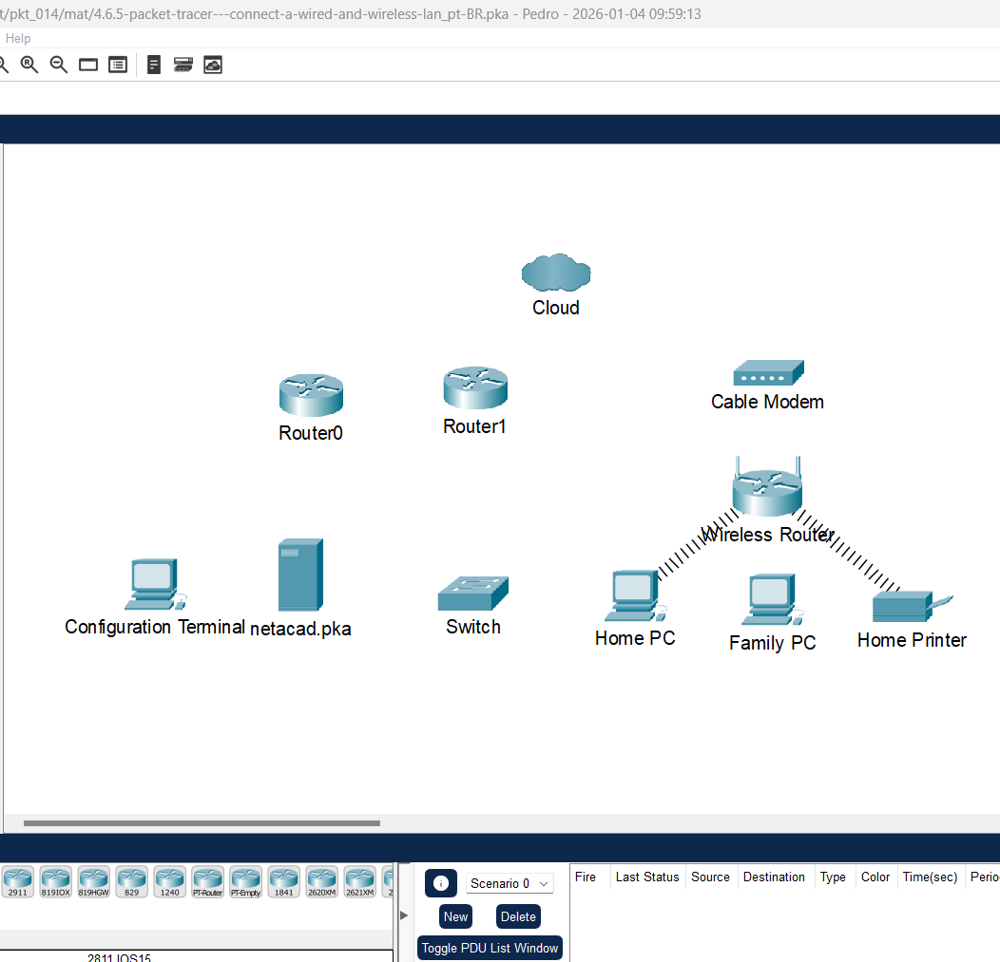
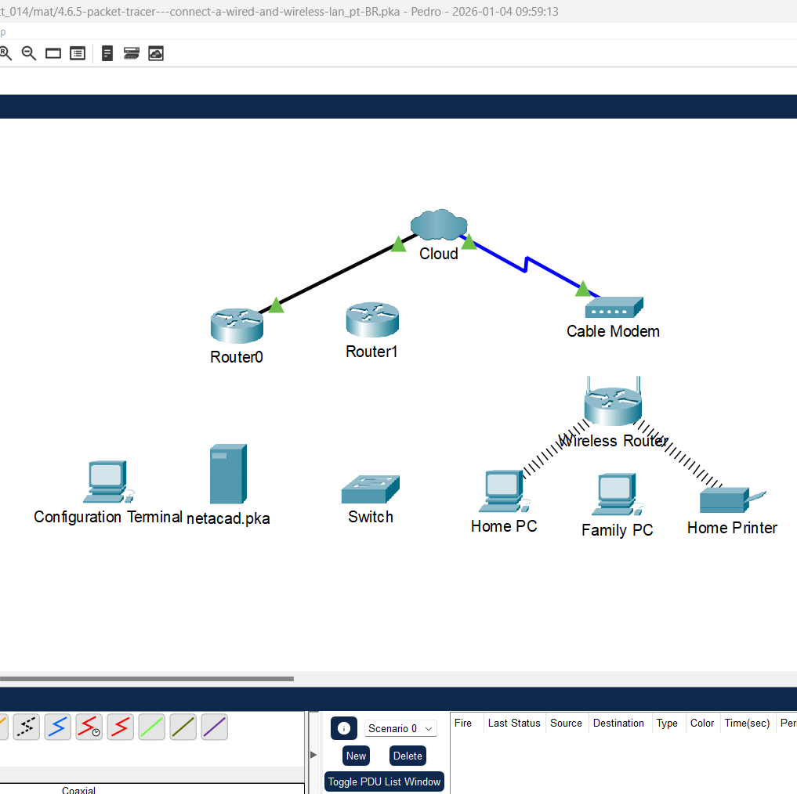
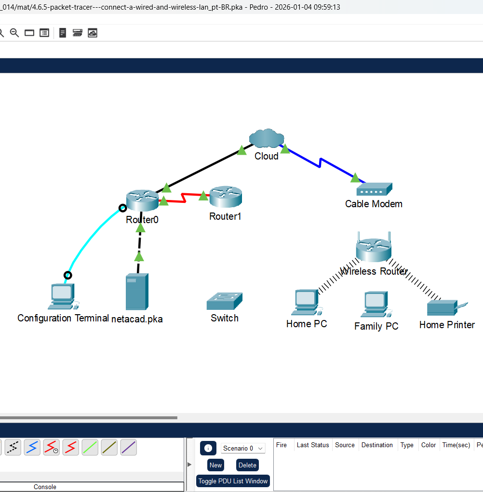
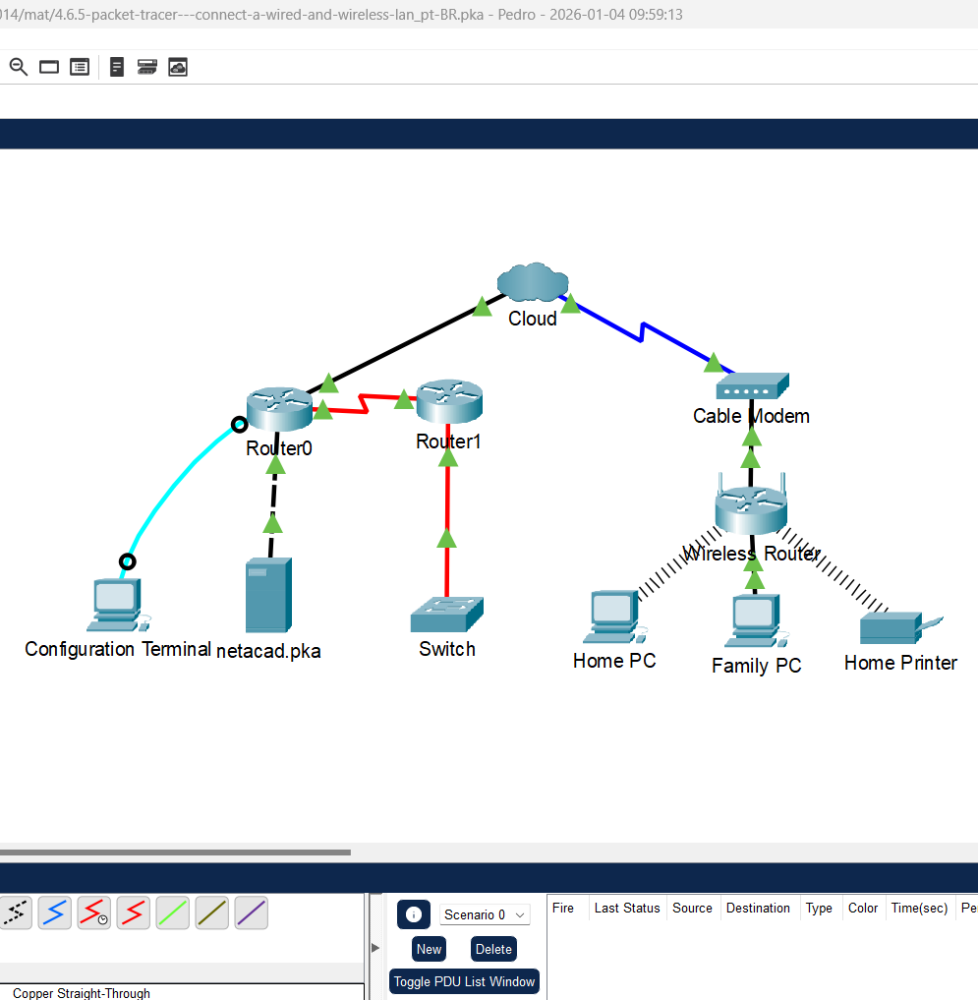
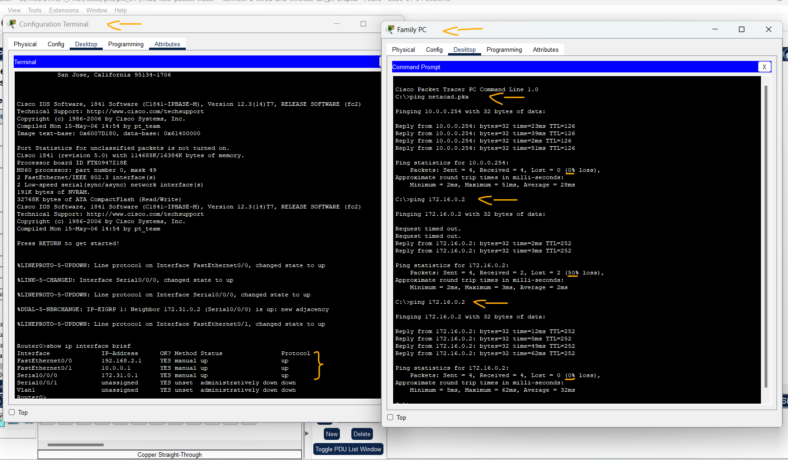
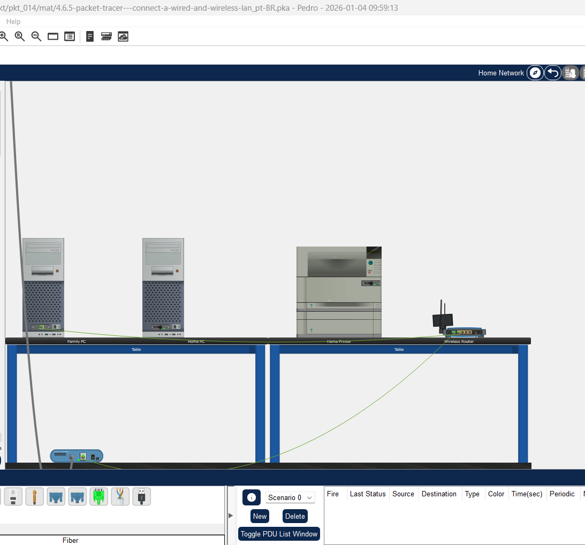

# Packet Tracer - Conecte uma LAN com e sem fio   

### Cisco: <a href="../../../">cisco   </a>
### Cisco Networking Academy: cna   </a>
### Training Category: <a href="../../../pkt/">pkt</a>
### Software/Subject: network   </a>
### Course: <a href="./">pkt_014 (Packet Tracer - Conecte uma LAN com e sem fio)   </a>

---

### Theme:
- Network

### Used Tools:
- Operating System (OS): 
  - Windows 11 
- Cloud Services:
  - Google Drive 
- Language:
  - HTML   
  - Markdown   
- Integrated Development Environment (IDE) and Text Editor:
  - Visual Studio Code (VS Code)   
- Versioning: 
  - Git   
- Repository:
  - GitHub   
- Network:
  - Cisco Packet Tracer   
  - ping   
  
---

<h3><a name="item00">Course Strcuture:</a></h3>

1. <a href="#item01">Parte 1: conectar-se à nuvem</a> 
  1.1 <a href="#item01.01">Etapa 1: Conectar a nuvem ao Router0.</a> 
  1.2 <a href="#item01.02">Etapa 2: Conectar a nuvem ao modem a cabo.</a> 
2. <a href="#item02">Parte 2: conectar Router0</a> 
  2.1 <a href="#item02.01">Etapa 1: Conectar Router0 a Router1.</a> 
  2.2 <a href="#item02.02">Etapa 2: Conectar Router0 a netacad.pka.</a> 
  2.3 <a href="#item02.03">Etapa 3: Conectar Router0 ao terminal de configuração (Configuration Terminal).</a> 
3. <a href="#item03">Parte 3: conectar dispositivos restantes</a> 
  3.1 <a href="#item03.01">Etapa 1: Conectar Router1 a Switch.</a> 
  3.2 <a href="#item03.02">Etapa 2: Conectar Cable Modem a Wireless Router.</a> 
  3.3 <a href="#item03.03">Etapa 3: Conectar Wireless Router a Family PC</a> 
4. <a href="#item04">Parte 4: verificar conexões</a> 
  4.1 <a href="#item04.01">Etapa 1: Testar a conexão do Family PC com netacad.pka.</a> 
  4.2 <a href="#item04.02">Etapa 2: Fazer ping no switch a partir do Home PC.</a> 
  4.3 <a href="#item04.03">Etapa 3: Abrir Router0 pelo Configuration Terminal.</a> 
5. <a href="#item05">Parte 5: examinar a topologia física</a> 
  5.1 <a href="#item05.01">Etapa 1: Examinar a nuvem.</a> 
  5.2 <a href="#item05.02">Etapa 2: Examinar a rede principal.</a> 
  5.3 <a href="#item05.03">Etapa 3: Examinar a rede secundária.</a> 
  5.4 <a href="#item05.04">Etapa 4: Examinar a rede residencial.</a> 

---

### Objective:
Este PTTA teve como objetivo identificar e aplicar o cabeamento adequado para a interconexão de diferentes dispositivos de rede. A atividade consistiu na montagem física da topologia, validando a conectividade desde uma estação em rede doméstica até o acesso a um servidor remoto.

### Folder Structure:
- [README.md](./README.md): Este documento de README, escrito em **Markdown**, com o conteúdo desta atividade.
- [0-aux](./0-aux/): Pasta auxiliar com imagens utilizadas na construção dos arquivos de README desse curso.

### Development:

<a name="item01"><h4>1. Parte 1: conectar-se à nuvem</h4></a>[Back to summary](#item00)

A imagem 01 mostra a topologia inicial.

<figure>
     
    <figcaption>Imagem 01.</figcaption>
</figure>
 

<a name="item01.01"><h4>1.1 Etapa 1: Conectar a nuvem ao Router0.</h4></a>[Back to summary](#item00)

- a. Na parte inferior esquerda, clique no ícone laranja para abrir as Connections (Conexões) disponíveis.
- b. Escolha o cabo certo para conectar Router0 F0/0 a Cloud Eth6. Cloud é um tipo de switch, então use a conexão Copper Straight-Through. Se você conectou o cabo certo, as luzes de link no cabo ficam verdes. 

<a name="item01.02"><h4>1.2 Etapa 2: Conectar a nuvem ao modem a cabo.</h4></a>[Back to summary](#item00)

- a. Escolha o cabo certo para conectar Cloud Coax7 a Modem Port0. Se você conectou o cabo certo, as luzes de link no cabo ficam verdes.

A imagem 02 exibe a conclusão da Parte 1.

<figure>
     
    <figcaption>Imagem 02.</figcaption>
</figure>
 

<a name="item02"><h4>2. Parte 2: conectar Router0</h4></a>[Back to summary](#item00)

<a name="item02.01"><h4>2.1 Etapa 1: Conectar Router0 a Router1.</h4></a>[Back to summary](#item00)

- a. Escolha o cabo certo para conectar Router0 Ser0/0/0 a Router1 Ser0/0. Um dos cabos Seriais disponíveis. Se você conectou o cabo certo, as luzes de link no cabo ficam verdes. 

<a name="item02.02"><h4>2.2 Etapa 2: Conectar Router0 a netacad.pka.</h4></a>[Back to summary](#item00)

- a. Escolha o cabo certo para conectar Router0 F0/1 a netacad.pka F0. Roteadores e computadores normalmente usam os mesmos fios para transmitir (1 e 2) e receber (3 e 6). O cabo certo consiste nestes cabos cruzados. Embora muitas NICs agora possam detectar automaticamente qual par é usado para transmitir e receber, o Router0 e o netacad.pka não possuem NICs com detecção automática. Se você conectou o cabo certo, as luzes de link no cabo ficam verdes.

<a name="item02.03"><h4>2.3 Etapa 3: Conectar Router0 ao terminal de configuração (Configuration Terminal).</h4></a>[Back to summary](#item00)

- a. Escolha o cabo correto para conectar o console Router0 ao terminal de configuração RS232. Esse cabo não fornece acesso de rede a Configuration Terminal (Terminal de configuração), mas permite a você configurar Router0 por meio de seu terminal. Se você conectou o cabo certo, as luzes de link no cabo ficam pretas. 

A imagem 03 exibe a conclusão da Parte 2.

<figure>
     
    <figcaption>Imagem 03.</figcaption>
</figure>
 

<a name="item03"><h4>3. Parte 3: conectar dispositivos restantes</h4></a>[Back to summary](#item00)

<a name="item03.01"><h4>3.1 Etapa 1: Conectar Router1 a Switch.</h4></a>[Back to summary](#item00)

- a. Escolha o cabo certo para conectar Router1 F1/0 a Switch F0/1. Se você conectou o cabo certo, as luzes de link no cabo ficam verdes. Espere alguns segundos até a luz 
passar de amarela para verde. 

<a name="item03.02"><h4>3.2 Etapa 2: Conectar Cable Modem a Wireless Router.</h4></a>[Back to summary](#item00)

- a. Escolha o cabo certo para conectar o cabo Modem Port1 à porta Wireless Router Internet. Se você conectou o cabo certo, as luzes de link no cabo ficarão verdes. 

<a name="item03.03"><h4>3.3 Etapa 3: Conectar Wireless Router a Family PC</h4></a>[Back to summary](#item00)

- a. Escolha o cabo certo para conectar Wireless Router Ethernet 1 a Family PC (PC da família). Se você conectou o cabo certo, as luzes de link no cabo ficam verdes.

A imagem 04 exibe a conclusão da Parte 3.

<figure>
     
    <figcaption>Imagem 04.</figcaption>
</figure>
 

<a name="item04"><h4>4. Parte 4: verificar conexões</h4></a>[Back to summary](#item00)

<a name="item04.01"><h4>4.1 Etapa 1: Testar a conexão do Family PC com netacad.pka.</h4></a>[Back to summary](#item00)

- a. Abra o prompt de comando em Family PC (PC da família) e envie um ping para netacad.pka. 
  - `ping netacad.pka`.
- b. Abra o Web Browser (Navegador da Web) e insira o endereço http://netacad.pka. 

<a name="item04.02"><h4>4.2 Etapa 2: Fazer ping no switch a partir do Home PC.</h4></a>[Back to summary](#item00)

- a. Abra o prompt de comando no Home PC (PC residencial) e execute ping no endereço IP do Switch para verificar a conexão. 
  - `ping 172.16.0.2`

<a name="item04.03"><h4>4.3 Etapa 3: Abrir Router0 pelo Configuration Terminal.</h4></a>[Back to summary](#item00)

- a. Abra o Terminal do Configuration Terminal (Terminal de configuração) e aceite as configurações padrão.
- b. Pressione Enter para ver o prompt de comando do Router0. 
- c. Digite show ip interface brief para ver os status das interfaces.

A imagem 05 exibe a conclusão da Parte 4.

<figure>
     
    <figcaption>Imagem 05.</figcaption>
</figure>
 

<a name="item05"><h4>5. Parte 5: examinar a topologia física</h4></a>[Back to summary](#item00)

<a name="item05.01"><h4>5.1 Etapa 1: Examinar a nuvem.</h4></a>[Back to summary](#item00)

- a. Clique na guia Physical Workspace (Área de trabalho física) ou pressione Shift+P and Shift+L para alternar entre os ambientes de trabalho lógico e físico. 
- b. Clique no ícone Home City (Cidade natal).
- c. Clique no ícone Cloud (Nuvem). Quantos cabos estão conectados ao switch no rack azul?
  - 2.
- d. Clique em Back (Voltar) para voltar para Home City (Cidade natal).

<a name="item05.02"><h4>5.2 Etapa 2: Examinar a rede principal.</h4></a>[Back to summary](#item00)

- a. Clique no ícone Primary Network (Rede principal). Aponte o cursor sobre os vários cabos. O que há na mesa à direita do rack azul?
  - O Configuration Terminal.
- b. Clique em Back (Voltar) para voltar para Home City (Cidade natal). 

<a name="item05.03"><h4>5.3 Etapa 3: Examinar a rede secundária.</h4></a>[Back to summary](#item00)

- a. Clique no ícone Secondary Network (Rede secundária). Aponte o cursor sobre os vários cabos. Por que existem dois cabos laranja conectados a cada dispositivo? 
  - O cabo laranja representa a conexão da rede secundária, que fornece um caminho alternativo de comunicação. Embora apenas um cabo seja visível, ele simboliza o enlace redundante utilizado caso o enlace principal falhe.
- b. Clique em Back (Voltar) para voltar para Home City (Cidade natal). 

<a name="item05.04"><h4>5.4 Etapa 4: Examinar a rede residencial.</h4></a>[Back to summary](#item00)

- a. Clique no ícone Home Network (Rede residencial). Por que não há racks para acomodar equipamentos? 
  - Porque não se trata de um Data Center e sim uma rede doméstica.
- b. Clique na guia Logical Workspace (Área de trabalho lógica) para voltar para a topologia.

A imagem 06 exibe a conclusão da Parte 5.

<figure>
     
    <figcaption>Imagem 06.</figcaption>
</figure>
 