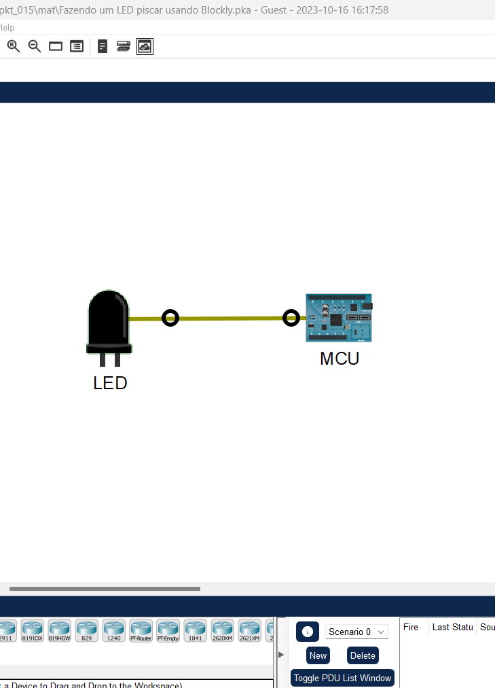
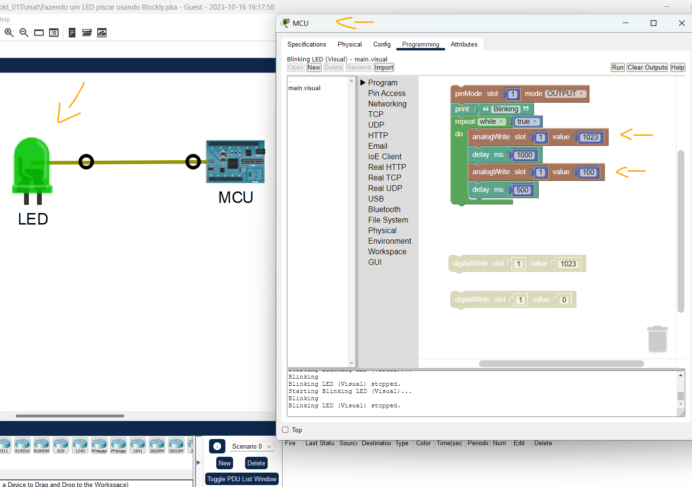
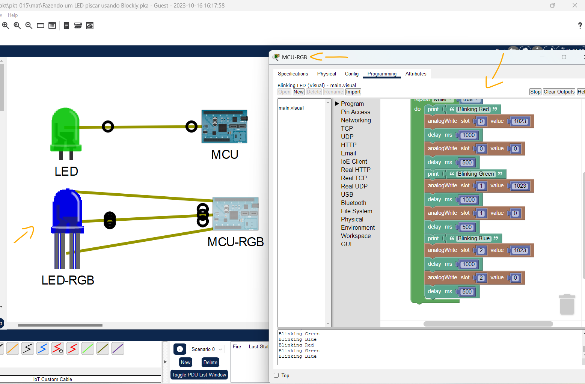
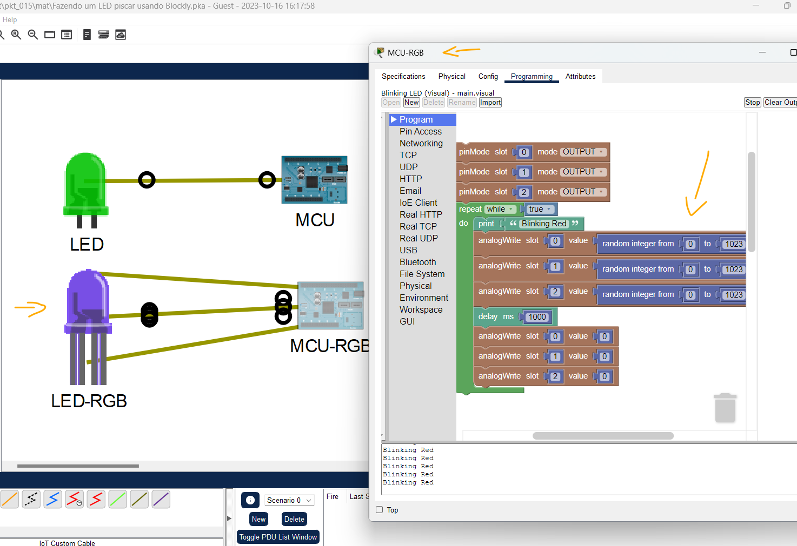

# Packet Tracer - Fazendo um LED piscar usando Blockly   

### Cisco: <a href="../../../">cisco   </a>
### Cisco Networking Academy: cna   </a>
### Training Category: <a href="../../../pkt/">pkt</a>
### Software/Subject: iot   </a>
### Course: <a href="./">pkt_015 (Packet Tracer - Fazendo um LED piscar usando Blockly)   </a>

---

### Theme:
- Internet of Things (IoT)
- Programming

### Used Tools:
- Operating System (OS): 
  - Windows 11 
- Cloud Services:
  - Google Drive 
- Language:
  - Blockly   
  - HTML   
  - Markdown   
- Integrated Development Environment (IDE) and Text Editor:
  - Visual Studio Code (VS Code)   
- Versioning: 
  - Git   
- Repository:
  - GitHub   
- Network:
  - Cisco Packet Tracer   
  
---

<h3><a name="item00">Course Strcuture:</a></h3>

1. <a href="#item01">Parte 1: Examinar um programa Blockly predefinido</a> 
  1.1 <a href="#item01.01">Etapa 1: Examine o uso do LED.</a> 
  1.2 <a href="#item01.02">Etapa 2: Examine um programa Blockly pré-construído.</a> 
  1.3 <a href="#item01.03">Etapa 3: Mude de digital para analógico.</a> 
2. <a href="#item02">Parte 2: Controlar um LED RGB com o Blockly</a> 
  2.1 <a href="#item02.01">Etapa 1: Adicione uma placa MCU e um LED RGB.</a> 
  2.2 <a href="#item02.02">Etapa 2: Conecte a placa MCU ao LED RGB.</a> 
  2.3 <a href="#item02.03">Etapa 3: Modificar o programa Blockly.</a> 
3. <a href="#item03">Parte 3: Desafio</a> 

---

### Objective:
O objetivo deste PTTA foi utilizar a linguagem de programação **Blockly** para controlar LEDs de um objetos IoT a partir de unidades microcontroladoras (MCU).

### Folder Structure:
- [README.md](./README.md): Este documento de README, escrito em **Markdown**, com o conteúdo desta atividade.
- [0-aux](./0-aux/): Pasta auxiliar com imagens utilizadas na construção dos arquivos de README desse curso.

### Development:

<a name="item01"><h4>1. Parte 1: Examinar um programa Blockly predefinido</h4></a>[Back to summary](#item00)

Nesta parte, você acessará o programa Cisco Packet Tracer e examinará o controle de LED usando a programação Blockly.

A imagem 01 mostra a topologia inicial.

<figure>
     
    <figcaption>Imagem 01.</figcaption>
</figure>
 

<a name="item01.01"><h4>1.1 Etapa 1: Examine o uso do LED.</h4></a>[Back to summary](#item00)

- a. Clique em LED para abrir a janela de configuração.
- b. Revise a especificação do LED. Essas informações são necessárias ao programar o LED posteriormente nesta atividade. Deixe a janela aberta para referência.

<a name="item01.02"><h4>1.2 Etapa 2: Examine um programa Blockly pré-construído.</h4></a>[Back to summary](#item00)

- a. Clique em MCU para abrir a janela de configuração.
- b. Clique na guia Programação para exibir o programa Blockly predefinido.
- c. Clique em Executar. O LED pisca? Explique.
  - Não, o LED não pisca. Isso ocorre porque o programa utiliza o valor 1 no comando digitalWrite, enquanto o LED trabalha com uma escala analógica de 0 a 1023, em que 1023 representa o brilho máximo e 0 representa desligado. Como o valor 1 é extremamente baixo nessa escala, a intensidade enviada ao LED é insuficiente para produzir brilho visível. Assim, mesmo com o programa em execução e o pino corretamente configurado, o LED permanece aparentemente apagado e não apresenta o efeito de piscar.
- d. Clique em Parar e altere o campo Valor do primeiro bloco digitalWrite para 1023.
- e. Clique em Executar. O LED deve piscar agora.

<a name="item01.03"><h4>1.3 Etapa 3: Mude de digital para analógico.</h4></a>[Back to summary](#item00)

As especificações do LED indicam que o analogWrite pode ser usado para ajustar o brilho do dispositivo. Nesta etapa, você mudará de digital para analógico e observará a mudança no brilho do LED à medida que altera os valores no programa.

- a. Na guia Programação do MCU, clique no grupo Acesso ao PIN para ver todas as opções.
- b. Selecione analogWrite para substituir digitalWrite no programa Blockly. Mantenha todos os outros valores iguais.
- c. Agora altere os valores do primeiro e segundo blocos analogWrite e observe os diferentes níveis de brilho do LED após reiniciar o programa. Por exemplo, altere os valores para 100 e 1023 para ver os diferentes níveis de brilho do LED.
- d. Clique em parar para parar o programa.

A imagem 02 exibe a conclusão da Parte 1.

<figure>
     
    <figcaption>Imagem 02.</figcaption>
</figure>
 

<a name="item02"><h4>2. Parte 2: Controlar um LED RGB com o Blockly</h4></a>[Back to summary](#item00)

Nesta parte, você usará Blockly para controlar um LED RGB. Um RGB pode exibir cores diferentes com a combinação de vermelho, verde e azul.

<a name="item02.01"><h4>2.1 Etapa 1: Adicione uma placa MCU e um LED RGB.</h4></a>[Back to summary](#item00)

Nesta etapa, você adicionará outra placa MCU e um LED RGB ao espaço de trabalho.

- a. Copie o MCU no espaço de trabalho. Com o MCU destacado, copie (Ctrl + C) e cole (Ctrl +V) na área de trabalho. Clique duas vezes no nome de exibição da placa copiada e renomeie MCU(1) para MCU-RGB.
- b. Clique em Componentes, selecione Atuadores e adicione um LED RGB à área de trabalho. Renomeie o LED RGB como LED-RGB.

<a name="item02.02"><h4>2.2 Etapa 2: Conecte a placa MCU ao LED RGB.</h4></a>[Back to summary](#item00)

- a. Clique no LED RGB para ver suas especificações. Revise as informações fornecidas para que você possa conectar e programar o LED corretamente. Observe que as entradas de pinos diferentes representam cores diferentes. Deixe a janela aberta.
- b. Clique na categoria Conexões, selecione três cabos IoT personalizados para vincular MCU-RGB e LED-RGB. De acordo com as especificações do LED RGB: A0: Vermelho; A1: Verde; A2: Azul. Portanto, a porta MCU-RGB D0 é conectada à porta A0 RGB-LED para a cor do LED vermelho. Observação: na placa MCU, verifique se você está conectado às portas digitais (D0, D1 e D2). No lado do LED, as portas analógicas (A0, A1, A2) são usadas.
- c. Repita o mesmo procedimento para as cores de LED verde e azul:
  - Verde: MCU-RGB D1 para LED-RGB A1
  - Azul: MCU-RGB D2 a LED-RGB A2

<a name="item02.03"><h4>2.3 Etapa 3: Modificar o programa Blockly.</h4></a>[Back to summary](#item00)

Nesta etapa, você programará o LED RGB modificando o programa usado para um LED de uma única cor.

- a. Clique no MCU-RGB. Clique em Programming. Você deve ver o programa para controlar o LED de cor única modificado na parte anterior.
- b. Expanda o grupo Pin Access e adicione mais dois blocos pinMode para definir três slots como OUTPUT (do MCU-RGB para enviar um sinal para RGB-LED).
- c. Defina o valor do slot para os slots 1, 2 e 3 para cada cor de LED.
- d. No loop de repetição, adicione blocos para controlar quando e por quanto tempo cada cor ficará acesa. Veja abaixo um exemplo de um programa:
- e. Clique em Executar. O LED deve exibir VERMELHO, VERDE e AZUL em sequência. Se o programa não estiver sendo executado, verifique se os cabos estão conectados corretamente.

A imagem 03 exibe a conclusão da Parte 2.

<figure>
     
    <figcaption>Imagem 03.</figcaption>
</figure>
 

<a name="item03"><h4>3. Parte 3: Desafio</h4></a>[Back to summary](#item00)

- a. Modifique o programa para mostrar uma cor combinada de todas as três entradas com valores diferentes gerados aleatoriamente para cada slot. Grave as alterações do programa.

A imagem 04 exibe a conclusão da Parte 3.

<figure>
     
    <figcaption>Imagem 04.</figcaption>
</figure>
 