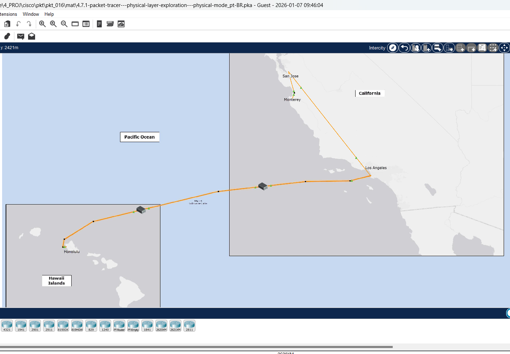
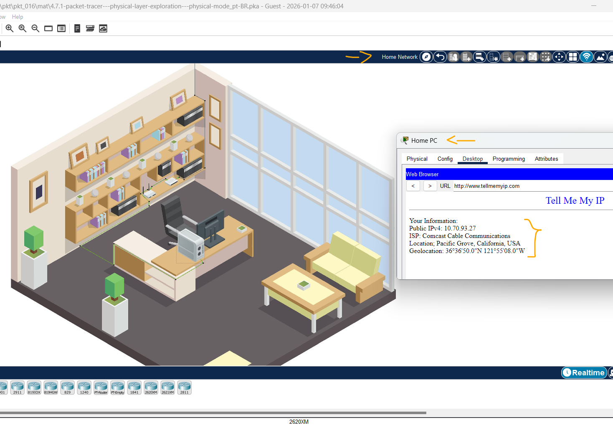
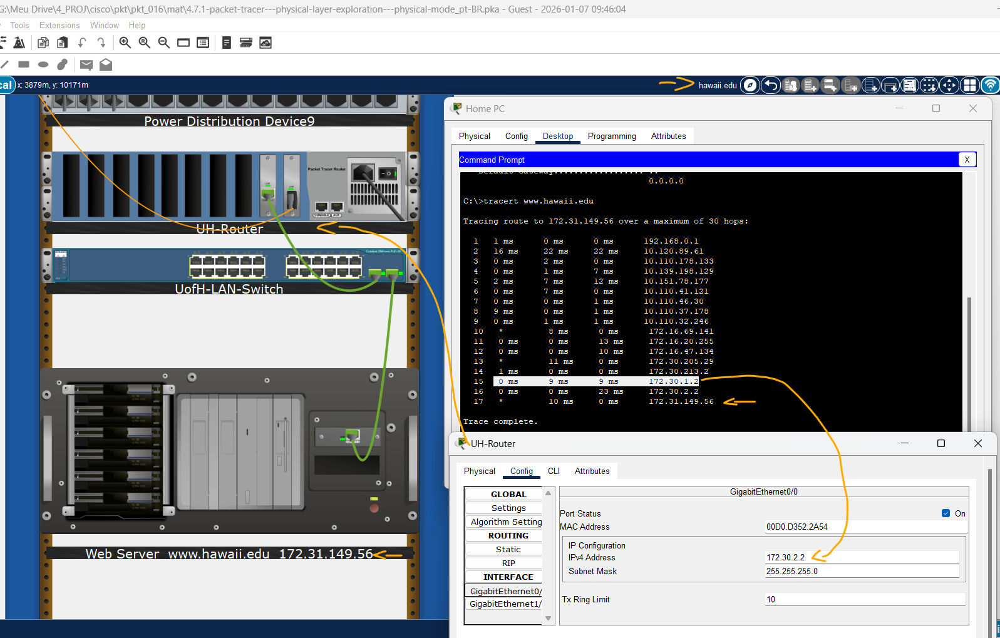

# Packet Tracer - Exploração de Camada Física - Modo Físico   

### Cisco: <a href="../../">cisco   </a>
### Cisco Networking Academy: cna   </a>
### Training Category: <a href="../../pkt/">pkt</a>
### Software/Subject: network   </a>
### Course: <a href="./">pkt_016 (Packet Tracer - Exploração de Camada Física - Modo Físico)   </a>

---

### Theme:
- Network

### Used Tools:
- Operating System (OS): 
  - Windows 11 
- Cloud Services:
  - Google Drive 
- Language:
  - HTML   
  - Markdown   
- Integrated Development Environment (IDE) and Text Editor:
  - Visual Studio Code (VS Code)   
- Versioning: 
  - Git   
- Repository:
  - GitHub   
- Network:
  - Cisco Packet Tracer   
  - traceroute   
  - Trace Route (tracert)   

---

<h3><a name="item00">Course Strcuture:</a></h3>

1. <a href="#item01">Parte 1: Examine Informações de Endereçamento IP Local</a> 
  1.1 <a href="#item01.01">Etapa 1: Qual é o meu endereço IPv4?</a> 
  1.2 <a href="#item01.02">Etapa 2: Qual é o endereço IPv4 para o meu roteador?</a> 
  1.3 <a href="#item01.03">Etapa 3: Qual é o meu endereço público iPv4?</a> 
  1.4 <a href="#item01.04">Etapa 4: Examine as conexões em sua rede.</a> 
2. <a href="#item02">Parte 2: Traçar o Caminho Entre Fonte e Destino</a> 
  2.1 <a href="#item02.01">Etapa 1: Use traceroute para exibir o caminho de Monterey para o Havaí.</a> 
  2.2 <a href="#item02.02">Etapa 2: Investigue o segundo salto na saída do traceroute.</a> 
  2.3 <a href="#item02.03">Etapa 3: Tente descobrir a localização física do endereço IP para o seu ISP POP.</a> 
  2.4 <a href="#item02.04">Etapa 4: Investigue por que as informações de geolocalização nem sempre são precisas.</a> 
  2.5 <a href="#item02.05">Etapa 5: Investigue a rede ISP local.</a> 
  2.6 <a href="#item02.06">Etapa 6: Investigue os nomes de domínio na saída para descobrir mais pistas sobre o lugar dos 
roteadores em cada salto.</a> 
  2.7 <a href="#item02.07">Etapa 7: Investigue o link entre Comcast e Internet2.</a> 
  2.8 <a href="#item02.08">Etapa 8: Investigue a Internet2.</a> 
  2.9 <a href="#item02.09">Etapa 9: Investigue o link para Los Angeles.</a> 
  2.10 <a href="#item02.10">Etapa 10: Investigue a ligação através do Oceano Pacífico.</a> 
  2.11 <a href="#item02.11">Etapa 11: Investigue a ligação entre a Internet2 e a rede da Universidade do Havaí.</a> 
  2.12 <a href="#item02.12">Etapa 12: Investigue o último endereço IP conhecido na saída do traceroute.</a> 
3. <a href="#item03">Conclusão e algumas coisas a considerar</a> 

---

### Objective:
O objetivo deste PTPM foi rastrear o caminho físico e lógico de pacotes IP entre uma residência em Monterey (Califórnia) e um servidor web na Universidade do Havaí. A atividade utilizou o Packet Tracer para identificar detalhadamente cada dispositivo, interface e meio de conexão no trajeto, replicando o experimento em uma máquina física para a comparação de resultados entre o ambiente simulado e o real.

### Folder Structure:
- [README.md](./README.md): Este documento de README, escrito em **Markdown**, com o conteúdo desta atividade.
- [0-aux](./0-aux/): Pasta auxiliar com imagens utilizadas na construção dos arquivos de README desse curso.

### Development:

<a name="item01"><h4>1. Parte 1: Examine Informações de Endereçamento IP Local</h4></a>[Back to summary](#item00)

Nesta parte, você examinará as informações de endereçamento IP em sua rede doméstica.

A imagem 01 mostra a topologia inicial.

<figure>
     
    <figcaption>Imagem 01.</figcaption>
</figure>
 

<a name="item01.01"><h4>1.1 Etapa 1: Qual é o meu endereço IPv4?</h4></a>[Back to summary](#item00)

Seu endereço IP é usado para identificar seu computador ao enviar e receber pacotes, semelhante ao modo como seu endereço residencial é usado para enviar e receber e-mails. Você pode usar o comando ipconfig no Windows e o comando ifconfig no macOS e Linux. Nota: Esta atividade abre dentro da rede doméstica. Se você explorou outros locais, navegue de volta para a rede doméstica. 

- a. Em Home Network em Monterey, clique no PC na mesa e clique na guia Desktop > Prompt de comando.
- b. Incorpore o comando ipconfig e examine a informação de endereçamento do IPv4 para o PC home: `C:\> ipconfig`. O endereço IPv4 é 192.168.0.75, que é conhecido como um endereço IPv4 privado. A maioria dos computadores clientes e outros dispositivos usam um endereço IPv4 privado. Estes são dispositivos que não exigem outro dispositivo para acessá-lo a partir da Internet. Endereços IPv4 privados são usados para conservar o número limitado de endereços IPv4 públicos globalmente roteáveis.
- c. Repita este passo no seu próprio dispositivo. Qual é o endereço IPv4 e o gateway padrão para o seu dispositivo? 
  - 192.168.1.0 e 192.168.1.1.

<a name="item01.02"><h4>1.2 Etapa 2: Qual é o endereço IPv4 para o meu roteador?</h4></a>[Back to summary](#item00)

Este mesmo comando do Windows ipconfig mostra o endereço IPv4 do seu roteador local ou home, igualmente conhecido como o gateway padrão. Observe que nosso roteador local tem o endereço IPv4 de 192.168.0.1. Este é o roteador que conecta sua rede doméstica local à rede do seu provedor de serviços de internet e dá acesso à internet. 

- a. Observação: você pode usar o comando route -n get default para determinar o gateway padrão em um computador usando o macOS ou o sistema operacional Linux. Qual é o endereço IPv4 para o seu roteador? 
  - 192.168.1.1.

<a name="item01.03"><h4>1.3 Etapa 3: Qual é o meu endereço público iPv4?</h4></a>[Back to summary](#item00)

Os endereços IPv4 privados não são roteáveis na internet. Quando os pacotes IP saem da sua rede, eles precisam ter seu endereço IPv4 privado substituído por um endereço IPv4 público. O endereço IPv4 público é usado por servidores ou qualquer outro destino para enviar pacotes de volta ao computador cliente. Onde essa tradução entre endereços IPv4 privados e públicos ocorre? Seu roteador local faz essa tradução para você. Como você pode descobrir o endereço público que seu roteador local substitui pelo seu endereço IPv4 privado?  

- a. No seu dispositivo, pesquise na internet por “qual é meu ip”. Alguns motores de busca lhe dirão o seu endereço IPv4 público sem a necessidade de visitar outro site. Além disso, vários sites serão listados que fornecerão esta e outras informações. Nota: Muitos ISPs começaram a usar endereços IPv6. Os endereços privados só são necessários para 
conservar o número limitado de endereços IPv4 públicos. Usar dois endereços diferentes e traduzir entre eles, não é necessário para IPv6. 
- b. No Packet Tracer, feche a janela de comando e clique então o navegador da Web. 
- c. No campo URL, digite www.tellmemyip.com e clique em Ir. Nota: Este site é fictício e atualmente só existe no Packet Tracer. Além do endereço IPv4 público, observe que o site que usamos forneceu outras informações, incluindo o nome do nosso ISP e localização geográfica. A informação do ISP é geralmente muito confiável. No entanto, as informações geográficas (cidade, estado e país) e geolocalização (latitude e longitude) nem sempre são completamente precisas. Observe que o site que usamos mostra a cidade como Pacific Grove, a cerca de 5 milhas da nossa localização em Monterey. Esta informação é tipicamente uma região que o ISP usou para todos os clientes nessa área. 
- d. No seu dispositivo, use um dos sites “o que é meu ip” que você encontrou em sua pesquisa. Liste seu endereço IPv4 público, localização e ISP. 
  - 46.220.101.10, São Paulo e Google LLC. 

<a name="item01.04"><h4>1.4 Etapa 4: Examine as conexões em sua rede.</h4></a>[Back to summary](#item00)

- a. Como é a conexão entre seu dispositivo e seu roteador? Com fio ou sem fio? 
  - Com fio.
- b. Onde está o roteador que seu dispositivo usa para acessar a Internet? 
  - Sala.
- c. Como é a conexão entre o roteador e a internet? Ele usa um cabo da empresa de cabo ou da empresa de telefonia? É sem fio? Você pode encontrar o cabo como ele sai de sua casa ou ver a torre remota se é uma conexão sem fio? 
  - É um cabo de fibra óptica.
- d. Pesquise no YouTube por “Tour of Home Network 2020 8-bit guy”. Esta não é a sua rede doméstica média, mas você pode reconhecer muitos dos mesmos dispositivos encontrados em sua própria rede doméstica. 

A imagem 02 exibe a conclusão da Parte 1.

<figure>
     
    <figcaption>Imagem 02.</figcaption>
</figure>
 

<a name="item02"><h4>2. Parte 2: Traçar o Caminho Entre Fonte e Destino</h4></a>[Back to summary](#item00)

Nesta parte, você usará o comando traceroute que é usado para diagnósticos de rede e para indicar os pacotes do caminho tomam a um destino. Ele reúne informações sobre cada salto do seu dispositivo para o destino. Cada linha na saída designa o endereço IP de Um ou Mais Servidores Cisco ICM NT de um roteador, usado para encaminhar pacotes de uma rede para outra rede. Estes são conhecidos como “saltos” ou "hops". No Windows, o comando é tracert, enquanto os sistemas operacionais macOS e Linux usam o comando traceroute. No rastreador de pacotes, você usa o comando do Windows tracert. Os saltos (hops) são simulados. No entanto, eles aderem de perto ao caminho real que os dados levariam entre um 
dispositivo em Monterey, Califórnia, e o servidor web na Universidade do Havaí, em Honolulu. Nota: Durante esta parte, você estará investigando a saída para dois traceroutes. Um será do PC Home dentro do Packet Tracer. O outro será do seu próprio dispositivo pessoal. 

<a name="item02.01"><h4>2.1 Etapa 1: Use traceroute para exibir o caminho de Monterey para o Havaí.</h4></a>[Back to summary](#item00)

- a. No Packet Tracer, no PC Home, feche a janela do navegador da Web se ainda está aberto. Na guia Desktop, clique em Command Prompt (Prompt de comando).
- b. Digite o comando tracert www.hawaii.edu. Packet Tracer levará algum tempo para resolver o nome de domínio hawaii.edu para o endereço IPv4. Você pode clicar em Fast Forward Time para acelerar o processo.  
- c. Em seu laptop ou outro computador, abra uma janela de terminal e insira o comando traceroute para o seu sistema operacional. Sua saída será diferente da saída abaixo e da saída no Packet Tracer. Sua saída provavelmente mostrará os nomes de roteadores reais e endereços IPv4 públicos. A menos que você mora perto de Monterey, Califórnia, você provavelmente terá nomes de roteadores muito diferentes, endereços IPv4 e número de saltos. Nota: Na saída abaixo, os endereços reais do IPv4 foram convertidos aos endereços IPv4 privados.
- d. Quando a saída começa a tempo para fora, quanto para o 15th e 16th hop na saída acima, incorpore Ctrl+C para terminar o traceroute. Caso contrário, continuará até que o máximo de 30 saltos seja atingido. O traceroute começa ao timeout neste exemplo porque o roteador no final do trajeto é configurado mais provavelmente para não responder às solicitações do traceroute. A primeira entrada destacada no exemplo mostra o primeiro salto como 1.
- e. Olhe atentamente para a primeira linha de saída. Os três números que precedem o endereço IP são valores de carimbo de data/hora, como 3ms, 4ms, 5ms, para o primeiro salto. Este é o tempo de ida e volta entre o dispositivo de origem e o roteador nesse endereço IPv4, em milissegundos. A rota de rastreamento também inclui o endereço IP da interface do roteador que recebeu o pacote da fonte da rota de rastreamento, o computador cliente. A entrada destacada no exemplo mostra que o primeiro roteador tem um endereço IPv4 de 10.0.0.1. Alguns saltos também podem incluir informações de nome de domínio usadas pelo provedor de serviços para ajudar a documentar informações sobre o roteador, como po-302-1222-rur02.monterey.ca.sfba.comcast.net destacadas na saída. Embora a saída tenha cronometrado antes de alcançar o servidor em hawaii.edu, os saltos anteriores fornecem informações suficientes para rastrear o caminho de nossos pacotes.
- f. No seu dispositivo, tente rastrear a rota para outros sites, como www.netacad.com ou www.google.com. Alguns pulos provavelmente vão esgotar o tempo limite. Alguns servidores web podem não responder ao traceroute. 

<a name="item02.02"><h4>2.2 Etapa 2: Investigue o segundo salto na saída do traceroute.</h4></a>[Back to summary](#item00)

O traceroute mostra um segundo salto de: 2 13 ms 16 ms 11 ms 10.120.89.61. Os pacotes IP saem agora da rede doméstica e são enviados ao ISP. O 10.120.89.61 é o endereço IPv4 do primeiro roteador fora da rede doméstica local. Este roteador pertence ao ISP. Este roteador é conhecido como o ponto de presença ou POP do ISP. É aqui que o ISP fornece aos 
seus clientes acesso à Internet. A conexão física entre o usuário final e o POP é conhecida como loop local, ou às vezes é referida como a “última milha”. 

Tradicionalmente, o circuito local era as linhas telefônicas das instalações de um cliente para a troca telefônica local, às vezes referida como o Escritório Central (CO). Os cabos de cobre, par trançado foram usados para transportar informações de voz analógica e sinalização. Hoje, o loop local também pode incluir cabos para transportar informações digitais, que podem ser com ou sem fio. Em termos de conectividade com a Internet, o loop local conecta as instalações do cliente ao ISP POP. O loop local pode ser um dos vários tipos diferentes de conexões, incluindo: 
- Conexão por cabo, normalmente usando o mesmo cabo coaxial usado para TV e telefone;
- DSL (Digital Subscriber Line) usando a mesma linha telefônica para telefone e TV;
- Sinais sem fio ou loop local sem fio (WLL), incluindo tecnologias celulares;
- Conexão por satélite, tipicamente o mesmo sinal de vigas usado para TV; 
- Cabo de fibra ótica;
- Linha telefônica de acesso dial-up usando o mesmo cabo de cobre de par trançado usado para telefone.

- a. No Packet Tracer, observe que o PC doméstico na mesa está conectado ao roteador doméstico na prateleira atrás da mesa. Contudo, o Roteador Home não é conectado diretamente ao roteador no salto seguinte. Em vez disso, ele está conectado a um modem a cabo. Este modem a cabo não é um roteador. Consequentemente, não é relatado como um salto na saída do traceroute. 
- b. Navegue até Monterey. Observe que o próximo salto está fisicamente ligado ao edifício POP Comcast. Clique em Pop Comcast. Um POP está fisicamente localizado em um data center. Um data center é uma instalação física que as organizações usam para abrigar seus equipamentos, aplicativos e dados críticos. Os principais componentes de um projeto de data center incluem roteadores, switches, firewalls, sistemas de armazenamento e servidores. Embora o POP da Comcast seja tipicamente um data center no mundo real, no Packet Tracer ele só está armazenando o equipamento necessário para esta atividade. No Rack, você verá vários dispositivos, incluindo um dispositivo simulando um sistema de terminação de modem a cabo (CMTS), o roteador Comcast-pop-Monterey, um switch multicamadas e dois servidores. 
- c. Investigue as conexões físicas entre os dispositivos. Uma interface do Comcast-CMTS está ligada diretamente ao modem a cabo na rede doméstica. A outra interface é conectada ao próximo roteador de salto, Comcast-pop-Monterey, que está diretamente abaixo dele. A segunda interface Comcast pop-Monterey se conecta ao próximo salto, que você investigará na próxima etapa. A terceira interface é conectada ao switch, que é então conectado aos dois servidores. O Servidor DNS está traduzindo www.hawaii.edu e www.tellmemyip.com para o respectivo endereço IPv4. O Servidor Web está servindo o site www.tellmemyip.com. 
- d. Em sua própria rede, qual é a tecnologia para o loop local que você está usando? Cabo? DSL? Satélite? Celular? Se for uma conexão com fio, veja se você pode encontrar o cabo saindo da rede doméstica. Para onde vai? Para um poste telefônico? Subterrâneo?  
  - Cabo de fibra óptica. Vai para o shaft e depois para o backbone vertical do prédio.
- e. O segundo salto em seu comando traceroute em seu dispositivo é tipicamente o POP do seu ISP. Qual é o endereço IP do POP do seu ISP?
  - No meu caso, o segundo salto não corresponde ao PoP do ISP. Ele apresenta um endereço da faixa 100.64.0.0/10, indicando CGNAT. O PoP do ISP aparece apenas no quarto salto, quando surge o primeiro endereço IP público.

<a name="item02.03"><h4>2.3 Etapa 3: Tente descobrir a localização física do endereço IP para o seu ISP POP.</h4></a>[Back to summary](#item00)

Quem possui o POP para o segundo roteador em sua saída traceroute? Você pode pesquisar na internet por “ip lookup”, o que resultará em uma lista de sites que lhe darão informações sobre um endereço IP.

- a. Preencha a tabela abaixo com as informações que você descobriu em sua pesquisa de pesquisa de IP. Você pode precisar visitar vários sites de pesquisa diferentes para obter todas as informações. 
  - Endereço IPv4 do segundo salto: - (Ocultado)
  - ISP: - (Ocultado)
  - Cidade: Salvador
  - Região: Bahia
  - País: Brasil

A informação sobre o nome do ISP é geralmente muito confiável. No entanto, as informações de localização física podem não ser precisas. Em muitos casos, o local físico listado pode ser centenas de milhas de onde o roteador e o datacenter estão realmente localizados. Pode ser o escritório administrativo do ISP ou até mesmo um local aleatório. Como as informações de geolocalização (longitude e latitude) registradas pelo ISP raramente são precisas, você não pode confiar nessas informações para encontrar a localização real do POP. Nesse caso, você precisaria entrar em contato com seu ISP para ver se ele lhe dirá onde este POP está localizado. 

<a name="item02.04"><h4>2.4 Etapa 4: Investigue por que as informações de geolocalização nem sempre são precisas.</h4></a>[Back to summary](#item00)

Pesquise na internet para "600 million IP addresses Kansas". Você encontrará vários artigos sobre um ISP que optou por usar uma geolocalização (latitude e longitude) no centro dos Estados Unidos para registrar mais de 600 milhões de seus endereços IP. Infelizmente, essa latitude e longitude particulares passou a ser uma casa particular no meio do Kansas e não um ISP. Qualquer pessoa com reclamações sobre o ISP, sua conexão com a internet ou recebendo spam de um desses endereços IP entraria em contato com os proprietários. Você pode imaginar as dificuldades que se seguiu tanto para as pessoas que chamam a casa e especialmente os proprietários do Kansas. Seja cético em relação a qualquer informação de geolocalização que mostre pacotes que vão de um local, a centenas ou milhares de milhas de distância, e depois de volta novamente. Por exemplo, os pacotes não são normalmente encaminhados da Califórnia para o Kansas e de volta para a Califórnia. 

<a name="item02.05"><h4>2.5 Etapa 5: Investigue a rede ISP local.</h4></a>[Back to summary](#item00)

Para o exemplo da saída real do traceroute mostrado abaixo, os saltos 2 a 9 todos pertencem ao Comcast. Lembre-se de que os endereços IPv4 reais para esses roteadores foram alterados para esta atividade. Portanto, você não pode usá-los para fazer uma pesquisa IP. Contudo, você pode procurar os endereços IP de Um ou Mais Servidores Cisco ICM NT para que sua própria saída do traceroute determine quantos dos saltos pertencem a seu ISP.

- a. No Packet Tracer, navegue até Montereye clique no edifício monterey.ca.
- b. Observe que os dois roteadores no rack pertencem ao comcast.net. Você pode passar o mouse sobre cada roteador para ver os endereços IPv4. Você também pode clicar em cada roteador e investigar o endereçamento IPv4 na guia Config. Que é o endereço IPv4 do terceiro salto na saída do traceroute do traçador de pacotes? 
  - 10.110.178.133.
- b. Que roteador e interface na construção monterey.ca são configurados com este endereço IPv4? 
  - Roteador: rur02.monterey.ca.sfba.comcast.net. Interface: GigabitEthernet0/0. 
- b. Que é o endereço IPv4 do 4o salto na saída do traceroute do traçador de pacotes? 
  - 10.139.198.129.
- b. Que roteador e interface na construção monterey.ca são configurados com este endereço IPv4?
  - Roteador: rur01.monterey.ca.sfba.comcast.net. Interface: GigabitEthernet0/0. 
- b. Por que você acha que os endereços IP de Um ou Mais Servidores Cisco ICM NT para as outras relações não são mostrados na saída do traceroute? 
  - Porque alguns roteadores da rede do ISP estão configurados para não responder a mensagens ICMP Time Exceeded ou Echo Reply, usadas pelo traceroute. Por razões de segurança e desempenho, esses dispositivos podem filtrar ou descartar esse tipo de tráfego, fazendo com que determinados saltos não apareçam ou sejam exibidos como “tempo esgotado” na saída do traceroute.
- b. Liste os saltos em sua própria saída traceroute que pertencem ao seu ISP local. 
  - Acredito que apenas o saltos 4 e 5 pertencem ao meu ISP local.

<a name="item02.06"><h4>2.6 Etapa 6: Investigue os nomes de domínio na saída para descobrir mais pistas sobre o lugar dos 
roteadores em cada salto.</h4></a>[Back to summary](#item00)

O nome de domínio (se houver um) no traceroute pode fornecer informações adicionais. Não há nenhuma convenção de nomenclatura padrão. Se e como ele é usado é unicamente até o critério do administrador do dispositivo. Na saída do traceroute acima, o Comcast forneceu a informação no Domain Name que lhe dá uma pista sobre onde o roteador pode realmente estar localizado: 
- po-302-1222-rur02.monterey.ca.sfba.comcast.net 
- po-2-rur01.monterey.ca.sfba.comcast.net 
- be-222-rar01.santaclara.ca.sfba.comcast.net 
- be-39931-cs03.sunnyvale.ca.ibone.comcast.net 
- be-1312-cr12.sunnyvale.ca.ibone.comcast.net 
- be-303-cr01.9greatoaks.ca.ibone.comcast.net 
- be-2211-pe11.9greatoaks.ca.ibone.comcast.net 

Todas essas cidades estão localizadas com a mesma região geográfica conhecida como a Área da Baía de São Francisco (sfba) e são controladas pela Comcast. 
- Monterey, Califórnia 
- Santa Clara, California 
- Sunnyvale, California 
- San Jose, Califórnia 

Nós fizemos a suposição no Packet Tracer que todos os roteadores com a mesma cidade no nome de domínio estão no mesmo data center. Por exemplo, como você viu, estes dois roteadores estão na construção monterey.ca: 
- po-302-1222-rur02.monterey.ca.sfba.comcast.net 
- po-2-rur01.monterey.ca.sfba.comcast.net 

- a. Quais informações, se houver, você pode decifrar dos nomes de domínio para o seu ISP local?
  - A partir dos nomes de domínio é possível identificar o nome do ISP local e inferir que determinados roteadores pertencem à sua infraestrutura, pois os domínios incluem o nome da operadora. Em alguns casos, também é possível obter pistas sobre a localização geográfica ou o tipo de enlace (acesso, agregação ou backbone). No entanto, nem todos os saltos apresentam nomes de domínio, pois alguns dispositivos não possuem registro DNS reverso ou estão configurados para não respondê-lo.
- a. Em Packet Tracer, navegue até Monterey. Observe o link northbound saindo monterey.ca.
- b. Navegue até um nível até Intercity. (Packet Tracer não permite a renomeação de Intercity.) Você verá uma representação das ligações físicas entre a casa em Monterey e ilha de Oahu, onde o servidor para a Universidade do Havaí está localizado em Honolulu. Observe que o link primeiro vai de Monterey para San Jose, e depois Los Angeles antes de cruzar o Oceano Pacífico para Honolulu. 
- c. Clique em San Jose. Observe que há três edifícios, cada um rotulado com uma parte do nome de domínio descoberto na saída do traceroute. Roteadores com o mesmo nome de domínio estão localizados no mesmo edifício. Investigue cada edifício, roteador e interface para concluir a tabela a seguir. Qual é o edifício, roteador, interface e endereço IPv4 para o link de saída para Los Angeles?
  - 5º Salto: Domínio: rar01.santaclara.ca.sfba.comcast.net; Interface: GigabitEthernet0/0; IPv4: 10.151.78.177.
  - 6º Salto: Domínio: cs03.sunnyvale.ca.ibone.comcast.net; Interface: GigabitEthernet0/0; IPv4: 10.110.41.121.
  - 7º Salto: Domínio: cr12.sunnyvale.ca.ibone.comcast.net; Interface: GigabitEthernet0/0; IPv4: 10.110.46.30.
  - 8º Salto: Domínio: cr01.9greatoaks.ca.ibone.comcast.net; Interface: GigabitEthernet0/0; IPv4: 10.110.37.178.
  - 9º Salto: Domínio: pe11.9greatoaks.ca.ibone.comcast.net; Interface: GigabitEthernet0/0; IPv4: 10.110.32.246.
- c. Qual é o edifício, roteador, interface e endereço IPv4 para o link de saída para Los Angeles? 
  -Edifício: greatoaks.calibone; Roteador: rtsw.sunn.net.internet2.edu; Interface: GigabitEthernet0/0; IPv4: 172.16.69.141.

Centro de Dados IXP:   
Um IXP (Internet Exchange Point) é tipicamente um centro de localização que abriga ISPs e outros clientes, com o objetivo de se conectar uns com os outros. Em algum momento um ISP como Comcast precisará de encaminhar os pacotes a um outro ISP. Isso geralmente ocorre em um IXP. Os locais são pensados frequentemente como sendo na “borda” da rede de 
um ISP, o que significa um lugar onde os pacotes saem da rede interna do ISP e são encaminhados para um outro ISP. Este é um lugar onde os ISPs e outros podem trocar o tráfego da Internet entre suas redes. Os IXPs são normalmente de propriedade e operados por uma parte neutra, o que significa que não são um ISP ou “cliente” de seu próprio data center. Nota: O termo Network Access Point (NAP) é um termo mais antigo para IXP que agora é obsoleto. 

<a name="item02.07"><h4>2.7 Etapa 7: Investigue o link entre Comcast e Internet2.</h4></a>[Back to summary](#item00)

Este último salto dentro da rede Comcast ISP antes que os pacotes sejam enviados a um outro ISP ocorre no salto 9. Novamente, Comcast nos dá uma pista de onde o roteador está localizado. No entanto, o nome de domínio não está indicando uma cidade, mas um endereço.

- a. Pesquise na internet por “9 great oaks California” e você vai descobrir que um centro de dados Equinix está localizado na 9 Great Oaks Boulevard em San Jose, Califórnia. Se você usar o Google Maps e procurar esse endereço, você pode usar a vista de satélite ou a vista de rua para ver o edifício real. Equinix é um ponto de troca de Internet (IXP) conhecido como Equinix SV5. Ele fornece conexões entre diferentes ISPs e está hospedando a conexão entre Comcast e o próximo ISP, que é Internet2.
- b. Existem muitos sites que fornecem informações sobre grandes centros de dados IXP, incluindo os ISPs que hospedam. Pesquise na internet por “Inflect data center”. Use o site para explorar e ver se você pode encontrar onde eles listam a Comcast como uma das organizações hospedadas no Equinix SV5.
- c. Em Packet Tracer, navegue até San Jose, se necessário, e clique então o edifício 9greatoaks.ca. Observe que o nome do terceiro roteador no rack indica que ele pertence à Internet2. Este roteador é o 10th hop na saída do traceroute. Qual é a interface para o décimo salto?
  - GigabitEthernet0/0.

<a name="item02.08"><h4>2.8 Etapa 8: Investigue a Internet2.</h4></a>[Back to summary](#item00)

Internet2? Esta é uma nova versão da internet? Não. Internet2 é um ISP sem fins lucrativos. É um consórcio de comunidades de pesquisa, educação, indústria e governo que fornecem serviços de rede de alta velocidade, serviços em nuvem e outros serviços personalizados para pesquisa e educação. Pesquise as informações da Wikipédia e outros sites para obter mais informações sobre a Internet2. 

- a. Que velocidade é o backbone da Internet2 que fornece conexões entre seus membros? 
  - O backbone dessa rede utiliza ligações de altíssima capacidade, frequentemente 10 Gbps ou superiores, chegando a 100 Gbps entre nós principais para suportar aplicações de grande volume de dados.

Por diversão, procure por “This Man Launched a New Internet Service Provider from His Garage”. É a história sobre Brandt Kuykendall, um residente da pequena cidade de Dillon Beach, Califórnia. O serviço de internet em sua cidade era muito lento e caro, então ele começou seu próprio ISP de sua garagem.

<a name="item02.09"><h4>2.9 Etapa 9: Investigue o link para Los Angeles.</h4></a>[Back to summary](#item00)

Nosso traceroute revela que o próximo salto é outro roteador Internet2. Felizmente, o nome de domínio nos fornece essas informações. Uma pesquisa de “proxy de roteador internet2” pode ajudá-lo a verificar que o “losa” no nome de domínio indica que este roteador Internet2 está em Los Angeles, Califórnia. Os pacotes IP deixaram a área da baía 
de São Francisco (“sfba”) estão viajando para sul aproximadamente 350 milhas para Los Angeles, Califórnia. 

- a. No Packet Tracer, navegue ao nível Intercity, e clique então Los Angles. 
- b. O edifício losa.net.internet2.edu está localizado em algum lugar no Condado de Los Angeles. Clique no prédio para inseri-lo. O rack tem um roteador, que é conectar-se à área da baía de São Francisco e um cabo submarino que atravessa o Oceano Pacífico. Que é a relação usada para este décimo primeiro salto na saída do traceroute?
  - O décimo primeiro salto corresponde à interface do roteador de Los Angeles conectada à Área da Baía de São Francisco, indicando que o tráfego chegou a Los Angeles por esse enlace.

<a name="item02.10"><h4>2.10 Etapa 10: Investigue a ligação através do Oceano Pacífico.</h4></a>[Back to summary](#item00)

O próximo salto em nosso traceroute é 12 85 ms 87 ms 85 ms 172.16.47.134. Embora não haja informações de nome de domínio fornecidas, existem duas informações interessantes aqui. Embora você não possa usar o endereço IP para este exemplo, pois ele foi convertido em um endereço IP privado, você pode usar um site de “pesquisa IP” para determinar quem é o proprietário do endereço IP para o seu resultado. No exemplo aqui, os autores foram capazes de determinar que o endereço IP para hop 12 também pertence à Internet2. 

Ainda mais interessante é quando olhamos para os tempos de ida e volta de 85 ms, 87 ms e 85 ms. Observe que há um grande aumento no tempo em comparação com o salto anterior de San Jose para Los Angeles (24 ms, 24 ms, 23 ms, respectivamente). Por que vemos aumentos incrementais menores de saltos 1 a 11 e, em seguida, um salto tão grande para no tempo de ida e volta no hop 12? 

Podemos deduzir que este roteador no salto 12 deve estar muito mais longe do que o roteador anterior no salto 11 em Los Angeles, Califórnia. Também notamos que não há outros lugares em nosso traceroute que mostram uma diferença tão grande nos tempos como há entre o salto 11 na Califórnia e o salto 12. Portanto, esses pacotes devem ter viajado uma distância muito mais longa do que quaisquer outros dois pontos ao longo do caminho de Monterey para o Havaí. O roteador no salto 12 deve estar no Havaí, onde os pacotes viajaram quase 2.500 milhas da Califórnia. Este roteador está no Internet2 Peer Exchange (IP2X) no Havaí e é o último salto dentro da rede Internet2. IP2X encaminha pacotes para o próximo roteador de salto pertencente à Universidade do Havaí. 

- a. Pesquise na internet por “mapa de cabo submarino” e veja se você pode localizar quaisquer cabos submarinos que tenham um ponto de pouso tanto em Hermosa Beach quanto no Havaí. Quantos cabos submarinos terminam na Praia de Hermosa? 
  - 5.
- a. Qual é o nome do cabo submarino que vai de Hermosa Beach para o Havaí? 
  - SEA-US.
- a. Qual é o nome do ponto de pouso no Havaí?
  - Makaha, HI, United States.
- a. Quantos cabos submarinos terminam neste ponto de pouso no Havaí?
  - 4.
- b. O cabo SEA-EUA foi feito através de parceria entre a Universidade do Havaí e a RAM Telecom International, Inc. (RTI). Esta parceria permite que o Sistema da Universidade do Havaí conecte o Havaí aos Estados Unidos continentais, Guam e além. Procure por “Cabo subaquático acelera conexões UH em todo o Pacífico” para encontrar um artigo e vídeo sobre este cabo que está sendo colocado em todo o Oceano Pacífico. 
- c. Para mais informações, procure no YouTube ou outros sites de vídeo para “cabo submarino. “ Você encontrará muitos vídeos mostrando como esses cabos são construídos e colocados através do leito do mar. 
- d. No Packet Tracer, navegue ao nível Intercity. Siga o cabo através do Oceano Pacífico. Dois repetidores são mostrados aqui, embora haveria mais dezenas. Pesquise na internet para descobrir quantos quilômetros separam cada repetidor em um cabo submarino. 
  - Os repetidores em cabos submarinos são necessários para reforçar o sinal da fibra óptica ao longo de grandes distâncias. Em cabos transoceânicos, eles geralmente estão espaçados entre cerca de 40 e 100 km, sendo comum um espaçamento de aproximadamente 60–80 km entre cada repetidor.
- e. Clique em Honolulu. Você está agora na ilha de Oahu. Observe que o cabo submarino termina em Makaha.
- f. Clique no edifício I2PX-Hawaii. No rack são dois roteadores. O primeiro pertence a I2PX e representa o décimo segundo salto na saída do traceroute. Que relação é atribuída ao décimo segundo salto? 
  - O décimo segundo salto utiliza o enlace de cabo submarino da Internet2 que conecta o repetidor do Oceano Pacífico (Pacific Ocean Repeater 2) ao roteador I2PX-Hawaii.

<a name="item02.11"><h4>2.11 Etapa 11: Investigue a ligação entre a Internet2 e a rede da Universidade do Havaí.</h4></a>[Back to summary](#item00)

O próximo salto em nosso traceroute é: 13 87 ms 85 ms 85 ms xe-1-1-0-54-kolanut-re0.uhnet.net [205.166.205.29]. O nome de domínio para este roteador indica que ele faz parte da rede da Universidade do Havaí (uhnet.net). Este roteador está localizado no Honolulu Internet Exchange (HIX) em Honolulu, Havaí, provavelmente localizado dentro do mesmo IXP que o roteador i2px.hawaii. 

- a. No Packet Tracer, observe que o segundo roteador no rack I2PX-Hawaii é o roteador kolanut-re0.uhnet.net. Que relação é atribuída ao décimo terceiro salto? 
  - O décimo terceiro salto utiliza o enlace que conecta o roteador I2PX-Hawaii ao roteador kolanut-re0.uhnet.net, representando a interconexão local entre a Internet2 (I2PX) e a rede da Universidade do Havaí (uhnet).

<a name="item02.12"><h4>2.12 Etapa 12: Investigue o último endereço IP conhecido na saída do traceroute.</h4></a>[Back to summary](#item00)

No Packet Tracer, todos os saltos são simulados. Navegue de volta para Honolulu e investigue o edifício uhnet.net e o campus hawaii.edu. Em cada edifício, você encontrará os dispositivos que simulam o restante do traceroute no rastreador de pacotes. Na saída do traceroute do mundo real, os saltos começam a timeout. Para o exemplo nesta atividade, ele cronometra para fora no salto 15. É mais provável tempos fora para você em um salto diferente.

Para o salto 14, o nome implica que este é outro roteador que faz parte da rede da Universidade do Havaí. Neste ponto, o traceroute começa a expirar o tempo limite. É comum que o Roteadores e outros dispositivos tais como um servidor de Web não respondam às mensagens do traceroute. Um roteador pode até ser configurado para negar todas as mensagens de 
traceroute que estão sendo encaminhadas sobre ao próximo roteador do salto. Muito provavelmente um roteador ou firewall da Universidade do Havaí, antes do servidor web, está bloqueando quaisquer outras mensagens de traceroutes de entrar na rede. No entanto, você seguiu o caminho desses pacotes de Monterey, Califórnia até a Universidade do Havaí, em 
Honolulu. 

A imagem 03 exibe a conclusão da Parte 2.

<figure>
     
    <figcaption>Imagem 03.</figcaption>
</figure>
 

<a name="item03"><h4>3. Conclusão e algumas coisas a considerar</h4></a>[Back to summary](#item00)

Vimos que ao rastrear os saltos em nosso traceroute que nossos pacotes passaram por três grupos diferentes de redes: 
- Comcast ISP  
- Internet2? 
- Rede da Universidade do Havaí 

Comcast, Internet2 e a Universidade do Havaí são conhecidos como um sistema autônomo (AS). A internet é uma interconexão de centenas de ASs em todo o mundo. No Internet, os pacotes são enviados entre ASs. Um AS é tipicamente um ISP como a Comcast, um provedor de telecomunicações como a Internet2, um provedor de conteúdo como NetFlix, uma empresa como a Cisco Systems, ou instituição educacional como a Universidade do Havaí. 

Os pacotes da Home Network em Monterey, Califórnia, para a Universidade do Havaí foram encaminhados do Comcast ISP para Internet2 ISP e, eventualmente, a Universidade do Havaí. Dentro de cada um desses ASs, os pacotes foram enviados por vários roteadores pertencentes a cada AS. 

Bônus: Você tentou mudar para o modo Lógico? Este modo foi deixado desbloqueado para que o aluno curioso possa encontrar prazer em descobrir o que a representação física do traceroute nesta atividade pôde parecer como uma topologia lógica. Aproveite!

Infelizmente o modo lógico estava bloqueado e não pôde ser visualizado.