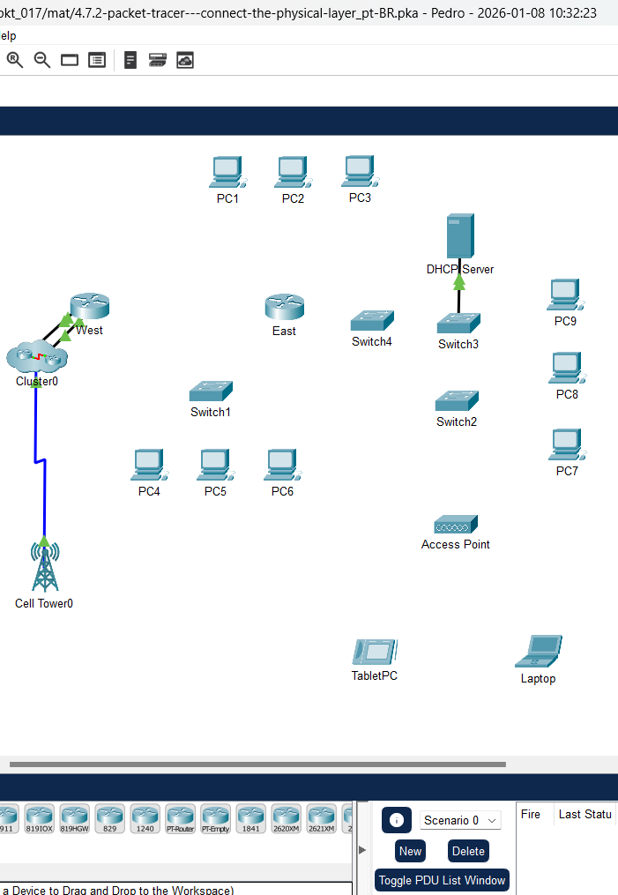
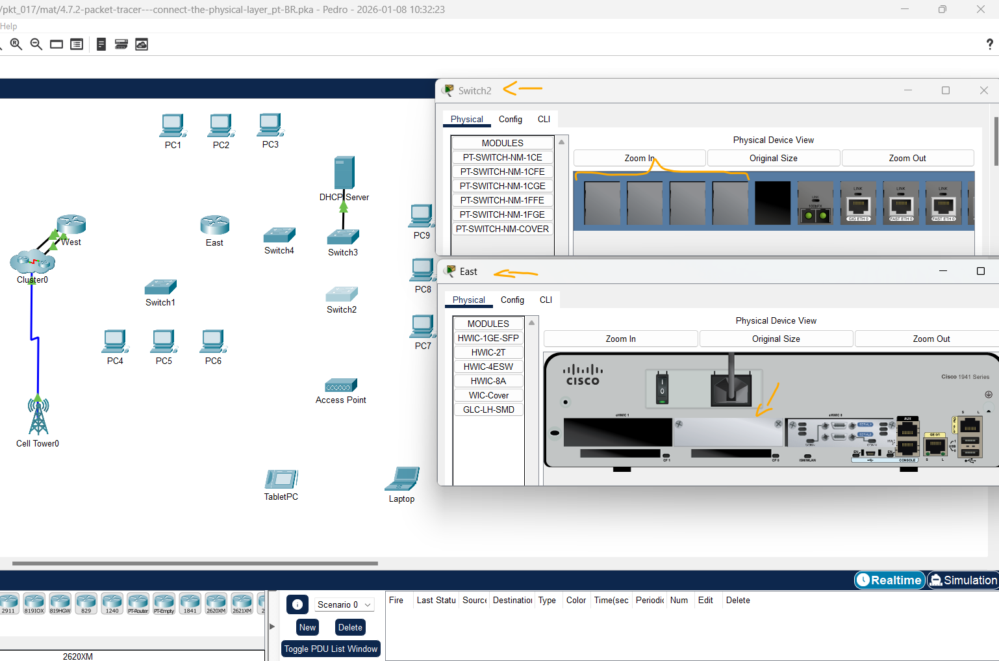
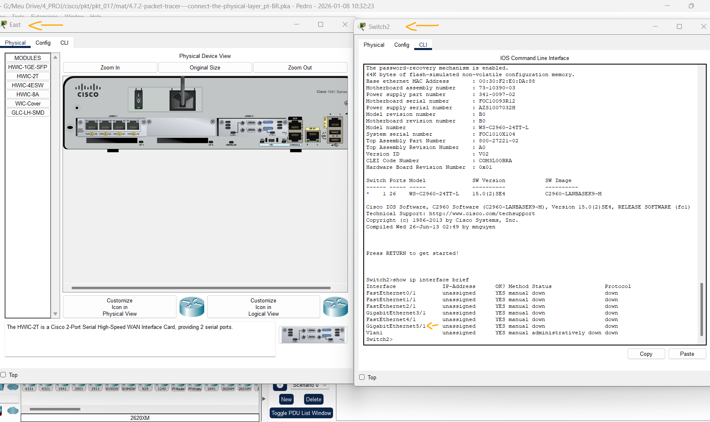
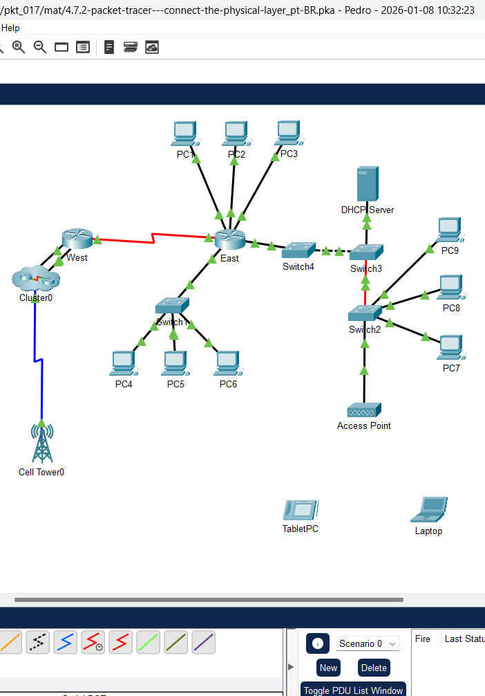
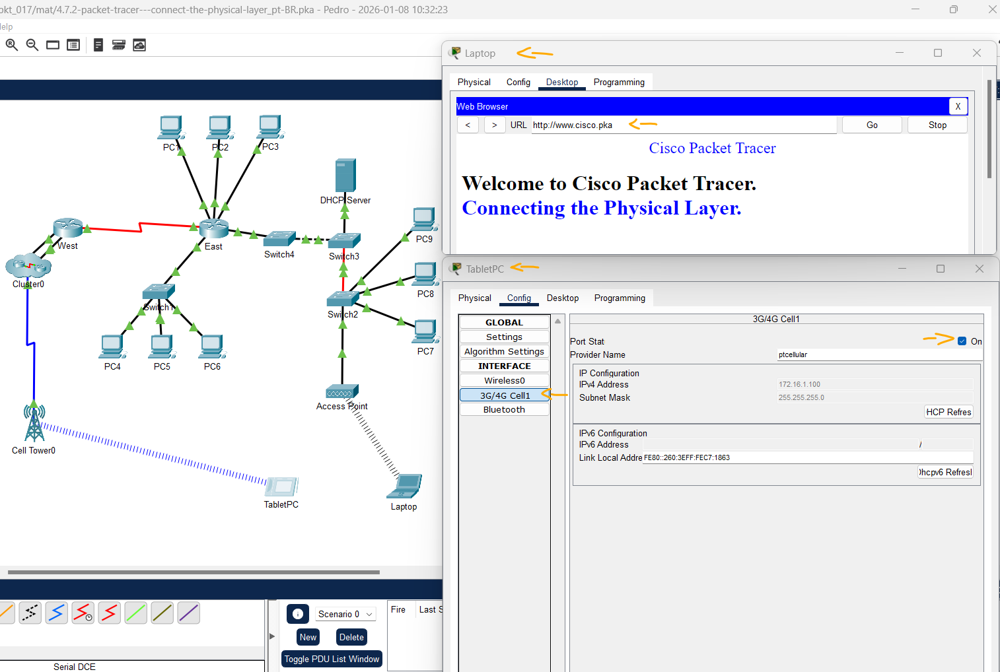

# Packet Tracer - Conecte a Camada Física   

### Cisco: <a href="../../../">cisco   </a>
### Cisco Networking Academy: cna   </a>
### Training Category: <a href="../../../pkt/">pkt</a>
### Software/Subject: network   </a>
### Course: <a href="./">pkt_017 (Packet Tracer - Conecte a Camada Física)   </a>

---

### Theme:
- Network

### Used Tools:
- Operating System (OS): 
  - Windows 11 
- Cloud Services:
  - Google Drive 
- Language:
  - HTML   
  - Markdown   
- Integrated Development Environment (IDE) and Text Editor:
  - Visual Studio Code (VS Code)   
- Versioning: 
  - Git   
- Repository:
  - GitHub   
- Network:
  - Cisco Internetwork Operating System (Cisco IOS)   
  - Cisco Packet Tracer   
  - ping   
  
---

<h3><a name="item00">Course Strcuture:</a></h3>

1. <a href="#item01">Parte 1: Identificar Características Físicas de Dispositivos para Interconexão de Redes</a> 
  1.1 <a href="#item01.01">Etapa 1: Identifique as portas de gerenciamento de um roteador Cisco.</a> 
  1.2 <a href="#item01.02">Etapa 2: Identifique as interfaces LAN e WAN de um roteador Cisco</a> 
  1.3 <a href="#item01.03">Etapa 3: Identifique os slots de expansão do módulo.</a> 
2. <a href="#item02">Parte 2: Selecionar os Módulos Corretos para Ter Conectividade</a> 
  2.1 <a href="#item02.01">Etapa 1: Determine quais módulos proveem a conectividade necessária.</a> 
  2.2 <a href="#item02.02">Etapa 2: Adicione os módulos corretos e ligue os dispositivos.</a> 
3. <a href="#item03">Parte 3: Conectar os Dispositivos</a> 
4. <a href="#item04">Parte 4: Testar conectividade</a> 
  4.1 <a href="#item04.01">Etapa 1: Verifique o status da interface no leste.</a> 
  4.2 <a href="#item04.02">Etapa 2: Conecte dispositivos sem fio, Laptop e TabletPC.</a> 
  4.3 <a href="#item04.03">Etapa 3: Altere o método de acesso do TabletPC.</a> 
  4.4 <a href="#item04.04">Etapa 4: Verifique a conectividade dos outros PCs.</a> 

---

### Objective:
O objetivo foi analisar as características físicas de switches e roteadores para a instalação de módulos adicionais necessários ao seu funcionamento. Além disso, foi realizada a conexão de diversos dispositivos utilizando o cabeamento e as interfaces adequadas, concluindo com testes de conectividade para validar a topologia montada.

### Folder Structure:
- [README.md](./README.md): Este documento de README, escrito em **Markdown**, com o conteúdo desta atividade.
- [0-aux](./0-aux/): Pasta auxiliar com imagens utilizadas na construção dos arquivos de README desse curso.

### Development:

<a name="item01"><h4>1. Parte 1: Identificar Características Físicas de Dispositivos para Interconexão de Redes</h4></a>[Back to summary](#item00)

A imagem 01 mostra a topologia inicial.

<figure>
     
    <figcaption>Imagem 01.</figcaption>
</figure>
 

<a name="item01.01"><h4>1.1 Etapa 1: Identifique as portas de gerenciamento de um roteador Cisco.</h4></a>[Back to summary](#item00)

- a. Clique no roteador East. A guia Physical (Físico) deve estar ativa.
- b. Aplique mais zoom (Zoom In) e expanda a janela para visualizar o roteador inteiro. Quais portas de gerenciamento estão disponíveis?
  - Console e AUX.

<a name="item01.02"><h4>1.2 Etapa 2: Identifique as interfaces LAN e WAN de um roteador Cisco</h4></a>[Back to summary](#item00)

- a. Que interfaces LAN e WAN estão disponíveis no roteador East e quantas existem?
  - Interfaces LAN: GigabitEthernet0/0 e GigabitEthernet0/1. Interfaces WAN: Serial0/0/0 e Serial 0/0/1.
- b. Clique na guia CLI, pressione a tecla Enter para acessar o prompt do modo de usuário e insira os seguintes comandos: `East> show ip interface brief`. A saída mostra o número correto de interfaces e sua designação. A interface vlan1 é uma interface virtual que existe somente em software. Quantas interfaces físicas estão listadas?
  - 4.
- c. Digite os seguintes comandos: `East> show interface gigabitethernet 0/0`. Qual é a largura de banda padrão desta interface?
  - Largura de banda lógica (BW): 1000000 Kbit = 1000 Mbps = 1 Gbps. Velocidade física real: 100 Mbps.
- c. `East> show interface serial 0/0/0`. Qual é a largura de banda padrão desta interface? Observação: a largura de banda em interfaces seriais é usada pelos processos de roteamento para determinar o melhor caminho até um destino. Ela não indica a largura de banda real da interface. A largura de banda real é negociada com um provedor de serviços. 
  - Largura de banda lógica (BW): 1544 Kbit = 1,5 Mbps. Velocidade física real: -.

<a name="item01.03"><h4>1.3 Etapa 3: Identifique os slots de expansão do módulo.</h4></a>[Back to summary](#item00)

- a. Quantos slots de expansão estão disponíveis para adicionar módulos ao roteador East?  
  - 3.
- b. Clique em Switch2. Quantos slots de expansão estão disponíveis?
  - 4.

A imagem 02 exibe a conclusão da Parte 1.

<figure>
     
    <figcaption>Imagem 02.</figcaption>
</figure>
 

<a name="item02"><h4>2. Parte 2: Selecionar os Módulos Corretos para Ter Conectividade</h4></a>[Back to summary](#item00)

<a name="item02.01"><h4>2.1 Etapa 1: Determine quais módulos proveem a conectividade necessária.</h4></a>[Back to summary](#item00)

- a. Clique em East e, em seguida, clique na guia Physical (Físico). À esquerda, abaixo da identificação Modules (Módulos), você verá as opções disponíveis para expandir as capacidades do roteador. Clique em cada módulo. Uma imagem e uma descrição são exibidas na parte inferior. Familiarize-se com essas opções. Você precisa conectar os PCs 1, 2 e 3 ao roteador East, mas não tem os recursos financeiros necessários para comprar um novo switch Que módulo você pode usar para conectar os três PCs ao roteador East? 
  - HWIC-4ESW.
- a. Quantos hosts é possível conectar ao roteador usando este módulo?
  - 4.
- b. Clique em Switch2. Que módulo você pode inserir para prover uma conexão óptica Gigabit com o Switch3?
  - PT-SWITCH-NM-COVER.

<a name="item02.02"><h4>2.2 Etapa 2: Adicione os módulos corretos e ligue os dispositivos.</h4></a>[Back to summary](#item00)

- a. Clique em East e tente inserir o módulo apropriado escolhido na Etapa 1a. Os módulos são adicionados clicando no módulo e arrastando-o para o slot vazio no dispositivo. 
Deverá ser exibida a mensagem Cannot add a module when the power is on (Não é possível adicionar um módulo com o dispositivo ligado). As interfaces desse modelo de roteador não podem sofrer hot-swap (troca a quente). O dispositivo deve ser desligado antes de adicionar ou remover módulos. Clique no botão liga/desliga localizado à direita do logotipo da Cisco para desligar o roteador East. Insira o módulo apropriado escolhido na Etapa 1a. Ao terminar, ligue o roteador East clicando no botão liga/desliga. Observação: se você inserir o módulo errado e precisar removê-lo, arraste o módulo para baixo até a imagem no canto inferior direito e solte o botão do mouse. 
- b. Usando o mesmo procedimento, insira o módulo que você identificou na Etapa 1b no slot vazio mais à direita no Switch2.
- c. Use o comando show ip interface brief no Switch2 para identificar o slot no qual o módulo foi colocado. Em qual slot ele foi inserido?
  - Slot 5.

A imagem 03 exibe a conclusão da Parte 2.

<figure>
     
    <figcaption>Imagem 03.</figcaption>
</figure>
 

<a name="item03"><h4>3. Parte 3: Conectar os Dispositivos</h4></a>[Back to summary](#item00)

Esta pode ser a primeira atividade a ser feita quando for necessário conectar dispositivos. Mesmo que você não saiba a finalidade dos diferentes tipos de cabos, use a tabela abaixo e siga estas diretrizes para conseguir conectar todos os dispositivos:
  - Selecione o tipo de cabo apropriado. 
  - Clique no primeiro dispositivo e selecione a interface especificada.
  - Clique no segundo dispositivo e selecione a interface especificada.
  - Se tiver conectado os dois dispositivos corretamente, você verá sua pontuação aumentar.

Exemplo: para conectar East ao Switch1, selecione o tipo de cabo Copper Straight-Through (Cabo de Cobre Direto). Clique em East e selecione GigabitEthernet0/0. Em seguida, clique em Switch1 e escolha GigabitEthernet0/1. Sua pontuação agora deve ser 4/55. 

Observação: nesta atividade, os leds dos links estão desativados. 

A imagem 04 exibe a conclusão da Parte 3.

<figure>
     
    <figcaption>Imagem 04.</figcaption>
</figure>
 

<a name="item04"><h4>4. Parte 4: Testar conectividade</h4></a>[Back to summary](#item00)

<a name="item04.01"><h4>4.1 Etapa 1: Verifique o status da interface no leste.</h4></a>[Back to summary](#item00)

- a. Clique na guia CLI e digite os seguintes comandos: `East> show ip interface brief`. Compare a saída. Se todo o cabeamento estiver correto, as saídas devem corresponder. 

<a name="item04.02"><h4>4.2 Etapa 2: Conecte dispositivos sem fio, Laptop e TabletPC.</h4></a>[Back to summary](#item00)

- a. Clique no Laptop e selecione a guia Config. Selecione a interface Wireless0. Coloque uma seleção na caixa chamada On (On) ao lado de Status da porta. Dentro de alguns segundos, a conexão sem fio deve aparecer.
- b. Clique na guia Área de trabalho do Laptop. Clique no ícone Navegador da Web para iniciar o navegador da Web. Digite www.cisco.pka na caixa URL e clique em Ir. A página deve exibir o Cisco Packet Tracer.
- c. Clique no TabletPC e selecione a guia Config. Selecione a interface Wireless0. Coloque uma seleção na caixa chamada On (On) ao lado de Status da porta. Dentro de alguns segundos, a conexão sem fio deve aparecer.
- d. Repita as etapas na Etapa 2b para verificar se a página é exibida.

<a name="item04.03"><h4>4.3 Etapa 3: Altere o método de acesso do TabletPC.</h4></a>[Back to summary](#item00)

- a. Clique no TabletPC e selecione a guia Config. Selecione a interface Wireless0. Desmarque a caixa ligada ao lado de Status da porta. Agora deve estar claro e a conexão sem fio cairá.
- b. Clique na interface 3G/4G Cell1. Coloque uma seleção na caixa chamada On (On) ao lado de Status da porta. Dentro de alguns segundos, a conexão celular deve aparecer. 
- c. Repita o processo de verificação do acesso à Web. Nota: Você não deve ter tanto a interface wireless0 quanto as interfaces 3G/4G Cell1 ativas ao mesmo tempo. Isso pode causar confusão no dispositivo ao tentar se conectar a alguns recursos.

<a name="item04.04"><h4>4.4 Etapa 4: Verifique a conectividade dos outros PCs.</h4></a>[Back to summary](#item00)

Todos os PCs devem ter conectividade com o site e entre si. Você aprenderá a usar testes de conectividade em muitos laboratórios futuros. 

A imagem 05 exibe a conclusão da Parte 4.

<figure>
     
    <figcaption>Imagem 05.</figcaption>
</figure>
 