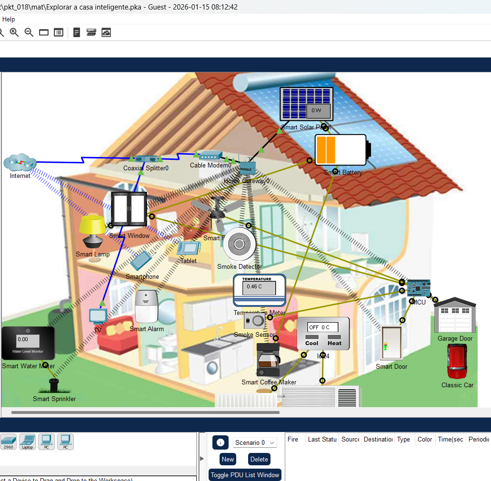
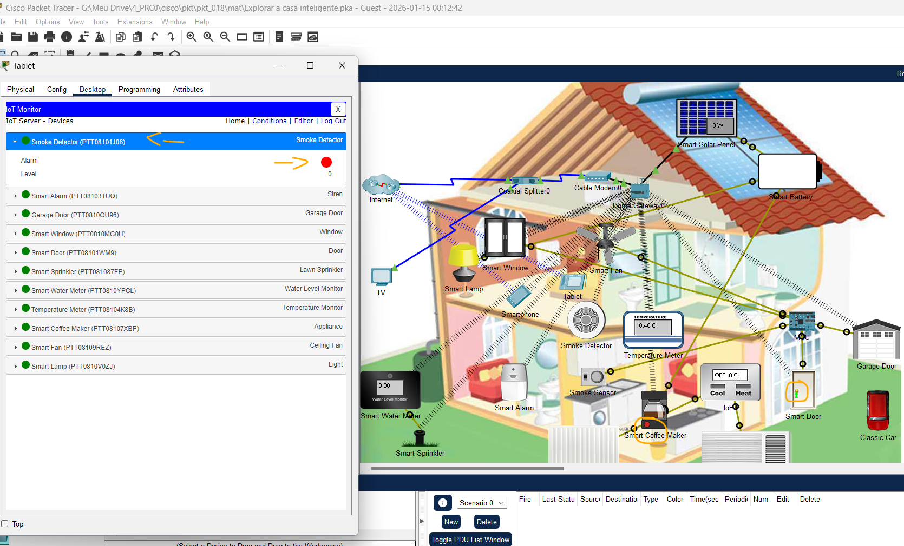
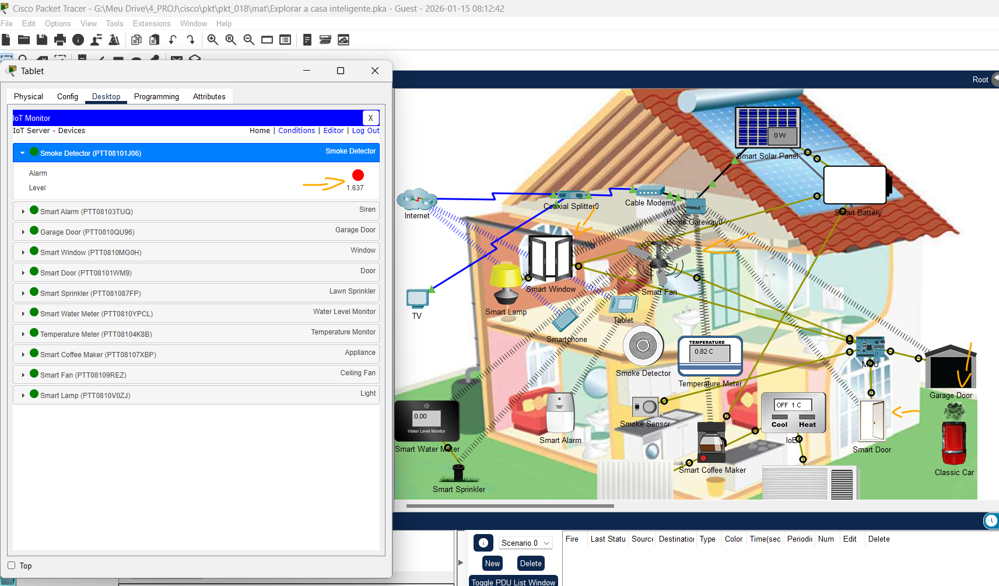

# Packet Tracer - Explore a casa inteligente   

### Cisco: <a href="../../../">cisco   </a>
### Cisco Networking Academy: cna   </a>
### Training Category: <a href="../../../pkt/">pkt</a>
### Software/Subject: iot   </a>
### Course: <a href="./">pkt_018 (Packet Tracer - Explore a casa inteligente)   </a>

---

### Theme:
- Internet of Things (IoT)
- Network

### Used Tools:
- Operating System (OS): 
  - Windows 11 
- Cloud Services:
  - Google Drive 
- Language:
  - Blockly   
  - HTML   
  - Markdown   
- Integrated Development Environment (IDE) and Text Editor:
  - Visual Studio Code (VS Code)   
- Versioning: 
  - Git   
- Repository:
  - GitHub   
- Network:
  - Cisco Packet Tracer   
  
---

<h3><a name="item00">Course Strcuture:</a></h3>

1. <a href="#item01">Parte 1: Explorar a casa inteligente</a> 
  1.1 <a href="#item01.01">Etapa 1: Como entender os dispositivos que compõem a casa inteligente.</a> 
  1.2 <a href="#item01.02">Etapa 2: Interação com a casa inteligente.</a> 
2. <a href="#item02">Parte 2: Edge Computing na Casa Inteligente</a> 
  2.1 <a href="#item02.01">Etapa 1: Dar partida no carro clássico.</a> 
3. <a href="#item03">Parte 3: Desafio</a> 

---

### Objective:
Este PTTA visou compreender o papel da computação de borda no ecossistema de IoT residencial, explorando os motivos técnicos para a sua utilização no processamento de dados próximo à fonte de origem em vez da nuvem centralizada.

### Folder Structure:
- [README.md](./README.md): Este documento de README, escrito em **Markdown**, com o conteúdo desta atividade.
- [0-aux](./0-aux/): Pasta auxiliar com imagens utilizadas na construção dos arquivos de README desse curso.

### Development:

<a name="item01"><h4>1. Parte 1: Explorar a casa inteligente</h4></a>[Back to summary](#item00)

A imagem 01 mostra a topologia inicial.

<figure>
     
    <figcaption>Imagem 01.</figcaption>
</figure>
 

<a name="item01.01"><h4>1.1 Etapa 1: Como entender os dispositivos que compõem a casa inteligente.</h4></a>[Back to summary](#item00)

É comum que os ISPs forneçam dados e vídeo em um único cabo coaxial. Começando no sótão, um divisor coaxial é usado para separar o sinal de vídeo do sinal de dados.

- a. Dois cabos coaxiais saem do divisor coaxial na topologia mostrada. A quais dispositivos o cabo coaxial se conecta?
  - TV e Cable Modem.
- b. O modem a cabo é a interface entre a rede do ISP e a casa. A quais dispositivos o modem a cabo se conecta?
  - Coaxial Splitter e Home Gateway.
- c. O Home Gateway atua como um concentrador e roteador para todos os dispositivos domésticos internos. Ele também fornece uma interface na Web que permite que os usuários monitorem e controlem vários dispositivos domésticos inteligentes. Observe que os dispositivos residenciais podem se conectar ao gateway doméstico por conexões com e sem fio. Observação: o Packet Tracer usa feixes tracejados para representar conexões sem fio. No entanto, isso pode dificultar a compreensão de uma topologia se houver muitos dispositivos conectados. Por isso, as conexões sem fio foram ocultadas. Para mostrar conexões sem fio, vá para Options > Preferences > Hide Tab > uncheck Hide Wireless/Cellular Connection. Liste todos os dispositivos da casa conectados ao gateway doméstico
  - Wired: Cable Modem, Smart Solar Panel.
  - Wireless: Smartphone, Tablet, Smart Window, Smart Lamp, Smart Water Meter, Smart Sprinkler, Smart Alarm, Smart Fan, Smoke Detector, Temperature Meter, Smart Coffee Maker, Smart Door, Garage Door.

<a name="item01.02"><h4>1.2 Etapa 2: Interação com a casa inteligente.</h4></a>[Back to summary](#item00)

Os dispositivos da casa inteligente podem ser monitorados e controlados remotamente por meio de qualquer computador da casa. Como todos os dispositivos inteligentes se conectam ao gateway doméstico, que hospeda uma interface da Web, tablets, smartphones, laptops ou computadores podem ser usados para interagir com os dispositivos inteligentes.

- a. Clique no tablet. (O tablet está na cama no quarto principal).
- b. Navegue até Desktop > IoT Monitor.
- c. O endereço IP do servidor de IoT no gateway doméstico é 192.168.25.1. Use admin /admin como nome de usuário e senha para fazer login no gateway doméstico. Clique em Login. O que aparece na tela?
  - Uma lista de todos os dispositivos inteligentes conectados no momento no gateway doméstico. Alguns dispositivos podem ser controlados, enquanto outros podem ser apenas monitorados.
- d. A porta inteligente (Smart Door) está atualmente destrancada (representado por uma luz verde na sua maçaneta), mas pode ser trancada remotamente. Clique na porta inteligente no navegador para expandir a opção.
- e. Clique em Trancar para trancar a porta. A porta foi trancada? Como você sabe?
  - A porta foi tracada, pois a luz vermelha na porta e na lista de dispositivos no tablet informa.
- f. Clique em Destrancar para destrancar a porta.
- g. Clique no detector de fumaça no navegador para expandir a seção. Qual é o nível de fumaça na leitura fornecida pelo detector de fumaça?
  - O nível é zero.
- g. O detector de fumaça pode ser controlado?
  - Não, ele é apenas monitorado.
- h. Dispositivos inteligentes também podem ser controlados diretamente, o que representa a interação física. Na área de trabalho Logical (Lógica) do Packet Tracer, mantenha a tecla ALT pressionada e clique na Cafeteira inteligente para ligá-la ou desligá-la.

A imagem 02 exibe a conclusão da Parte 1.

<figure>
     
    <figcaption>Imagem 02.</figcaption>
</figure>
 

<a name="item02"><h4>2. Parte 2: Edge Computing na Casa Inteligente</h4></a>[Back to summary](#item00)

A MCU adicionada à casa inteligente é usada para monitorar os níveis de fumaça lidos pelo sensor de fumaça e decidir se a casa deverá ser ventilada. Se os níveis de monóxido de carbono (CO) ultrapassarem 10,3 unidades, o MCU é programado para abrir automaticamente a janela, a porta frontal, a porta da garagem e ligar o ventilador em alta velocidade. Esta ação só é revertida (fechar portas e janelas e parar o ventilador) quando os níveis de CO caem abaixo de 1 unidade.

<a name="item02.01"><h4>2.1 Etapa 1: Dar partida no carro clássico.</h4></a>[Back to summary](#item00)

O proprietário mantém um carro clássico na garagem e ele precisa funcionar de vez em quando. O carro clássico gera monóxido de carbono, que aumenta os níveis de dentro das instalações.

- a. Clique no Tablet localizado na cama do quarto principal.
- b. Navegue até Desktop > Web Browser.
- c. Na barra de endereço, digite 192.168.25.1. Esse é o endereço IP do gateway doméstico.
- d. Use admin /admin como nome de usuário e senha para fazer login no gateway doméstico.
- e. Clique no Detector de Fumaça na casa inteligente; deixe esta janela visível para poder monitorar os níveis de fumaça.
- f. Ligue o motor do carro segurando a tecla Alt e clicando no carro clássico. O que acontece com o ar dentro da casa com o carro funcionando dentro da garagem?
  - Como as portas e janelas estão fechadas, o sensor de fumaça detecta altos níveis de gases perigosos. Quando os níveis de aumentam acima de 10,3 unidades, a MCU age e abre a porta da garagem, a porta da frente e a janela. A MCU também liga o ventilador de teto em sua velocidade máxima.
- f. O que acontece com o ar dentro da casa depois que a MCU abre as portas e a janela e liga o ventilador?
  - Os níveis caem para 1,6 unidades.
- f. A MCU fecha as portas e a janela e desliga o ventilador?
  - Não. Isso só acontece quando os níveis ficam abaixo de 1 unidade.
- g. Enquanto monitora os níveis, desligue o motor do carro clássico segurando a tecla Alt e clicando no carro clássico. O que acontece com a qualidade do ar dentro da casa depois de o motor ser desligado?
  - O nível volta a zero.
- g. O que acontece com a portas, a janela e o ventilador?
  - As portas e janelas são fechadas e o ventilador desligado.

A imagem 03 exibe a conclusão da Parte 2.

<figure>
     
    <figcaption>Imagem 03.</figcaption>
</figure>
 

<a name="item03"><h4>3. Reflexão</h4></a>[Back to summary](#item00)

Este exemplo mostra que a decisão entre o processamento na nuvem e na borda depende da aplicação. No exemplo da casa inteligente, a computação de borda foi a melhor opção. Os dados gerados pelos sensores de fumaça foram processados e utilizados para a tomada de decisões quanto à qualidade do ar da casa. Neste cenário, não houve necessidade de enviar dados de sensores para processamento na nuvem. O processamento na nuvem retardaria o tempo de resposta, podendo colocar vidas em risco. Outro problema possível está relacionado ao link da Internet. Se a conexão com a Internet tivesse sido perdida, todo o sistema teria falhado, colocando vidas em risco.