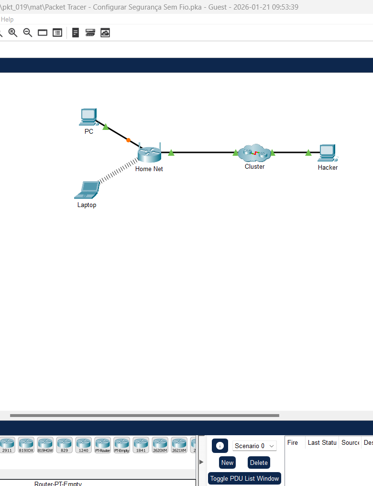
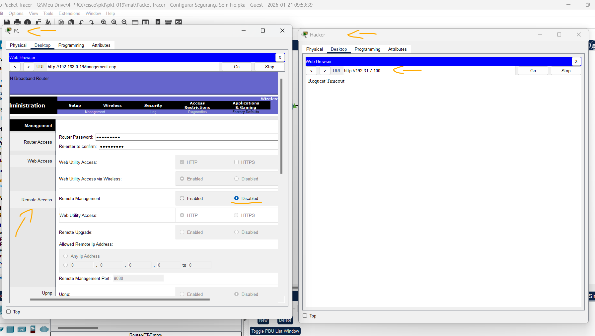
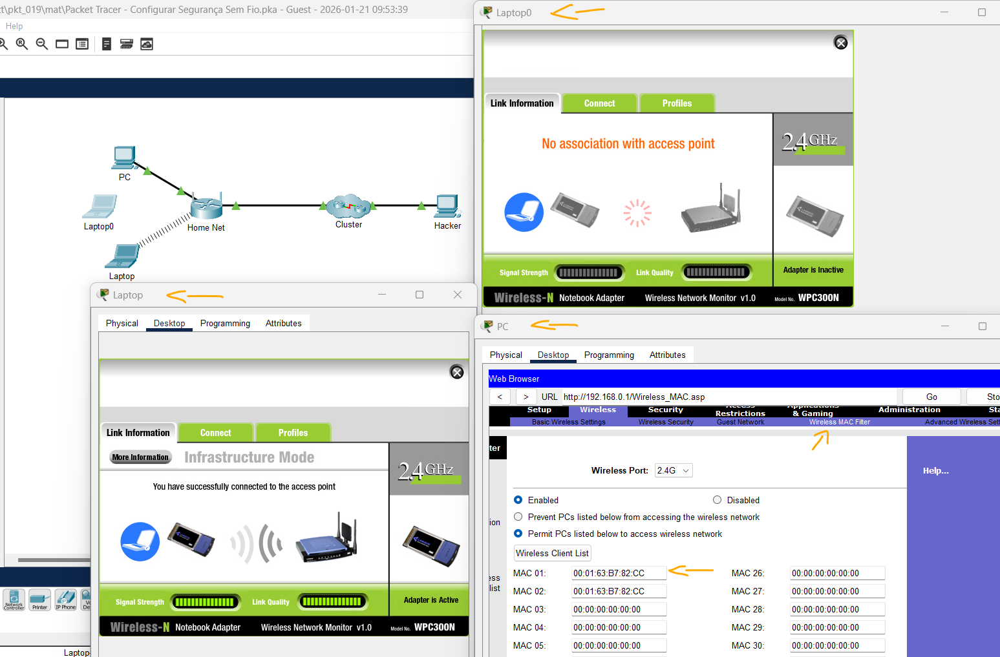
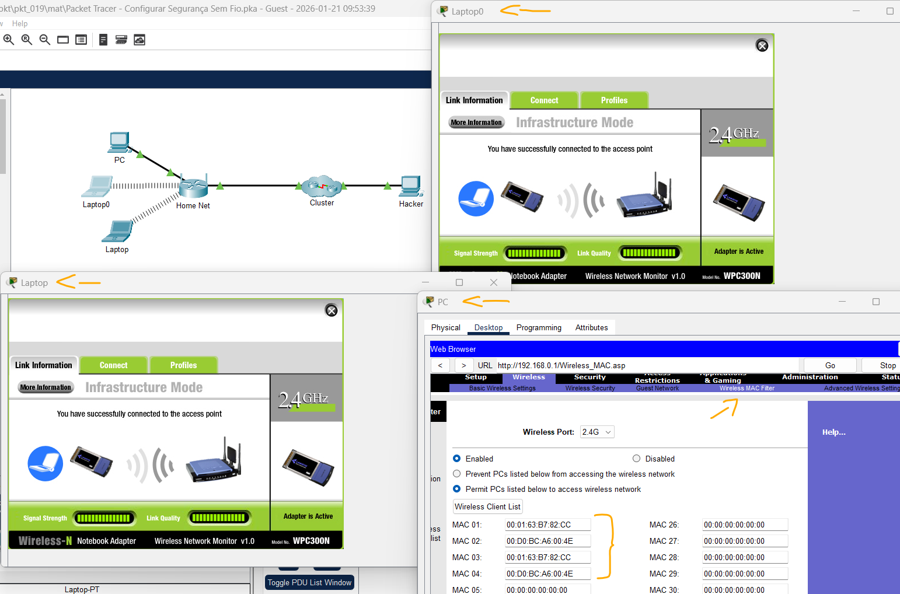

# Packet Tracer - Configurar Segurança Sem Fio   

### Cisco: <a href="../../../">cisco   </a>
### Cisco Networking Academy: cna   </a>
### Training Category: <a href="../../../pkt/">pkt</a>
### Software/Subject: network   </a>
### Course: <a href="./">pkt_019 (Packet Tracer - Configurar Segurança Sem Fio)   </a>

---

### Theme:
- Network

### Used Tools:
- Operating System (OS): 
  - Windows 11 
- Cloud Services:
  - Google Drive 
- Language:
  - HTML   
  - Markdown   
- Integrated Development Environment (IDE) and Text Editor:
  - Visual Studio Code (VS Code)   
- Versioning: 
  - Git   
- Repository:
  - GitHub   
- Network:
  - Cisco Packet Tracer   
  
---

<h3><a name="item00">Course Strcuture:</a></h3>

1. <a href="#item01">Parte 1: modificar as configurações básicas de segurança</a> 
  1.1 <a href="#item01.01">Etapa 1: Altere a senha administrativa padrão.</a> 
  1.2 <a href="#item01.02">Etapa 2: Desative o gerenciamento remoto no roteador sem fio.</a> 
2. <a href="#item02">Parte 2: Configurar a Segurança sem Fio no Roteador Sem Fio</a> 
  2.1 <a href="#item02.01">Etapa 1: Modifique o nome SSID padrão e desative o recurso de transmissão.</a> 
  2.2 <a href="#item02.02">Etapa 2: Configurar a segurança WPA2 no roteador sem fio.</a> 
  2.3 <a href="#item02.03">Etapa 3: Configurar Laptop como um cliente sem fio.</a> 
  2.4 <a href="#item02.04">Etapa 4: Configure o roteador sem fio para suportar o filtro de endereços MAC.</a> 
  2.5 <a href="#item02.05">Etapa 5: Teste a filtragem de MAC do roteador sem fio</a> 

---

### Objective:
O objetivo foi configurar um roteador sem fio para uma rede doméstica.

### Folder Structure:
- [README.md](./README.md): Este documento de README, escrito em **Markdown**, com o conteúdo desta atividade.
- [0-aux](./0-aux/): Pasta auxiliar com imagens utilizadas na construção dos arquivos de README desse curso.

### Development:

<a name="item01"><h4>1. Parte 1: modificar as configurações básicas de segurança</h4></a>[Back to summary](#item00)

A imagem 01 mostra a topologia inicial.

<figure>
     
    <figcaption>Imagem 01.</figcaption>
</figure>
 

<a name="item01.01"><h4>1.1 Etapa 1: Altere a senha administrativa padrão.</h4></a>[Back to summary](#item00)

- a. A partir do PC, abra um navegador da web a partir da área de trabalho e acesse 192.168.0.1 para acessar o roteador sem fio Home Net.
- b. Faça login no roteador usando "admin" como nome de usuário e senha.
- c. Após fazer login com sucesso, clique em "Administração" > "Gerenciamento".
- d. Modifique a senha do roteador para uma mais forte. Altere a senha para "aC0mpAny3". Observe que a nova senha tem 8 caracteres com letras maiúsculas e minúsculas, e algumas das vogais foram substituídas por números. Clique em Salvar configurações na parte inferior da tela.
- e. Faça login no roteador com a nova senha. Clique em OK. Clique em "Continuar" para acessar a página de configuração novamente.

<a name="item01.02"><h4>1.2 Etapa 2: Desative o gerenciamento remoto no roteador sem fio.</h4></a>[Back to summary](#item00)

Por razões de segurança, o gerenciamento remoto, como o acesso de fora da rede local, deve ser desativado.

- a. Verifique o status atual do gerenciamento remoto no roteador sem fio. Selecione "Administração" > "Acesso Remoto". Neste momento, o gerenciamento remoto está habilitado.
- b. Selecione o PC do hacker e navegue até 192.31.7.100 no navegador da Web. Você deve ser apresentado com a solicitação de um nome de usuário e uma senha. Digite as credenciais de "admin" e a senha "aC0mpAny3" e você deverá conseguir acessar a página de configuração do roteador sem fio. Feche o navegador da web quando terminar.
- c. Volte para o PC e faça login na página de configuração do roteador sem fio Home Net, conforme necessário, para desativar o Gerenciamento Remoto. (Administração > Gerenciamento) Selecione "Desativado" e clique em "Salvar Configurações". Clique em Continuar.
- d. Retorne ao PC do hacker e navegue até 192.31.7.100. Você não poderá mais conectar o roteador sem fio Home Net remotamente.

A imagem 02 exibe a conclusão da Parte 1.

<figure>
     
    <figcaption>Imagem 02.</figcaption>
</figure>
 

<a name="item02"><h4>2. Parte 2: Configurar a Segurança sem Fio no Roteador Sem Fio</h4></a>[Back to summary](#item00)

<a name="item02.01"><h4>2.1 Etapa 1: Modifique o nome SSID padrão e desative o recurso de transmissão.</h4></a>[Back to summary](#item00)

- a. Ao fazer login no roteador sem fio Home Net a partir do PC, clique em "Sem Fio" e modifique o nome SSID para "aCompany".
- b. Para "Transmissão de SSID", clique em "Desativado ". Clique em  Save Settings > Continue. Verifique a topologia O que aconteceu com a conectividade sem fio entre o notebook e a rede doméstica?
  - A conexão sem fio é perdida, já que o notebook não consegue mais “ver” a rede sem fio.

<a name="item02.02"><h4>2.2 Etapa 2: Configurar a segurança WPA2 no roteador sem fio.</h4></a>[Back to summary](#item00)

- a. Volte para o PC e faça login na página de configuração do roteador sem fio Home Net, conforme necessário.
- b. Selecione "Sem Fio" > "Segurança sem Fio".
- c. Altere Security Mode (Modo de Segurança) para WPA2 Personal. O AES é o protocolo de criptografia mais forte disponível atualmente. Deixe-o selecionado.
- d. Configure a senha como aCompWiFi. Clique em Save Settings.

<a name="item02.03"><h4>2.3 Etapa 3: Configurar Laptop como um cliente sem fio.</h4></a>[Back to summary](#item00)

Nesta etapa, você configurará o laptop para se conectar à rede sem fio usando as configurações de segurança que você configurou no roteador sem fio.

- a. Selecione Laptop. Clique em "Área de Trabalho" > "PC sem Fio".
- b. Selecione Perfis > Novo e adicione um novo perfil. Digite um nome de perfil de sua escolha e clique em "OK".
- c. Clique em Advanced Setup (Configuração avançada). Digite "aCompany" como Nome da Rede Sem Fio (SSID). Clique em Avançar para continuar.
- d. Aceite as configurações de rede padrão para usar o DHCP e clique em "Próximo".
- e. Modifique a segurança usando a caixa suspensa para "WPA2-Personal" e selecione "Próximo".
- f. Digite a chave pré-compartilhada: "aCompWiFi" e selecione "Próximo".
- g. Clique em "Salvar" para confirmar as novas configurações.
- h. Clique em "Conectar-se à Rede".
- i. Se o laptop não se conectar com sucesso, retorne ao perfil e edite-o. Verifique a digitação do nome do SSID e da chave pré-compartilhada.
- j. Feche a janela "PC sem Fio" quando estiver conectado.

<a name="item02.04"><h4>2.4 Etapa 4: Configure o roteador sem fio para suportar o filtro de endereços MAC.</h4></a>[Back to summary](#item00)

- a. Na Área de Trabalho, clique em "Prompt de Comando".
- b. No prompt, digite "ipconfig /all" e anote o endereço IPv4 e os endereços físicos (MAC) para a Conexão Wireless0: `192.168.0.100` e `00:01:63:B7:82:CC`.
- c. Volte para o PC e faça login na página de configuração do roteador sem fio Home Net conforme necessário.
- d. Navegue até "Sem Fio" > "Filtro de MAC sem Fio".
- e. Sob o cabeçalho "Resolução de Acesso", selecione "Habilitado" e "Permitir que PCs listados abaixo acessem a rede sem fio".
- f. Digite o endereço MAC da conexão sem fio Wireless0 no Laptop no campo MAC 01:. Observe que o endereço MAC deve estar no formato XX:XX:XX:XX:XX:XX. Clique em "Salvar Configurações" e depois em "Continuar" para retornar à página de configuração.
- g. Reconecte o Laptop à rede sem fio. (Laptop > clique em PC Sem Fio > Perfil > selecione aCompany > clique em Conectar, se necessário.)

<a name="item02.05"><h4>2.5 Etapa 5: Teste a filtragem de MAC do roteador sem fio</h4></a>[Back to summary](#item00)

Nesta etapa, você testará a filtragem de MAC adicionando um segundo notebook à rede. Você precisará trocar a placa de interface de rede Fast Ethernet por uma placa de interface de rede sem fio.

- a. Adicione um segundo laptop à topologia. Você precisará trocar a placa de interface de rede Fast Ethernet por uma placa de interface de rede sem fio. Observação: não altere o nome de exibição do notebook recém-adicionado. O nome do dispositivo afetará a pontuação no Packet Tracer.
- b. Pressione o botão de energia no Laptop0 para desligá-lo.
- c. Arraste a placa Ethernet para a lista Modules (Módulos) para removê-la.
- d. Arraste o módulo WPC300N para o slot vazio no Laptop0 e pressione o botão de energia para ligar o Laptop0. Você não conseguiu se associar ao ponto de acesso? Se não, explique como você resolveria o problema.
  - Não foi possível se associar ao ponto de acesso porque a filtragem de MAC está habilitada e o endereço MAC do Laptop0 não está autorizado. Para resolver, é necessário adicionar o MAC do Laptop0 à lista de dispositivos permitidos no roteador sem fio ou desativar a filtragem de MAC.
- e. Configure o novo laptop com as configurações de segurança nos passos anteriores para conectar o Laptop0 à rede.

As imagens 03 e 04 exibem a conclusão da Parte 2.

<figure>
     
    <figcaption>Imagem 03.</figcaption>
</figure>
 

<figure>
     
    <figcaption>Imagem 04.</figcaption>
</figure>
 