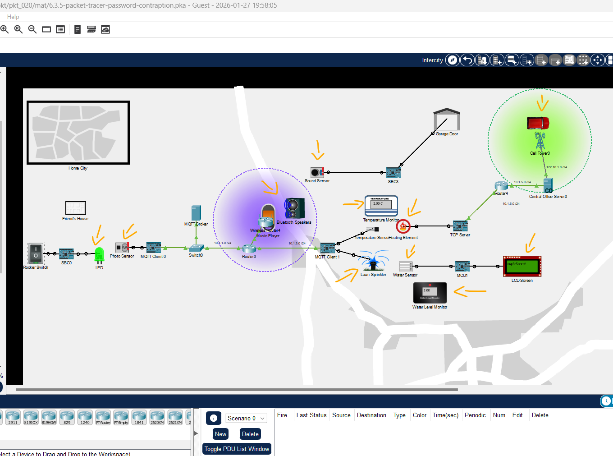
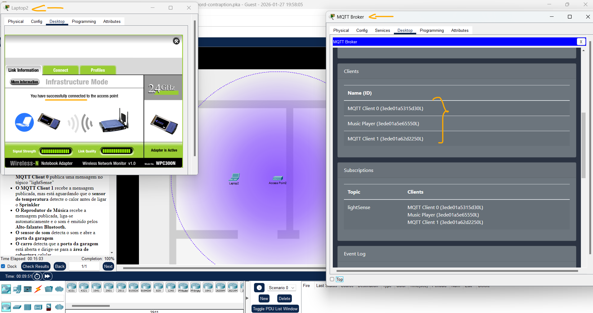

# Packet Tracer - A engenhoca da senha   

### Cisco: <a href="../../../">cisco   </a>
### Cisco Networking Academy: cna   </a>
### Training Category: <a href="../../../pkt/">pkt</a>
### Software/Subject: network   </a>
### Course: <a href="./">pkt_020 (Packet Tracer - A engenhoca da senha)   </a>

---

### Theme:
- Network

### Used Tools:
- Operating System (OS): 
  - Cisco Internetwork Operating System (Cisco IOS)   
  - Windows 11 
- Cloud Services:
  - Google Drive 
- Language:
  - HTML   
  - Markdown   
- Integrated Development Environment (IDE) and Text Editor:
  - Visual Studio Code (VS Code)   
- Versioning: 
  - Git   
- Repository:
  - GitHub   
- Network:
  - Cisco Packet Tracer   
  - ping   

---cisco_packet_tracer

<h3><a name="item00">Course Strcuture:</a></h3>

1. <a href="#item01">Packet Tracer - A engenhoca da senha</a> 

---

### Objective:
O objetivo desta atividade de desafio foi estabelecer a conectividade a uma rede Wi-Fi através de um fluxo de automação entre dispositivos IoT, utilizando a interação entre sensores e atuadores para a liberação da chave de acesso à rede.

### Folder Structure:
- [README.md](./README.md): Este documento de README, escrito em **Markdown**, com o conteúdo do laboratório.
- [0-aux](./0-aux/): Pasta auxiliar com imagens utilizadas na construção dos arquivos de README desse curso.

### Development:

<a name="item01"><h4>1. Packet Tracer - A engenhoca da senha</h4></a>[Back to summary](#item00)

- a. Você está na casa de um amigo e deseja se conectar ao Wi-Fi deles. Seu amigo criou uma engenhoca de IoT para este momento. Pressione o interruptor basculante para revelar a senha!
- b. Depois de obtê-la, vá para o recipiente "Casa do Amigo" e insira-a como senha WPA2 no "Meu Laptop" para se conectar ao Ponto de Acesso.
  - `sup3rSecret!`.
- c. O que está acontecendo?
  - O interruptor basculante acende o LED.
  - O foto sensor detecta a luz do LED.
  - Há três clientes MQTT inscritos no tópico 'lightSense':
    - MQTT Client 0 (conectado ao foto sensor).
    - MQTT Client 1 (conectado ao sensor de temperatura e ao aSprinkler).
    - Reprodutor de Música.
  - O foto sensor detecta a luz do LED e o MQTT Client 0 publica uma mensagem no tópico "lightSense".
  - O MQTT Client 1 recebe a mensagem publicada, mas está aguardando que o sensor de temperatura detecte o calor antes de ligar o Sprinkler.
  - O Reprodutor de Música recebe a mensagem publicada, liga-se automaticamente e o som é emitido pelos Alto-falantes Bluetooth.
  - O sensor de som detecta o som e abre a porta da garagem.
  - O carro detecta que a porta da garagem está aberta e dirige-se para a área de cobertura celular.
  - O carro estabelece uma conexão com o Servidor TCP e envia um pacote para instruir o servidor a ligar o Elemento de Aquecimento.
  - O sensor de temperatura detecta o calor. O MQTT Client 1 aguarda que a temperatura do ambiente seja maior ou igual a 3 graus Celsius. Quando ambas as condições de movimento e temperatura são atendidas, o Sprinkler é ligado.
  - O Sensor de Água detecta água, e a senha do Wi-Fi será exibida no LCD quando os níveis de água atingirem 3% ou mais
- d. Observações:
  - Aguarde a convergência da rede antes de pressionar o interruptor basculante. No MQTT Broker, acesse o miniaplicativo MQTT Broker na guia Desktop. A rede deve estar pronta para ser usada quando você vir três dispositivos na lista de clientes
  - Para obter o melhor desempenho, aguarde alguns segundos para que todos os scripts sejam "estabelecidos" após a convergência da rede. As animações para o carro podem ficar lentas se você não o fizer.
  - Para redefinir o dispositivo, clique em Arquivo > Redefinir Atividade.

A imagem 01 exibe a obtenção da senha Wi-Fi do Friend's house.

<figure>
     
    <figcaption>Imagem 01.</figcaption>
</figure>
 

A imagem 02 mostra a conexão Wireless estabelecida, além dos três clients MQTT configurados no MQTT Broker.

<figure>
     
    <figcaption>Imagem 02.</figcaption>
</figure>
 