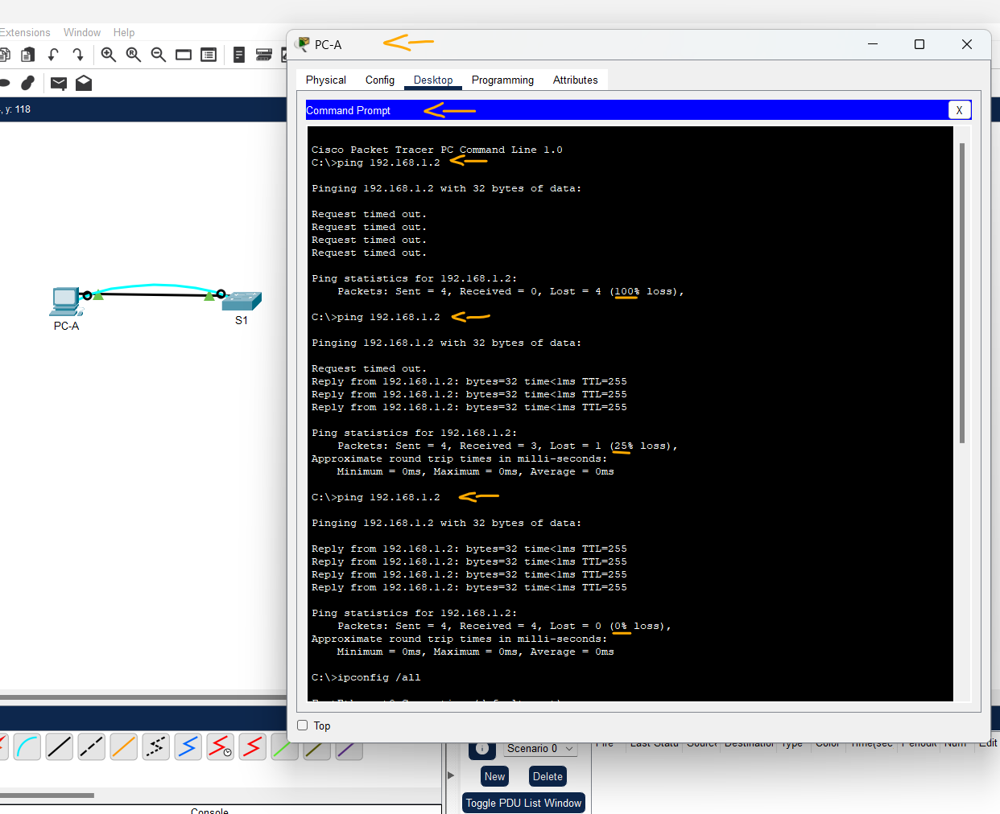
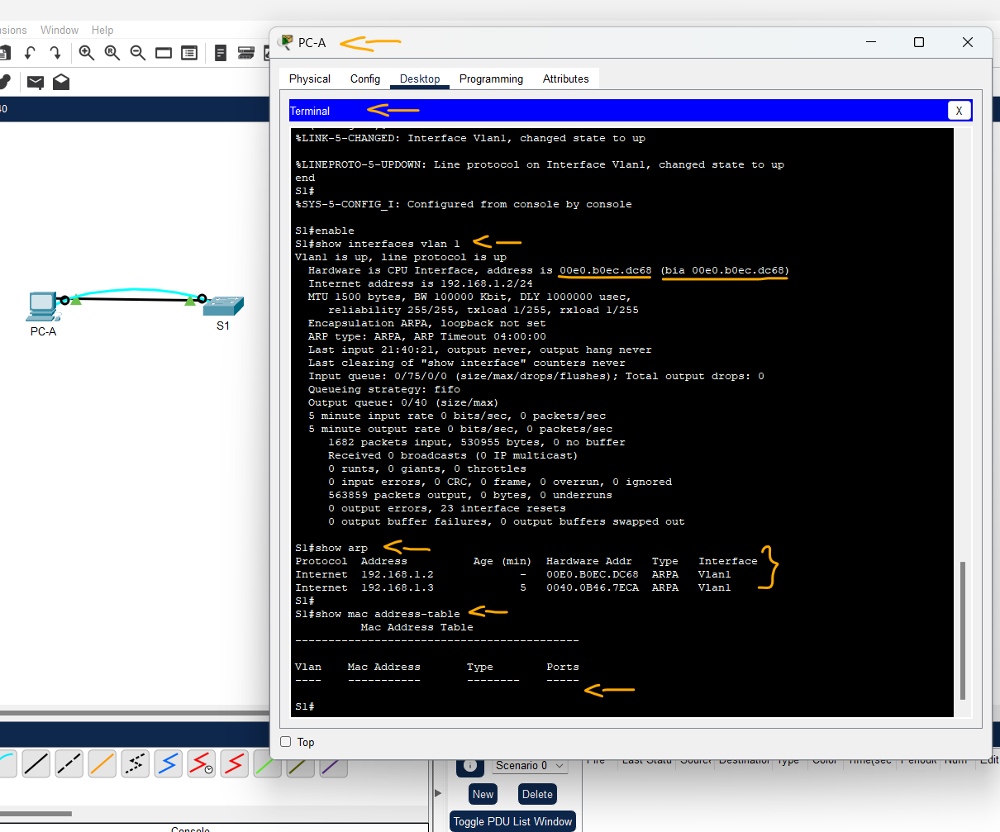

# Packet Tracer - Exibir Endereços MAC do dispositivo de rede   

### Cisco: <a href="../../">cisco   </a>
### Cisco Networking Academy: cna   </a>
### Training Category: <a href="../../self_paced/">self-paced</a>
### Software/Subject: network   </a>
### Course: <a href="./">pkt_021 (Packet Tracer - Exibir Endereços MAC do dispositivo de rede)   </a>

---

### Theme:
- Network

### Used Tools:
- Operating System (OS): 
  - Cisco Internetwork Operating System (Cisco IOS)   
  - Windows 11 
- Cloud Services:
  - Google Drive 
- Language:
  - HTML   
  - Markdown   
- Integrated Development Environment (IDE) and Text Editor:
  - Visual Studio Code (VS Code)   
- Versioning: 
  - Git   
- Repository:
  - GitHub   
- Network:
  - Cisco Packet Tracer 
  - ping   

---

<h3><a name="item00">Course Strcuture:</a></h3>

1. <a href="#item01">Parte 1: Configurar Dispositivos e Verificar a Conectividade</a> 
  1.1 <a href="#item01.01">Etapa 1: Instale a rede conforme mostrado na topologia.</a> 
  1.2 <a href="#item01.02">Etapa 2: Configure o endereço IPv4 do PC.</a> 
  1.3 <a href="#item01.03">Etapa 3: Defina as configurações básicas do switch.</a> 
  1.4 <a href="#item01.04">Etapa 4: Verificar a conectividade da rede.</a> 
2. <a href="#item02">Parte 2: Exibir, Descrever e Analisar Endereços MAC Ethernet</a> 
  2.1 <a href="#item02.01">Etapa 1: Analise o endereço MAC da placa de interface de rede de PC-A.</a> 
  2.2 <a href="#item02.02">Etapa 2: Analise o endereço MAC da interface F0/6 de S1.</a> 
  2.3 <a href="#item02.03">Etapa 3: Exiba os endereços MAC no switch.</a> 
3. <a href="#item03">Perguntas para reflexão</a> 

---

### Objective:
O objetivo foi configurar o endereçamento IP de dois dispositivos (um PC e um Switch), realizar a conexão entre eles por meio de cabos Ethernet e Console, testar a conectividade de rede e analisar o comportamento dos endereços MAC nas tabelas MAC e ARP, bem como nas configurações dos próprios dispositivos.

### Folder Structure:
- [README.md](./README.md): Este documento de README, escrito em **Markdown**, com o conteúdo do laboratório.
- [0-aux](./0-aux/): Pasta auxiliar com imagens utilizadas na construção dos arquivos de README desse curso.

### Development:

<a name="item01"><h4>1. Parte 1: Configurar Dispositivos e Verificar a Conectividade</h4></a>[Back to summary](#item00)

Nesta parte, você vai configurar a topologia de rede e definir configurações básicas, como nome de dispositivo e endereços IP da interface. Para ver informações de endereço e nome de dispositivos, consulte a Topologia e a Tabela de Endereçamento. 

<a name="item01.01"><h4>1.1 Etapa 1: Instale a rede conforme mostrado na topologia.</h4></a>[Back to summary](#item00)

- a. Conecte os dispositivos exibidos na topologia e o cabo, conforme necessário.
- b. Ligue todos os dispositivos da topologia.

<a name="item01.02"><h4>1.2 Etapa 2: Configure o endereço IPv4 do PC.</h4></a>[Back to summary](#item00)

- a. Configure o endereço IPv4, a máscara de sub-rede e o endereço do gateway padrão de PC-A. 
- b. No prompt de comando em PC-A, faça ping no endereço do switch. Os pings foram bem-sucedidos? Explique. 
  - Não. Os pings não foram bem-sucedidos porque o switch ainda não possui um endereço IP configurado na interface VLAN, o que impede a comunicação em nível de Camada 3.
Como switches de Camada 2 não respondem a pings sem um endereço IP de gerenciamento configurado, o PC não consegue alcançar o switch até que essa configuração seja realizada.

<a name="item01.03"><h4>1.3 Etapa 3: Defina as configurações básicas do switch.</h4></a>[Back to summary](#item00)

Nesta etapa, você irá configurar o endereço IP e o nome do dispositivo e desativar a pesquisa de DNS no switch. 
- a. Use o console para se conectar ao switch e entre no modo de configuração global.
  - `enable` -> `configure terminal`
- b. Atribua um nome de host ao switch com base na Tabela de Endereçamento.
  - `hostname S1`.
- c. Desative a pesquisa de DNS.
  - `no ip domain-lookup`.
- d. Configure e ative a interface SVI para VLAN1.
  - `interface vlan 1` -> `ip address 192.168.1.2 255.255.255.0` -> `no shutdown` -> `end`

<a name="item01.04"><h4>1.4 Etapa 4: Verificar a conectividade da rede.</h4></a>[Back to summary](#item00)

- a. Faça ping no PC-A. Os pings foram bem-sucedidos?
  - Sim. Após a configuração da VLAN no switch e a atribuição de um endereço IP à interface VLAN, os pings passaram a ser bem-sucedidos.

A imagem 01 exibe a conclusão da Parte 1.

<figure>
     
    <figcaption>Imagem 01.</figcaption>
</figure>
 

<a name="item02"><h4>2. Parte 2: Exibir, Descrever e Analisar Endereços MAC Ethernet</h4></a>[Back to summary](#item00)

Todo dispositivo em uma LAN Ethernet tem um endereço MAC que é atribuído pelo fabricante e armazenado no firmware da NIC. Os endereços MAC Ethernet têm 48 bits. Eles são exibidos com seis conjuntos de dígitos hexadecimais normalmente separados por traços, dois-pontos ou pontos. O exemplo a seguir mostra o mesmo endereço MAC usando os três métodos de notação diferentes: 
- 00-05-9A-3C-78-00
- 00:05:9A:3C:78:00
- 0005.9A3C.7800

Nota: Os endereços MAC também são chamados de endereços físicos, endereços de hardware ou endereços de hardware Ethernet. Você emitirá comandos para exibir os endereços MAC em um PC e um comutador e analisará as propriedades de cada um.

<a name="item02.01"><h4>2.1 Etapa 1: Analise o endereço MAC da placa de interface de rede de PC-A.</h4></a>[Back to summary](#item00)

Antes de analisar o endereço MAC em PC-A, veja um exemplo de uma NIC de um PC diferente. Você pode usar o comando ipconfig /all para exibir o endereço MAC da placa de interface de rede. Um exemplo de saída de tela é mostrado abaixo. Ao usar o comando ipconfig /all, observe que os endereços MAC são chamados de endereços físicos. Lendo o endereço MAC da esquerda para a direita, os seis primeiros dígitos hexadecimais se referem ao fornecedor (fabricante) deste dispositivo. Esses primeiros seis dígitos hexadecimais (3 bytes) também são conhecidos como OUI (Organizationally Unique Identifier). Esse código de 3 bytes é atribuído ao fornecedor pela organização IEEE. 

Para localizar ou fabricar, use como palavras-chave padrões IEEE OUI para localizar uma ferramenta de pesquisa OUI na Internet ou navegue até [http://standards-oui.ieee.org/oui.txt](http://standards-oui.ieee.org/oui.txt) para encontrar os códigos de fornecedor OUI registrados. Os últimos seis dígitos são o número de série da NIC atribuído pelo fabricante. 

- a. Usando a saída do comando ipconfig /all, responda às perguntas a seguir. Qual é a parte de OUI do endereço MAC neste dispositivo?
  - 5C-26-0A
- a. Qual é a parte de número de série do endereço MAC neste dispositivo?
  - 24-2A-60
- a. Usando o exemplo acima, localize o nome do fornecedor que fabricou essa placa de interface de rede.
  - Dell Inc.
- b. No prompt de comando do PC-A, emita o comando ipconfig /all e identifique a parte do OUI do endereço MAC da placa de rede do PC-A.
  - 00:40:0B
- b. Identifique a parte de número de série do endereço MAC na NIC de PC-A.
  - 46.7E:CA
- b. Identifique o nome do fornecedor que fabricou a NIC de PC-A.
  - Cisco Systems, Inc.

<a name="item02.02"><h4>2.2 Etapa 2: Analise o endereço MAC da interface F0/6 de S1.</h4></a>[Back to summary](#item00)

Podem ser usados vários comandos para exibir os endereços MAC no switch.

- a. Use o console para se conectar a S1 e execute o comando `show interfaces vlan 1` para localizar as informações do endereço MAC. Um exemplo é mostrado abaixo. Use a saída gerada pelo switch para responder às perguntas. Qual é o endereço MAC de VLAN 1 em S1?
  - 001b.0c6d.8f40 | 00e0.b0ec.dc68
- a. Qual é o número de série do MAC para VLAN 1?
  - 6d:8f:40 | 00:e0:b0
- a. Qual é o OUI para VLAN 1?
  - 00:1b:0c | ec:dc:68
- a. Com base nessa OUI, qual é o nome do fornecedor?
  - Cisco Systems, Inc. | Cisco Systems, Inc.
- a. O que significa bia?
  - BIA (Burned-In Address) é o endereço MAC original gravado pelo fabricante no hardware da interface de rede. Esse endereço é único e permanente.
- a. Por que a saída indica o mesmo endereço MAC duas vezes?
  - Porque a interface VLAN está utilizando o endereço MAC original (BIA) como endereço MAC ativo. Como não houve nenhuma configuração que alterasse o MAC da interface, o endereço operacional e o endereço gravado no hardware são iguais.
- b. Outra forma de exibir endereços MAC no switch é usar o comando `show arp`. Use o comando show arp para exibir informações de endereço MAC. Esse comando mapeia o endereço da Camada 2 para o endereço correspondente da Camada 3. Um exemplo é mostrado abaixo. Use a saída gerada pelo switch para responder às perguntas. Que endereços da Camada 2 são exibidos em S1?
  - 001b.0c6d.8f40 para IP 192.168.1.2 | 00E0.B0EC.DC68 para IP 192.168.1.2 (S1)
  - 5c26.0a24.2a60 para IP 192.168.1.3 | 0040.0B46.7ECA para IP 192.168.1.3 (PC-A)

<a name="item02.03"><h4>2.3 Etapa 3: Exiba os endereços MAC no switch.</h4></a>[Back to summary](#item00)

- a. Emita o comando `show mac address-table` em S1. Um exemplo é mostrado abaixo. Use a saída gerada pelo switch para responder às perguntas. O switch exibe o endereço MAC de PC-A? Se você respondeu sim, em que porta ele estava? 
  - Cenário Instrução Lab: Sim, o switch exibe o endereço MAC de PC-A. O endereço MAC 5c26.0a24.2a60 foi aprendido dinamicamente (DYNAMIC) na porta FastEthernet 0/6 (Fa0/6).
  - Cenário PKT: Não. Embora o switch conheça o endereço MAC do PC por meio da tabela ARP, o endereço não aparece na tabela MAC porque o tráfego ICMP foi destinado à interface VLAN do próprio switch. Nesse caso, o quadro é processado pela CPU e não necessita de comutação entre portas físicas.

A imagem 02 exibe a conclusão da Parte 2.

<figure>
     
    <figcaption>Imagem 02.</figcaption>
</figure>
 

<a name="item03"><h4>3. Perguntas para reflexão</h4></a>[Back to summary](#item00)

- a. É possível ter broadcasts no nível da Camada 2? Em caso afirmativo, qual seria o endereço MAC?
  - Sim. Na Camada 2, o endereço MAC de broadcast é FFFF.FFFF.FFFF, utilizado para enviar quadros a todos os dispositivos da rede local.
- b. Por que você precisaria saber o endereço MAC de um dispositivo?
  - Para permitir o encaminhamento correto dos quadros na Camada de Enlace de Dados, garantindo que o quadro chegue ao dispositivo de destino dentro da rede local.