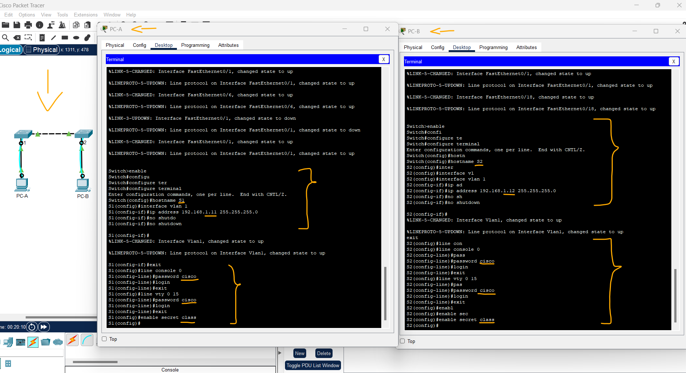
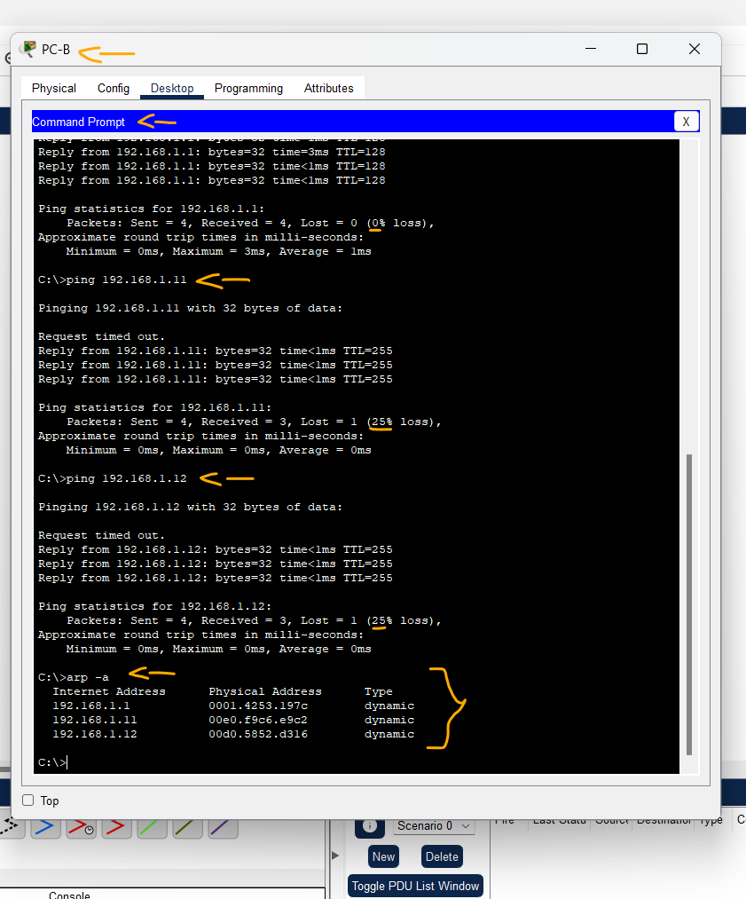

# Packet Tracer - Exibir a tabela de endereços MAC do switch   

### Cisco: <a href="../../../">cisco   </a>
### Cisco Networking Academy: cna   </a>
### Training Category: <a href="../../../pkt/">pkt</a>
### Software/Subject: network   </a>
### Course: <a href="./">pkt_022 (Packet Tracer - Exibir a tabela de endereços MAC do switch)   </a>

---

### Theme:
- Network

### Used Tools:
- Operating System (OS): 
  - Cisco Internetwork Operating System (Cisco IOS)   
  - Windows 11 
- Cloud Services:
  - Google Drive 
- Language:
  - HTML   
  - Markdown   
- Integrated Development Environment (IDE) and Text Editor:
  - Visual Studio Code (VS Code)   
- Versioning: 
  - Git   
- Repository:
  - GitHub   
- Network:
  - Cisco Packet Tracer 
  - ping   

---

<h3><a name="item00">Course Strcuture:</a></h3>

1. <a href="#item01">Parte 1: Criar e Configurar a Rede</a> 
  1.1 <a href="#item01.01">Etapa 1: Instale a rede de acordo com a topologia.</a> 
  1.2 <a href="#item01.02">Etapa 2: Configure os PCs hosts.</a> 
  1.3 <a href="#item01.03">Etapa 3: Inicialize e recarregue os switches, conforme necessário.</a> 
  1.4 <a href="#item01.04">Etapa 4: Defina as configurações básicas de cada switch.</a> 
2. <a href="#item02">Parte 2: Examinar a Tabela de Endereços MAC do Switch</a> 
  2.1 <a href="#item02.01">Etapa 1: Registre os endereços MAC do dispositivo de rede.</a> 
  2.2 <a href="#item02.02">Etapa 2: Exiba a tabela de endereços MAC do switch.</a> 
  2.3 <a href="#item02.03">Etapa 3: Limpe a tabela de endereços MAC de S2 e exiba a tabela de endereços MAC novamente.</a> 
  2.4 <a href="#item02.04">Etapa 4: Em PC-B, faça ping nos dispositivos da rede e observe a tabela de endereços MAC do switch.</a> 
3. <a href="#item03">Perguntas para reflexão</a> 

---

### Objective:
O objetivo deste laboratório foi configurar o endereçamento IP de quatro dispositivos (dois PCs e dois switches), conectá-los por meio de cabos Ethernet e console, verificar a conectividade entre eles e analisar o comportamento dos endereços MAC nas tabelas MAC dos switches, na cache ARP dos PCs e nas configurações das próprias interfaces.

### Folder Structure:
- [README.md](./README.md): Este documento de README, escrito em **Markdown**, com o conteúdo do laboratório.
- [0-aux](./0-aux/): Pasta auxiliar com imagens utilizadas na construção dos arquivos de README desse curso.

### Development:

<a name="item01"><h4>1. Parte 1: Criar e Configurar a Rede</h4></a>[Back to summary](#item00)

<a name="item01.01"><h4>1.1 Etapa 1: Instale a rede de acordo com a topologia.</h4></a>[Back to summary](#item00)

- a. Posicionar os dispositivos (PCs e switches) conforme a topologia proposta.
- b. Conectar os PCs aos switches utilizando cabo Ethernet adequado.
- c. Conectar os PCs aos switches via cabo console para acesso à interface de configuração, quando necessário.

<a name="item01.02"><h4>1.2 Etapa 2: Configure os PCs hosts.</h4></a>[Back to summary](#item00)

- a. Acessar as configurações de rede do PC.
- b. Configurar manualmente o endereço IP e máscara de sub-rede, conforme o cenário proposto.

<a name="item01.03"><h4>1.3 Etapa 3: Inicialize e recarregue os switches, conforme necessário.</h4></a>[Back to summary](#item00)

- a. Acessar o switch via console.
- b. Apagar a configuração inicial, se existente, para garantir um ambiente limpo.
  - `enable` -> `erase startup-config` -> `Enter`.
- c. Recarregar o switch para aplicar as configurações padrão.
  - `reload` -> `Enter` -> `no`.

<a name="item01.04"><h4>1.4 Etapa 4: Defina as configurações básicas de cada switch.</h4></a>[Back to summary](#item00)

- a. Configure o nome do dispositivo conforme mostrado na topologia.
  - `enable` -> `configure terminal` -> `hostname S1`.
  - `enable` -> `configure terminal` -> `hostname S2`.
- b. Configure o endereço IP conforme listado na Tabela de Endereçamento.
  - `interface vlan 1` -> `ip address 192.168.1.11 255.255.255.0` -> `no shutdown` -> `exit`.
  - `interface vlan 1` -> `ip address 192.168.1.12 255.255.255.0` -> `no shutdown` -> `exit`.
- c. Atribua cisco como o console e senhas vty.
  - `line console 0` -> `password cisco` -> `login` -> `exit`.
  - `line vty 0 15` -> `password cisco` -> `login` -> `exit`.
- d. Atribua class como a senha do EXEC privilegiado.
  - `enable secret class`.

A imagem 01 exibe a conclusão da Parte 1.

<figure>
     
    <figcaption>Imagem 01.</figcaption>
</figure>
 

<a name="item02"><h4>2. Parte 2: Examinar a Tabela de Endereços MAC do Switch</h4></a>[Back to summary](#item00)

Um switch reconhece endereços MAC e cria a tabela de endereços MAC, enquanto os dispositivos de rede iniciam a comunicação na rede.

<a name="item02.01"><h4>2.1 Etapa 1: Registre os endereços MAC do dispositivo de rede.</h4></a>[Back to summary](#item00)

- a. Abra um prompt de comando no PC-A e PC-B e digite ipconfig /all. Quais são os endereços físicos do adaptador de Ethernet? 
  - Endereço MAC PC-A: 0001.4253.197C
  - Endereço MAC PC-B: 00D0.9796.BD68
- b. Use o console para se conectar aos switches S1 e S2 e digite o comando `show interface F0/1` em cada switch. Na segunda linha da saída do comando, quais são os endereços de hardware (ou bia [burned-in address, endereço gravado na ROM])? 
  - S1 Fast Ethernet 0/1 MAC Address: 0006.2a33.b301 (bia 0006.2a33.b301).
  - S2 Fast Ethernet 0/1 MAC Address: 0009.7cb3.9201 (bia 0009.7cb3.9201).

<a name="item02.02"><h4>2.2 Etapa 2: Exiba a tabela de endereços MAC do switch.</h4></a>[Back to summary](#item00)

Use o console para se conectar ao switch S2 e visualize a tabela de endereços MAC antes e depois de executar os testes de comunicação de rede com ping. 

- a. Estabeleça uma conexão de console com S2 e entre no modo EXEC privilegiado. 
- b. No modo EXEC privilegiado, digite o comando `show mac address-table` e pressione Enter. Mesmo que não haja comunicação de rede iniciada pela rede (isto é, nenhum uso de ping), é possível que o switch tenha reconhecido os endereços MAC da sua conexão com o PC e com o outro switch. Existe algum endereço MAC gravado na tabela de endereços MAC?
  - Sim. A tabela de endereços MAC contém entradas mesmo sem tráfego gerado manualmente (como ping). O switch aprende dinamicamente endereços MAC a partir de quadros de controle e de gerenciamento. Nesse caso, o endereço MAC 0006.2a33.b301, pertencente ao switch S1, foi aprendido dinamicamente na porta FastEthernet 0/1 (Fa0/1).
- b. Quais endereços MAC estão registrados na tabela? Em que portas do switch eles estão mapeados e a que dispositivos pertencem? Ignore os endereços MAC que estão mapeados para a CPU.
  - A tabela de endereços MAC contém entradas aprendidas dinamicamente a partir dos dispositivos conectados ao switch. O endereço MAC 0006.2a33.b301 está registrado como DYNAMIC na porta FastEthernet 0/1 (Fa0/1) e corresponde ao dispositivo conectado a essa interface, neste caso, o switch S1. Não foram considerados os endereços MAC associados à CPU, pois eles se referem a endereços de controle e gerenciamento internos do switch.
- b. Se você não havia gravado anteriormente os endereços MAC dos dispositivos de rede na Etapa 1, como você poderia dizer a quais dispositivos os endereços MAC pertencem, usando apenas a saída do comando show mac address-table? Isso funciona em todos os cenários? 
  - É possível identificar os dispositivos observando em qual porta cada endereço MAC foi aprendido e comparando com a topologia da rede. Isso não funciona em todos os cenários, pois em redes maiores ou com vários switches, a mesma porta pode representar vários dispositivos.
  
<a name="item02.03"><h4>2.3 Etapa 3: Limpe a tabela de endereços MAC de S2 e exiba a tabela de endereços MAC novamente.</h4></a>[Back to summary](#item00)

- a. No modo EXEC privilegiado, digite o comando dinâmico `clear mac address-table` e pressione Enter.
- b. Digite rapidamente o comando `show mac address-table` novamente. A tabela de endereços MAC tem algum endereço para VLAN 1? Há outros endereços MAC listados?
  - Não. Após a execução do comando clear mac address-table, a tabela de endereços MAC não apresenta entradas para a VLAN 1, pois todos os endereços MAC aprendidos dinamicamente foram removidos e ainda não houve novo tráfego para que o switch reaprendesse esses endereços.
- b. Aguarde 10 segundos, digite o comando `show mac address-table` e pressione Enter. Há novos endereços na tabela de endereços MAC? 
  - Sim. Após aguardar alguns segundos, o switch voltou a registrar dinamicamente o endereço MAC 0006.2a33.b301 na tabela de endereços MAC, associado à porta FastEthernet 0/1 (Fa0/1).

<a name="item02.04"><h4>2.4 Etapa 4: Em PC-B, faça ping nos dispositivos da rede e observe a tabela de endereços MAC do switch.</h4></a>[Back to summary](#item00)

- a. No PC-B, abra um prompt de comando e digite `arp -a`. Não incluindo endereços de difusão seletiva ou difusão, quantos pares de endereços IP para MAC do 
dispositivo foram aprendidos pelo ARP?
  - Nenhum. Antes de qualquer comunicação de rede, a tabela ARP do PC-B não contém entradas aprendidas dinamicamente.
- b. No prompt de comando de PC-B, faça ping em PCA-A, S1 e S2. Todos os dispositivos tiveram respostas bem-sucedidas? Em caso negativo, verifique o cabeamento e as configurações de IP: `ping 192.168.1.1`, `ping 192.168.1.11` e `ping 192.168.1.12`.
  - Sim. Todos os dispositivos responderam com sucesso aos pings, indicando que o cabeamento e as configurações de endereçamento IP estão corretos.
- c. De uma conexão de console ao S2, digite o comando `show mac address-table`. O switch adicionou outros endereços MAC à tabela de endereços MAC? Em caso afirmativo, que 
endereços e dispositivos?
  - Sim. Após a comunicação de rede, o switch S2 adicionou novos endereços MAC à sua tabela de endereços MAC. Foram aprendidos dinamicamente o endereço MAC do PC-A (0001.4253.197c) na porta Fa0/1, o do PC-B (00d0.9796.bd68) na porta Fa0/18, além dos endereços MAC do switch S1: 00e0.f9c6.e9c2 (interface VLAN 1) e 0006.2a33.b301 (interface Fa0/1), ambos associados à porta Fa0/1 do S2.
- c. No PC-B, abra um prompt de comando e digite novamente `arp -a`. A cache ARP de PC-B tem entradas adicionais para todos os dispositivos de rede que receberam pings? 
  - Sim. Após a execução dos pings, a cache ARP do PC-B passou a conter entradas adicionais correspondentes aos dispositivos de rede que responderam às solicitações, pois seus endereços MAC foram aprendidos dinamicamente durante o processo de resolução ARP.

A imagem 02 exibe a conclusão da Parte 2.

<figure>
     
    <figcaption>Imagem 02.</figcaption>
</figure>
 

<a name="item03"><h4>3. Perguntas para reflexão</h4></a>[Back to summary](#item00)

- a. Em redes Ethernet, os dados são entregues a dispositivos baseados em seus endereços MAC. Para que isso aconteça, switches e computadores criam dinamicamente caches ARP e tabelas de endereços MAC. Com apenas alguns computadores na rede, esse processo parece muito fácil. Quais seriam alguns dos desafios em redes maiores? 
  - Em redes maiores, o aumento da quantidade de dispositivos torna o gerenciamento dos endereços MAC e das tabelas ARP mais complexo. As tabelas passam a consumir mais memória e processamento nos switches e nos hosts, além de haver maior volume de tráfego de broadcast para resolução de endereços ARP. Isso pode causar atrasos na comunicação, maior uso da largura de banda e dificuldades na identificação e solução de problemas, especialmente quando há mudanças frequentes na topologia da rede.