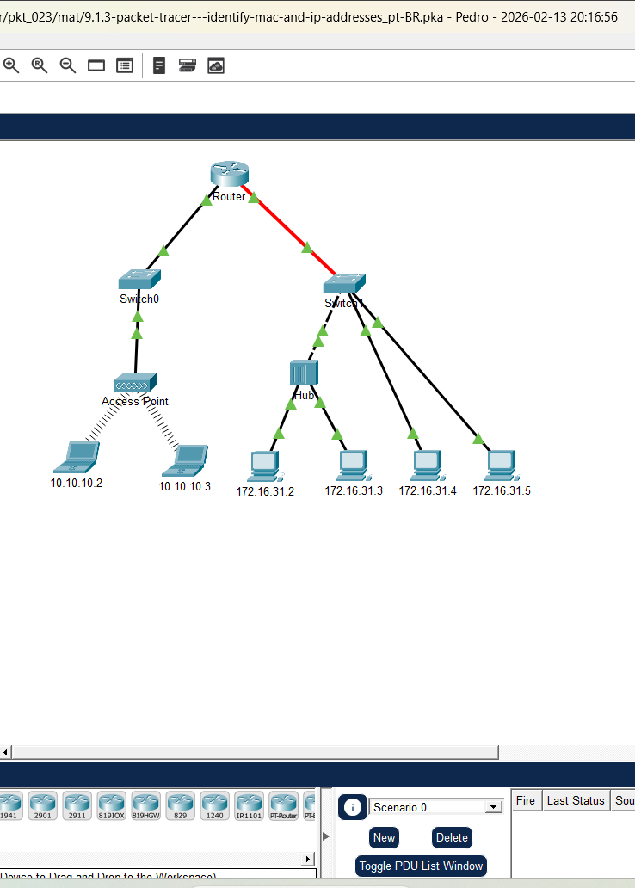
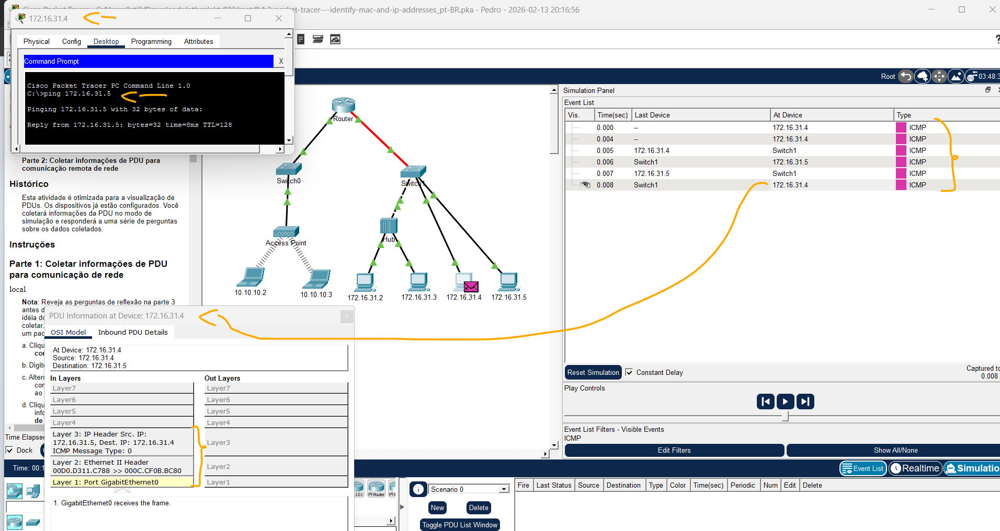
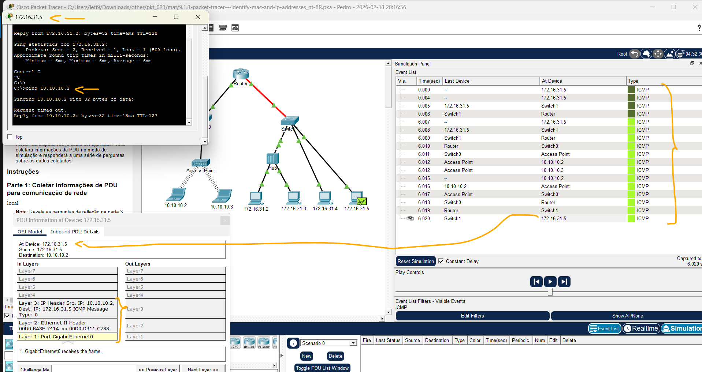

# Packet Tracer – Identificação de Endereços MAC e IP   

### Cisco: <a href="../../../">cisco   </a>
### Cisco Networking Academy: cna   </a>
### Training Category: <a href="../../../pkt/">pkt</a>
### Software/Subject: network   </a>
### Course: <a href="./">pkt_023 (Packet Tracer – Identificação de Endereços MAC e IP)   </a>

---

### Theme:
- Network

### Used Tools:
- Operating System (OS): 
  - Windows 11 
- Cloud Services:
  - Google Drive 
- Language:
  - HTML   
  - Markdown   
- Integrated Development Environment (IDE) and Text Editor:
  - Visual Studio Code (VS Code)   
- Versioning: 
  - Git   
- Repository:
  - GitHub   
- Network:
  - Cisco Packet Tracer 
  - ping   

---

<h3><a name="item00">Course Strcuture:</a></h3>

1. <a href="#item01">Parte 1: Coletar informações de PDU para comunicação de rede local</a> 
  1.1 <a href="#item01.01">Etapa 1: Reunir informações da PDU à medida que um pacote viaja de 172.16.31.5 a 172.16.31.2.</a> 
  1.2 <a href="#item01.02">Etapa 2: Obtenha informações adicionais sobre a PDU de outros pings.</a> 
2. <a href="#item02">Parte 2: Coletar informações de PDU para comunicação remota de rede</a> 
  2.1 <a href="#item02.01">Etapa 1: Reunir informações da PDU à medida que um pacote viaja de 172.16.31.5 a 10.10.10.2.</a> 
3. <a href="#item03">Questões para Reflexão</a> 

---

### Objective:
O objetivo desta atividade foi analisar o comportamento e a evolução da PDU (Protocol Data Unit) durante o tráfego de pacotes entre dispositivos de redes locais e remotas. A simulação permitiu observar a persistência do endereçamento IPv4 de ponta a ponta e a alternância dinâmica dos endereços MAC em cada salto, validando na prática os conceitos de encapsulamento das camadas do modelo OSI.

### Folder Structure:
- [README.md](./README.md): Este documento de README, escrito em **Markdown**, com o conteúdo do laboratório.
- [0-aux](./0-aux/): Pasta auxiliar com imagens utilizadas na construção dos arquivos de README desse curso.

### Development:

<a name="item01"><h4>1. Parte 1: Coletar informações de PDU para comunicação de rede local</h4></a>[Back to summary](#item00)

A imagem 01 mostra a topologia inicial.

<figure>
     
    <figcaption>Imagem 01.</figcaption>
</figure>
 

<a name="item01.01"><h4>1.1 Etapa 1: Reunir informações da PDU à medida que um pacote viaja de 172.16.31.5 a 172.16.31.2.</h4></a>[Back to summary](#item00)

- a. Clique em 172.16.31.5 e abra o Prompt de Comando.
- b. Insira o comando ping 172.16.31.2.
- c. Mude para o modo de simulação e repita o comando ping 172.16.31.2. Uma PDU aparece ao lado de 172.16.31.5.
- d. Clique na PDU e observe as seguintes informações nas guias Modelo OSI e Camada de PDU de saída:
  - Endereço MAC de destino: 000C:85CC:1DA7
  - Endereço MAC de origem: 00D0:D311:C788
  - Endereço IP Origem: 172.16.31.5
  - Endereço IP Destino: 172.16.31.2
  - No Dispositivo: 172.16.31.5
- e. Clique em Capture/Forward (Capturar/Encaminhar) para mover a PDU para o próximo dispositivo. Colete as mesmas informações da Etapa 1d. Repita esse processo até que a PDU chegue ao seu destino. Para registrar as informações coletadas sobre as PDUs, use uma tabela:

| Dispositivo | MAC de Origem | MAC de Destino | IPv4 Origem | IPv4 Destino |
| :---: | :---: | :---: | :---: | :---: |
| **172.16.31.5** | 00D0:D311:C788 | 000C:85CC:1DA7 | 172.16.31.5 | 172.16.31.2 |
| **Switch1** | 00D0:D311:C788 | 000C:85CC:1DA7 | N/D | N/D |
| **Hub** | N/D | N/D | N/D | N/D |
| **172.16.31.2** | 00D0:D311:C788 | 000C:85CC:1DA7 | 172.16.31.5 | 172.16.31.2 |
| **172.16.31.2** | 000C:85CC:1DA7 | 00D0:D311:C788 | 172.16.31.2 | 172.16.31.5 |
| **Hub** | N/D | N/D | N/D | N/D |
| **Switch1** | 000C:85CC:1DA7 | 00D0:D311:C788 | N/D | N/D |
| **172.16.31.5** | 000C:85CC:1DA7 | 00D0:D311:C788 | 172.16.31.2 | 172.16.31.5 |

<a name="item01.02"><h4>1.2 Etapa 2: Obtenha informações adicionais sobre a PDU de outros pings.</h4></a>[Back to summary](#item00)

- a. Repita o processo da Etapa 1 e colete informações para os seguintes testes: Ping 172.16.31.2 de 172.16.31.3. 

| Dispositivo | MAC de Origem | MAC de Destino | IPv4 Origem | IPv4 Destino |
| :---: | :---: | :---: | :---: | :---: |
| **172.16.31.2** | 000C:85CC:1DA7 | 0060:7036:2849 | 172.16.31.2 | 172.16.31.3 |
| **Hub** | N/D | N/D | N/D | N/D |
| **172.16.31.3** | 000C:85CC:1DA7 | 0060:7036:2849 | 172.16.31.2 | 172.16.31.3 |
| **172.16.31.3** | 0060:7036:2849 | 000C:85CC:1DA7 | 172.16.31.3 | 172.16.31.2 |
| **Hub** | N/D | N/D | N/D | N/D |
| **172.16.31.2** | 0060:7036:2849 | 000C:85CC:1DA7 | 172.16.31.3 | 172.16.31.2 |

- a. Repita o processo da Etapa 1 e colete informações para os seguintes testes: Ping 172.16.31.4 de 172.16.31.5.

| Dispositivo | MAC de Origem | MAC de Destino | IPv4 Origem | IPv4 Destino |
| :---: | :---: | :---: | :---: | :---: |
| **172.16.31.4** | 000C:CF0B:BC80 | 00D0:D311:C788  | 172.16.31.4 | 172.16.31.5 |
| **Switch1** | 000C:CF0B:BC80 | 00D0:D311:C788 | N/D | N/D |
| **172.16.31.5** | 000C:CF0B:BC80 | 00D0:D311:C788  | 172.16.31.4 | 172.16.31.5 |
| **172.16.31.5** | 00D0:D311:C788 | 000C:CF0B:BC80 | 172.16.31.5 | 172.16.31.4 |
| **Switch1** | 00D0:D311:C788 | 000C:CF0B:BC80 | N/D | N/D |
| **172.16.31.4** | 00D0:D311:C788 | 000C:CF0B:BC80 | 172.16.31.5 | 172.16.31.4 |

A imagem 02 exibe a conclusão da Parte 1.

<figure>
     
    <figcaption>Imagem 02.</figcaption>
</figure>
 

<a name="item02"><h4>2. Parte 2: Coletar informações de PDU para comunicação remota de rede</h4></a>[Back to summary](#item00)

Para se comunicar com redes remotas, é necessário um dispositivo de gateway. Estude o processo que ocorre para se comunicar com dispositivos na rede remota. Preste muita atenção aos endereços MAC usados.

<a name="item02.01"><h4>2.1 Etapa 1: Reunir informações da PDU à medida que um pacote viaja de 172.16.31.5 a 10.10.10.2.</h4></a>[Back to summary](#item00)

- a. Clique em 172.16.31.5 e abra o Prompt de Comando.
- b. Insira o comando ping 10.10.10.2.
- c. Mude para o modo de simulação e repita o comando ping 10.10.10.2. Uma PDU aparece ao lado de 172.16.31.5.
- d. Clique na PDU e observe as seguintes informações na guia Outbound PDU Layer (PDU das Camadas de Saída):
  - Endereço MAC de Destino: 00D0:BA8E:741A.
  - Endereço MAC de origem: 00D0:D311:C788.
  - Endereço IP Origem: 172.16.31.5.
  - Endereço IP Destino: 10.10.10.2.
  - No Dispositivo: 172.16.31.5.
- d. Qual dispositivo tem o MAC de destino que é mostrado?
  - 
- e. Clique em Capture/Forward (Capturar/Encaminhar) para mover a PDU para o próximo dispositivo. Colete as mesmas informações da Etapa 1d. Repita esse processo até que a PDU chegue ao seu destino. Registre as informações da PDU coletadas do ping 172.16.31.5 a 10.10.10.2 em uma planilha 
usando um formato de tabela:

| Dispositivo | MAC de Origem | MAC de Destino | IPv4 Origem | IPv4 Destino |
| :---: | :---: | :---: | :---: | :---: |
| **172.16.31.5** | 00D0:D311:C788 | 00D0:BA8E:741A | 172.16.31.5 | 10.10.10.2 |
| **Switch1** | 00D0:D311:C788 | 00D0:BA8E:741A | N/D | N/D |
| **Roteador** | 00D0:D311:C788 | 00D0:BA8E:741A | 172.16.31.5 | 10.10.10.2 |
| **Roteador** | 00D0:588C:2401 | 0060:2F84:4AB6 | 172.16.31.5 | 10.10.10.2 |
| **Switch0** | 00D0:588C:2401 | 0060:2F84:4AB6 | N/D | N/D |
| **Ponto de Acesso** | N/D | N/D | N/D | N/D |
| **10.10.10.2** | N/D | N/D | 172.16.31.5 | 10.10.10.2 |
| **10.10.10.2** | N/D | N/D | 10.10.10.2 | 172.16.31.5 |
| **Ponto de Acesso** | N/D | N/D | N/D | N/D |
| **Switch0** | 0060:2F84:4AB6 | 00D0:588C:2401 | N/D | N/D |
| **Roteador** | 0060:2F84:4AB6 | 00D0:588C:2401 | 10.10.10.2 | 172.16.31.5 |
| **Roteador** | 00D0:BA8E:741A | 00D0:D311:C788 | 10.10.10.2 | 172.16.31.5 |
| **Switch1** | 00D0:BA8E:741A | 00D0:D311:C788 | N/D | N/D |
| **172.16.31.5** | 00D0:BA8E:741A | 00D0:D311:C788 | 10.10.10.2 | 172.16.31.5 |

A imagem 03 exibe a conclusão da Parte 2.

<figure>
     
    <figcaption>Imagem 03.</figcaption>
</figure>
 

<a name="item03"><h4>3. Questões para Reflexão</h4></a>[Back to summary](#item00)

Responda às perguntas a seguir sobre os dados capturados:

- a. Havia tipos diferentes de cabos / mídia usados para conectar dispositivos?
  - Sim, a topologia utiliza diferentes meios de transmissão para interconectar os dispositivos. É possível observar cabos de cobre para as conexões Ethernet padrão, um cabo serial (representado pela linha vermelha) ligando o roteador e links sem fio para os laptops.
- b. Os fios mudaram o processamento das PDUs de alguma forma?
  - Não, os meios de transmissão apenas transportam os dados sem alterar o conteúdo das PDUs. O processamento e as mudanças de endereçamento ocorrem exclusivamente nas camadas lógicas dos dispositivos, como roteadores e switches.
- c. O Hub perdeu alguma informação fornecida a ele?
  - Não, o Hub não perdeu informações porque sua função é simplesmente repetir os sinais elétricos que recebe para todas as outras portas. Ele não processa nem altera o conteúdo das PDUs, agindo apenas como um repetidor de Camada 1.
- d. O que o Hub faz com endereços MAC e IP?
  - O Hub não faz nada com os endereços MAC ou IP, pois ele opera exclusivamente na Camada 1 (Física) do modelo OSI. Ele não possui inteligência para ler ou processar cabeçalhos de endereçamento, limitando-se a replicar os sinais elétricos recebidos para todas as suas portas conectadas.
- e. O Access Point sem fio fez algo com as informações fornecidas a ele?
  - O Ponto de Acesso (Access Point) apenas converteu os sinais de dados entre a mídia com fio e a mídia sem fio sem alterar o conteúdo da PDU. Ele funciona como uma ponte na Camada 2, garantindo que os endereços e informações originais cheguem ao destino intactos.
- f. Algum endereço MAC ou IP foi perdido durante a transferência sem fio?
  - Não, nenhum endereço MAC ou IP foi perdido durante a transferência sem fio. O Ponto de Acesso e a mídia wireless apenas encapsulam os dados para transmissão, mantendo a integridade de todos os cabeçalhos de endereçamento originais da PDU.
- g. Qual foi a camada OSI mais alta usada pelo Hub e pelo Access Point?
  - O Hub utilizou apenas a Camada 1 (Física), pois ele apenas replica sinais elétricos entre as portas. Já o Access Point operou na Camada 2 (Enlace) para gerenciar o tráfego entre a rede cabeada e a rede sem fio.
- h. O Hub ou o Access Point replicou uma PDU que foi rejeitada com um “X” vermelho? 
  - Sim, o Hub e o Access Point replicam PDUs para todos os dispositivos conectados, o que faz com que aparelhos que não são o destino pretendido rejeitem o pacote com um "X" vermelho. Isso ocorre porque esses dispositivos operam enviando os dados para todas as suas portas, cabendo ao receptor final verificar se o endereço de destino corresponde ao seu próprio.
- i. Ao examinar a guia PDU Details (Detalhes da PDU), qual endereço MAC apareceu primeiro: o Origem ou o Destino?
  - Ao examinar a guia PDU Details, o endereço MAC de Destino aparece primeiro, seguido pelo endereço de Origem. Isso ocorre porque o cabeçalho Ethernet segue o padrão de priorizar o destino para que os dispositivos de rede possam encaminhar o quadro rapidamente.
- j. Por que os endereços MAC aparecem nesta ordem?
  - Os endereços MAC aparecem nessa ordem porque o padrão Ethernet foi projetado para permitir que switches e placas de rede processem o quadro o mais rápido possível. Ao ler o MAC de Destino primeiro, o dispositivo pode decidir imediatamente se deve processar, descartar ou encaminhar o pacote sem precisar ler o restante dos dados.
- k. Houve um padrão para o endereçamento MAC na simulação?
  - Sim, houve um padrão claro: os endereços MAC de origem e destino permanecem os mesmos enquanto a PDU viaja dentro da mesma rede local (através de Hubs e Switches). No entanto, quando a PDU atravessa um roteador, os endereços MAC são alterados para representar o próximo salto físico entre as interfaces de rede, enquanto os endereços IP permanecem inalterados.
- l. Os switches replicaram uma PDU que foi rejeitada com um "X" vermelho?
  - Diferente do Hub, os switches geralmente não replicam a PDU para todas as portas, pois eles utilizam a tabela de endereços MAC para enviar o quadro apenas à porta de destino correta. O "X" vermelho em um switch normalmente só aparece se o dispositivo de destino estiver configurado para rejeitar aquele tipo específico de tráfego ou se o switch realizar um broadcast (como em um ARP) para um destinatário que não seja aquele computador.
- m. Cada vez que a PDU foi enviada entre a rede 10 e a rede 172, havia um ponto em que os endereços MAC mudavam de repente. Onde isso aconteceu?
  - Isso aconteceu no Roteador. Como o roteador opera na Camada 3, ele desmembra o quadro da Camada 2 para ler o endereço IP e, ao encaminhar o pacote para uma rede diferente, ele gera um novo cabeçalho com os endereços MAC das suas próprias interfaces e do próximo salto.
- n. Qual dispositivo usa endereços MAC que começam com 00D0:BA?
  - É um dos endereços Mac de uma das interfaces do roteador.
- o. A quais dispositivos os outros endereços MAC pertencem?
  - 00D0:BA8E:741A: Roteador Rede Local.
  - 00D0:588C:2401: Roteador Rede Remota.
  - 00D0:D311:C788: PC 172.16.31.5.
  - 0060:2F84:4AB6: Laptop 10.10.10.2
- p. Os endereços IPv4 de envio e recebimento alteraram os campos em alguma das PDUs?
  - Não, os endereços IPv4 de origem e destino permaneceram os mesmos em todas as PDUs durante todo o trajeto entre as duas redes. Diferente dos endereços MAC, que mudam a cada salto em um roteador, o endereçamento IP é de ponta a ponta para garantir que o pacote chegue ao destinatário final correto.
- q. Se você seguir a resposta a um ping (também conhecida como pong), os endereços IPv4 de envio e de recepção serão trocados?
  - Sim, os endereços IPv4 de envio e recepção são trocados na resposta ao ping. O endereço que era o destino na solicitação (Echo Request) torna-se a origem na resposta (Echo Reply), enquanto o endereço do emissor original passa a ser o novo destino.
- r. Qual é o padrão para o endereçamento IPv4 nesta simulação?
  - O padrão para o endereçamento IPv4 nesta simulação é o de entrega fim-a-fim, onde os endereços de origem e destino permanecem inalterados durante todo o percurso entre as redes. Enquanto os endereços MAC mudam a cada salto no roteador, os campos de IP no cabeçalho mantêm a identidade dos dispositivos finais (172.16.31.5 e 10.10.10.2) para garantir a entrega correta da camada de rede.
- s. Por que redes IP diferentes precisam ser atribuídas a portas diferentes de um roteador?
  - As redes IP diferentes precisam ser atribuídas a portas distintas porque a função principal do roteador é interconectar redes independentes e encaminhar o tráfego entre elas. Se ambas as portas estivessem na mesma rede, o roteador não conseguiria distinguir para qual interface enviar o pacote, perdendo sua utilidade de "ponte inteligente" que define as rotas de navegação.
- t. O que seria diferente se a simulação fosse configurada com IPv6 em vez de IPv4?
  - Se a simulação utilizasse IPv6, a mudança mais drástica seria a substituição do protocolo ARP por mensagens de Multicast via NDP, eliminando as transmissões de broadcast que geram o "X" vermelho em dispositivos não destinados. Além disso, os endereços passariam de 32 bits decimais para 128 bits hexadecimais, mantendo a lógica de troca de cabeçalhos MAC em cada salto do roteador, mas com um processamento de cabeçalho mais simplificado e eficiente.
