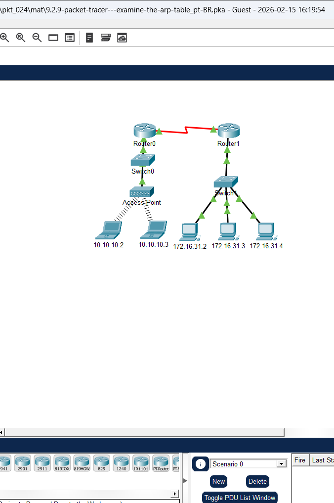
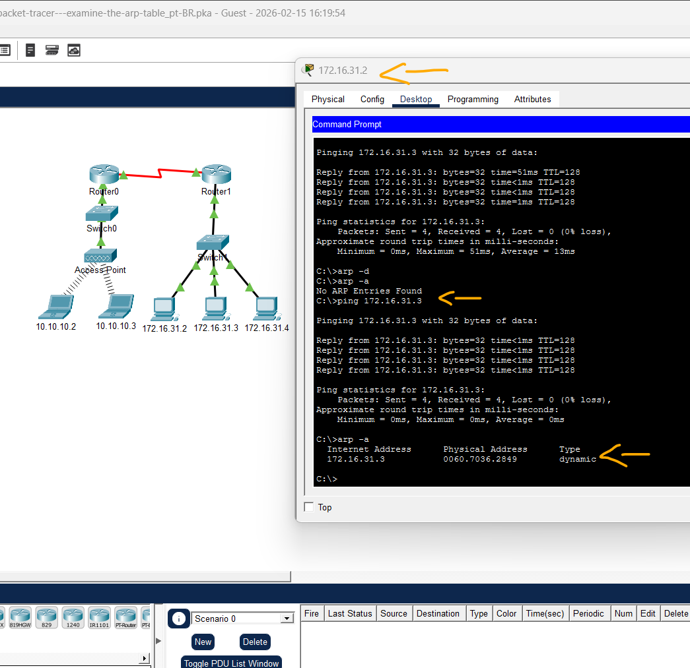
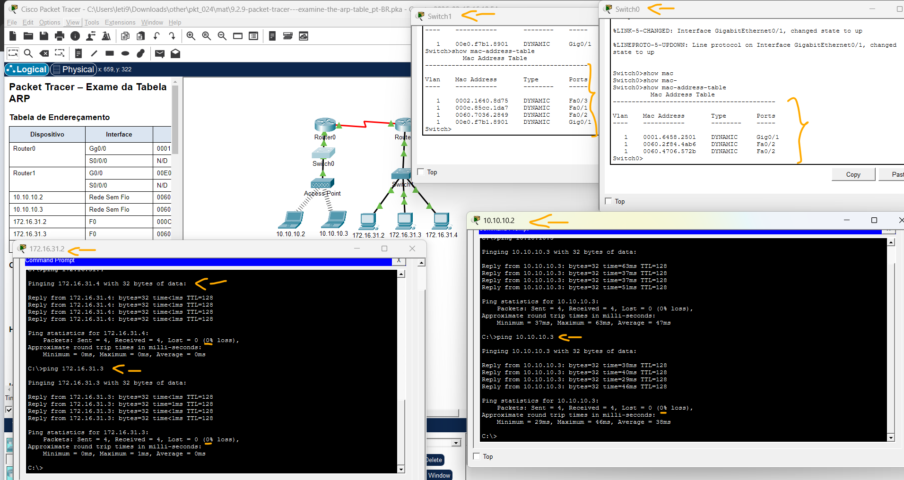
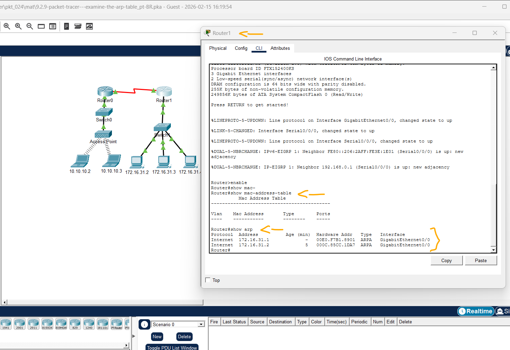

# Packet Tracer – Exame da Tabela ARP   

### Cisco: <a href="../../../">cisco   </a>
### Cisco Networking Academy: cna   </a>
### Training Category: <a href="../../../pkt/">pkt</a>
### Software/Subject: network   </a>
### Course: <a href="./">pkt_024 (Packet Tracer – Exame da Tabela ARP)   </a>

---

### Theme:
- Network

### Used Tools:
- Operating System (OS): 
  - Windows 11 
- Cloud Services:
  - Google Drive 
- Language:
  - HTML   
  - Markdown   
- Integrated Development Environment (IDE) and Text Editor:
  - Visual Studio Code (VS Code)   
- Versioning: 
  - Git   
- Repository:
  - GitHub   
- Network:
  - Cisco Packet Tracer   
  - ping   

---

<h3><a name="item00">Course Strcuture:</a></h3>

1. <a href="#item01">Parte 1: Examinar uma Requisição ARP</a> 
  1.1 <a href="#item01.01">Etapa 1: Gere requisições ARP enviando ping para 172.16.31.2 de 172.16.31.3.</a> 
  1.2 <a href="#item01.02">Etapa 2: Examinar a tabela ARP.</a> 
2. <a href="#item02">Parte 2: Examinar a Tabela de Endereços MAC de um Switch</a> 
  2.1 <a href="#item02.01">Etapa 1: Gerar tráfego adicional para preencher a tabela de endereços MAC do switch.</a> 
  2.2 <a href="#item02.02">Etapa 2: Examinar a tabela de endereços MAC nos switches.</a> 
3. <a href="#item03">Parte 3: Examinar o Processo ARP em Comunicações Remotas</a> 
  3.1 <a href="#item03.01">Etapa 1: Gerar tráfego para produzir tráfego ARP.</a> 
  3.2 <a href="#item03.02">Etapa 2: Examinar a tabela ARP em Router1.</a> 

---

### Objective:
O objetivo desta atividade foi analisar o processo de resolução de endereços através do protocolo ARP, observando como os dispositivos mapeiam endereços lógicos (IP) em endereços físicos (MAC). A prática visou compreender o comportamento da PDU em redes locais e remotas, além de examinar como dispositivos de Camada 2 (Switches) e Camada 3 (Roteadores) gerenciam suas tabelas internas para viabilizar a comunicação de dados.

### Folder Structure:
- [README.md](./README.md): Este documento de README, escrito em **Markdown**, com o conteúdo do laboratório.
- [0-aux](./0-aux/): Pasta auxiliar com imagens utilizadas na construção dos arquivos de README desse curso.

### Development:

<a name="item01"><h4>1. Parte 1: Examinar uma Requisição ARP</h4></a>[Back to summary](#item00)

A imagem 01 mostra a topologia inicial.

<figure>
     
    <figcaption>Imagem 01.</figcaption>
</figure>
 

<a name="item01.01"><h4>1.1 Etapa 1: Gere requisições ARP enviando ping para 172.16.31.2 de 172.16.31.3.</h4></a>[Back to summary](#item00)

- a. Clique em 172.16.31.2 e abra o Command Prompt (Prompt de Comando). 
- b. Digite o comando arp -d para limpar a tabela ARP.
- c. Entre no modo Simulation (Simulação) e insira o comando ping 172.16.31.3. Serão geradas duas PDUs. O comando ping não pode completar o pacote ICMP sem saber o endereço MAC de destino. Por isso, o computador envia um quadro broadcast ARP para localizar o endereço MAC destino.
- d. Clique uma vez em Capture/Forward (Capturar/Encaminhar). A PDU ARP se moverá para Switch1 quando a PDU do ICMP desaparecer, aguardando a resposta ARP. Abra a PDU e registre o endereço MAC de destino. O endereço está listado na tabela acima?
  - Não, pois o endereço de destino é FFFF.FFFF.FFFF, que representa um Broadcast de Camada 2. Ele é usado justamente porque o emissor ainda desconhece o MAC específico do destino e precisa que todos os dispositivos da rede recebam a pergunta.
- e. Clique em Capture/Forward (Capturar/Encaminhar) para mover a PDU para o próximo dispositivo. Quantas cópias da PDU o Switch1 fez?
  - Três cópias. Ele enviou para o Router1 e os PCs 172.16.31.3 e 172.16.31.4.
- e. Qual é o endereço IP do dispositivo que aceitou a PDU? 
  - O dispositivo que aceitou a PDU foi de endereço IP 172.16.31.3, ao qual o ping foi enviado.
- f. Abra a PDU e examine a Camada 2. O que aconteceu com os endereços MAC de origem e de destino?
  - Alteraram. O endereço Mac de origem virou de destino (000C:85CC:1DA7) e o novo endereço de origem virou 0060:7036:2849, que corresponde ao endereço Mac do PC 172.16.31.3.
  - Os endereços foram invertidos para a resposta (ARP Reply). O MAC do PC 172.16.31.3 (0060:7036:2849) tornou-se a origem, enquanto o MAC do PC 172.16.31.2 (000C:85CC:1DA7), que iniciou a requisição, tornou-se o destino.
- g. Clique em Capture/Forward (Capturar/Encaminhar) até que a PDU retorne para 172.16.31.2. Quantas cópias da PDU o switch fez durante a resposta ARP? 
  - Apenas uma cópia. Como o switch já aprendeu em qual porta o PC 172.16.31.2 está conectado durante a fase de solicitação, ele encaminha a resposta como um Unicast direto para o destino, em vez de inundar todas as portas.

<a name="item01.02"><h4>1.2 Etapa 2: Examinar a tabela ARP.</h4></a>[Back to summary](#item00)

- a. Observe que o pacote ICMP será exibido novamente. Abra a PDU e examine os endereços MAC. Os endereços MAC origem e destino estão alinhados aos respectivos endereços IP? 
  - Sim, estão alinhados. O endereço do PC 172.16.31.2 é 000C:85CC:1DA7, enquanto do PC 172.16.31.3 é 0060:7036:2849.
- b. Volte para o modo Realtime (Tempo real) e o ping será concluído.
- c. Clique em 172.16.31.2 e insira o comando arp –a. A qual endereço IP corresponde a entrada do endereço MAC?
  - O endereço MAC listado na tabela ARP (0060:7036:2849) corresponde ao endereço IP 172.16.31.3. Isso ocorre porque o protocolo ARP vinculou o endereço físico da placa de rede ao endereço lógico (IP) do dispositivo com o qual você acabou de se comunicar.
- c. Em geral, quando um dispositivo final envia uma requisição ARP? 
  - Um dispositivo envia uma requisição ARP sempre que precisa encaminhar um pacote para um destino na mesma rede local, mas conhece apenas o endereço IP e não possui o endereço MAC correspondente em sua tabela ARP (cache). Isso também ocorre quando o dispositivo precisa enviar dados para o Gateway padrão (roteador) para alcançar uma rede remota, mas ainda não mapeou o endereço físico da interface do roteador.

A imagem 02 exibe a conclusão da Parte 1.

<figure>
     
    <figcaption>Imagem 02.</figcaption>
</figure>
 

<a name="item02"><h4>2. Parte 2: Examinar a Tabela de Endereços MAC de um Switch</h4></a>[Back to summary](#item00)

<a name="item02.01"><h4>2.1 Etapa 1: Gerar tráfego adicional para preencher a tabela de endereços MAC do switch.</h4></a>[Back to summary](#item00)

- a. Em 172.16.31.2, insira o comando ping 172.16.31.4.
- b. Clique em 10.10.10.2 e abra o Prompt de Comando.
- c. Insira o comando ping 10.10.10.3. Quantas respostas foram enviadas e recebidas?
  - Foram enviados 4 pacotes ICMP Echo Request e recebidos 4 pacotes ICMP Echo Reply, resultando em 0% de perda. Isso confirma que a conectividade entre o dispositivo 10.10.10.2 e o 10.10.10.3 na rede local está funcionando perfeitamente.

<a name="item02.02"><h4>2.2 Etapa 2: Examinar a tabela de endereços MAC nos switches.</h4></a>[Back to summary](#item00)

- a. Clique em Switch1 e depois na guia CLI. Insira o comando show mac-address-table. As entradas correspondem às da tabela acima?
  - Sim, as entradas correspondem. O Switch1 registrou em sua tabela os endereços MAC dos três PCs locais e o endereço MAC da interface do Roteador (Gateway) que atende a essa sub-rede (Router1).
- b. Clique em Switch0 e depois na guia CLI. Insira o comando show mac-address-table. As entradas correspondem às da tabela acima?
  - Sim. Estão registrados os endereços MAC dos dois laptops presentes nesta rede local e o endereço MAC da interface correspondente do Roteador que conecta essa rede ao restante da topologia (Router0).
- b. Por que dois endereços MAC estão associados a uma porta?
  - Isso ocorre porque a porta Fa0/2 do Switch0 está conectada a um Access Point. Como o Access Point funciona como uma ponte (bridge) entre a rede sem fio e a rede cabeada, o Switch aprende os endereços MAC de todos os dispositivos Wi-Fi que enviam dados através desse ponto de acesso, associando-os à mesma porta física de entrada.

A imagem 03 exibe a conclusão da Parte 2.

<figure>
     
    <figcaption>Imagem 03.</figcaption>
</figure>
 

<a name="item03"><h4>3. Parte 3: Examinar o Processo ARP em Comunicações Remotas</h4></a>[Back to summary](#item00)

<a name="item03.01"><h4>3.1 Etapa 1: Gerar tráfego para produzir tráfego ARP.</h4></a>[Back to summary](#item00)

- a. Clique em 172.16.31.2 e abra o Prompt de Comando.
- b. Insira o comando ping 10.10.10.1. 
- c. Digite arp –a. Qual é o endereço IP da nova entrada da tabela ARP? 
  - 172.16.31.1, correspondente a interface do Router1
- d. Insira arp -d para limpar a tabela ARP e mude para o modo Simulation (Simulação).
- e. Repita o ping para 10.10.10.1. Quantas PDUs são exibidas?
  - De início são dois, um ICMP e outro ARP.
- f. Clique em Capture/Forward (Capturar/Encaminhar). Clique na PDU que agora está em Switch1. Qual é o endereço IP destino da requisição ARP?
  - O endereço IP de destino é 172.16.31.1. Embora o objetivo final seja o endereço 10.10.10.1, o computador primeiro precisa descobrir o endereço físico (MAC) do seu Gateway Padrão para conseguir tirar o pacote da rede local.
- g. O endereço IP destino não é 10.10.10.1. Por quê?
  - Porque o endereço 10.10.10.1 pertence a uma rede remota. O protocolo ARP é um protocolo de Camada 2 e funciona apenas por broadcast dentro do domínio local; portanto, o PC 172.16.31.2 direciona a requisição ARP ao IP da interface do roteador (Gateway), que é o dispositivo responsável por encaminhar pacotes para fora da sub-rede local.

<a name="item03.02"><h4>3.2 Etapa 2: Examinar a tabela ARP em Router1.</h4></a>[Back to summary](#item00)

- a. Alterne para o modo Realtime (Tempo real). Clique em Router1 em em seguinda na guia CLI. 
- b. Entre no modo EXEC privilegiado e insira o comando show mac-address-table. Quantos endereços MAC há na tabela? Por quê?
  - Não há nenhum endereço na tabela MAC. Isso ocorre porque o show mac-address-table é um comando de Camada 2, utilizado por switches para mapear em quais portas físicas estão os dispositivos. Como o Router1 é um dispositivo de Camada 3, ele não utiliza uma tabela de comutação de endereços MAC para encaminhar pacotes; em vez disso, ele utiliza a Tabela ARP e a Tabela de Roteamento.
- c. Insira o comando show arp. Existe uma entrada para 172.16.31.2?
  - Sim, existe uma entrada na tabela ARP. Diferente da tabela MAC, a Tabela ARP do roteador armazena o mapeamento entre os endereços IP (Camada 3) e os endereços MAC (Camada 2) de todos os dispositivos com os quais ele se comunicou diretamente nas suas interfaces locais. O endereço do PC 172.16.31.2 aparece aqui porque o roteador precisou desse MAC para responder ao ping ou encaminhar pacotes de volta para ele.
- c. O que acontece com o primeiro ping em uma situação em que o roteador responde à requisição ARP?
  - Geralmente, o primeiro ping resulta em "Request Timed Out" (Esgotamento do tempo limite). Isso ocorre porque o pacote ICMP é retido em um buffer enquanto o dispositivo aguarda a resolução do endereço MAC via ARP. Como o processo de requisição e resposta ARP pode demorar mais do que o tempo de espera do primeiro pacote ICMP, ele acaba sendo descartado. Os pings subsequentes funcionam normalmente (100% de sucesso) porque o endereço MAC do roteador já estará armazenado no cache ARP do emissor.

A imagem 04 exibe a conclusão da Parte 3.

<figure>
     
    <figcaption>Imagem 04.</figcaption>
</figure>
 