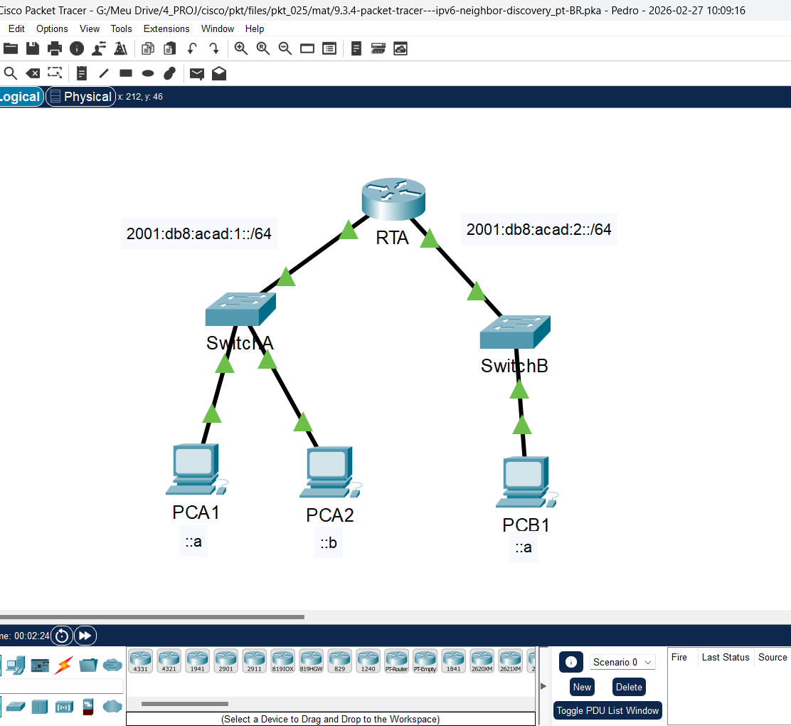
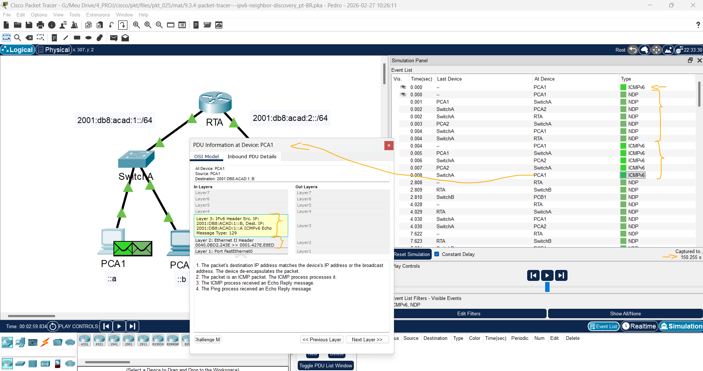
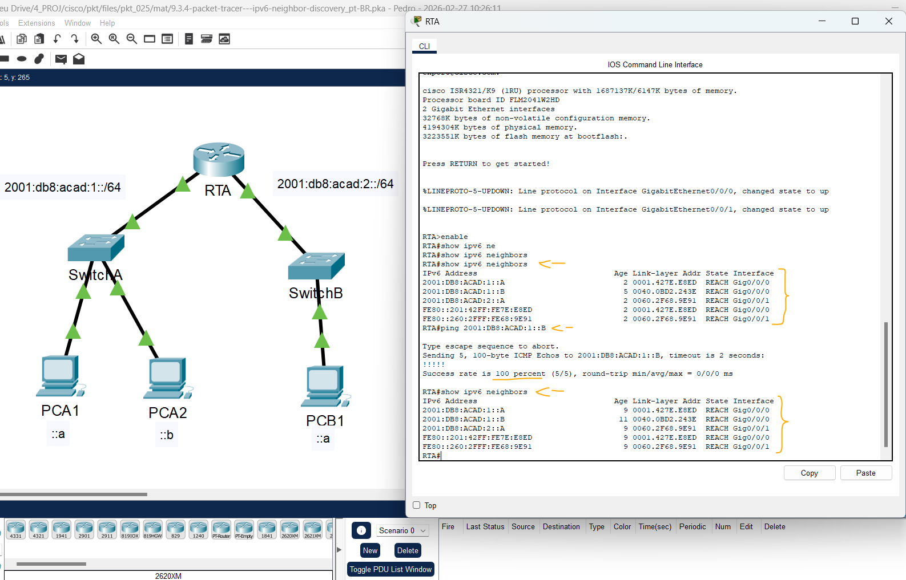

# Packat Tracer - Descoberta de vizinhos de IPv6   

### Cisco: <a href="../../../">cisco   </a>
### Cisco Networking Academy: cna   </a>
### Training Category: <a href="../../../pkt/">pkt</a>
### Software/Subject: network   </a>
### Course: <a href="./">pkt_025 (Packat Tracer - Descoberta de vizinhos de IPv6)   </a>

---

### Theme:
- Network

### Used Tools:
- Operating System (OS): 
  - Cisco Internetwork Operating System (Cisco IOS)   
  - Windows 11 
- Cloud Services:
  - Google Drive 
- Language:
  - HTML   
  - Markdown   
- Integrated Development Environment (IDE) and Text Editor:
  - Visual Studio Code (VS Code)   
- Versioning: 
  - Git   
- Repository:
  - GitHub   
- Network:
  - Cisco Packet Tracer   
  - ping   

---

<h3><a name="item00">Course Strcuture:</a></h3>

1. <a href="#item01">Parte 1: Rede local de descoberta de vizinhos IPv6</a> 
  1.1 <a href="#item01.01">Etapa 1: Verifique se há vizinhos que ele descobriu no roteador.</a> 
  1.2 <a href="#item01.02">Etapa 2: Alterne para o Modo de Simulação para capturar eventos.</a> 
2. <a href="#item02">Parte 2: Rede remota de descoberta de vizinhos IPv6</a> 
  2.1 <a href="#item02.01">Etapa 1: Capturar eventos para comunicação remota.</a> 
  2.2 <a href="#item02.02">Etapa 2: Examine as saídas do roteador.</a> 
3. <a href="#item03">Perguntas para reflexão</a> 

---

### Objective:
O objetivo desta atividade foi analisar o funcionamento do protocolo IPv6 Neighbor Discovery (NDP), observando como os dispositivos descobrem endereços MAC, realizam a resolução de vizinhos e se comunicam tanto dentro da mesma rede local quanto entre redes diferentes por meio de um roteador.

### Folder Structure:
- [README.md](./README.md): Este documento de README, escrito em **Markdown**, com o conteúdo do laboratório.
- [0-aux](./0-aux/): Pasta auxiliar com imagens utilizadas na construção dos arquivos de README desse curso.

### Development:

<a name="item01"><h4>1. Parte 1: Rede local de descoberta de vizinhos IPv6</h4></a>[Back to summary](#item00)

Na Parte 1 desta atividade, você obterá o endereço MAC de um dispositivo de destino na mesma rede. 

A imagem 01 mostra a topologia inicial.

<figure>
     
    <figcaption>Imagem 01.</figcaption>
</figure>
 

<a name="item01.01"><h4>1.1 Etapa 1: Verifique se há vizinhos que ele descobriu no roteador.</h4></a>[Back to summary](#item00)

- a. Clique no RTA Router. Selecione a guia CLI e emita o comando show ipv6 neighbors no modo exec privilegiado. Se houver entradas exibidas, remova-as usando o comando clear ipv6 neighbors.
  - `enable` -> `show ipv6 neighbors`.
- b. Clique em PCA1, selecione a guia Área de Trabalho e clique no ícone Prompt Command.

<a name="item01.02"><h4>1.2 Etapa 2: Alterne para o Modo de Simulação para capturar eventos.</h4></a>[Back to summary](#item00)

- a. Clique no botão Simulação no canto inferior direito da janela Topologia do Rastreador de Pacotes. 
- b. Clique no botão Mostrar tudo/nenhum na parte inferior esquerda do Painel de simulação. Tornar determinados Filtros de Lista de Eventos — Eventos Visíveis exibe Nenhum.
- c. No prompt de comando em PCA1, execute o comando ping —n 1 2001:db8:acad:1::b. Isso iniciará o processo de ping PCA2.
- d. Clique no botão Reproduzir Captura Avançar, que é exibido como uma seta apontando para a direita com uma barra vertical na caixa Reproduzir Controles. A barra de status acima dos Controles de Reprodução deve ler Capturado para 150. (O número exato pode variar.) 
- e. Clique no botão Edit Filters. Selecione a guia IPv6 na parte superior e marque as caixas para ICMPv6 e NDP. Clique no X vermelho no canto superior direito da janela Editar filtros ACL. Os eventos capturados agora devem ser listados. Você deve ter aproximadamente 12 entradas na janela. Por que as PDUs ND estão presentes?
  - As PDUs aparecem porque o host precisa descobrir o endereço MAC do destino antes de enviar o ping. No IPv6 isso é feito pelo Neighbor Discovery Protocol, que envia mensagens Neighbor Solicitation e Neighbor Advertisement. Esse processo ocorre usando o Internet Control Message Protocol version 6.
- f. Clique no quadrado na coluna Tipo para o primeiro evento, que deve ser ICMPv6. Uma vez que a mensagem começa com este evento, existe apenas uma PDU de saída. Na guia Modelo OSI, qual é o Tipo de Mensagem listado para ICMPv6? Observe que não há endereçamento de Camada 2. Clique no botão Próxima Camada >> para obter uma explicação sobre o processo ND (Descoberta de Vizinhos).
  - O tipo de mensagem listado é ICMPv6 Echo Request, usado para iniciar o teste de conectividade (ping). Esse pacote faz parte do Internet Control Message Protocol version 6.
- g. Clique no quadrado ao lado do próximo evento no Painel de simulação. Deve estar no dispositivo PCA1 e o tipo deve ser NDP. O que mudou no endereçamento da Camada 3?
  - O endereço IPv6 de destino mudou de 2001:db8:acad:1::B para FF02::1:FF00:B, que é um endereço multicast de nó solicitado usado pelo Neighbor Discovery Protocol para descobrir o endereço MAC do host de destino. Isso ocorre antes do envio efetivo do ping.
- g. Quais endereços da Camada 2 são mostrados? Quando um host não sabe o endereço MAC do destino, um endereço MAC de multicast especial é usado pelo IPv6 Neighbor Discovery como o endereço de destino da Camada 2. 
  - O endereço MAC de origem é 00:01:42:7E:E8:ED (PCA1) e o endereço MAC de destino é 33:33:FF:00:00:0B, que é um endereço multicast. Esse endereço é usado pelo Neighbor Discovery Protocol quando o host ainda não conhece o MAC do destino. Assim, a solicitação é enviada para um grupo multicast correspondente ao IPv6 de destino.
- h. Selecione o primeiro evento NDP no SwitchA. Existe alguma diferença entre as Camadas Dentro e Fora da Camada 2?
  - Sim, apenas na camada física: o switch recebe o quadro pela porta FastEthernet0/1 e o encaminha pelas portas FastEthernet0/2 e GigabitEthernet0/1. Como o dispositivo opera na Camada 2 do padrão IEEE 802.3, os endereços MAC do quadro não são alterados.
- i. Selecione o primeiro evento NDP no PCA2. Clique na guia Detalhes da PDU de Saída. Quais endereços são exibidos para o seguinte? Observação: os endereços nos campos podem ser quebrados, ajuste o tamanho da janela da PDU para facilitar a leitura das informações de endereço.  
  - ADDR DEST Ethernet II: 3333:FF00:000B (MAC multicast usado pelo IPv6 Neighbor Discovery)
  - ADDR SRC Ethernet II: 0040.0BD2.243E (MAC do PCA2)
  - IPv6 SRC IP: 2001:DB8:ACAD:1::B (endereço IPv6 do PCA2)
  - IPv6 DST IP: FF02::1:FF00:B (endereço multicast de nó solicitado usado pelo Neighbor Discovery Protocol)
- j. Selecione o primeiro evento NDP no RTA. Por que não há Camadas Out?
  - Não há Out Layers porque o pacote não é destinado ao RTA. A mensagem foi enviada para o endereço multicast FF02::1:FF00:B, que corresponde ao grupo do host de destino (PCA2). Como o roteador não participa desse grupo do Neighbor Discovery Protocol, ele apenas recebe e ignora o pacote.
- k. Clique no botão Próxima Camada >> até o final e leia as etapas 4 a 7 para obter mais explicações.
- l. Clique no próximo evento ICMPv6 em PCA1. O PCA1 tem agora todas as informações necessárias para comunicar com o PCA2?
  - Sim. Após receber a resposta do Neighbor Discovery Protocol, o PCA1 aprende o endereço MAC do PCA2 e pode enviar o ping diretamente ao destino.
- m. Clique no último evento ICMPv6 em PCA1. Observe que esta é a última comunicação listada. O que é o tipo de mensagem de eco ICMPv6?
  - O tipo de mensagem é Echo Reply, que é a resposta ao Echo Request enviado anteriormente dentro do Internet Control Message Protocol version 6.
- n. Clique em Reset Simulation (Redefinir Simulação) no Simulation Panel (Painel de Simulação). No prompt de comando do PCA1 repita o ping para PCA2. (Dica: você deve ser capaz de pressionar a seta para cima para trazer o comando anterior de volta.)
  - `ping —n 1 2001:db8:acad:1::b`.
- o. Clique no botão Capturar Encaminhar 5 vezes para concluir o processo de ping. Por que não houve nenhum evento do NDP?
  - Porque o PCA1 já aprendeu o endereço MAC do PCA2 na etapa anterior e o armazenou na tabela de vizinhos. Assim, não é necessário executar novamente o Neighbor Discovery Protocol, e o ping pode ser enviado diretamente.

A imagem 02 exibe a conclusão da Parte 1.

<figure>
     
    <figcaption>Imagem 02.</figcaption>
</figure>
 

<a name="item02"><h4>2. Parte 2: Rede remota de descoberta de vizinhos IPv6</h4></a>[Back to summary](#item00)

Na Parte 2 desta atividade, você executará etapas semelhantes às da Parte 1, exceto nesse caso, o host de destino está em outra LAN. Observe como o processo de descoberta de vizinhos difere do processo observado na Parte 1. Preste muita atenção a algumas das etapas de endereçamento adicionais que ocorrem quando um dispositivo se comunica com um dispositivo que está em uma rede diferente. Certifique-se de clicar no botão Redefinir simulação para limpar os eventos anteriores.

<a name="item02.01"><h4>2.1 Etapa 1: Capturar eventos para comunicação remota.</h4></a>[Back to summary](#item00)

- a. Exibir e limpar todas as entradas na tabela de dispositivos vizinhos IPv6 como foi feito na Parte I.
- b. Mude o modo de simulação. Clique no botão Mostrar tudo/nenhum na parte inferior esquerda do Painel de simulação. Certifique-se de que os Filtros da Lista de Eventos — Eventos Visíveis exiba Nenhum.
- c. No prompt de comando em PCA1, emita o comando ping —n 1 2001:db8:acad:2::a para ping host PCB1.
- d. Clique no botão Reproduzir Captura Avançar, que é exibido como uma seta apontando para a direita com uma barra vertical na caixa Reproduzir Controles. A barra de status acima dos Controles de Reprodução deve ler Capturado para 150. (O número exato pode variar.)
- e. Clique no botão Edit Filters. Selecione a guia IPv6 na parte superior e marque as caixas para ICMPv6 e NDP. Clique no X vermelho no canto superior direito da janela Editar filtros ACL. Todos os eventos anteriores devem agora ser listados. Você deve notar que há consideravelmente mais entradas listadas desta vez.
- f. Clique no quadrado na coluna Tipo para o primeiro evento, que deve ser ICMPv6. Como a mensagem começa com este evento, existe apenas uma PDU de saída. Observe que está faltando as informações da Camada 2 como fazia no cenário anterior.
- g. Clique no primeiro evento NDP no dispositivo PCA1. Qual endereço está sendo usado para o IP Src na PDU de entrada? O IPv6 Neighbor Discovery determinará o próximo destino para encaminhar a mensagem ICMPv6.
  - O endereço IP de origem é FE80::201:42FF:FE7E:E8ED, que é o endereço link-local do PCA1. Esse endereço é usado pelo Neighbor Discovery Protocol para realizar a descoberta do próximo salto antes de encaminhar o pacote ICMPv6 para outra rede.
  - O Neighbor Discovery Protocol é usado para descobrir o endereço MAC do próximo dispositivo no mesmo link. Se o destino estiver na mesma rede, ele resolve o MAC do próprio host usando o IPv6 dele. Se o destino estiver em outra rede, ele resolve o MAC do roteador, que normalmente é identificado pelo endereço link-local (FE80::) no Internet Protocol version 6.
- h. Clique no segundo evento ICMPv6 para PCA1. O PCA1 agora tem informações suficientes para criar uma solicitação de eco ICMPv6. Qual endereço MAC está sendo usado para o MAC de destino?
  - O MAC de destino é 0001.961D.6301, que corresponde ao MAC do roteador (gateway). Como o destino final (PCB1) está em outra rede, o PCA1 envia o pacote primeiro ao roteador para que ele encaminhe o tráfego ao destino.
- i. Clique no próximo evento ICMPv6 no dispositivo RTA. Observe que a PDU de saída do RTA não possui o endereço de camada 2 de destino. Isso significa que o RTA mais uma vez precisa executar uma descoberta de vizinho para a interface que tenha a rede 2001:db8:acad:2:: porque ele não sabe os endereços MAC dos dispositivos na LAN G0/0/1.
- j. Ir para o primeiro evento ICMPv6 para o dispositivo PCB1. O que está faltando nas informações de saída da Camada 2?
  - Faltam os endereços MAC de origem e destino na Camada 2. Isso ocorre porque o PCB1 ainda não conhece o MAC do roteador, então ele precisa executar o Neighbor Discovery Protocol para descobrir o MAC do gateway antes de enviar a resposta ICMPv6 dentro do Internet Protocol version 6.
- k. Os próximos eventos NDP estão associando os endereços IPv6 restantes a endereços MAC. Os eventos NDP anteriores associados endereços MAC com endereços de Link Local.
- l. Pule para o último conjunto de eventos ICMPv6 e observe que todos os endereços foram aprendidos. As informações necessárias agora são conhecidas, então PCB1 pode enviar mensagens de resposta de eco para PCA1.
- m. Clique em Reset Simulation (Redefinir Simulação) no Simulation Panel (Painel de Simulação). No prompt de comando do PCA1 repita o comando para ping PCB1.
- n. Clique no botão Capturar Encaminhar nove vezes para concluir o processo de ping. Houve algum evento do NDP?
  - Não. Nenhum novo evento do Neighbor Discovery Protocol ocorre porque os dispositivos já possuem os endereços MAC necessários armazenados em suas tabelas de vizinhos, permitindo que o Internet Protocol version 6 envie os pacotes diretamente sem realizar outra descoberta.
- o. Clique no único evento PCB1 na nova lista. A que corresponde o endereço MAC de destino?
  - Corresponde ao MAC da interface do roteador conectada à rede do PCB1, que atua como gateway padrão para encaminhar o tráfego para outras redes.
- o. Por que o PCB1 está usando o endereço MAC da interface do roteador para fazer suas PDUs ICMP?
  - Porque o destino do pacote está em outra rede. Assim, o PCB1 envia o quadro para o gateway padrão (roteador), utilizando o MAC da interface do roteador para que ele encaminhe o pacote até a rede de destino.

#### Tabela 1 — Endereços MAC e IP

| Dispositivo | MAC | IP | Caminho |
| :---: | :---: | :---: | :---: |
| **PCA1** | 0001.427E.E8ED | 2001:db8:acad:1::A/64 | - |
| **PCA2** | 0040.0BD2.243E | 2001:db8:acad:1::B/64 | - |
| **RTA-G0/0/0** | 0001.961D.6301 | 2001:db8:acad:1::1/64 | - |
| **RTA-G0/0/1** | 0001.961D.6302 | 2001:db8:acad:2::1/64 | - |
| **PCB1** | 0060.2F68.9E91 | 2001:db8:acad:2::A/64 | - |
| **Solicited-Node Multicast** | 3333:FF00:000B | FF02::1:FF00:B | PCA1 - PCA2 |
| **Solicited-Node Multicast** | 3333.FF00.0001 | FF02::1:FF00:1 | PCA1 - RTA - PCB1 |
| **Solicited-Node Multicast** | 3333.FF00.000A | FF02::1:FF00:A | RTA - PCB1 |
| **Link-Local Address** | 3333.FF00.0001 | FE80::201:42FF:FE7E:E8ED / FE80::1 | PCA1 - RTA |
| **Link-Local Address** | 3333.FF00.0001 | FE80::260:2FFF:FE68:9E91 / FE80::1 | PCB1 - RTA |

<a name="item02.02"><h4>2.2 Etapa 2: Examine as saídas do roteador.</h4></a>[Back to summary](#item00)

- a. Volte ao modo de Tempo real.
- b. Clique em RTA e selecione a guia CLI. No prompt do roteador, digite o comando show ipv6 neighbors. Quantos endereços estão listados?
  - São listados 5 endereços na tabela de vizinhos IPv6.
- b. A que dispositivos esses endereços estão associados?
  - Aos PCs PCA1, PCA2 e PCB1, além das duas interfaces do roteador (G0/0/0 e G0/0/1).
- b. Há alguma entrada para PCA2 listada (por que ou por que não)?
  - Sim. Mesmo sem comunicação direta com o roteador, o PCA2 respondeu às mensagens de Neighbor Discovery enviadas pelo PCA1 em multicast, permitindo que o roteador aprendesse seu endereço IPv6 e MAC e os registrasse na tabela de vizinhos.
- c. Ping PCA2 a partir do roteador.
  - `ping 2001:DB8:ACAD:1::B`.
- d. Emita o comando show ipv6 neighbours. Há entradas para o PCA2?
  - Sim. A entrada para o PCA2 já existia na tabela de vizinhos e permaneceu registrada, pois o roteador já havia aprendido seu endereço IPv6 e MAC durante o processo de Neighbor Discovery.

A imagem 03 exibe a conclusão da Parte 2.

<figure>
     
    <figcaption>Imagem 03.</figcaption>
</figure>
 

<a name="item03"><h4>3. Perguntas para reflexão</h4></a>[Back to summary](#item00)

- a. Quando um dispositivo requer o processo IPv6 Neighbor Discovery?
  - Quando precisa descobrir o endereço MAC correspondente a um endereço IPv6 ou verificar a presença de um vizinho na rede local.
- b. Como um roteador ajuda a minimizar a quantidade de tráfego IPv6 Neighbor Discovery em uma rede?
  - O roteador separa as redes em diferentes domínios de camada 2, impedindo que mensagens ND se propaguem para outras redes.
- c. Como o IPv6 minimiza o impacto do processo ND nos hosts de rede?
  - O IPv6 utiliza multicast em vez de broadcast, enviando mensagens apenas para grupos multicast específicos. Assim, somente os dispositivos que pertencem a esse grupo processam o pacote, reduzindo o processamento desnecessário nos demais hosts da rede.
- d. Qual a diferença entre o processo de descoberta de vizinhos quando um host de destino está na mesma LAN e quando está em uma LAN remota? 
  - Se o destino estiver na mesma LAN, o host descobre diretamente o MAC do dispositivo destino. Se estiver em uma rede remota, o host descobre apenas o MAC do gateway (roteador) para encaminhar o pacote.